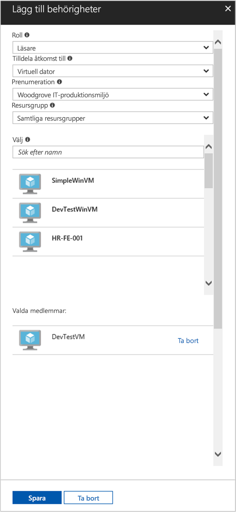

# <a name="use-a-linux-vm-system-assigned-managed-identity-to-access-azure-resource-manager"></a>Använda en systemtilldelad hanterad identitet för en virtuell Linux-dator för åtkomst till Azure Resource Manager

[!INCLUDE [preview-notice](../../../includes/active-directory-msi-preview-notice.md)]

Den här snabbstarten visar hur du kommer åt Azure Resource Manager-API:et med en systemtilldelad identitet för en virtuell Linux-dator. Hanterade identiteter för Azure-resurser hanteras automatiskt av Azure och gör att du kan autentisera mot tjänster som stöder Azure AD-autentisering, utan att du behöver skriva in autentiseringsuppgifter i koden. Lär dig att:

> [!div class="checklist"]
> * Ge den virtuella datorn åtkomst till en resursgrupp i Azure Resource Manager 
> * Hämta en åtkomsttoken med hjälp av den virtuella datorns identitet och använda den för att anropa Azure Resource Manager 

## <a name="prerequisites"></a>Krav

[!INCLUDE [msi-tut-prereqs](../../../includes/active-directory-msi-tut-prereqs.md)]

## <a name="grant-your-vm-access-to-a-resource-group-in-azure-resource-manager"></a>Ge den virtuella datorn åtkomst till en resursgrupp i Azure Resource Manager 

Med hjälp av hanterade identiteter för Azure-resurser kan din kod hämta åtkomsttoken för att autentisera mot resurser som har stöd för Azure AD-autentisering. Azure Resource Manager API har stöd för Azure AD-autentisering. Först måste vi ge den virtuella datorns identitet åtkomst till en resurs i Azure Resource Manager, i detta fall den resursgrupp som den virtuella datorn finns i.  

1. Gå till fliken för **resursgrupper**.
2. Välj den specifika **resursgrupp** som du skapade tidigare.
3. Gå till **Åtkomstkontroll (IAM)** i den vänstra panelen.
4. Klicka på **Lägg till** en ny rolltilldelning för den virtuella datorn. Välj **rollen** som **läsare**.
5. I nästa listruta **tilldelar du behörighet till** resursen **Virtuell dator**.
6. Kontrollera sedan att rätt prenumeration visas i listrutan **Prenumeration**. Och för **Resursgrupp** väljer du **Alla resursgrupper**.
7. I **Välj** väljer du sedan din virtuella Linux-dator i listrutan och klickar på **Spara**.

    

## <a name="get-an-access-token-using-the-vms-system-assigned-managed-identity-and-use-it-to-call-resource-manager"></a>Hämta en åtkomsttoken med hjälp av den virtuella datorns systemtilldelade hanterade identitet och använd den för att anropa Resource Manager 

Om du vill slutföra de här stegen behöver du en SSH-klient. Om du använder Windows kan du använda SSH-klienten i [Windows-undersystemet för Linux](https://msdn.microsoft.com/commandline/wsl/about). Om du behöver hjälp att konfigurera SSH-klientens nycklar läser du [Så här använder du SSH-nycklar med Windows i Azure](../../virtual-machines/linux/ssh-from-windows.md) eller [How to create and use an SSH public and private key pair for Linux VMs in Azure](../../virtual-machines/linux/mac-create-ssh-keys.md) (Skapa och använda SSH-nyckelpar med privata och offentliga nycklar för virtuella Linux-datorer i Azure).

1. I portalen går du till den virtuella Linux-datorn och i **översikten** klickar du på **Anslut**.  
2. **Anslut** till den virtuella datorn med valfri SSH-klient. 
3. Använd `curl` i terminalfönstret och skicka en begäran till de lokala hanterade identiteterna för Azure-resursslutpunkter för att hämta en åtkomsttoken för Azure Resource Manager.  
 
    `curl`-begäran för åtkomsttoken visas nedan.  
    
    ```bash
    curl 'http://169.254.169.254/metadata/identity/oauth2/token?api-version=2018-02-01&resource=https://management.azure.com/' -H Metadata:true   
    ```
    
    > [!NOTE]
    > Värdet för parametern ”resource” måste vara en exakt matchning av vad som förväntas av Azure AD.  In the case of the Resource Manager resource ID, you must include the trailing slash on the URI. 
    
    Svaret innehåller den åtkomsttoken som du behöver för att komma åt Azure Resource Manager. 
    
    Svar:  

    ```bash
    {"access_token":"eyJ0eXAiOi...",
    "refresh_token":"",
    "expires_in":"3599",
    "expires_on":"1504130527",
    "not_before":"1504126627",
    "resource":"https://management.azure.com",
    "token_type":"Bearer"} 
    ```
    
    Du kan använda den här åtkomsttoken för att komma åt Azure Resource Manager, till exempel för att läsa information om den resursgrupp som du tidigare gav den här virtuella datorn åtkomst till. Replace the values of \<SUBSCRIPTION ID\>, \<RESOURCE GROUP\>, and \<ACCESS TOKEN\> with the ones you created earlier. 
    
    > [!NOTE]
    > Eftersom URL:en är skiftlägeskänslig måste du använda exakt samma skiftläge som du använde tidigare när du namngav resursgruppen samt versalt ”G” i ”resourceGroup”.  
    
    ```bash 
    curl https://management.azure.com/subscriptions/<SUBSCRIPTION ID>/resourceGroups/<RESOURCE GROUP>?api-version=2016-09-01 -H "Authorization: Bearer <ACCESS TOKEN>" 
    ```
    
    Svar tillbaka information för den specifika resursgruppen:    
    ```bash
    {"id":"/subscriptions/98f51385-2edc-4b79-bed9-7718de4cb861/resourceGroups/DevTest","name":"DevTest","location":"westus","properties":{"provisioningState":"Succeeded"}} 
    ```

## <a name="next-steps"></a>Nästa steg

I den här snabbstarten har du lärt dig hur du använder en systemtilldelad hanterad identitet för att få åtkomst till Azure Resource Manager-API:et.  Mer information om Azure Resource Manager finns här:

> [!div class="nextstepaction"]
>[Azure Resource Manager](/azure/azure-resource-manager/resource-group-overview)
>[Create, list or delete a user-assigned managed identity using Azure PowerShell](how-to-manage-ua-identity-powershell.md)
