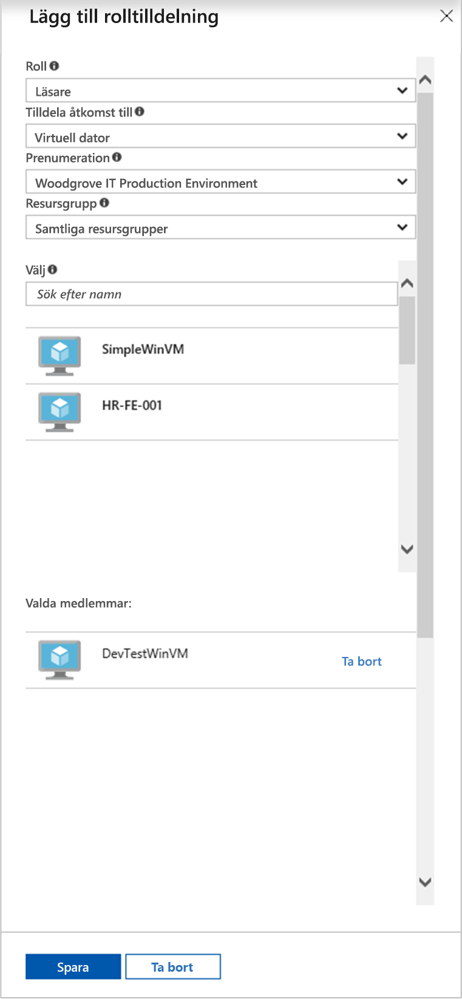

# <a name="use-a-windows-vm-system-assigned-managed-identity-to-access-resource-manager"></a>Använda en systemtilldelad hanterad identitet för en virtuell Windows-dator för åtkomst till Resource Manager

[!INCLUDE [preview-notice](../../../includes/active-directory-msi-preview-notice.md)]

Den här snabbstarten visar hur du kommer åt Azure Resource Manager-API:t via en virtuell Windows-dator med aktiverad systemtilldelad hanterad identitet. Hanterade identiteter för Azure-resurser hanteras automatiskt av Azure och gör att du kan autentisera mot tjänster som stöder Azure AD-autentisering, utan att du behöver skriva in autentiseringsuppgifter i koden. Lär dig att:

> [!div class="checklist"] 
> * Ge den virtuella datorn åtkomst till en resursgrupp i Azure Resource Manager 
> * Hämta en åtkomsttoken med hjälp av den virtuella datorns identitet och använda den för att anropa Azure Resource Manager

## <a name="prerequisites"></a>Nödvändiga komponenter

[!INCLUDE [msi-tut-prereqs](../../../includes/active-directory-msi-tut-prereqs.md)]

## <a name="grant-your-vm-access-to-a-resource-group-in-resource-manager"></a>Ge den virtuella datorn åtkomst till en resursgrupp i Resource Manager
Med hjälp av hanterade identiteter för Azure-resurser kan din kod hämta åtkomsttoken för att autentisera mot resurser som har stöd för Azure AD-autentisering.  Azure Resource Manager har stöd för Azure AD-autentisering.  Först måste vi ge den virtuella datorns systemtilldelade hanterade identitet åtkomst till en resurs i Resource Manager, i detta fall den resursgrupp som den virtuella datorn finns i.  

1.  Gå till fliken för **resursgrupper**. 
2.  Välj den specifika **resursgrupp** som du skapade för den **virtuella Windows-datorn**. 
3.  Gå till **Åtkomstkontroll (IAM)** på den vänstra panelen. 
4.  **Lägg sedan till en ny rolltilldelning** för den **virtuella Windows-datorn**.  Välj **rollen** som **läsare**. 
5.  I nästa listruta **tilldelar du behörighet till** resursen **Virtuell dator**. 
6.  Kontrollera sedan att rätt prenumeration visas i listrutan **Prenumeration**. Och för **Resursgrupp** väljer du **Alla resursgrupper**. 
7.  I **Välj** väljer du slutligen din virtuella Windows-dator i listrutan och klickar på **Spara**.

    

## <a name="get-an-access-token-using-the-vms-system-assigned-managed-identity-and-use-it-to-call-azure-resource-manager"></a>Hämta en åtkomsttoken med hjälp av den virtuella datorns systemtilldelade hanterade identitet och använd den för att anropa Azure Resource Manager 

Du måste använda **PowerShell** i den här delen.  Om du inte har installerat **PowerShell** kan du hämta det [här](https://docs.microsoft.com/powershell/azure/overview). 

1.  I portalen går du till **Virtuella datorer** och sedan till den virtuella Windows-datorn. Under **Översikt** klickar du på **Anslut**. 
2.  Ange ditt **användarnamn** och **lösenord** som du lade till när du skapade den virtuella Windows-datorn. 
3.  Nu när du har skapat en **anslutning till fjärrskrivbord** med den virtuella datorn öppnar du **PowerShell** i fjärrsessionen. 
4.  Använd cmdleten Invoke-WebRequest och skicka en begäran till den lokala slutpunkten för hanterad identitet för Azure-resurser för att hämta en åtkomsttoken för Azure Resource Manager.

    ```powershell
       $response = Invoke-WebRequest -Uri 'http://169.254.169.254/metadata/identity/oauth2/token?api-version=2018-02-01&resource=https://management.azure.com/' -Method GET -Headers @{Metadata="true"}
    ```
    
    > [!NOTE]
    > Värdet för parametern ”resource” måste vara en exakt matchning av vad som förväntas av Azure AD. När du använder Azure Resource Manager-resurs-ID:t måste du ta med det avslutande snedstrecket i URI:n.
    
    Extrahera sedan hela svaret som lagras som en JSON-formaterad sträng (JavaScript Object Notation) i $response-objektet. 
    
    ```powershell
    $content = $response.Content | ConvertFrom-Json
    ```
    Extrahera sedan åtkomsttoken från svaret.
    
    ```powershell
    $ArmToken = $content.access_token
    ```
    
    Anropa slutligen Azure Resource Manager med din åtkomsttoken. I det här exemplet använder vi även cmdleten Invoke-WebRequest för att göra anropet till Azure Resource Manager och lägga till vår åtkomsttoken i auktoriseringshuvudet.
    
    ```powershell
    (Invoke-WebRequest -Uri https://management.azure.com/subscriptions/<SUBSCRIPTION ID>/resourceGroups/<RESOURCE GROUP>?api-version=2016-06-01 -Method GET -ContentType "application/json" -Headers @{ Authorization ="Bearer $ArmToken"}).content
    ```
    > [!NOTE] 
    > Eftersom URL:en är skiftlägeskänslig måste du använda exakt samma skiftläge som du använde tidigare när du namngav resursgruppen, samt versalt ”G” i ”resourceGroups”.
        
    Följande kommando returnerar information om resursgruppen:

    ```powershell
    {"id":"/subscriptions/98f51385-2edc-4b79-bed9-7718de4cb861/resourceGroups/DevTest","name":"DevTest","location":"westus","properties":{"provisioningState":"Succeeded"}}
    ```

## <a name="next-steps"></a>Nästa steg

I den här snabbstarten har du lärt dig hur du använder en systemtilldelad hanterad identitet för att få åtkomst till Azure Resource Manager-API:et.  Mer information om Azure Resource Manager finns här:

> [!div class="nextstepaction"]
>[Azure Resource Manager](/azure/azure-resource-manager/resource-group-overview)

