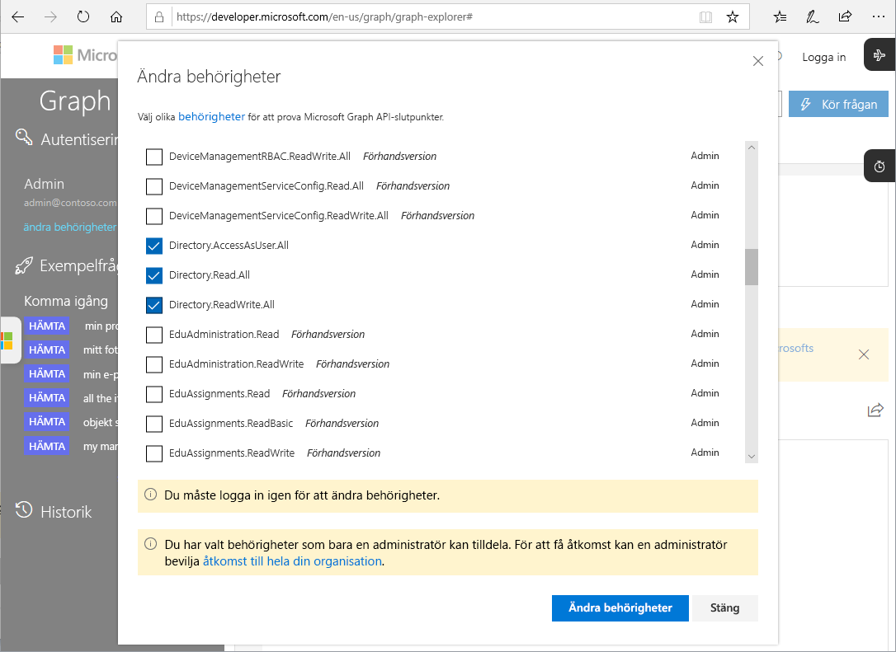

# Microsoft Graph API:er för privilegierad identitetshantering (förhandsversion)

Du kan utföra alla uppgifter för privilegierad identitetshantering med hjälp av [Microsoft Graph API:er](https://developer.microsoft.com/graph/docs/concepts/overview) för Azure Active Directory. I den här artikeln beskrivs viktiga begrepp för att använda Microsoft Graph API:er för privilegierad identitetshantering.

Mer information om Microsoft Graph-API:er finns i [referensen för Azure AD Privileged Identity Management API](https://developer.microsoft.com/graph/docs/api-reference/beta/resources/privilegedidentitymanagement_root).

> [!IMPORTANT]
> API:er under /betaversionen i Microsoft Graph är i förhandsversion och kan komma att ändras. Användning av dessa API:er i produktionsprogram stöds inte.
>
> Även om alla PIM-åtgärder stöds via våra Graph API-kommandon använder vi ett annat system för att godkänna aktiveringsbegäranden. Graph API för godkännande håller för närvarande på att utvecklas och kommer att släppas under de närmaste månaderna.

## Nödvändiga behörigheter

Om du vill anropa Api:erna för privilegierad identitetshantering i Microsoft Graph måste du ha **en eller flera** av följande behörigheter:

- `Directory.AccessAsUser.All`
- `Directory.Read.All`
- `Directory.ReadWrite.All`
- `PrivilegedAccess.ReadWrite.AzureAD`

### Ställa in behörigheter

För att program ska kunna anropa Microsoft Graph API:er för privilegierad identitetshantering måste de ha de behörigheter som krävs. Det enklaste sättet att ange nödvändiga behörigheter är att använda [Azure AD-ramverket för medgivande](../develop/consent-framework.md).

### Ställa in behörigheter i Graph Explorer

Om du använder Graph Explorer för att testa anrop kan du ange behörigheterna i verktyget.

1. Logga in på [Graph Explorer](https://developer.microsoft.com/graph/graph-explorer) som global administratör.

1. Klicka på **ändra behörigheter**.

    

1. Markera kryssrutorna bredvid de behörigheter som du vill inkludera. `PrivilegedAccess.ReadWrite.AzureAD` är ännu inte tillgänglig i Graph Explorer.

    

1. Klicka på **Ändra behörigheter** för att tillämpa behörighetsändringarna.

## Nästa steg

- [Referens för Azure AD Privileged Identity Management API](https://developer.microsoft.com/graph/docs/api-reference/beta/resources/privilegedidentitymanagement_root)
