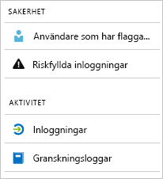

# Vad är rapporter i Azure Active Directory?

Azure AD-rapporter (Azure Active Directory) tillhandahåller en omfattande översikt över aktivitet i din miljö. Med dessa data kan du:

- Avgör hur din app och dina tjänster används av dina användare
- Identifiera potentiella risker som påverkar hälsotillståndet för din miljö
- Felsöka problem som hindrar användare från att uträtta sitt arbete  

Rapportarkitekturen förlitar sig på två huvudsakliga pelare:

- [Säkerhetsrapporter](#security-reports)
- [Aktivitetsrapporter](#activity-reports)

## Säkerhetsrapporter

Säkerhetsrapporter hjälper dig att skydda din organisations identiteter. Det finns två typer av säkerhetsrapporter:

- **Användare som har flaggats för risk** - Från [användare som har flaggats för risksäkerhetsrapporten](concept-user-at-risk.md) får du en översikt över användarkonton som kan ha drabbats.

- **Riskfyllda inloggningar** – med [ säkerhetsrapporten för riskfyllda inloggningar](concept-risky-sign-ins.md) får du en indikator för inloggningsförsök som kan ha utförts av någon som inte är tillförlitligt ägare för ett användarkonto. 

### Vilken Azure AD-licens behöver du för att komma åt en säkerhetsrapport?  

Alla utgåvor av Azure AD ger rapporter över användare som har flaggats för risk och riskfyllda inloggningar. Nivån av rapportens detaljrikedom varierar dock mellan versionerna: 

- I **versionerna Azure Active Directory Free och Basic** har du en lista över användare som har flaggats för risk och riskfyllda inloggningar. 

- Utgåvan **Azure Active Directory Premium 1** har en utökad modell där du även kan utforska några av de underliggande riskhändelser som har identifierats för varje rapport. 

- Utgåvan **Azure Active Directory Premium 2** ger den mest detaljerade informationen om de underliggande riskhändelser och du kan konfigurera säkerhetsprinciper som automatiskt svarar på konfigurerade risknivåer.

## Aktivitetsrapporter

Aktivitetsrapporter hjälper dig att förstå beteendet för användare i din organisation. Det finns två typer av aktivitetsrapporter i Azure AD:

- **Granskningsloggar** – [aktivitetsrapport för granskningsloggar ](concept-audit-logs.md) ger dig tillgång till historiken för varje aktivitet i din klient.

- **Inloggningar** – med [aktivitetsrapport för inloggningar ](concept-sign-ins.md) kan du bestämma vem som har utfört de uppgifter som rapporteras i granskningsloggarna.

### Granskningsloggar 

[Granskningsloggarna](concept-audit-logs.md) ger dokumentation över systemaktiviteter för kontroll av överensstämmelse. Dessa data gör att det möjligt att hantera vanliga scenarier, till exempel:

- Någon i min klient har fått tillgång till en administratörsgrupp. Vem som gav användaren åtkomst? 

- Jag vill ha en lista över användare som loggar in på en viss app eftersom jag nyss publicerade appen och vill veta om den fungerar bra

- Jag vill veta hur många lösenordsåterställningar som sker i min klient

#### Vilken Azure AD-licens behöver du för att komma åt granskningsloggar?  

Granskningsloggarna är tillgängliga för funktioner som du har licenser för. Om du har en licens för en specifik funktion har du också åtkomst till dess granskningslogg. Mer information finns i avsnittet om [Azure Active Directory-funktioner](https://www.microsoft.com/cloud-platform/azure-active-directory-features).   

### Rapport över inloggningar

[Rapport för inloggningar ](concept-sign-ins.md) gör det möjligt för att få svar på frågor som:

- Vilket inloggningsmönster har en användare?
- Hur många användare har en användare loggat in under en vecka?
- Vad är status för dessa inloggningar?

#### Vilken Azure AD-licens behöver du för att komma åt inloggningsaktiviteter?  

Din klient måste ha en associerad Azure AD Premium-licens för att det ska gå att se alla rapporter om inloggningsaktiviteter.

## Programmässig åtkomst

Utöver användargränssnittet ger Azure AD också [programmässig åtkomst](concept-reporting-api.md) till rapporteringsdata via en uppsättning REST-baserade API:er. Du kan anropa API: erna från en mängd olika programmeringsspråk och verktyg. 

## Nästa steg

- [Rapport över riskfyllda inloggningar](concept-risky-sign-ins.md)
- [Granskningsloggar](concept-audit-logs.md)
- [Inloggningsrapport](concept-sign-ins.md)
