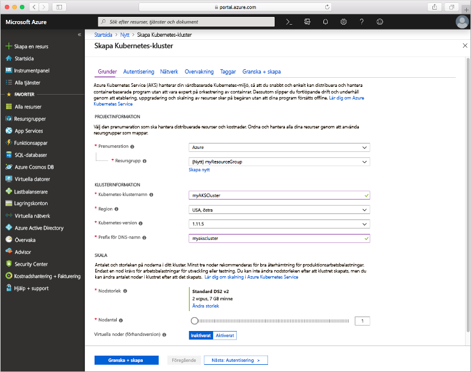
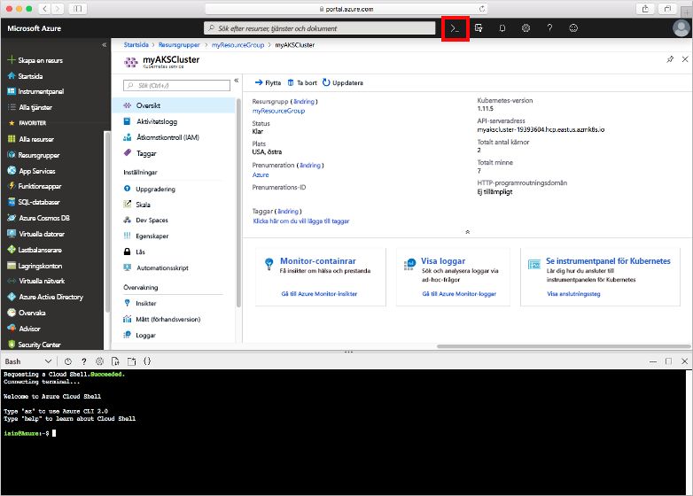
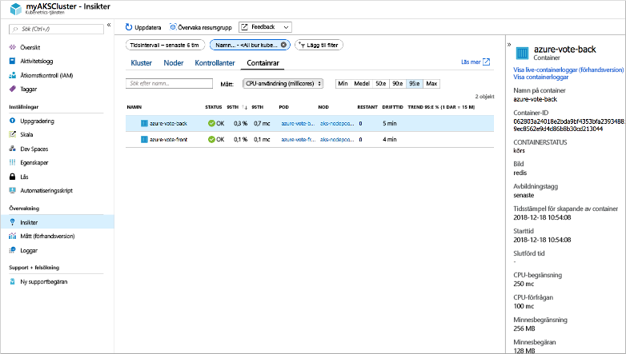

# <a name="quickstart-deploy-an-azure-kubernetes-service-aks-cluster-using-the-azure-portal"></a>Snabbstart: Distribuera ett kluster med Azure Kubernetes Service (AKS) med hjälp av Azure Portal

Azure Kubernetes Service (AKS) är en hanterad Kubernetes-tjänst som gör att du snabbt kan distribuera och hantera kluster. I den här snabbstarten ska du distribuera ett AKS-kluster med hjälp av Azure-portalen. Ett flerbehållarprogram som består av en webbklientdel och en Redis-instans körs sedan i klustret. Då ser du hur du övervakar hälsotillståndet för klustret och poddar som kör programmet.


Den här snabbstarten förutsätter grundläggande kunskaper om Kubernetes-begrepp. Mer information finns i [Kubernetes Core Concepts for Azure Kubernetes service (AKS)][kubernetes-concepts].

Om du inte har en Azure-prenumeration kan du skapa ett [kostnadsfritt konto](https://azure.microsoft.com/free/?WT.mc_id=A261C142F) innan du börjar.

## <a name="sign-in-to-azure"></a>Logga in på Azure

Logga in på Azure Portal på https://portal.azure.com.

## <a name="create-an-aks-cluster"></a>Skapa ett AKS-kluster

I det övre vänstra hörnet av Azure Portal väljer du **+ skapa en resurs** > **behållare** >  **Kubernetes-tjänst**.

Du skapar ett AKS-kluster genom att slutföra följande steg:

1. På sidan **grundläggande** inställningar konfigurerar du följande alternativ:
   - *PROJEKTINFORMATION*: Välj en Azure-prenumeration och välj sedan eller skapa en Azure-resursgrupp, till exempel *myResourceGroup*. Ange ett **Kubernetes-klusternamn**, till exempel *myAKSCluster*.
   - *KLUSTERINFORMATION*: Välj en region, en Kubernetes-version och ett DNS-namnprefix för AKS-klustret.
   - **Primär Node-pool**: Välj en VM-storlek för AKS-noderna. VM-storleken **kan inte** ändras efter att ett AKS-kluster har distribuerats. 
       - Välj även det antal noder som ska distribueras till klustret. För den här snabbstarten ställer du in **Nodantal** till *1*. Antalet noder **kan** justeras efter att klustret har distribuerats.
    
     

     Välj **Nästa: Skala** när den är klar.

2. Behåll standard alternativen på sidan **skala** . Längst ned på skärmen klickar du på **Nästa: autentisering**.
> [!CAUTION]
> Det kan ta flera minuter att sprida nya AAD-tjänstens huvud namn och bli tillgängliga, vilket orsakar att tjänstens huvud namn inte hittades fel och validerings fel i Azure Portal. Om du når [den här lösningen går du](troubleshooting.md#im-receiving-errors-that-my-service-principal-was-not-found-when-i-try-to-create-a-new-cluster-without-passing-in-an-existing-one) vidare till lösningar.
3. Konfigurera följande alternativ på sidan **autentisering** :
   - Skapa ett nytt huvud namn för tjänsten genom att lämna fältet för **tjänstens huvud** namn med **(nytt) standard huvud namn för tjänsten**. Du kan också välja *Konfigurera tjänstens huvud namn* för att använda en befintlig. Om du använder en befintlig måste du ange klient-ID och hemlighet för tjänstens huvud namn.
   - Aktivera alternativet för kontroller för rollbaserad åtkomstkontroll (RBAC) för Kubernetes. Detta ger mer detaljerad kontroll över åtkomsten till de Kubernetes-resurser som distribueras i ditt AKS-kluster.

    Som standard används *Grundläggande* nätverk och Azure Monitor för container är aktiverat. Klicka på **Granska + skapa** och **skapa** när verifieringen är klar.

Det tar några minuter att skapa AKS-klustret. När distributionen är klar klickar du på **gå till resurs**, eller bläddrar till resurs gruppen AKS-kluster, till exempel *myResourceGroup*, och väljer AKS-resursen, till exempel *myAKSCluster*. AKS-klustrets instrument panel visas, som i det här exemplet:


## <a name="connect-to-the-cluster"></a>Anslut till klustret

Om du vill hantera ett Kubernetes-kluster använder du [kubectl][kubectl], Kubernetes kommando rads klient. `kubectl`-klienten är förinstallerad i Azure Cloud Shell.

Öppna Cloud Shell med `>_` knappen överst i Azure Portal.



För att konfigurera `kubectl` till att ansluta till ditt Kubernetes-kluster använder du kommandot [az aks get-credentials][az-aks-get-credentials]. Det här kommandot laddar ned autentiseringsuppgifter och konfigurerar Kubernetes CLI för att använda dem. I följande exempel hämtas autentiseringsuppgifterna för klusternamnet *myAKSCluster* i den resursgrupp som heter *myResourceGroup*:

```azurecli-interactive
az aks get-credentials --resource-group myResourceGroup --name myAKSCluster
```

Du kan kontrollera anslutningen till klustret genom att köra kommandot [kubectl get][kubectl-get] för att returnera en lista över klusternoderna.

```azurecli-interactive
kubectl get nodes
```

Följande exempelutdata visar den enskilda nod som skapades i föregående steg. Kontrollera att status för noden är *Klar*:

```
NAME                       STATUS    ROLES     AGE       VERSION
aks-agentpool-14693408-0   Ready     agent     15m       v1.11.5
```

## <a name="run-the-application"></a>Köra programmet

En Kubernetes-manifestfil definierar ett önskat tillstånd för klustret, till exempel vilka containeravbildningar som ska köras. I den här snabbstarten används ett manifest för att skapa alla objekt som behövs för att köra Azure Vote-programmet. Det här manifestet innehåller två [Kubernetes-distributioner][kubernetes-deployment] – en för Azures rösten python-program och en annan för en Redis-instans. Två [Kubernetes-tjänster][kubernetes-service] skapas också – en intern tjänst för Redis-instansen och en extern tjänst för att få åtkomst till Azures röst program från Internet.

> [!TIP]
> I den här snabbstarten skapar och distribuerar du manuellt applikationsmanifest till AKS-klustret. I verkliga scenarier kan du använda [Azure dev Spaces][azure-dev-spaces] för att snabbt iterera och felsöka koden direkt i AKS-klustret. Du kan använda Dev Spaces på olika OS-plattformar och i olika utvecklingsmiljöer samt arbeta tillsammans med andra i ditt team.

I Cloud Shell använder `nano` eller `vi` för att skapa en fil med namnet `azure-vote.yaml` och kopiera i följande yaml-definition:

```yaml
apiVersion: apps/v1
kind: Deployment
metadata:
  name: azure-vote-back
spec:
  replicas: 1
  selector:
    matchLabels:
      app: azure-vote-back
  template:
    metadata:
      labels:
        app: azure-vote-back
    spec:
      nodeSelector:
        "beta.kubernetes.io/os": linux
      containers:
      - name: azure-vote-back
        image: redis
        resources:
          requests:
            cpu: 100m
            memory: 128Mi
          limits:
            cpu: 250m
            memory: 256Mi
        ports:
        - containerPort: 6379
          name: redis
---
apiVersion: v1
kind: Service
metadata:
  name: azure-vote-back
spec:
  ports:
  - port: 6379
  selector:
    app: azure-vote-back
---
apiVersion: apps/v1
kind: Deployment
metadata:
  name: azure-vote-front
spec:
  replicas: 1
  selector:
    matchLabels:
      app: azure-vote-front
  template:
    metadata:
      labels:
        app: azure-vote-front
    spec:
      nodeSelector:
        "beta.kubernetes.io/os": linux
      containers:
      - name: azure-vote-front
        image: microsoft/azure-vote-front:v1
        resources:
          requests:
            cpu: 100m
            memory: 128Mi
          limits:
            cpu: 250m
            memory: 256Mi
        ports:
        - containerPort: 80
        env:
        - name: REDIS
          value: "azure-vote-back"
---
apiVersion: v1
kind: Service
metadata:
  name: azure-vote-front
spec:
  type: LoadBalancer
  ports:
  - port: 80
  selector:
    app: azure-vote-front
```

Distribuera programmet med kommandot [kubectl Apply][kubectl-apply] och ange namnet på ditt yaml-manifest:

```azurecli-interactive
kubectl apply -f azure-vote.yaml
```

Följande exempelutdata visar de distributioner och tjänster som skapats:

```
deployment "azure-vote-back" created
service "azure-vote-back" created
deployment "azure-vote-front" created
service "azure-vote-front" created
```

## <a name="test-the-application"></a>Testa programmet

När programmet körs så exponerar en Kubernetes-tjänst programmets klientdel mot Internet. Den här processen kan ta ett par minuter att slutföra.

Du kan övervaka förloppet genom att använda kommandot [kubectl get service][kubectl-get] med argumentet `--watch`.

```azurecli-interactive
kubectl get service azure-vote-front --watch
```

Till en början visas *EXTERNAL-IP* för *azure-vote-front*-tjänsten som *väntande*.

```
NAME               TYPE           CLUSTER-IP   EXTERNAL-IP   PORT(S)        AGE
azure-vote-front   LoadBalancer   10.0.37.27   <pending>     80:30572/TCP   6s
```

När *EXTERNAL-IP*-adressen ändras från *väntande* till en faktisk offentlig IP-adress använder du `CTRL-C` för att stoppa `kubectl`-övervakningsprocessen. Följande exempelutdata visar en giltig offentlig IP-adress som har tilldelats tjänsten:

```
azure-vote-front   LoadBalancer   10.0.37.27   52.179.23.131   80:30572/TCP   2m
```

Om du vill se hur Azure Vote-appen fungerar i praktiken så öppnar du en webbläsare till den externa IP-adressen för din tjänst.


## <a name="monitor-health-and-logs"></a>Övervaka hälsotillstånd och loggar

När du skapade klustret aktiverades Azure Monitor för container. Den här övervakningsfunktionen tillhandahåller hälsomått för både AKS-klustret och de poddar som körs i klustret.

Det kan ta några minuter för dessa data att hämtas till Azure Portal. Om du vill se aktuell status, drifttid och resursanvändning för Azure Vote poddarna bläddrar du tillbaka till AKS-resursen i Azure-portalen, till exempel *myAKSCluster*. Du kan sedan komma åt hälsostatusen så här:

1. Under **Övervakning** väljer du **Insights**  på vänster sida
1. Överst väljer du **+ Lägg till filter**
1. Välj *Namnrymd* som egenskapen, och välj sedan *\<Alla förutom kube-system\>*
1. Välja att visa **containrarna**.

Containrarna *bak-azure-vote* och *azure-vote-front* visas enligt följande exempel:



Om du vill se loggar för podden `azure-vote-front` väljer du länken **Visa containerloggar** på höger sida av listan över containrar. Loggarna inkluderar strömmarna *stdout* och *stderr* från containern.


## <a name="delete-cluster"></a>Ta bort kluster

När klustret inte längre behövs, kan du ta bort klusterresursen. Alla associerade resurser tas då också bort. Du kan göra detta i Azure-portalen genom att välja knappen **Ta bort** på AKS-klustrets instrumentpanel. Alternativt kan du använda kommandot [AZ AKS Delete][az-aks-delete] i Cloud Shell:

```azurecli-interactive
az aks delete --resource-group myResourceGroup --name myAKSCluster --no-wait
```

> [!NOTE]
> När du tar bort klustret tas Azure Active Directory-tjänstens huvudnamn, som används av AKS-klustret, inte bort. Anvisningar om hur du tar bort tjänstens huvud namn finns i [AKS Service Principal överväganden och borttagning][sp-delete].

## <a name="get-the-code"></a>Hämta koden

I den här snabbstarten har fördefinierade containeravbildningar användes för att skapa en Kubernetes-distribution. Den tillhörande programkoden, Dockerfile och Kubernetes-manifestfilen finns på GitHub.

[https://github.com/Azure-Samples/azure-voting-app-redis][azure-vote-app]

## <a name="next-steps"></a>Nästa steg

I den här snabbstartsguiden distribuerade du ett Kubernetes-kluster och distribuerade sedan ett flerbehållarprogram till det.

Om du vill lära dig mer om AKS, och gå igenom ett exempel med fullständig distributionskod, fortsätter du till självstudiekursen om Kubernetes-kluster.

> [!div class="nextstepaction"]
> [AKS-självstudie][aks-tutorial]

<!-- LINKS - external -->
[azure-vote-app]: https://github.com/Azure-Samples/azure-voting-app-redis.git
[kubectl]: https://kubernetes.io/docs/user-guide/kubectl/
[kubectl-apply]: https://kubernetes.io/docs/reference/generated/kubectl/kubectl-commands#apply
[kubectl-get]: https://kubernetes.io/docs/reference/generated/kubectl/kubectl-commands#get
[kubernetes-documentation]: https://kubernetes.io/docs/home/

<!-- LINKS - internal -->
[kubernetes-concepts]: concepts-clusters-workloads.md
[az-aks-get-credentials]: /cli/azure/aks?view=azure-cli-latest#az-aks-get-credentials
[az-aks-delete]: /cli/azure/aks#az-aks-delete
[aks-monitor]: ../monitoring/monitoring-container-health.md
[aks-network]: ./concepts-network.md
[aks-tutorial]: ./tutorial-kubernetes-prepare-app.md
[http-routing]: ./http-application-routing.md
[sp-delete]: kubernetes-service-principal.md#additional-considerations
[azure-dev-spaces]: https://docs.microsoft.com/azure/dev-spaces/
[kubernetes-deployment]: concepts-clusters-workloads.md#deployments-and-yaml-manifests
[kubernetes-service]: concepts-network.md#services