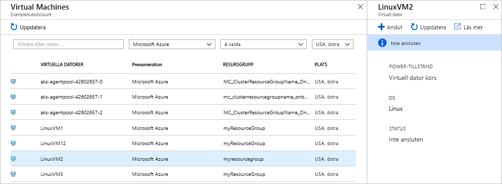
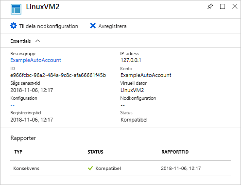

# <a name="configure-a-linux-virtual-machine-with-desired-state-configuration"></a>Konfigurera en virtuell Linux-dator med DSC (Desired State Configuration)

Genom att aktivera önskat tillstånd-konfiguration, DSC (Desired State Configuration), kan du hantera och övervaka konfigurationerna för dina Windows- och Linux-servrar. Konfigurationer som avviker från den önskade konfigurationen kan identifieras och korrigeras automatiskt. Den här snabbstarten går igenom registrering på en virtuell Linux-dator och distribution av en LAMP-stack med DSC.

## <a name="prerequisites"></a>Nödvändiga komponenter

Följande krävs för att slutföra den här snabbstarten:

* En Azure-prenumeration. Om du inte har en Azure-prenumeration kan du skapa ett [kostnadsfritt konto](https://azure.microsoft.com/free/).
* Ett Azure Automation-konto. Instruktioner om hur du skapar ett Kör som-konto för Azure Automation finns i [Azure Kör som-konto](automation-sec-configure-azure-runas-account.md).
* En virtuell Azure Resource Manager-dator (inte klassisk) med Red Hat Enterprise Linux, CentOS eller Oracle Linux. Instruktioner om hur du skapar en virtuell dator finns i [Skapa din första virtuella Linux-dator i Azure Portal](../virtual-machines/linux/quick-create-portal.md)

## <a name="sign-in-to-azure"></a>Logga in på Azure
Logga in i Azure på https://portal.azure.com

## <a name="onboard-a-virtual-machine"></a>Registrera en virtuell dator
Det finns många olika metoder för att registrera en dator och aktivera DSC. I den här snabbstarten beskrivs registrering via ett Automation-konto. Du kan läsa mer om olika metoder för att registrera datorerna med DSC genom att läsa artikeln om [registrering](https://docs.microsoft.com/azure/automation/automation-dsc-onboarding).

1. I det vänstra fönstret i Azure Portal väljer du **Automation-konton**. Om det inte visas i det vänstra fönstret klickar du på **Alla tjänster** och söker efter den resulterande vyn.
1. Välj ett Automation-konto i listan.
1. I det vänstra fönstret i Automation-kontot väljer du **Tillståndskonfiguration (DSC)**.
2. Klicka på **Lägg till** att öppna sidan för att välja virtuell dator.
3. Leta reda på den virtuella dator du vill aktivera DSC för. Du kan använda sökfältet och filteralternativ för att hitta en viss virtuell dator.
4. Klicka på den virtuella datorn och välj sedan **Anslut**
5. Välj lämpliga DSC-inställningar för den virtuella datorn. Om du redan har förberett en konfiguration kan du ange den som *Nodkonfigurationsnamn*. Du kan ställa in [konfigurationsläget](https://docs.microsoft.com/powershell/dsc/metaconfig) på att styra datorns konfigurationsbeteende.
6. Klicka på **OK**



När DSC-tillägget har distribuerats på den virtuella datorn visas *Ansluter*.

## <a name="import-modules"></a>Importera moduler

Moduler innehåller DSC-resurser och många finns i [PowerShell-galleriet](https://www.powershellgallery.com). Resurser som används i dina konfigurationer måste importeras till Automation-kontot innan du kompilerar. För de här självstudierna krävs modulen med namnet **nx**.

1. I det vänstra fönstret i Automation-kontot väljer du **Modulgalleri** (under Delade resurser).
1. Sök efter den modul du vill importera genom att skriva en del av namnet: *nx*
1. Klicka på den modul du vill importera
1. Klicka på **Importera**


## <a name="import-the-configuration"></a>Importera konfigurationen

I den här snabbstarten används en DSC-konfiguration som konfigurerar Apache HTTP Server, MySQL och PHP på datorn.

Information om DSC-konfigurationer finns i [DSC-konfigurationer](https://docs.microsoft.com/powershell/dsc/configurations).

I en textredigerare skriver du följande och sparar lokalt som `LAMPServer.ps1`.

```powershell-interactive
configuration LAMPServer {
   Import-DSCResource -module "nx"

   Node localhost {

        $requiredPackages = @("httpd","mod_ssl","php","php-mysql","mariadb","mariadb-server")
        $enabledServices = @("httpd","mariadb")

        #Ensure packages are installed
        ForEach ($package in $requiredPackages){
            nxPackage $Package{
                Ensure = "Present"
                Name = $Package
                PackageManager = "yum"
            }
        }

        #Ensure daemons are enabled
        ForEach ($service in $enabledServices){
            nxService $service{
                Enabled = $true
                Name = $service
                Controller = "SystemD"
                State = "running"
            }
        }
   }
}
```

Importera konfigurationen:

1. I det vänstra fönstret i Automation-kontot väljer du **Tillståndskonfiguration (DSC)** och klickar sedan på fliken **Konfigurationer**.
2. Klicka på **+ Lägg till**
3. Välj den *konfigurationsfil* som du sparade i det föregående steget
4. Klicka på **OK**

## <a name="compile-a-configuration"></a>Kompilera en konfiguration

DSC-konfigurationer måste kompileras till en nodkonfiguration (MOF-dokument) innan de tilldelas till en nod. Kompilering verifierar konfigurationen och tillåter indata för parametervärden. Mer information om hur du kompilerar en konfiguration finns i: [Kompilera konfigurationer i Azure Automation DSC](https://docs.microsoft.com/azure/automation/automation-dsc-compile)

Kompilera konfigurationen:

1. I det vänstra fönstret i Automation-kontot väljer du **Tillståndskonfiguration (DSC)** och klickar sedan på fliken **Konfigurationer**.
1. Välj konfigurationen du importerade i det föregående steg, "LAMPServer"
1. I menyalternativen klickar du på **Kompilera** och sedan på **Ja**
1. I konfigurationsvyn visas ett nytt *kompileringsjobb* i kö. När jobbet har slutförts kan du gå vidare till nästa steg. Om det finns några fel kan du klicka på kompileringsjobbet och få information.

## <a name="assign-a-node-configuration"></a>Tilldela en nodkonfiguration

En kompilerad *nodkonfiguration* kan tilldelas till DSC-noder. Tilldelningen tillämpar konfigurationen på datorn och övervakar (eller korrigerar automatiskt) avvikelser från den konfigurationen.

1. I det vänstra fönstret i Automation-kontot väljer du **Tillståndskonfiguration (DSC) och klickar sedan på fliken **Noder**.
1. Välj den nod du vill tilldela en konfiguration till
1. Klicka på **Tilldela nodkonfiguration**
1. Välj *nodkonfigurationen* - **LAMPServer.localhost** – för att tilldela och klicka på **OK**
1. Den kompilerade konfigurationen är nu tilldelad till noden och nodstatusen ändras till *Väntar*. Vid nästa periodiska kontroll hämtar noden konfigurationen, tillämpar den och rapporterar tillbaka statusen. Det kan ta upp till 30 minuter för noden att hämta konfigurationen, beroende på nodens inställningar. Om du vill tvinga fram en omedelbar kontroll kan du köra följande kommando lokalt på den virtuella Linux-datorn: `sudo /opt/microsoft/dsc/Scripts/PerformRequiredConfigurationChecks.py`



## <a name="viewing-node-status"></a>Visa nodstatus

Status för alla hanterade noder finns i **Tillståndskonfiguration (DSC)** och under fliken **Noder** i Automation-kontot. Du kan filtrera visningen efter status, nodkonfiguration och namnsökning.


## <a name="next-steps"></a>Nästa steg

I den här snabbstarten har du registrerat en virtuell Linux-dator med DSC, skapat en konfiguration för en LAMP-stack och distribuerat den på den virtuella datorn. Information om hur du kan använda Automation DSC till att aktivera kontinuerlig distribution finns i den här artikeln:

> [!div class="nextstepaction"]
> [Continuous deployment to a VM using DSC and Chocolatey](./automation-dsc-cd-chocolatey.md) (Kontinuerlig distribution på en virtuell datorn med hjälp av DSC och Chocolatey)

* Mer information om PowerShell DSC finns i [PowerShell Desired State Configuration Overview](https://docs.microsoft.com/powershell/dsc/overview) (Översikt över PowerShell DSC).
* Mer information om hur du hanterar Automation DSC från PowerShell finns i [Azure PowerShell](https://docs.microsoft.com/powershell/module/azurerm.automation/)
* Information om hur du vidarebefordrar DSC-rapporter till Azure Monitor-loggar för rapportering och aviseringar finns i avsnittet om att [vidarekoppla DSC-rapporter till Azure Monitor-loggar](https://docs.microsoft.com/azure/automation/automation-dsc-diagnostics) 

