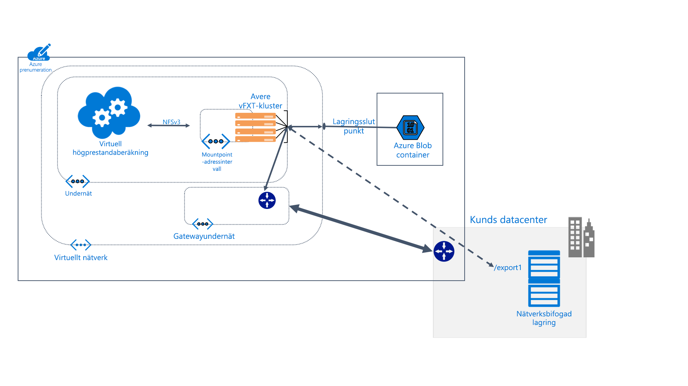

# Vad är Avere vFXT för Azure? 

Avere vFXT för Azure är cachelagringslösning för filsystem för dataintensiva HPC-uppgifter (databehandling med höga prestanda). Du kan dra nytta av molnets skalbarhet för att göra dina data tillgängliga vid den tid och på den plats de behövs – även för data som lagras på din lokala maskinvara.

Avere vFXT stöder följande vanliga databehandlingsscenarier: 

* Hybridmolnarkitektur: Avere vFXT för Azure kan fungera med maskinvarubaserade lagringssystem, där du får fördelarna med databehandling i molnet utan att behöva flytta filer. 
* Kapacitetsstyrd omdirigering (cloud bursting): Avere vFXT för Azure kan hjälpa dig att flytta dina data till molnet för ett enstaka projekt, eller lyfta och föra över hela arbetsflödet permanent. 

Avere vFXT för Azure passar bäst för följande situationer: 

* Läsintensiva åtgärder för HPC-arbetsbelastningar
* Program som använder vanligt NFS-protokoll
* Servergrupper med 1 000 till 40 000 CPU-kärnor
* Integrering med lokal maskinvaru-NAS, Azure Blob Storage eller båda

Mer information finns på <https://azure.microsoft.com/services/storage/avere-vfxt/>

## Vilka använder Avere vFXT för Azure? 

Avere vFXT kan hjälpa till med alla typer av läsintensiva databehandlingsuppgifter:

### Rendering av visuella effekter 

Inom media och underhållning kan Avere vFXT-klustret påskynda dataåtkomsten för tidskritiska renderingsprojekt. Eftersom du kan lägga till mer cacheutrymme och fler beräkningsnoder i Azure har du flexibiliteten att hantera stora projekt effektivt. 

### Biovetenskap 

Med Avere vFXT kan forskare köra sina sekundära analysarbetsflöden i Azure Compute och komma åt genomiska data oavsett var de befinner sig.

I läkemedelsforskning kan Avere vFXT-kluster användas till snabbare identifiering av läkemedel genom hjälpa forskare att förutsäga medicin/mål-interaktion och analysera forskningsdata.

### Analyser för ekonomiska tjänster

Ett Avere vFXT-kluster kan hjälpa till med snabbare beräkningar för kvantitativa analyser, vilket ger finansföretag bättre information för att fatta strategiska beslut. 

## Funktioner och specifikationer

Avere vFXT-systemet utgörs av minst tre virtuella Edge Filer-noder, konfigurerade i ett kluster. Det kan finnas nära klientdatorerna, som monterar klustret istället för att montera lagringsutrymmet direkt. 

Avere vFXT-klustret cachelagrar filerna när de begärs. Upprepade begäranden kan hanteras från cachen i drygt 80 procent av gångerna.

### Kompatibilitet 

* Kompatibelt med NAS-maskinvarusystem från NetApp eller Dell EMC Isilon
* Kompatibelt med Azure Blob
* Använder NFSv3- eller SMB2-protokoll

Avere vFXT använder följande Azure-resurser: 

|Azure-komponent|   |
|----------|-----------|
|Virtuella datorer|Minst 3 D16s_v3 eller E32s_v3|
|Premium SSD-lagring|200 GB OS-utrymme plus 1 TB till 4 TB cacheutrymme per nod |
|Lagringskonto (valfritt) |v2|
|Datalagring i serverdel (valfritt) | En tom LRS Blob-container |

## Nästa steg

Här är några länkar till att skapa en egen Avere vFXT-distribution. 

* [Planera ditt system](avere-vfxt-deploy-plan.md)
* [Distributionsöversikt](avere-vfxt-deploy-overview.md)
* [Skapa vFXT](avere-vfxt-deploy.md)
