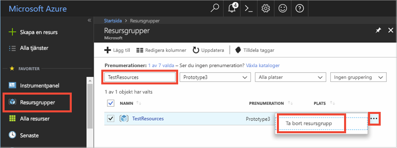

# <a name="quickstart-use-azure-cache-for-redis-with-python"></a>Snabbstart: Använda Azure Cache for Redis med Python

I den här snabb starten införlivar du Azure cache för Redis i en python-app för att få åtkomst till en säker, dedikerad cache som är tillgänglig från alla program i Azure.

## <a name="prerequisites"></a>Förutsättningar

- Azure-prenumeration – [skapa en kostnads fritt](https://azure.microsoft.com/free/)
- [Python 2 eller 3](https://www.python.org/downloads/)

## <a name="create-an-azure-cache-for-redis-on-azure"></a>Skapa Azure Cache for Redis på Azure
[!INCLUDE [redis-cache-create](../../includes/redis-cache-create.md)]

[!INCLUDE [redis-cache-create](../../includes/redis-cache-access-keys.md)]

## <a name="install-redis-py"></a>Installera redis-py

[Redis-py](https://github.com/andymccurdy/redis-py) är ett Python-gränssnitt för Azure Cache for Redis. Använd Python-verktygspaketet *pip* för att installera redis-py-paketet. 

I följande exempel används *PIP3* för python3 för att installera Redis-py-paketet på Windows 10 med hjälp av en Visual Studio 2019 Developer-kommando tolk som körs med utökade administratörs privilegier.

```python
    pip3 install redis
```


## <a name="read-and-write-to-the-cache"></a>Läsa och skriva till cachen

Kör Python och testa med hjälp av cachen från kommandoraden. Ersätt `<Your Host Name>` och `<Your Access Key>` med värdena för Azure Cache for Redis. 

```python
>>> import redis
>>> r = redis.StrictRedis(host='<Your Host Name>.redis.cache.windows.net',
        port=6380, db=0, password='<Your Access Key>', ssl=True)
>>> r.set('foo', 'bar')
True
>>> r.get('foo')
b'bar'
```

> [!IMPORTANT]
> För Redis-versionen är 3,0 eller högre tillämpas SSL-certifikats kontrollen. ssl_ca_certs måste anges explicit vid anslutning till Redis. Om du använder RH Linux finns ssl_ca_certs i certifikats-modulen "/etc/PKI/TLS/certs/ca-Bundle.CRT".

## <a name="create-a-python-script"></a>Skapa ett Python-skript

Skapa en ny textfil i skriptet med namnet *PythonApplication1.py*.

Lägg till följande skript till *PythonApplication1.py* och spara filen. Det här skriptet kommer att testa cacheåtkomst. Ersätt `<Your Host Name>` och `<Your Access Key>` med värdena för Azure Cache for Redis. 

```python
import redis

myHostname = "<Your Host Name>.redis.cache.windows.net"
myPassword = "<Your Access Key>"

r = redis.StrictRedis(host=myHostname, port=6380,
                      password=myPassword, ssl=True)

result = r.ping()
print("Ping returned : " + str(result))

result = r.set("Message", "Hello!, The cache is working with Python!")
print("SET Message returned : " + str(result))

result = r.get("Message")
print("GET Message returned : " + result.decode("utf-8"))

result = r.client_list()
print("CLIENT LIST returned : ")
for c in result:
    print("id : " + c['id'] + ", addr : " + c['addr'])
```

Kör skriptet med Python.


## <a name="clean-up-resources"></a>Rensa resurser

Om du ska fortsätta till nästa självstudie kan du behålla resurserna som du har skapat i den här självstudien och använda dem igen.

Om du är klar med exempelappen för snabbstart kan du ta bort Azure-resurserna som du skapade i snabbstarten för att undvika kostnader. 

> [!IMPORTANT]
> Det går inte att ångra borttagningen av en resursgrupp och resursgruppen och alla resurser i den tas bort permanent. Kontrollera att du inte av misstag tar bort fel resursgrupp eller resurser. Om du har skapat resurserna som värd för det här exemplet i en befintlig resursgrupp som innehåller resurser som du vill behålla, kan du ta bort varje resurs separat från deras respektive blad istället för att ta bort resursgruppen.
>

Logga in på [Azure Portal](https://portal.azure.com) och klicka på **Resursgrupper**.

Skriv namnet på din resursgrupp i textrutan **Filtrera efter namn...** . Anvisningarna för den här artikeln använde en resursgrupp med namnet *TestResources*. På din resursgrupp i resultatlistan klickar du på **...** och därefter **Ta bort resursgrupp**.



Du blir ombedd att bekräfta borttagningen av resursgruppen. Skriv namnet på din resursgrupp för att bekräfta och klicka på **Ta bort**.

Efter en liten stund tas resursgruppen och resurser som finns i den bort.

## <a name="next-steps"></a>Nästa steg

> [!div class="nextstepaction"]
> [Skapa en enkel ASP.NET-webbapp som använder Azure Cache for Redis.](./cache-web-app-howto.md)

<!--Image references-->
[1]: ./media/cache-python-get-started/redis-cache-new-cache-menu.png
[2]: ./media/cache-python-get-started/redis-cache-cache-create.png
