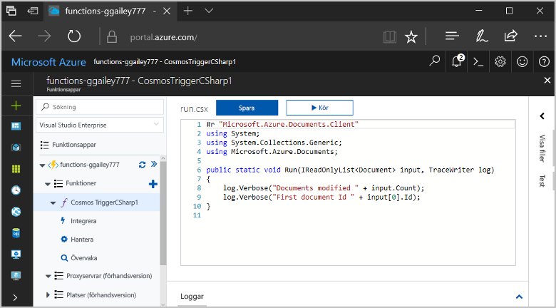
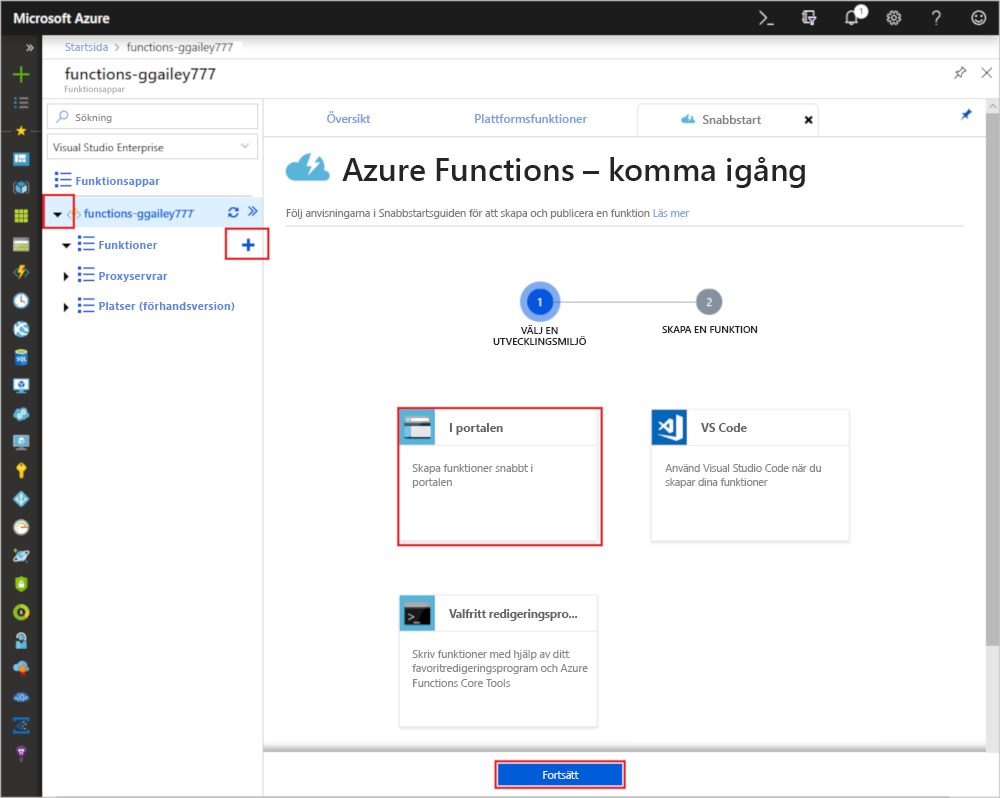
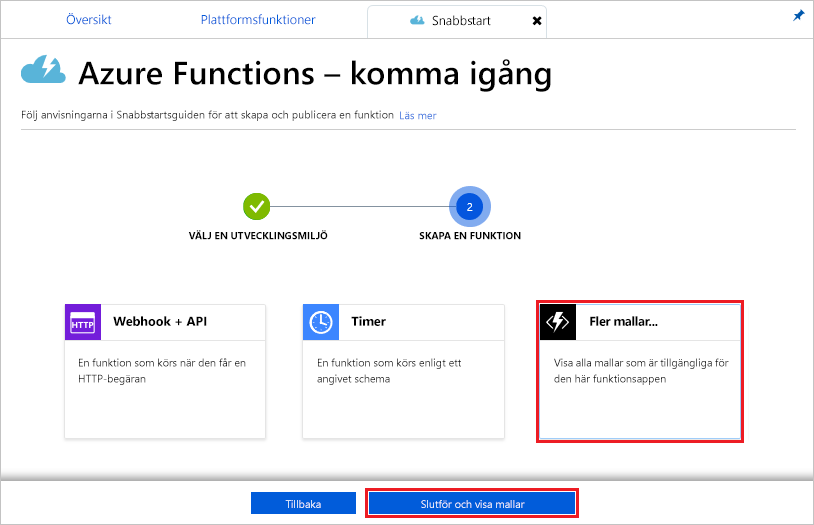
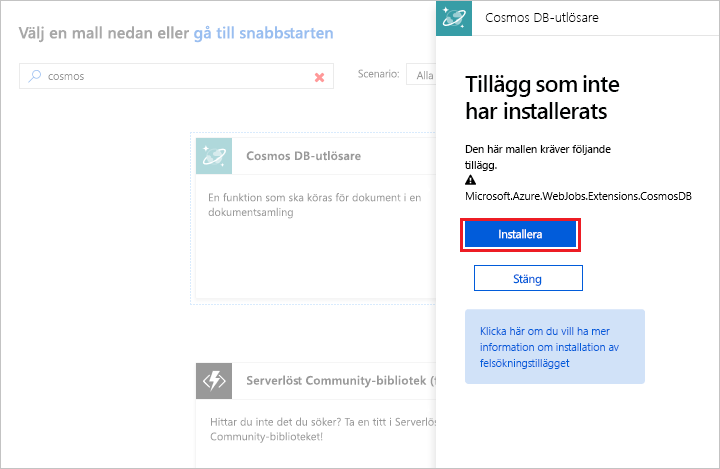
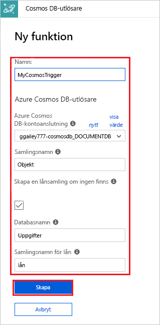
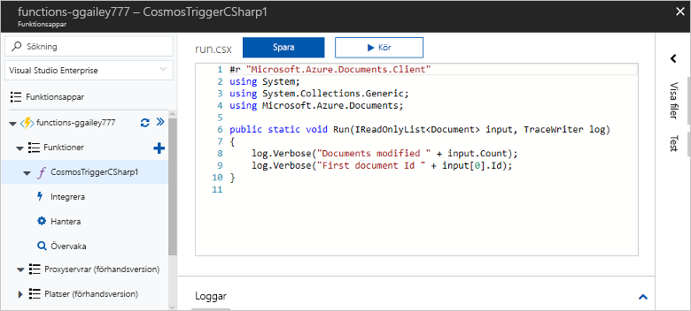
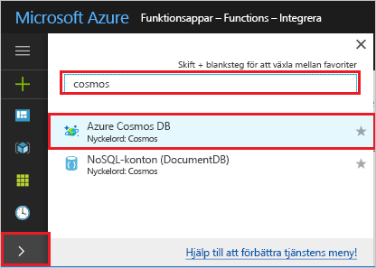

# Skapa en funktion som utlöses av Azure Cosmos DB

Lär dig hur du skapar en funktion som utlöses när data läggs till eller ändras i Azure Cosmos DB. Läs mer om Azure Cosmos DB i [Azure Cosmos DB: Serverlös databasberäkning med Azure Functions](../cosmos-db/serverless-computing-database.md).

## Förutsättningar

För att slutföra den här självstudien behöver du:

+ Om du inte har en Azure-prenumeration kan du skapa ett [kostnadsfritt konto](https://azure.microsoft.com/free/?WT.mc_id=A261C142F) innan du börjar.

> [!NOTE]
> [!INCLUDE [SQL API support only](../../includes/functions-cosmosdb-sqlapi-note.md)]

## Skapa ett Azure Cosmos DB-konto

Du måste ha ett Azure Cosmos DB-konto som använder SQL API innan du skapar utlösaren.

[!INCLUDE [cosmos-db-create-dbaccount](../../includes/cosmos-db-create-dbaccount.md)]

## Skapa en Azure Functions-app

[!INCLUDE [Create function app Azure portal](../../includes/functions-create-function-app-portal.md)]

Därefter skapar du en funktion i den nya funktionsappen.

## Skapa en Azure Cosmos DB-utlösare

1. Expandera funktionsappen och klicka på knappen **+** bredvid **Funktioner**. Om det här är den första funktionen i din funktionsapp väljer du **I portalen** och sedan **Fortsätt**. Annars går du till steg tre.

   

1. Välj **Fler mallar** och sedan **Slutför och visa mallar**.

    

1. Skriv `cosmos` i sökfältet och välj sedan mallen **Azure Cosmos DB-utlösare**.

1. Om du uppmanas väljer du **Installera** för att installera Azure Cosmos DB tillägget i Function-appen. När installationen är klar väljer du **Fortsätt**.

    

1. Konfigurera den nya utlösaren med inställningar enligt tabellen under bilden.

    

    | Inställning      | Föreslaget värde  | Beskrivning                                |
    | ------------ | ---------------- | ------------------------------------------ |
    | **Namn** | Standard | Använd det standardfunktionsnamn som föreslås av mallen.|
    | **Azure Cosmos DB-kontoanslutning** | Ny inställning | Välj **Ny**, välj sedan din **prenumeration**, det **databaskonto** som du skapade tidigare och sedan **Välj**. Detta skapar en programinställning för din kontoanslutning. Den här inställningen används av bindningen för anslutningen till databasen. |
    | **Samlingsnamn** | Objekt | Namnet på samlingen som ska övervakas. |
    | **Skapa en lånsamling om ingen finns** | Markerad | Samlingen finns inte redan, så du måste skapa den. |
    | **Databasnamn** | Aktiviteter | Namnet på databasen med den samling som ska övervakas. |

1. Klicka på **Skapa** för att skapa en funktion som utlöses av Azure Cosmos DB. När funktionen har skapats visas den mallbaserade funktionskoden.  

    

    Den här funktionsmallen skriver antalet dokument och ID:t för det första dokumentet till loggarna.

Anslut ditt Azure Cosmos DB-konto och skapa samlingen `Items` i databasen `Tasks`.

## Skapa objektsamlingen

1. Öppna en andra instans av [Azure-portalen](https://portal.azure.com) på en ny flik i webbläsaren.

1. Expandera ikonfältet till vänster på portalen, skriv `cosmos` i sökfältet och välj **Azure Cosmos DB**.

    

1. Välj ditt Azure Cosmos DB-konto och välj sedan **Datautforskaren**. 

1. Gå till **Samlingar**, välj **taskDatabase** och välj **Ny samling**.

    

1. Gå till **Lägg till samling** och använd de inställningar som visas i tabellen nedanför bilden. 

    

    | Inställning|Föreslaget värde|Beskrivning |
    | ---|---|--- |
    | **Databas-ID** | Aktiviteter |Namnet på din nya databas. Måste matcha namnet som definierats i funktionsbindningen. |
    | **Samlings-ID** | Objekt | Namnet på den nya samlingen. Måste matcha namnet som definierats i funktionsbindningen.  |
    | **Lagringskapacitet** | Fast (10 GB)|Använd standardvärdet. Det här värdet är databasens lagringskapacitet. |
    | **Dataflöde** |400 RU| Använd standardvärdet. Du kan skala upp dataflödet senare om du vill minska svarstiden. |
    | **[Partitionsnyckel](../cosmos-db/partition-data.md)** | /category|En partitionsnyckel som distribuerar data jämnt till varje partition. Det är viktigt att välja rätt partitionsnyckel när man skapar en performant samling. | 

1. Klicka på **OK** för att skapa samlingen Items (Objekt). Det kan ta en stund att skapa samlingen.

När den samling som har angetts i funktionsbindningen väl har skapats kan du testa funktionen genom att lägga till dokument i den nya samlingen.

## Testa funktionen

1. Expandera den nya samlingen **taskCollection** i Datautforskaren, välj **Dokument** och välj **Nytt dokument**.

    

1. Ersätt innehållet i det nya dokumentet med följande innehåll och välj sedan **Spara**.

        {
            "id": "task1",
            "category": "general",
            "description": "some task"
        }

1. Växla till den första webbläsarfliken som innehåller din funktion i portalen. Utöka funktionsloggarna och kontrollera att det nya dokumentet har utlöst funktionen. Se efter så att dokumentets ID-värde `task1` skrivs till loggarna. 

    

1. (Valfritt) Gå tillbaka till dokumentet, gör en ändring och klicka på **Uppdatera**. Gå tillbaka till funktionsloggarna och kontrollera att uppdateringen också har utlöst funktionen.

## Rensa resurser

[!INCLUDE [Next steps note](../../includes/functions-quickstart-cleanup.md)]

## Nästa steg

Du har nu skapat en funktion som körs när ett dokument läggs till eller ändras i Azure Cosmos DB. Mer information om Cosmos DB-utlösare finns i [Azure Cosmos DB-bindningar för Azure Functions](functions-bindings-cosmosdb.md).

[!INCLUDE [Next steps note](../../includes/functions-quickstart-next-steps.md)]
