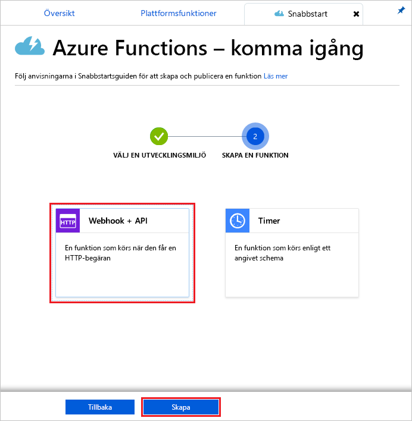

# Skapa din första funktion i Azure Portal

Med Azure Functions kan du köra kod i en [serverfri](https://azure.microsoft.com/solutions/serverless/) miljö utan att först behöva skapa en virtuell dator eller publicera en webbapp. I den här artikeln får du lära dig hur du använder Functions för att skapa en "Hello World"-funktion i Azure Portal.

[!INCLUDE [quickstarts-free-trial-note](../../includes/quickstarts-free-trial-note.md)]

> [!NOTE]
> C#utvecklare bör överväga att [skapa din första funktion i Visual Studio 2019](functions-create-your-first-function-visual-studio.md) i stället för i portalen. 

## Logga in på Azure

Logga in på Azure-portalen på <https://portal.azure.com> med ditt Azure-konto.

## Skapa en funktionsapp

Du måste ha en funktionsapp som värd för körning av dina funktioner. Med en Function-app kan du gruppera funktioner som en logisk enhet för enklare hantering, distribution, skalning och delning av resurser.

[!INCLUDE [Create function app Azure portal](../../includes/functions-create-function-app-portal.md)]

Därefter skapar du en funktion i den nya funktionsappen.

## Skapa en HTTP-utlöst funktion

1. Expandera den nya funktionsappen. Välj knappen **+** intill knappen **Functions**, välj **I portalen** och välj **Fortsätt**.

    

1. Välj **WebHook + API** och välj sedan **Skapa**.

    

En funktion skapas med hjälp av en språkspecifik mall för en HTTP-utlöst funktion.

Nu kan du köra den nya funktionen genom att skicka en HTTP-begäran.

## Testa funktionen

1. I den nya funktionen klickar du på **</> Hämta funktionswebbadress** längst upp till höger och väljer **Standard (funktionsnyckel)** . Sedan klickar du på **Kopiera**. 

    

2. Klistra in funktionens URL i adressfältet för din webbläsare. Lägg till frågesträngvärdet `&name=<yourname>` i slutet av den här webbadressen och tryck på knappen `Enter` på tangentbordet för att utföra begäran. Du bör se svaret som returnerades av funktionen som visas i webbläsaren.  

    I följande exempel visas svaret i webbläsaren:

    

    Begäransadressen innehåller en nyckel som krävs för åtkomst till din funktion över HTTP.

3. När din funktion körs skrivs spårningsinformation till loggarna. Om du vill visa spårningsinformationen från föregående körning återgår du till funktionen i portalen och klickar på pilen längst ned på skärmen så att **Loggar** expanderas.

   

## Rensa resurser

[!INCLUDE [Clean-up resources](../../includes/functions-quickstart-cleanup.md)]

## Nästa steg

Du har skapat en Function-app med en enkel HTTP-utlöst funktion.  

[!INCLUDE [Next steps note](../../includes/functions-quickstart-next-steps.md)]

Mer information finns i [Azure Functions HTTP bindings](functions-bindings-http-webhook.md) (HTTP-bindningar i Azure Functions).
