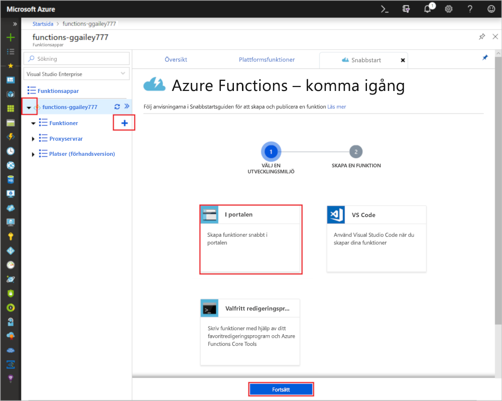
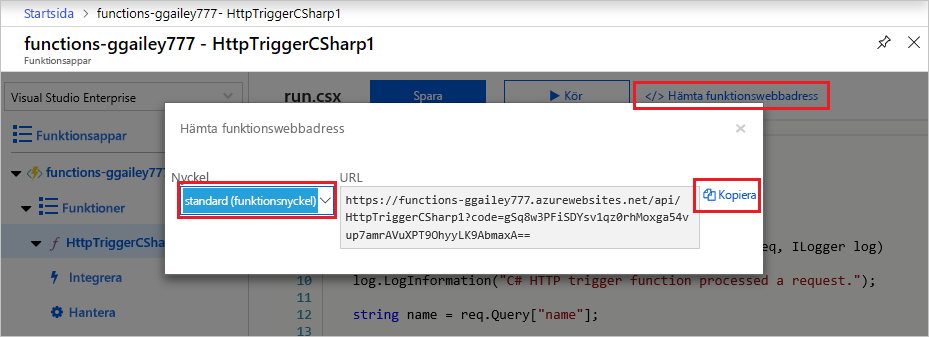

# Skapa din första funktion i Azure Portal

Med Azure Functions kan du köra koden i en serverlös miljö utan att först behöva skapa en virtuell dator (VM) eller publicera ett webbprogram. I den här artikeln får du lära dig hur du använder Azure Functions för att skapa en HTTP-utlösad "hello world"-funktion i Azure-portalen.

[!INCLUDE [quickstarts-free-trial-note](../../includes/quickstarts-free-trial-note.md)]

Om du är C#-utvecklare kan du [överväga att skapa din första funktion i Visual Studio 2019](functions-create-your-first-function-visual-studio.md) i stället för i portalen. 

## Logga in på Azure

Logga in på [Azure-portalen](https://portal.azure.com) med ditt Azure-konto.

## Skapa en funktionsapp

Du måste ha en funktionsapp som värd för körning av dina funktioner. Med en funktionsapp kan du gruppera funktioner som en logisk enhet för enklare hantering, distribution, skalning och delning av resurser.

[!INCLUDE [Create function app Azure portal](../../includes/functions-create-function-app-portal.md)]

Skapa sedan en funktion i den nya funktionsappen.

## Skapa en HTTP-utlöst funktion

1. Expandera din nya funktionsapp, **+** välj knappen bredvid **Funktioner,** välj **I-portalen**och välj sedan **Fortsätt**.

    

1. Välj **WebHook + API**och välj sedan **Skapa**.

    

   En funktion skapas med hjälp av en språkspecifik mall för en HTTP-utlöst funktion.

Nu kan du köra den nya funktionen genom att skicka en HTTP-begäran.

## Testa funktionen

1. I den nya funktionen väljer du **</> Hämta funktionsadress** längst upp till höger. 

1. I dialogrutan **Hämta funktions-URL** väljer du **standard (funktionstangent)** i listrutan och väljer sedan **Kopiera**. 

    

1. Klistra in funktionens URL i adressfältet för din webbläsare. Lägg till frågesträngvärdet `&name=<your_name>` i slutet av den här URL:en och tryck på Retur för att köra begäran. 

    I följande exempel visas svaret i webbläsaren:

    

    Begäransadressen innehåller en nyckel som krävs för åtkomst till din funktion över HTTP.

1. När din funktion körs skrivs spårningsinformation till loggarna. Om du vill visa spårningsutdata från föregående körning går du tillbaka till funktionen i portalen och väljer pilen längst ned på skärmen för att expandera **loggarna**.

   

## Rensa resurser

[!INCLUDE [Clean-up resources](../../includes/functions-quickstart-cleanup.md)]

## Nästa steg

[!INCLUDE [Next steps note](../../includes/functions-quickstart-next-steps.md)]

