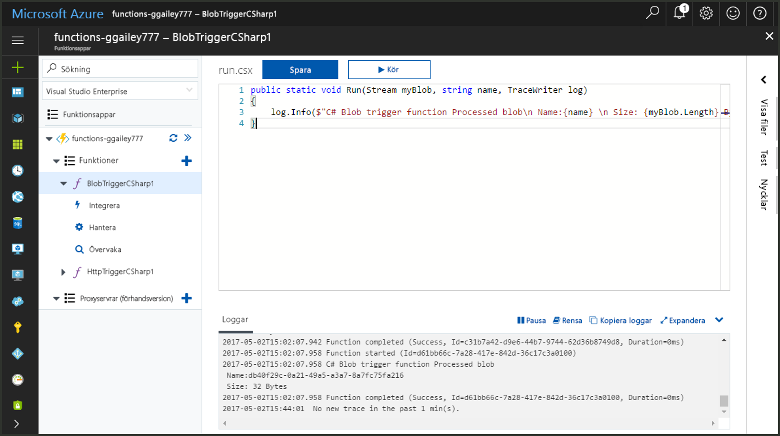
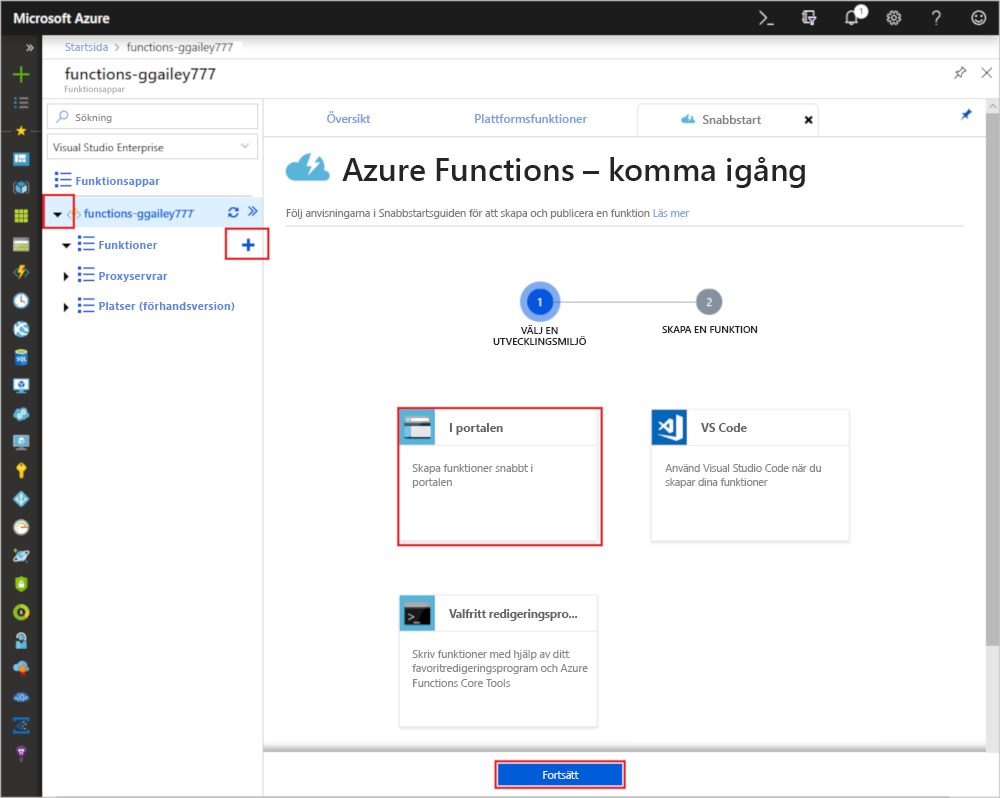
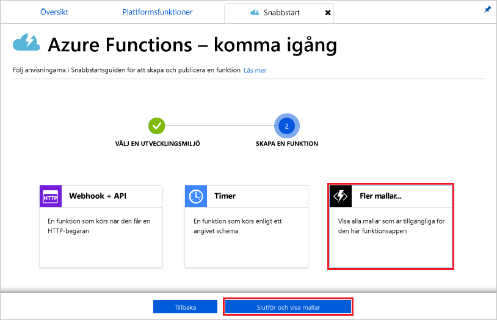
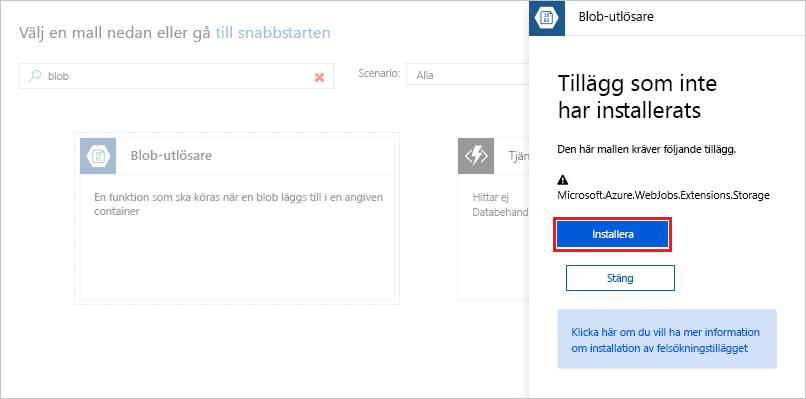
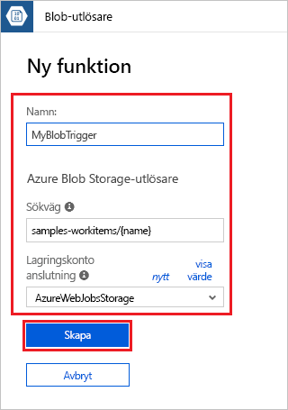
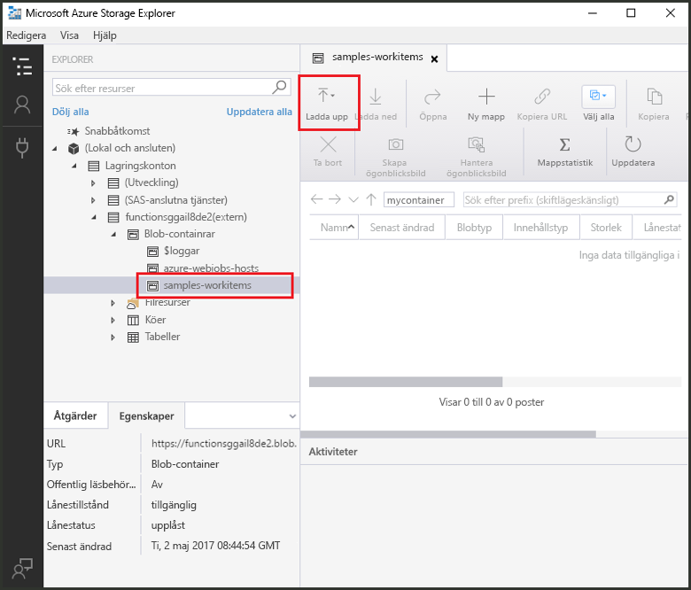
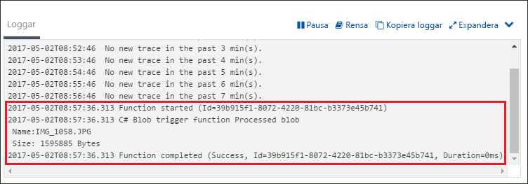

# Skapa en funktion som utlöses av Azure Blob Storage

Lär dig hur du skapar en funktion som utlöses när filer överförs till eller uppdateras i Azure Blob Storage.

## Krav

+ Hämta och installera [Microsoft Azure Storage Explorer](https://storageexplorer.com/).
+ En Azure-prenumeration. Om du inte har ett, skapa ett [gratis konto](https://azure.microsoft.com/free/?WT.mc_id=A261C142F) innan du börjar.

## Skapa en Azure Functions-app

[!INCLUDE [Create function app Azure portal](../../includes/functions-create-function-app-portal.md)]

Därefter skapar du en funktion i den nya funktionsappen.

## Skapa en funktion som utlöses av Blob Storage

1. Expandera funktionsappen **+** och klicka på knappen bredvid **Funktioner**. Om det här är den första funktionen i din funktionsapp väljer du **I portalen** och sedan **Fortsätt**. Annars går du till steg tre.

   

1. Välj **Fler mallar** och sedan **Slutför och visa mallar**.

    

1. Skriv `blob` i sökfältet och välj sedan mallen **Blob-utlösare**.

1. Om du uppmanas till det väljer du **Installera** för att installera Azure Storage-tillägget och eventuella beroenden i funktionsappen. När installationen är klar väljer du **Fortsätt**.

    

1. Använd inställningarna som anges i tabellen nedanför bilden.

    

    | Inställning | Föreslaget värde | Beskrivning |
    |---|---|---|
    | **Namn** | Ett unikt namn i funktionsappen | Namnge funktionen som utlöses av blobben. |
    | **Sökväg**   | samples-workitems/{namn}    | Platsen i Blob Storage som övervakas. Filnamnet för bloben skickas i bindningen som parametern _namn_.  |
    | **Lagringskontoanslutning** | AzureWebJobsStorage | Du kan antingen använda den lagringskontoanslutning som redan används i funktionsappen eller skapa en ny.  |

1. Klicka på **Skapa** för att skapa den nya funktionen.

Anslut sedan till ditt Azure Storage-konto och skapa containern **samples-workitems**.

## Skapa containern

1. Klicka på **Integrera** i din funktion, expandera **Dokumentation** och kopiera både **kontonamnet** och **kontonyckeln**. Du använder dessa autentiseringsuppgifter för att ansluta till lagringskontot. Om du redan har anslutit ditt lagringskonto går du vidare till steg 4.

    

1. Kör verktyget [Microsoft Azure Storage Explorer](https://storageexplorer.com/), klicka på anslutningsikonen till vänster, välj **Use a storage account name and key** (Använd ett kontonamn och en kontonyckel för lagringskontot) och klicka på **Nästa**.

    

1. Ange **kontonamnet** och **kontonyckeln** från steg 1, klicka på **Nästa** och sedan på **Anslut**. 

    

1. Expandera det bifogade lagringskontot, högerklicka på **Blob Containers,** klicka på **Skapa blobcontainer**, skriv `samples-workitems`och tryck sedan på retur.

    

Nu när du har en blobcontainer kan du testa funktionen genom att ladda upp en fil till containern.

## Testa funktionen

1. Tillbaka i Azure-portalen, bläddra till din funktion expandera **loggarna** längst ner på sidan och se till att loggströmning inte pausas.

1. Expandera ditt lagringskonto, **Blob Containers**och **exempel-arbetsyter**i Storage Explorer. Klicka på **Ladda upp** och sedan på **Ladda upp filer**.

    

1. Klicka på fältet **Filer** i dialogrutan **Ladda upp filer**. Bläddra till en fil lokalt i datorn, till exempel en bildfil, markera den, klicka på **Öppna** och sedan på **Ladda upp**.

1. Gå tillbaka till funktionsloggarna och kontrollera att bloben har lästs.

   

    >[!NOTE]
    > Om din funktionsapp körs med standardförbrukningsplanen kan det dröja flera minuter från det att blobben läggs till eller uppdateras och att funktionen utlöses. Om du behöver låg latens i dina blobutlösta funktioner bör du köra funktionsapparna med en App Service-plan.

## Rensa resurser

[!INCLUDE [Next steps note](../../includes/functions-quickstart-cleanup.md)]

## Nästa steg

Du har skapat en funktion som körs när en blob läggs till eller uppdateras i Blob Storage. Mer information om Blob Storage-utlösare finns i [Azure Functions Blob storage bindings](functions-bindings-storage-blob.md) (Blob Storage-bindningar i Azure Functions).

[!INCLUDE [Next steps note](../../includes/functions-quickstart-next-steps.md)]
