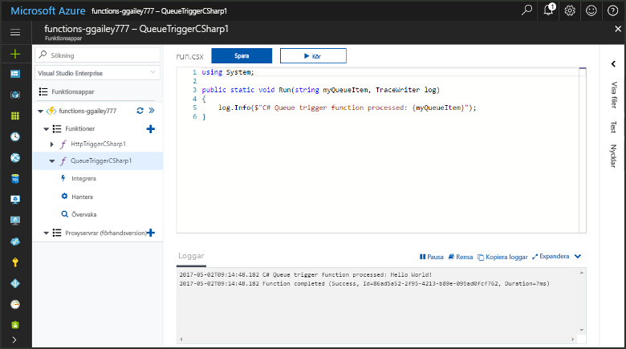
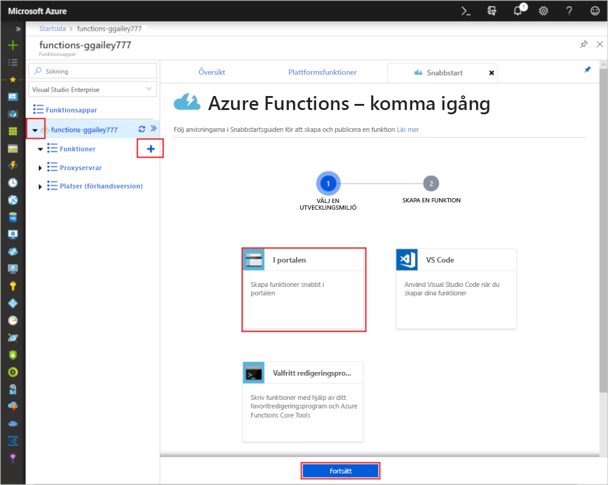
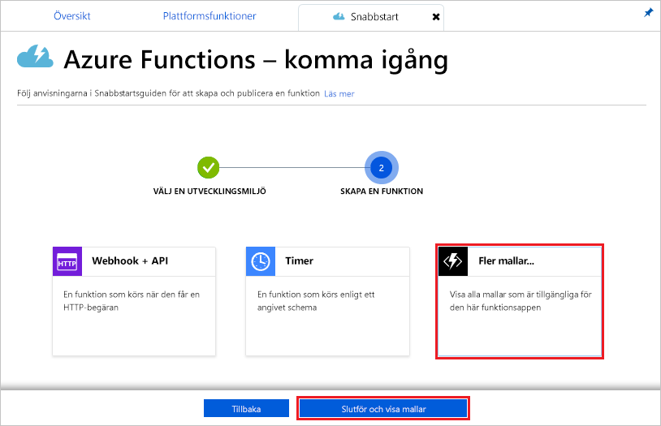
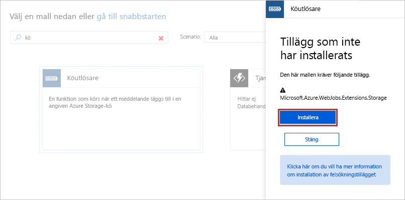
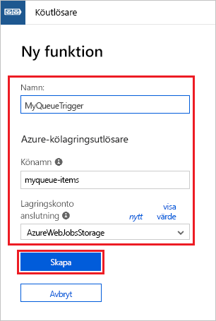
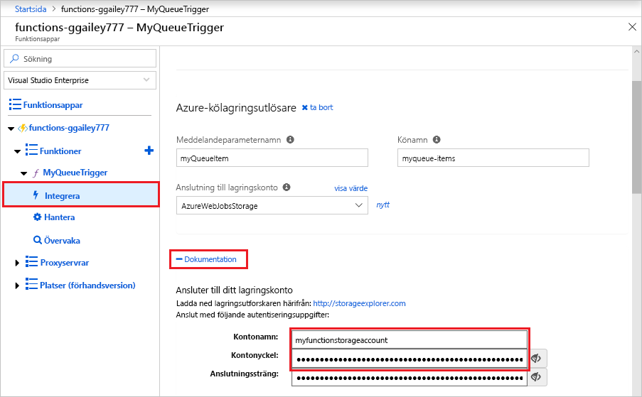
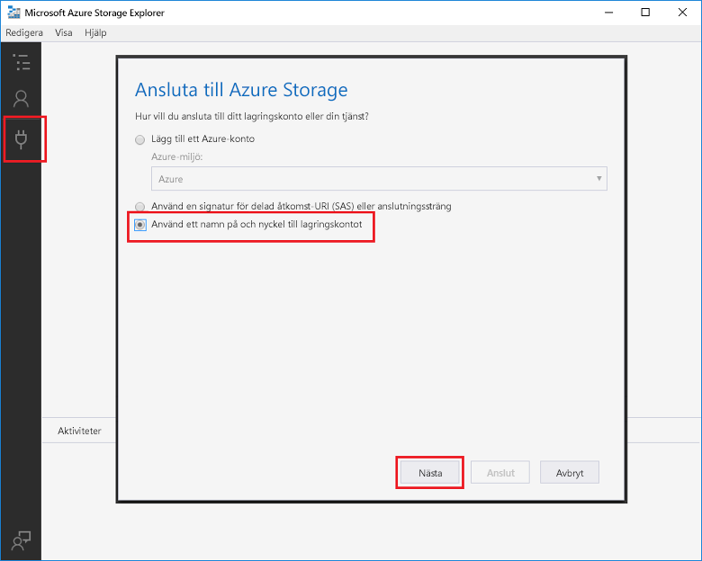
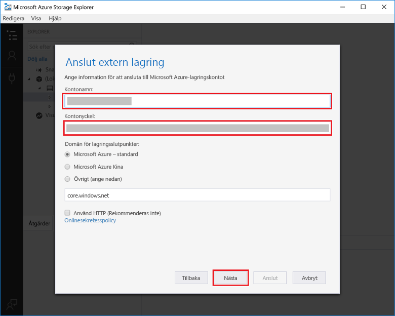
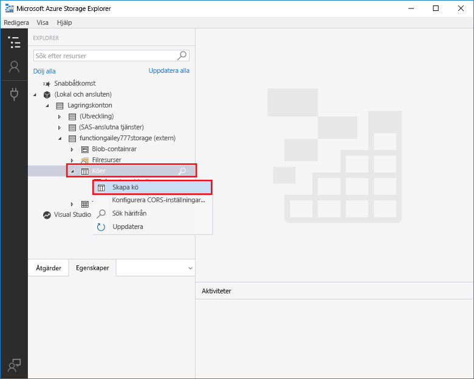
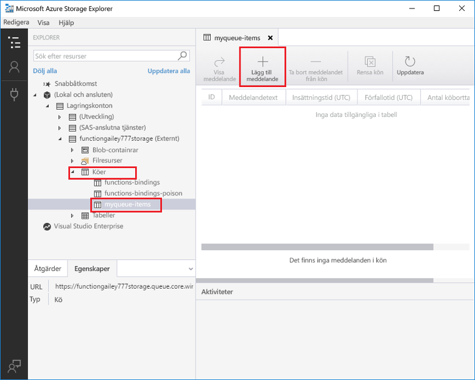

# Skapa en funktion som utlöses av Azure Queue Storage

Läs hur du skapar en funktion som utlöses när meddelanden skickas till en Azure Storage-kö.

## Förutsättningar

- Hämta och installera [Microsoft Azure Storage Explorer](https://storageexplorer.com/).

- En Azure-prenumeration. Om du inte har ett konto kan du skapa ett [kostnadsfritt konto](https://azure.microsoft.com/free/?WT.mc_id=A261C142F) innan du börjar.

## Skapa en Azure Functions-app

[!INCLUDE [Create function app Azure portal](../../includes/functions-create-function-app-portal.md)]

Därefter skapar du en funktion i den nya funktionsappen.

## Skapa en funktion som utlöses av en kö

1. Expandera funktionsappen och klicka på knappen **+** bredvid **Funktioner**. Om det här är den första funktionen i din funktionsapp väljer du **I portalen** och sedan **Fortsätt**. Annars går du till steg tre.

   

1. Välj **Fler mallar** och sedan **Slutför och visa mallar**.

    

1. Skriv `queue` i sökfältet och välj sedan mallen **Köutlösare**.

1. Om du får uppmaningen väljer du **Installera** för att installera Azure Storage-tillägget för eventuella beroenden i funktionsappen. När installationen är klar väljer du **Fortsätt**.

    

1. Använd inställningarna som anges i tabellen nedanför bilden.

    

    | Inställning | Föreslaget värde | Beskrivning |
    |---|---|---|
    | **Namn** | Ett unikt namn i funktionsappen | Namnge funktionen som utlöses av kön. |
    | **Könamn**   | myqueue-items    | Namnet på den kö som ska anslutas till i ditt Storage-konto. |
    | **Lagringskontoanslutning** | AzureWebJobStorage | Du kan antingen använda den lagringskontoanslutning som redan används i funktionsappen eller skapa en ny.  |    

1. Klicka på **Skapa** för att skapa den nya funktionen.

Sedan ansluter du till ditt Azure Storage-konto och skapar lagringskön **myqueue-items**.

## Skapa kön

1. Klicka på **Integrera** i din funktion, expandera **Dokumentation** och kopiera både **kontonamnet** och **kontonyckeln**. Du använder dessa autentiseringsuppgifter för att ansluta till lagringskontot i Azure Storage Explorer. Om du redan har anslutit ditt lagringskonto går du vidare till steg 4.

    

1. Kör verktyget [Microsoft Azure Storage Explorer](https://storageexplorer.com/), klicka på anslutningsikonen till vänster, välj **Use a storage account name and key** (Använd ett kontonamn och en kontonyckel för lagringskontot) och klicka på **Nästa**.

    

1. Ange **kontonamnet** och **kontonyckeln** från steg 1, klicka på **Nästa** och sedan på **Anslut**.

    

1. Expandera det anslutna lagringskontot, högerklicka på **Köer**, klicka på **Skapa kö**, skriv `myqueue-items` och tryck sedan på Retur.

    

Nu när du har en lagringskö kan du testa funktionen genom att lägga till ett meddelande i kön.

## Testa funktionen

1. Gå till Azure Portal igen, bläddra till din funktion, expandera **Loggar** längst ned på sidan och se till att loggströmningen inte är pausad.

1. I Lagringsutforskaren expanderar du ditt lagringskonto, **Köer** och **myqueue-items**. Klicka sedan på **Lägg till meddelande**.

    

1. Skriv ditt "Hello World!"- meddelande i **Meddelandetext** och klicka på **OK**.

1. Vänta några sekunder och gå sedan tillbaka till dina funktionsloggar och kontrollera att det nya meddelandet har lästs från kön.

    

1. Gå tillbaka till Lagringsutforskaren, klicka på **Uppdatera** och kontrollera att meddelandet har bearbetats och inte längre finns i kön.

## Rensa resurser

[!INCLUDE [Next steps note](../../includes/functions-quickstart-cleanup.md)]

## Nästa steg

Du har skapat en funktion som körs när ett meddelande läggs till i en lagringskö. Mer information om Queue Storage-utlösare finns i [Azure Functions Storage queue bindings](functions-bindings-storage-queue.md) (Azure Functions-lagringsköbindningar).

Nu när du har skapat din första funktion ska vi lägga till en utdatabindning till funktionen som skriver ett meddelande till en annan kö.

> [!div class="nextstepaction"]
> [Lägga till meddelanden i en Azure Storage-kö med Functions](functions-integrate-storage-queue-output-binding.md)
