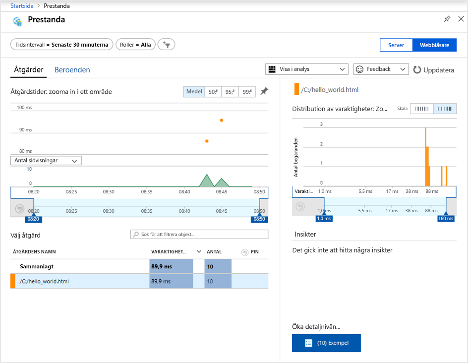
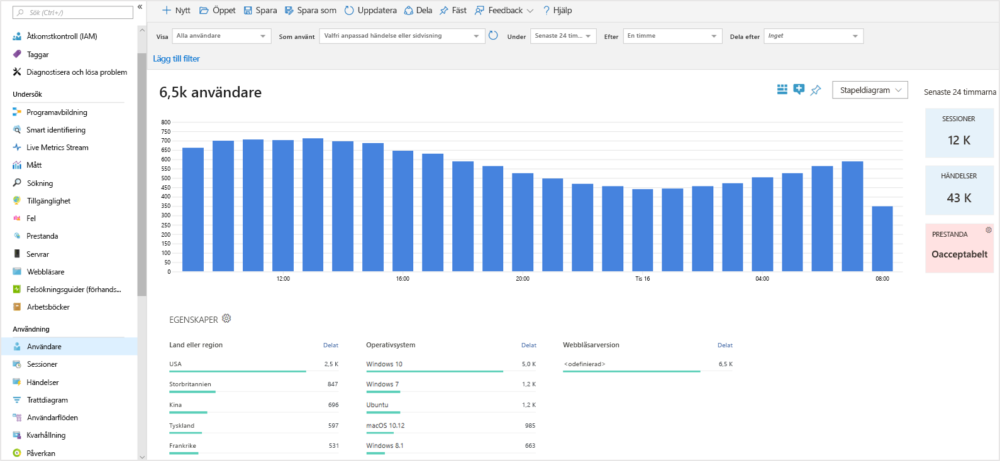

# <a name="quickstart-start-monitoring-your-website-with-azure-monitor-application-insights"></a>Snabb start: börja övervaka din webbplats med Azure Monitor Application Insights

I den här snabb starten lär du dig att lägga till Application Insights Java Script SDK med öppen källkod på din webbplats. Du lär dig också hur du bättre förstår klient-och webb läsar upplevelsen för besökare på din webbplats.

Med Azure Monitor Application Insights kan du enkelt övervaka din webbplats med avseende på tillgänglighet, prestanda och användning. Du kan också snabbt identifiera och diagnostisera fel i appen utan att vänta på att en användare rapporterar dem. Application Insights tillhandahåller övervakning på både server sidan och klient-och webb läsar sidan.

## <a name="prerequisites"></a>Förutsättningar

* Ett Azure-konto med en aktiv prenumeration. [Skapa ett konto kostnads fritt](https://azure.microsoft.com/free/?ref=microsoft.com&utm_source=microsoft.com&utm_medium=docs&utm_campaign=visualstudio).
* En webbplats där du kan lägga till Application Insights JavaScript SDK.

## <a name="enable-application-insights"></a>Aktivera Application Insights

Application Insights kan samla in telemetridata från alla Internetanslutna appar som körs lokalt eller i molnet. Använd följande steg för att börja visa dessa data.

1. Logga in på [Azure-portalen](https://portal.azure.com/).
2. Välj **Skapa en resurs** > **Hanteringsverktyg** > **Application Insights**.

   > [!NOTE]
   >Om det här är första gången du skapar en Application Insights-resurs kan du lära dig mer genom att gå till artikeln [skapa en Application Insights resurs](https://docs.microsoft.com/azure/azure-monitor/app/create-new-resource) .

   En konfigurationsruta visas. Använd följande tabell när du ska fylla i indatafälten.

    | Inställningar        | Värde           | Beskrivning  |
   | ------------- |:-------------|:-----|
   | **Namn**      | Globalt unikt värde | Namn som identifierar den app som du övervakar |
   | **Resursgrupp**     | myResourceGroup      | Namn för den nya resurs gruppen som ska vara värd för Application Insights data. Du kan skapa en ny resursgrupp eller välja en befintlig. |
   | **Plats** | USA, östra | Välj en plats nära dig eller nära där appen finns |

3. Klicka på **Skapa**.

## <a name="create-an-html-file"></a>Skapa en HTML-fil

1. På din lokala dator skapar du en fil med namnet ``hello_world.html``. För det här exemplet placeras filen i roten på C:-enheten i ``C:\hello_world.html``.
2. Kopiera skriptet nedan till ``hello_world.html``:

    ```html
    <!DOCTYPE html>
    <html>
    <head>
    <title>Azure Monitor Application Insights</title>
    </head>
    <body>
    <h1>Azure Monitor Application Insights Hello World!</h1>
    <p>You can use the Application Insights JavaScript SDK to perform client/browser-side monitoring of your website. To learn about more advanced JavaScript SDK configurations visit the <a href="https://github.com/Microsoft/ApplicationInsights-JS/blob/master/API-reference.md" title="API Reference">API reference</a>.</p>
    </body>
    </html>
    ```

## <a name="configure-application-insights-sdk"></a>Konfigurera Application Insights SDK

1. Välj **Översikt** > **Essentials** > kopiera appens **instrumenteringsnyckel**.

   

2. Lägg till följande skript till ``hello_world.html`` före den avslutande ``</head>``-taggen:

   ```javascript
   <script type="text/javascript">
      var sdkInstance="appInsightsSDK";window[sdkInstance]="appInsights";var aiName=window[sdkInstance],aisdk=window[aiName]||function(e){function n(e){t[e]=function(){var n=arguments;t.queue.push(function(){t[e].apply(t,n)})}}var t={config:e};t.initialize=!0;var i=document,a=window;setTimeout(function(){var n=i.createElement("script");n.src=e.url||"https://az416426.vo.msecnd.net/scripts/b/ai.2.min.js",i.getElementsByTagName("script")[0].parentNode.appendChild(n)});try{t.cookie=i.cookie}catch(e){}t.queue=[],t.version=2;for(var r=["Event","PageView","Exception","Trace","DependencyData","Metric","PageViewPerformance"];r.length;)n("track"+r.pop());n("startTrackPage"),n("stopTrackPage");var s="Track"+r[0];if(n("start"+s),n("stop"+s),n("setAuthenticatedUserContext"),n("clearAuthenticatedUserContext"),n("flush"),!(!0===e.disableExceptionTracking||e.extensionConfig&&e.extensionConfig.ApplicationInsightsAnalytics&&!0===e.extensionConfig.ApplicationInsightsAnalytics.disableExceptionTracking)){n("_"+(r="onerror"));var o=a[r];a[r]=function(e,n,i,a,s){var c=o&&o(e,n,i,a,s);return!0!==c&&t["_"+r]({message:e,url:n,lineNumber:i,columnNumber:a,error:s}),c},e.autoExceptionInstrumented=!0}return t}(
      {
         instrumentationKey:"INSTRUMENTATION_KEY"
      }
      );window[aiName]=aisdk,aisdk.queue&&0===aisdk.queue.length&&aisdk.trackPageView({});
   </script>
   ```

3. Redigera ``hello_world.html`` och Lägg till din instrumentationsnyckel.

4. Öppna ``hello_world.html`` i en lokal webbläsarsession. Den här åtgärden skapar en enda sid visningar. Du kan uppdatera webbläsaren för att generera flera testsidvisningar.

## <a name="start-monitoring-in-the-azure-portal"></a>Börja övervaka i Azure-portalen

1. Nu kan du öppna sidan Application Insights **Översikt** i Azure Portal för att visa information om ditt program som körs. På sidan **Översikt** har du hämtat din Instrumentation-nyckel. De fyra standarddiagrammen på översiktssidan är begränsade till programdata på serversidan. Eftersom vi instrumenterar klient-och webb läsar interaktioner med Java Script SDK, gäller inte den här vyn om vi även har installerat SDK för Server sidan.

2. Klicka på  **analys**.  Den här åtgärden öppnar **analys**, som innehåller ett omfattande frågespråk för analys av alla data som samlas in av Application Insights. Visa data relaterade till klientsidans webbläsarbegäranden genom att köra följande fråga:

    ```kusto
    // average pageView duration by name
    let timeGrain=1s;
    let dataset=pageViews
    // additional filters can be applied here
    | where timestamp > ago(15m)
    | where client_Type == "Browser" ;
    // calculate average pageView duration for all pageViews
    dataset
    | summarize avg(duration) by bin(timestamp, timeGrain)
    | extend pageView='Overall'
    // render result in a chart
    | render timechart
    ```

   

3. Gå tillbaka till sidan **Översikt**. Klicka på **Webbläsare** under rubriken **Undersök** och välj sedan **Prestanda**. Här hittar du prestandamått för din webbplats. Det finns också en motsvarande vy för att analysera fel och undantag på din webbplats. Du kan klicka på **Exempel** för att visa detaljer för enskilda transaktioner. Härifrån kan du komma åt upplevelsen [transaktionsinformation från början till slut](../../azure-monitor/app/transaction-diagnostics.md).

   

4. För att börja utforska [analysverktygen för användarbeteende](../../azure-monitor/app/usage-overview.md) går du till Application Insights-huvudmenyn och väljer [**Användare**](../../azure-monitor/app/usage-segmentation.md) under rubriken **Användning**. Eftersom vi testar från en enda dator ser vi bara data för en användare. För en webbplats som är live kan fördelningen av användare se ut på följande sätt:

     

5. Om vi hade instrumenterat en mer komplex webbplats med flera sidor skulle ett annat användbart verktyg vara [**Användarflöden**](../../azure-monitor/app/usage-flows.md). Med **Användarflöden** kan du spåra den väg som besökare tar via de olika delarna på webbplatsen.

   

Om du vill lära dig mer om avancerade konfigurationer för att övervaka webbplatser kan du läsa [JavaScript SDK API-referensen](https://github.com/Microsoft/ApplicationInsights-JS/blob/master/API-reference.md).

## <a name="clean-up-resources"></a>Rensa resurser

Om du planerar att fortsätta att arbeta med ytterligare snabb starter eller med självstudierna ska du inte rensa resurserna som du skapade i den här snabb starten. Annars, om du inte planerar att fortsätta, använder du följande steg för att ta bort alla resurser som skapats i den här snabb starten i Azure Portal.

> [!NOTE]
> Om du använde en befintlig resurs grupp kommer instruktionerna nedan inte att fungera och du behöver bara ta bort den enskilda Application Insights resursen. Kom ihåg att du tar bort en resurs grupp när alla underyling-resurser som är medlemmar i gruppen tas bort.

1. På menyn till vänster i Azure Portal klickar du på **Resursgrupper** och sedan på **myResourceGroup**.
2. På sidan med resursgrupper klickar du på **Ta bort**, skriver **myResourceGroup** i textrutan och klickar sedan på **Ta bort**.

## <a name="next-steps"></a>Nästa steg

> [!div class="nextstepaction"]
> [Hitta och diagnostisera prestandaproblem](https://docs.microsoft.com/azure/application-insights/app-insights-analytics)
