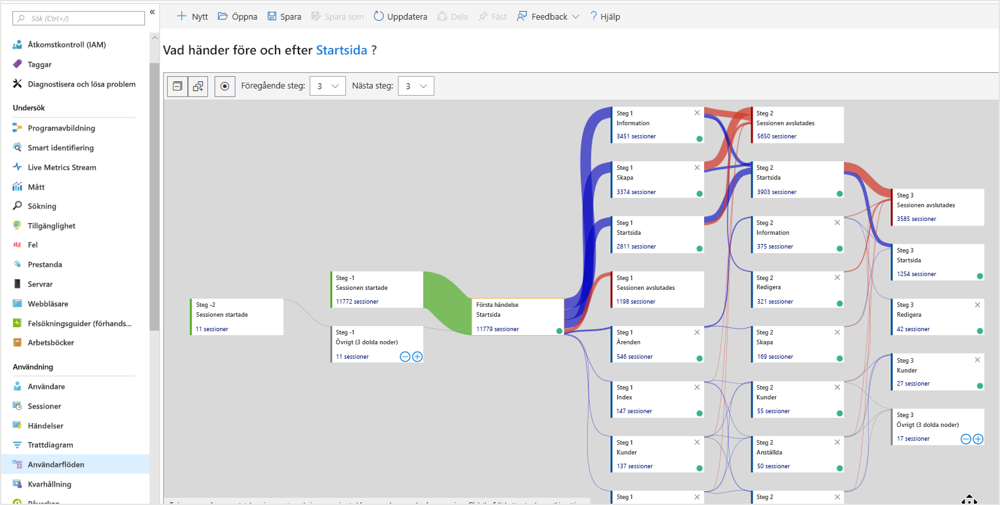

# <a name="start-monitoring-your-website"></a>Börja övervaka din webbplats

Med Azure Monitor Application Insights kan du enkelt övervaka din webbplats med avseende på tillgänglighet, prestanda och användning. Du kan också snabbt identifiera och diagnostisera fel i appen utan att vänta på att en användare rapporterar dem. Application Insights erbjuder funktioner för övervakning både på serversidan samt på klient-/webbläsarsidan.

Den här snabbstarten vägleder dig genom att lägga till [Application Insights JavaScript SDK med öppen källkod](https://github.com/Microsoft/ApplicationInsights-JS) så att du förstår upplevelsen på klient-/webbläsarsidan för användarna på din webbplats.

## <a name="prerequisites"></a>Förutsättningar

För att slutföra den här snabbstarten behöver du:

- Du behöver en Azure-prenumeration.

Om du inte har en Azure-prenumeration kan du skapa ett [kostnadsfritt](https://azure.microsoft.com/free/) konto innan du börjar.

## <a name="sign-in-to-the-azure-portal"></a>Logga in på Azure Portal

Logga in på [Azure Portal](https://portal.azure.com/).

## <a name="enable-application-insights"></a>Aktivera Application Insights

Application Insights kan samla in telemetridata från alla Internetanslutna appar som körs lokalt eller i molnet. Gör så här om du vill börja granska dessa data:

1. Välj **Skapa en resurs** > **Hanteringsverktyg** > **Application Insights**.

   > [!NOTE]
   >Om det här är första gången du skapar en Application Insights-resurs kan du lära dig mer genom att gå till artikeln [skapa en Application Insights resurs](https://docs.microsoft.com/azure/azure-monitor/app/create-new-resource) .

   En konfigurationsruta visas. Använd följande tabell när du ska fylla i indatafälten.

    | Inställningar        | Value           | Beskrivning  |
   | ------------- |:-------------|:-----|
   | **Namn**      | Globalt unikt värde | Namn som identifierar appen du övervakar |
   | **Resursgrupp**     | myResourceGroup      | Namnet på den nya resursgrupp som är värd för App Insights-data |
   | **Location** | East US | Välj en plats nära dig eller nära där appen finns |

2. Klicka på **Skapa**.

## <a name="create-an-html-file"></a>Skapa en HTML-fil

1. På din lokala dator skapar du en fil med namnet ``hello_world.html``. För det här exemplet placeras filen i roten på C:-enheten i ``C:\hello_world.html``.
2. Kopiera skriptet nedan till ``hello_world.html``:

    ```html
    <!DOCTYPE html>
    <html>
    <head>
    <title>Azure Monitor Application Insights</title>
    </head>
    <body>
    <h1>Azure Monitor Application Insights Hello World!</h1>
    <p>You can use the Application Insights JavaScript SDK to perform client/browser-side monitoring of your website. To learn about more advanced JavaScript SDK configurations visit the <a href="https://github.com/Microsoft/ApplicationInsights-JS/blob/master/API-reference.md" title="API Reference">API reference</a>.</p>
    </body>
    </html>
    ```

## <a name="configure-app-insights-sdk"></a>Konfigurera App Insights SDK

1. Välj **Översikt** > **Essentials** > kopiera appens **instrumenteringsnyckel**.

   

2. Lägg till följande skript till ``hello_world.html`` före den avslutande ``</head>``-taggen:

   ```javascript
   <script type="text/javascript">
      var sdkInstance="appInsightsSDK";window[sdkInstance]="appInsights";var aiName=window[sdkInstance],aisdk=window[aiName]||function(e){
         function n(e){t[e]=function(){var n=arguments;t.queue.push(function(){t[e].apply(t,n)})}}var t={config:e};t.initialize=!0;var i=document,a=window;setTimeout(function(){var n=i.createElement("script");n.src=e.url||"https://az416426.vo.msecnd.net/next/ai.2.min.js",i.getElementsByTagName("script")[0].parentNode.appendChild(n)});try{t.cookie=i.cookie}catch(e){}t.queue=[],t.version=2;for(var r=["Event","PageView","Exception","Trace","DependencyData","Metric","PageViewPerformance"];r.length;)n("track"+r.pop());n("startTrackPage"),n("stopTrackPage");var s="Track"+r[0];if(n("start"+s),n("stop"+s),n("setAuthenticatedUserContext"),n("clearAuthenticatedUserContext"),n("flush"),!(!0===e.disableExceptionTracking||e.extensionConfig&&e.extensionConfig.ApplicationInsightsAnalytics&&!0===e.extensionConfig.ApplicationInsightsAnalytics.disableExceptionTracking)){n("_"+(r="onerror"));var o=a[r];a[r]=function(e,n,i,a,s){var c=o&&o(e,n,i,a,s);return!0!==c&&t["_"+r]({message:e,url:n,lineNumber:i,columnNumber:a,error:s}),c},e.autoExceptionInstrumented=!0}return t
      }({
         instrumentationKey:"xxxxxxxx-xxxx-xxxx-xxxx-xxxxxxxx"
      });

      window[aiName]=aisdk,aisdk.queue&&0===aisdk.queue.length&&aisdk.trackPageView({});
   </script>
   ```

3. Redigera ``hello_world.html`` och Lägg till din instrumentationsnyckel.

4. Öppna ``hello_world.html`` i en lokal webbläsarsession. Detta skapar en enda sidvisning. Du kan uppdatera webbläsaren för att generera flera testsidvisningar.

## <a name="start-monitoring-in-the-azure-portal"></a>Börja övervaka i Azure-portalen

1. Nu kan du öppna sidan **Översikt** i Application Insights i Azure-portalen, där du hämtade instrumenteringsnyckeln, för att visa information om den app som körs. De fyra standarddiagrammen på översiktssidan är begränsade till programdata på serversidan. Eftersom vi instrumenterar interaktioner på klient-/webbläsarsidan med JavaScript SDK gäller inte just den här vyn såvida vi inte även har en serverdels-SDK installerad.

2. Klicka på  **Analys**.  Då öppnas **Analys**, med ett funktionsrikt frågespråk för att analysera alla data som samlas in av Application Insights. Visa data relaterade till klientsidans webbläsarbegäranden genom att köra följande fråga:

    ```kusto
    // average pageView duration by name
    let timeGrain=1s;
    let dataset=pageViews
    // additional filters can be applied here
    | where timestamp > ago(15m)
    | where client_Type == "Browser" ;
    // calculate average pageView duration for all pageViews
    dataset
    | summarize avg(duration) by bin(timestamp, timeGrain)
    | extend pageView='Overall'
    // render result in a chart
    | render timechart
    ```

   

3. Gå tillbaka till sidan **Översikt**. Klicka på **Webbläsare** under rubriken **Undersök** och välj sedan **Prestanda**. Här hittar du prestandamått för din webbplats. Det finns även en motsvarande vy för att analysera fel och undantag på webbplatsen. Du kan klicka på **Exempel** för att visa detaljer för enskilda transaktioner. Härifrån kan du komma åt upplevelsen [transaktionsinformation från början till slut](../../azure-monitor/app/transaction-diagnostics.md).

   

4. För att börja utforska [analysverktygen för användarbeteende](../../azure-monitor/app/usage-overview.md) går du till Application Insights-huvudmenyn och väljer [**Användare**](../../azure-monitor/app/usage-segmentation.md) under rubriken **Användning**. Eftersom vi testar från en enskild dator ser vi bara data för en användare. För en webbplats som är live kan fördelningen av användare se ut på följande sätt:

     

5. Om vi hade instrumenterat en mer komplex webbplats med flera sidor skulle ett annat användbart verktyg vara [**Användarflöden**](../../azure-monitor/app/usage-flows.md). Med **Användarflöden** kan du spåra den väg som besökare tar via de olika delarna på webbplatsen.

   

Om du vill lära dig mer om avancerade konfigurationer för att övervaka webbplatser kan du läsa [JavaScript SDK API-referensen](https://github.com/Microsoft/ApplicationInsights-JS/blob/master/API-reference.md).

## <a name="clean-up-resources"></a>Rensa resurser

Om du planerar att fortsätta att arbeta med efterföljande snabbstarter eller med självstudierna ska du inte rensa resurserna som skapas i denna snabbstart. Om du inte planerar att fortsätta följer du annars stegen nedan för att ta bort alla resurser som du skapade i den här snabbstarten på Azure-portalen.

1. På menyn till vänster i Azure Portal klickar du på **Resursgrupper** och sedan på **myResourceGroup**.
2. På sidan med resursgrupper klickar du på **Ta bort**, skriver **myResourceGroup** i textrutan och klickar sedan på **Ta bort**.

## <a name="next-steps"></a>Nästa steg

> [!div class="nextstepaction"]
> [Hitta och diagnostisera prestandaproblem](https://docs.microsoft.com/azure/application-insights/app-insights-analytics)
