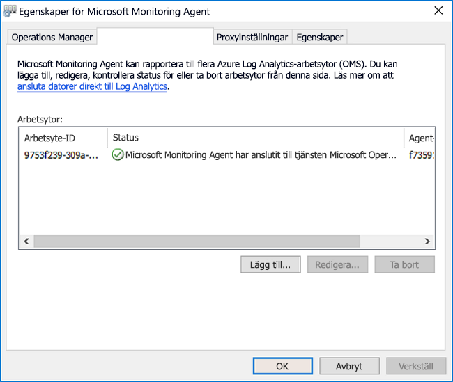
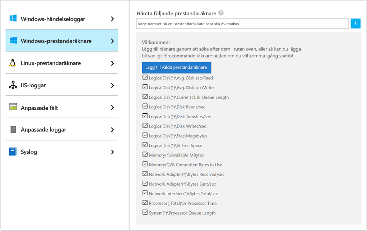

# Samla in data från en Windows-dator i en hybrid miljö med Azure Monitor

[Azure Monitor](../overview.md) kan samla in data direkt från dina fysiska eller virtuella Windows-datorer i din miljö till en Log Analytics arbets yta för detaljerad analys och korrelation. Genom att installera [Log Analytics-agenten](../platform/log-analytics-agent.md) kan Azure Monitor samla in data från ett Data Center eller en annan moln miljö. Den här snabbstarten visar hur du konfigurerar och samlar in data från Windows-datorer med några enkla steg. Information om virtuella Azure Windows-datorer finns i [samla in data om Azure Virtual Machines](../../azure-monitor/learn/quick-collect-azurevm.md).  

Information om vilka konfigurationer som stöds finns i [Windows operativ system](../../azure-monitor/platform/log-analytics-agent.md#supported-windows-operating-systems) och [konfigurationen för nätverks brand väggen](../../azure-monitor/platform/log-analytics-agent.md#network-requirements).
 
Om du inte har någon Azure-prenumeration kan du [skapa ett kostnadsfritt konto](https://azure.microsoft.com/free/?WT.mc_id=A261C142F) innan du börjar.

## Logga in på Azure-portalen

Logga in på Azure Portal på [https://portal.azure.com](https://portal.azure.com). 

## Skapa en arbetsyta

1. Välj **Alla tjänster** i Azure-portalen. I listan över resurser skriver du **Log Analytics**. När du börjar skriva filtreras listan baserat på det du skriver. Välj **Log Analytics arbets ytor**.

       

2. Välj **skapa**och välj sedan alternativ för följande objekt:

   * Ange ett namn för den nya **Log Analytics-arbetsytan**, som *DefaultLAWorkspace*.  
   * Välj en **prenumeration** att länka till genom att välja från den listrutan om standardvalet inte är lämpligt.
   * För **Resursgrupp** väljer du en befintlig resursgrupp som innehåller en eller flera virtuella datorer i Azure.  
   * Välj den **plats** där dina virtuella datorer distribueras.  Mer information finns i avsnittet om [tillgängliga regioner för Log Analytics](https://azure.microsoft.com/regions/services/).
   * Om du skapar en arbetsyta i en ny prenumeration som skapats efter 2 april 2018 används prisplanen *Per GB* automatiskt och alternativet för att välja en prisnivå är inte tillgängligt.  Om du skapar en arbetsyta för en befintlig prenumeration som skapats före 2 april eller en prenumeration som var bunden till en befintlig EA-registrering, väljer du önskad prisnivå.  Mer information om de olika nivåerna finns i [prisinformation om Log Analytics](https://azure.microsoft.com/pricing/details/log-analytics/).
  
         

3. När du har angett nödvändig information i fönstret **Log Analytics arbets yta** väljer du **OK**.  

När informationen har verifierats och arbetsytan skapas, kan du spåra förloppet under **Meddelanden** på menyn. 

## Hämta arbetsyte-ID och nyckel

Innan du installerar Log Analytics agent för Windows (kallas även Microsoft Monitoring Agent (MMA)) behöver du arbets ytans ID och nyckel för din Log Analytics-arbetsyta. Installations guiden behöver informationen för att konfigurera agenten korrekt och se till att den kan kommunicera med Azure Monitor.  

1. I det övre vänstra hörnet av Azure Portal väljer du **alla tjänster**. I rutan Sök anger du **Log Analytics**. När du skriver filtreras listan baserat på dina inaktuella inaktuella inaktuella inaktuella. Välj **Log Analytics arbets ytor**.

2. I listan med Log Analytics arbets ytor väljer du den arbets yta som du skapade tidigare. (Du kan ha namngett det **DefaultLAWorkspace**.)

3. Välj **Avancerade inställningar**:

    
  
4. Välj **Anslutna källor** och välj sedan **Windows-servrar**.

5. Kopiera värdena till höger om **arbetsyte-ID** och **primär nyckel**. Klistra in dem i din favorit redigerare.

## Installera agenten för Windows

Följande steg installerar och konfigurerar agenten för Log Analytics i Azure och Azure Government. Du använder installations programmet för Microsoft Monitoring Agent för att installera agenten på datorn.

1. Fortsätt från föregående uppsättning steg, Välj den version av **Windows agent** som du vill ladda ned på sidan **Windows-servrar** . Välj lämplig version för processor arkitekturen för ditt Windows-operativsystem.

2. Kör installationsprogrammet för att installera agenten på datorn.

3. På sidan **Välkommen** klickar du på **Nästa**.

4. På sidan **Licensvillkor** läser du licensen och väljer **Jag accepterar**.

5. På sidan **Målmapp** ändrar du eller behåller standardinstallationsmappen och väljer **Nästa**.

6. På sidan **installations alternativ för agent** ansluter du agenten till Azure Log Analytics och väljer sedan **Nästa**.

7. Utför följande steg på sidan **Azure Log Analytics** :

   1. Klistra in den **arbetsyte-ID** och **arbets ytans nyckel (primär nyckel)** som du kopierade tidigare. Om datorn ska rapportera till en Log Analytics arbets yta i Azure Government väljer du **Azure amerikanska myndigheter** i listan **Azure-moln** .  
   2. Om datorn behöver kommunicera via en proxyserver till Log Analytics-tjänsten väljer du **Avancerat** och anger URL och portnummer för proxyservern. Om proxyservern kräver autentisering anger du användar namn och lösen ord för autentisering med proxyservern och väljer sedan **Nästa**.  

8. Välj **Nästa** när du har lagt till konfigurations inställningarna:

    

9. På sidan **Klar att installera** kontrollerar du valen och väljer sedan **Installera**.

10. På sidan **konfigurationen har slutförts** väljer du **Slutför**.

När installationen och installationen är slutförd visas Microsoft Monitoring Agent i kontroll panelen. Du kan granska konfigurationen och kontrol lera att agenten är ansluten till Log Analytics arbets ytan. När du är ansluten på fliken **Azure-Log Analytics** visar agenten följande meddelande: **Microsoft Monitoring Agent har anslutit till Microsoft Log Analytics-tjänsten.**   

## Samla in data om händelser och prestanda

Azure Monitor kan samla in händelser som du anger i händelse loggen och prestanda räknarna i Windows för längre period analys och rapportering. Det kan också vidta åtgärder när ett visst villkor upptäcks. Följ dessa steg om du vill konfigurera insamling av händelser från Windows-händelseloggen och flera vanliga prestandaräknare till att börja med.  

1. I det nedre vänstra hörnet av Azure Portal väljer du **fler tjänster**. I rutan Sök anger du **Log Analytics**. När du skriver filtreras listan baserat på dina inaktuella inaktuella inaktuella inaktuella. Välj **Log Analytics arbets ytor**.

2. Välj **Avancerade inställningar**:

    
 
3. Välj **Data** och sedan **Windows-händelseloggar**.  

4. Du lägger till en händelse logg genom att ange namnet på loggen. Ange **system**och välj sedan plus tecknet ( **+** ).  

5. I tabellen väljer du **fel** -och **varnings** allvarlighets grader.

6. Välj **Spara** längst upp på sidan.

7. Välj **Windows-prestandaräknare** för att aktivera insamling av prestandaräknare i en Windows-dator.

8. När du först konfigurerar Windows-prestandaräknare för en ny Log Analytics arbets yta får du möjlighet att snabbt skapa flera vanliga räknare. Varje alternativ visas med en kryss ruta bredvid:

    .
    
    Välj **Lägg till de valda prestanda räknarna**. Räknarna läggs till och förinställs med ett exempel intervall på 10 sekunders samling.

9. Välj **Spara** längst upp på sidan.

## Visa insamlade data

Nu när du har aktiverat data insamling ska vi köra en enkel loggs ökning för att se vissa data från mål datorn.  

1. I den valda arbets ytan väljer du **loggar**i den vänstra rutan.

2. På sidan loggar fråga skriver `Perf` du i Frågeredigeraren och väljer **Kör**.
 
    

    Frågan i den här bilden returnerade till exempel 10 000 prestanda poster. Ditt resultatet blir mycket mindre.

    

## Rensa resurser

Du kan ta bort agenten från datorn och ta bort arbets ytan Log Analytics om du inte längre behöver dem.  

Slutför följande steg för att ta bort agenten:

1. Öppna Kontrollpanelen.

2. Öppna **Program och funktioner**.

3. I **program och funktioner**väljer du **Microsoft Monitoring Agent** och väljer sedan **Avinstallera**.

Om du vill ta bort Log Analytics arbets ytan som du skapade tidigare, markerar du den och väljer **ta bort**på sidan resurs:

## Nästa steg

Nu när du samlar in drift-och prestanda data från din Windows-dator kan du enkelt börja utforska, analysera och agera på de data som du samlar in *utan kostnad*.  

Om du vill veta mer om hur du visar och analyserar data fortsätter du till självstudien:

> [!div class="nextstepaction"]
> [Visa eller analysera data i Log Analytics](../log-query/get-started-portal.md)
