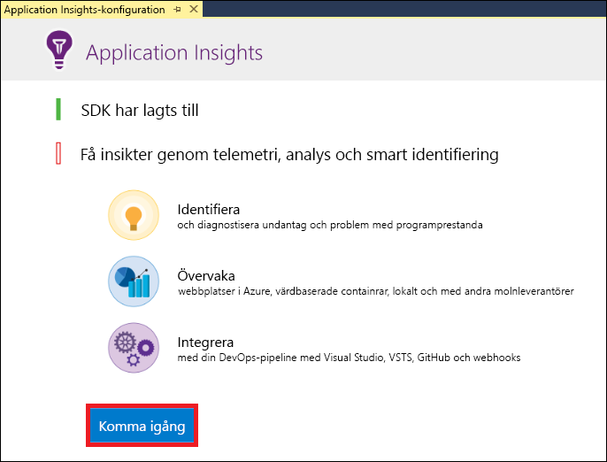
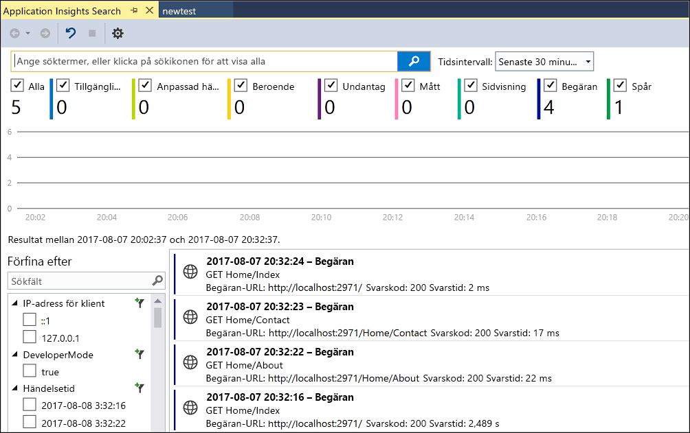
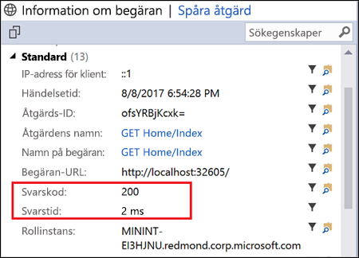

# <a name="start-monitoring-your-aspnet-web-application"></a>Börja övervaka din ASP.NET-webbapp

Med Azure Application Insights kan du enkelt övervaka en webbapp med avseende på tillgänglighet, prestanda och användning.  Du kan också snabbt identifiera och diagnostisera fel i appen utan att vänta på att en användare rapporterar dem.  Med hjälp av informationen du samlar in från Application Insights om appens prestanda och effektivitet kan du göra välgrundade val för att underhålla och förbättra ditt program.

Den här snabbstarten visar hur du lägger till Application Insights till en befintlig ASP.NET-webbapp och börjar analysera livestatistik. Det är bara en av de olika metoderna du kan använda för att analysera din app. Om du inte har en ASP.NET-webbprogram, kan du skapa en genom att följa den [skapa en Snabbstart för ASP.NET-Webbapp](../../app-service/app-service-web-get-started-dotnet-framework.md).

## <a name="prerequisites"></a>Förutsättningar
För att slutföra den här snabbstarten behöver du:

- Installera [Visual Studio 2017](https://www.visualstudio.com/downloads/) med följande arbetsbelastningar:
    - ASP.NET och webbutveckling
    - Azure Development


Om du inte har en Azure-prenumeration kan du skapa ett [kostnadsfritt](https://azure.microsoft.com/free/) konto innan du börjar.

## <a name="enable-application-insights"></a>Aktivera Application Insights

1. Öppna projektet i Visual Studio 2017.
2. Välj **Configure Application Insights** (Konfigurera Application Insights) på projektmenyn. Visual Studio lägger till Application Insights SDK för programmet.

    > [!IMPORTANT]
    > Processen för att lägga till Application Insights varierar beroende på malltypen i ASP.NET. Om du använder mallen **Tom** eller **Azure-mobilapp** väljer du **Projekt** > **Lägg till Application Insights Telemetry**. För alla andra ASP.NET-mallar läser du anvisningarna i steget ovan. 

3. Klicka på **Get Started** (Kom igång) (tidigare versioner av Visual Studio har knappen **Start Free** (Börja kostnadsfritt) i stället).

    

4. Välj din prenumeration och klicka på **Registrera**.

5. Kör ditt program genom att antingen välja alternativet för att **starta felsökning** på menyn **Felsök** eller genom att trycka på tangenten F5.

## <a name="confirm-app-configuration"></a>Bekräfta appkonfiguration

Application Insights samlar in telemetridata för tillämpningsprogrammet oavsett var det körs. Gör så här om du vill börja granska dessa data:

1. Öppna Application Insights genom att klicka på **Visa** -> **Andra fönster** -> **Application Insights Search**.  Du kan se telemetrin från den aktuella sessionen.<BR><br>

2. Klicka på den första begäran i listan (GET Home/Index i det här exemplet) för att se mer information. Observera att både statuskoden och svarstiden ingår tillsammans med annan värdefull information om begäran.<br><br>

## <a name="start-monitoring-in-the-azure-portal"></a>Börja övervaka i Azure-portalen

Nu kan du öppna Application Insights i Azure-portalen för att visa olika detaljer om programmet som körs.

1. Högerklicka på mappen **Connected Services Application Insights** i Solution Explorer och klicka på alternativet för att **öppna Application Insights-portalen**.  Du ser viss information om ditt program och många andra alternativ.

    

2. Klicka på **Programkarta** för en visuell layout av beroenden mellan programkomponenterna.  För varje komponent visas KPI:er som belastning, prestanda, fel och varningar.

    

3. Klicka på **App Analytics**-ikonen  på någon av programkomponenterna.  Då öppnas **Application Insights Analytics**, med ett funktionsrikt frågespråk för att analysera alla data som samlas in av Application Insights.  I det här fallet skapas en fråga som återger antalet begäranden som ett diagram.  Du kan skriva egna frågor för att analysera andra data.

    

4. Återgå till **översiktssidan** och klicka på **Live Stream**.  Här ser du livestatistik om programmet när medan det körs.  Det innehåller information som antalet inkommande begäranden, varaktigheten för dessa begäranden och fel som inträffar.  Du kan även granska kritiska prestandavärden, till exempel processor och minne.

    

    Om du är redo att vara värd för programmet i Azure kan publicera den nu. Följ stegen i informationen om att [skapa en snabbstart för ASP.NET-webbappen](../../app-service/app-service-web-get-started-dotnet.md#update-the-app-and-redeploy).

5. Om du använder Visual Studio för att lägga till Application Insights-övervakning kan du automatiskt lägga till övervakning på klientsidan. För att lägga till övervakning på klientsidan manuellt till ett program lägger du till följande JavaScript för ditt program:

```html
<!-- 
To collect user behavior analytics about your application, 
insert the following script into each page you want to track.
Place this code immediately before the closing </head> tag,
and before any other scripts. Your first data will appear 
automatically in just a few seconds.
-->
<script type="text/javascript">
var appInsights=window.appInsights||function(a){
  function b(a){c[a]=function(){var b=arguments;c.queue.push(function(){c[a].apply(c,b)})}}var c={config:a},d=document,e=window;setTimeout(function(){var b=d.createElement("script");b.src=a.url||"https://az416426.vo.msecnd.net/scripts/a/ai.0.js",d.getElementsByTagName("script")[0].parentNode.appendChild(b)});try{c.cookie=d.cookie}catch(a){}c.queue=[];for(var f=["Event","Exception","Metric","PageView","Trace","Dependency"];f.length;)b("track"+f.pop());if(b("setAuthenticatedUserContext"),b("clearAuthenticatedUserContext"),b("startTrackEvent"),b("stopTrackEvent"),b("startTrackPage"),b("stopTrackPage"),b("flush"),!a.disableExceptionTracking){f="onerror",b("_"+f);var g=e[f];e[f]=function(a,b,d,e,h){var i=g&&g(a,b,d,e,h);return!0!==i&&c["_"+f](a,b,d,e,h),i}}return c
  }({
      instrumentationKey:"<your instrumentation key>"
  });

window.appInsights=appInsights,appInsights.queue&&0===appInsights.queue.length&&appInsights.trackPageView();
</script>
```

Mer information finns på GitHub-lagringsplatsen för vår [JavaScript-SDK med öppen källkod](https://github.com/Microsoft/ApplicationInsights-JS).

## <a name="next-steps"></a>Nästa steg
Du har aktiverat ditt program för övervakning av Azure Application Insights i den här snabbstartsguiden.  Fortsätt till självstudierna för att lära dig att använda övervakningsstatistik och identifiera problem i programmet.

> [!div class="nextstepaction"]
> [Azure Application Insights-självstudier](tutorial-runtime-exceptions.md)
