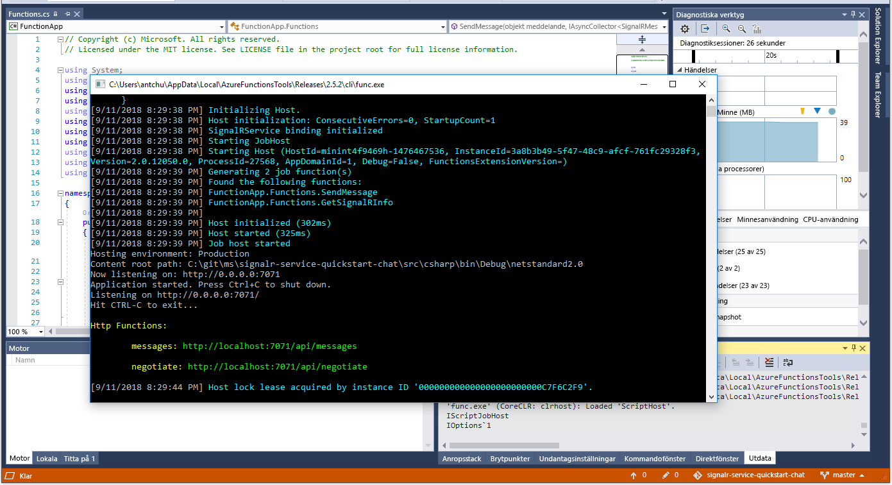

# <a name="quickstart-create-a-chat-room-with-azure-functions-and-signalr-service-using-c"></a>Snabbstart: Skapa ett chattrum med Azure Functions and SignalR Service med C\#

Med Azure SignalR Service kan du enkelt lägga till realtidsfunktioner i ditt program. Azure Functions är en serverlös plattform som gör att du kan köra din kod utan att behöva hantera någon infrastruktur. I den här snabbstarten lär du dig hur du använder SignalR Service och Functions för att skapa ett serverlöst realtidschattprogram.

## <a name="prerequisites"></a>Krav

Om du inte redan har Installerat Visual Studio 2019 kan du ladda ned och använda den **kostnadsfria** [Visual Studio 2019 Community Edition.](https://www.visualstudio.com/downloads/) Se till att du aktiverar **Azure-utveckling** under installationen av Visual Studio.

Du kan också köra den här självstudien på kommandoraden (macOS, Windows eller Linux) med hjälp av [Azure Functions Core Tools (v2),](https://github.com/Azure/azure-functions-core-tools#installing) [.NET Core SDK](https://dotnet.microsoft.com/download)och din favoritkodredigerare.

[!INCLUDE [quickstarts-free-trial-note](../../includes/quickstarts-free-trial-note.md)]

## <a name="log-in-to-azure"></a>Logga in på Azure

Logga in på Azure-portalen på <https://portal.azure.com/> med ditt Azure-konto.

[!INCLUDE [Create instance](includes/signalr-quickstart-create-instance.md)]

[!INCLUDE [Clone application](includes/signalr-quickstart-clone-application.md)]

## <a name="configure-and-run-the-azure-function-app"></a>Konfigurera och köra Azure Functions-appen

1. Starta Visual Studio (eller en annan kodredigerare) och öppna lösningen i *mappen src/chat/csharp* i den klonade databasen.

1. I den webbläsare där Azure-portalen är öppnad bekräftar du att den SignalR Service-instans som du distribuerade tidigare skapades korrekt genom att söka efter dess namn i sökrutan längst upp i portalen. Välj instansen för att öppna den.

    

1. Välj **Nycklar** för att visa anslutningssträngarna för SignalR Service-instansen.

1. Markera och kopiera den primära anslutningssträngen.

1. Tillbaka i Visual Studio, i Solution Explorer, byter du namn på *local.settings.sample.json* till *local.settings.json*.

1. I **local.settings.json** klistrar du in anslutningssträngen i värdet för inställningen **AzureSignalRConnectionString**. Spara filen.

1. Öppna **Functions.cs**. Det finns två HTTP-utlösta funktioner i den här funktionsappen:

    - **GetSignalRInfo** – använder indatabindningen *SignalRConnectionInfo* för att skapa och returnera giltig anslutningsinformation.
    - **SendMessage** – tar emot ett chattmeddelande i begärandetexten och använder utdatabindningen *SignalR* för att skicka meddelandet till alla anslutna klientprogram.

1. Använd något av följande alternativ för att starta Azure Function-appen lokalt.

    - **Visual Studio**: I *Felsökningsmenyn* väljer du *Starta felsökning* för att köra programmet.

        

    - **Kommandorad:** Kör följande kommando för att starta funktionsvärden.

        ```bash
        func start
        ```

[!INCLUDE [Run web application](includes/signalr-quickstart-run-web-application.md)]

[!INCLUDE [Cleanup](includes/signalr-quickstart-cleanup.md)]

## <a name="next-steps"></a>Nästa steg

I den här snabbstarten har du skapat och kört ett serverlöst program i realtid i Visual Studio. Härnäst får du lära dig mer om att utveckla och distribuera Azure Functions med Visual Studio.

> [!div class="nextstepaction"]
> [Utveckla Azure Functions med hjälp av Visual Studio](../azure-functions/functions-develop-vs.md)