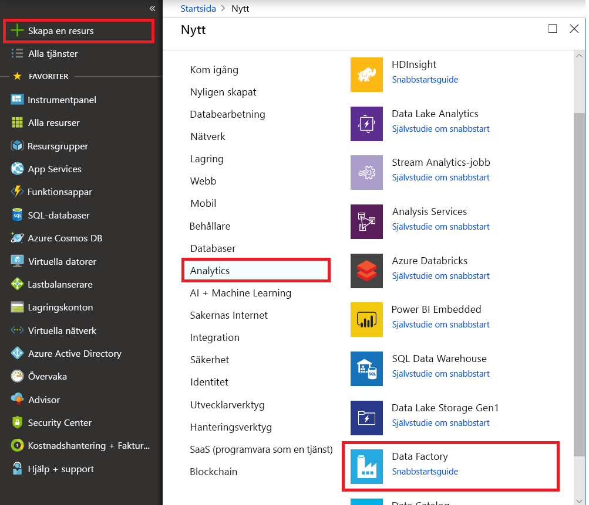
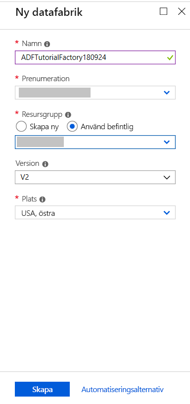
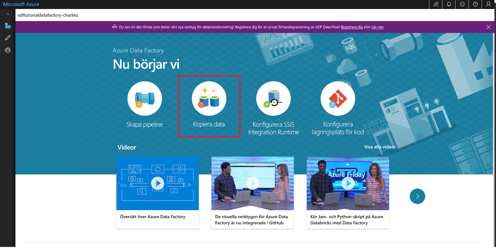

# Snabbstart: Kopiera data med verktyget Kopiera data

> [!div class="op_single_selector" title1="Select the version of Data Factory service that you are using:"]
> * [Version 1](v1/data-factory-copy-data-from-azure-blob-storage-to-sql-database.md)
> * [Aktuell version](quickstart-create-data-factory-copy-data-tool.md)

I den här snabbstarten använder du Azure-portalen för att skapa en datafabrik. Sedan använder du verktyget Kopiera data för att skapa en pipeline som kopierar data från en mapp i en Azure Blob Storage till en annan mapp. 

> [!NOTE]
> Om du inte har använt Azure Data Factory tidigare kan du läsa [Introduktion till Azure Data Factory](data-factory-introduction.md). 

[!INCLUDE [data-factory-quickstart-prerequisites](../../includes/data-factory-quickstart-prerequisites.md)] 

## Skapa en datafabrik

1. Välj **Nytt** på den vänstra menyn, välj **Data och analys** och välj sedan **Data Factory**. 
   
   
1. På sidan **Ny datafabrik** anger du **ADFTutorialDataFactory** som **Namn**. 
      
   
 
   Namnet på Azure Data Factory måste vara *globalt unikt*. Om du ser följande fel ändrar du namnet på datafabriken (till exempel **&lt;dittnamn&gt;ADFTutorialDataFactory**) och provar att skapa fabriken igen. Namngivningsregler för Data Factory-artefakter finns i artikeln [Data Factory – namnregler](naming-rules.md).
  
   
1. Välj den Azure-prenumeration där du vill skapa den nya datafabriken för **Prenumeration**. 
1. För **Resursgrupp** utför du något av följande steg:
     
   - Välj **Använd befintlig** och välj en befintlig resursgrupp från listan. 
   - Välj **Skapa ny** och ange namnet på en resursgrupp.   
         
   Mer information om resursgrupper finns i [Använda resursgrupper till att hantera Azure-resurser](../azure-resource-manager/resource-group-overview.md).  
1. För **Version** väljer du **V2**.
1. För **Plats** väljer du en plats för datafabriken. 

   I listan visas endast platser som Data Factory har stöd för och var dina Azure Data Factory-metadata kommer att lagras. Observera att de associerade datalagren (såsom Azure Storage och Azure SQL Database) och beräkningar (som HDInsight) som används i Data Factory kan köras i andra regioner.

1. Välj **Skapa**.
1. När datafabriken har skapats visas sidan **Datafabrik**. Välj panelen **Författare och övervakare** för att starta användargränssnittet för Azure Data Factory på en separat flik.
   
   

## Starta verktyget Kopiera data

1. Sidan **Nu sätter vi igång** visas. Välj panelen **Kopiera data** för att starta verktyget kopieringsdata. 

   

1. På sidan **Egenskaper** sida i verktyget Kopiera data kan du ange ett namn för din pipeline och dess beskrivning och sedan välja **Nästa**. 

   
1. Gör följande på sidan **Källdatalager**:

    a. Klicka på **+ Skapa ny anslutning** för att lägga till en anslutning.

    

    b. Välj **Azure Blob Storage** från galleriet och välj sedan **Nästa**.

    

    c. På sidan där du **anger Azure Blob Storage-konto** väljer du ditt lagringskonto i listan med **lagringskontonamn**. Välj sedan **Avsluta**. 

   

   d. Välj den nyligen skapade länkade tjänsten som källa och klicka sedan på **Nästa**.

   

1. Gör följande på sidan för att **välja indatafil eller -mapp**:

   a. Klicka på **Bläddra** för att gå till mappen **adftutorial/input**, välj filen **emp.txt** och klicka på **Välj**. 

   

   d. Markera alternativet **binär kopia** för att kopiera filen i befintligt skick och välj **nästa**. 

   

1. Sidan **Destination data store** (Måldatalager) visas. Välj den länkade **Azure Blob Storage**-tjänsten som du skapade och sedan **Nästa**. 

   

1. På sidan **Välj utdatafil eller mapp** anger du **adftutorial/fromonprem** och klickar på **Nästa**. 

    

1. På sidan **Inställningar** väljer du **Nästa** för att använda standardkonfigurationerna. 

1. Granska alla inställningar på sidan **Summary** (Sammanfattning) och klicka på **Nästa**. 

    

1. Sidan om att **distributionen har slutförts** visas. Välj **Övervaka** om du vill övervaka den pipeline du har skapat. 

    

1. Programmet växlar till fliken **Övervaka**. På den här fliken visas status för pipelinen. Om du vill uppdatera listan väljer du **Refresh** (Uppdatera). 
    
    

1. Välj länken **View Activity Runs** (Visa aktivitetskörningar) i kolumnen **Actions** (Åtgärder). Pipelinen har endast en aktivitet av typen **Kopiera**. 

    
    
1. Om du vill se mer information om kopieringsåtgärden väljer du länken **Detaljer** (glasögonbilden) i kolumnen **Actions** (Åtgärder). Mer information om egenskaperna finns i [Copy Activity overview](copy-activity-overview.md) (Översikt över kopieringsaktivitet).

    

1. Verifiera att filen **emp.txt** har skapats i mappen **output** för containern **adftutorial**. Om utdatamappen inte finns skapas den automatiskt av Data Factory-tjänsten. 

1. Växla till fliken **Fönster** över fliken **Övervakare** på den vänstra panelen så att du kan redigera länkade tjänster, datauppsättningar och piplines. Mer information om hur du redigerar dessa i användargränssnittet för Data Factory finns i [Skapa en datafabrik med hjälp av Azure-portalen](quickstart-create-data-factory-portal.md).

## Nästa steg
Pipelinen i det här exemplet kopierar data från en plats till en annan i Azure Blob Storage. Gå igenom [självstudiekurserna](tutorial-copy-data-portal.md) om du vill lära dig hur du använder Data Factory i fler scenarier. 