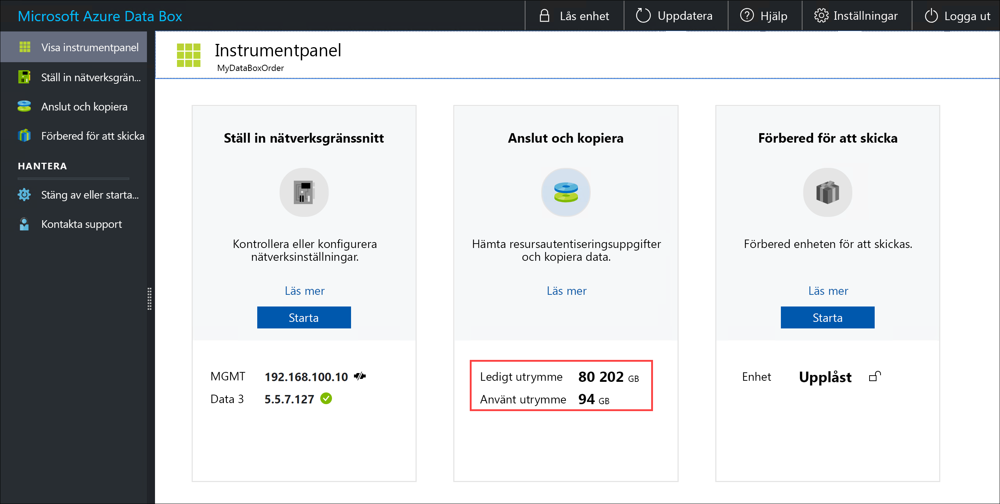
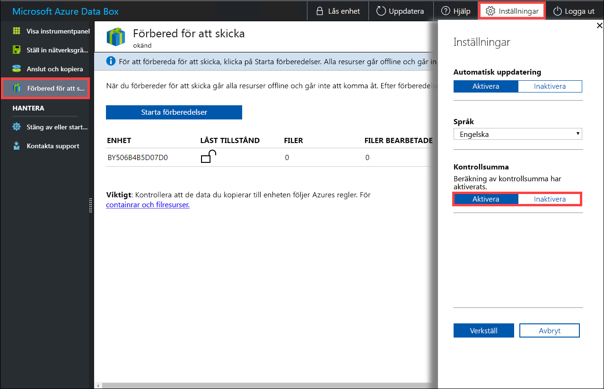

# <a name="use-the-local-web-ui-to-administer-your-data-box-and-data-box-heavy"></a>Använd det lokala webbgränssnittet för att administrera din databox och databoxtunga

I den här artikeln beskrivs några av de konfigurations- och hanteringsuppgifter som kan utföras på databoxen och databoxen tung enhet. Du kan hantera databoxen och databoxen tunga enheter via Azure portal-användargränssnittet och det lokala webbgränssnittet för enheten. Den här artikeln fokuserar på de uppgifter som du kan utföra med det lokala webbgränssnittet.

Lokalt webbgränssnitt för databoxen och databoxen tung används för den första konfigurationen av enheten. Du kan också använda det lokala webbgränssnittet för att stänga av eller starta om enheten, köra diagnostiska tester, uppdatera programvara, visa kopieringsloggar och generera ett loggpaket för Microsoft Support. På en Data Box Heavy-enhet med två oberoende noder kan du komma åt två separata lokala webb-UIs som motsvarar varje nod på enheten.

Den här artikeln innehåller följande självstudier:

- Generera ett supportpaket
- Stänga av eller starta om enheten
- Ladda ned strukturlista eller manifestfiler
- Visa tillgänglig kapacitet på enheten
- Hoppa över validering av kontrollsummor

## <a name="generate-support-package"></a>Generera supportpaket

Om det uppstår enhetsproblem kan du skapa ett supportpaket från systemloggarna. Microsoft Support använder det här paketet för att felsöka problemet. Så här skapar du ett supportpaket:

1. I det lokala webbgränssnittet går du till **Kontakta support** och klickar på **Skapa supportpaket**.

    

2. Ett supportpaket samlas in. Den här åtgärden tar några minuter.

    

3. När supportpaketet är klart klickar du på **Ladda ned supportpaket**. 

    

4. Bläddra och välj nedladdningsplats. Öppna mappen för att visa innehållet.

    


## <a name="shut-down-or-restart-your-device"></a>Stänga av eller starta om enheten

Du kan stänga av eller starta om enheten med det lokala webbgränssnittet. Innan du startar om rekommenderar vi att du tar ned resurserna offline på värden och sedan enheten. Detta minskar risken för skadade data. Se till att datakopiering inte pågår när du stänger av enheten.

Om du vill stänga av enheten gör du följande.

1. I det lokala webbgränssnittet går du till **Stäng av eller starta om**.
2. Klicka på **Stäng av**.

    

3. När du uppmanas att bekräfta klickar du på **OK** för att fortsätta.

    

När enheten är avstängd använder du strömknappen på frontpanelen för att starta enheten.

Utför följande steg för att starta om din Data Box.

1. I det lokala webbgränssnittet går du till **Stäng av eller starta om**.
2. Klicka på **Starta om**.

    

3. När du uppmanas att bekräfta klickar du på **OK** för att fortsätta.

   Enheten stängs av och startar sedan om.

## <a name="download-bom-or-manifest-files"></a>Ladda ned strukturlista eller manifestfiler

Strukturlistan (Bom) eller manifestfilerna innehåller en lista över de filer som kopieras till datarutan eller datarutan Tung. Dessa filer genereras när du förbereder enheten för att leverera.

Innan du börjar kontrollerar du att enheten har slutfört **Förbered leveranssteg.** Följ stegen nedan för att hämta strukturlistan eller manifestfilerna:

1. Gå till det lokala webbgränssnittet för enheten. Du kommer att se att enheten har slutfört förbereda att leverera. När enhetsförberedelserna har slutförts visas enhetens status som **Klar för leverans**.

    

2. Klicka på **Ladda ned fillista** för att ladda ned listan med filer som kopierades på din Data Box.

    

3. I Utforskaren ser du att en separat lista över filer genereras beroende på vilket protokoll som användes för att ansluta till enheten och vilken typ av Azure Storage-lagring du använde.

    

   Följande tabell mappar filnamnen med den typ av Azure Storage-lagring och det anslutningsprotokoll som används.

    |Filnamn  |Azure Storage-typ  |Anslutningsprotokoll som används |
    |---------|---------|---------|
    |databoxe2etest_BlockBlob.txt     |Blockblobar         |SMB/NFS         |
    |databoxe2etest_PageBlob.txt     |Sidblobbar         |SMB/NFS         |
    |databoxe2etest_AzFile-BOM.txt    |Azure Files         |SMB/NFS         |
    |databoxe2etest_PageBlock_Rest-BOM.txt     |Sidblobbar         |REST        |
    |databoxe2etest_BlockBlock_Rest-BOM.txt    |Blockblobar         |REST         |
    |mydbmdrg1_MDisk-BOM.txt    |Hanterad disk         |SMB/NFS         |
    |mydbmdrg2_MDisk-BOM.txt     |Hanterad disk         |SMB/NFS         |

Du använder den här listan för att bekräfta överföringen av filerna till Azure Storage-kontot när Data Box returnerats till Azure-datacentret. En exempelmanifestfil visas nedan.

> [!NOTE]
> På en dataruta tung, två uppsättningar av lista över filer (BOM-filer) finns som motsvarar de två noderna på enheten.

```xml
<file size="52689" crc64="0x95a62e3f2095181e">\databox\media\data-box-deploy-copy-data\prepare-to-ship2.png</file>
<file size="22117" crc64="0x9b160c2c43ab6869">\databox\media\data-box-deploy-copy-data\connect-shares-file-explorer2.png</file>
<file size="57159" crc64="0x1caa82004e0053a4">\databox\media\data-box-deploy-copy-data\verify-used-space-dashboard.png</file>
<file size="24777" crc64="0x3e0db0cd1ad438e0">\databox\media\data-box-deploy-copy-data\prepare-to-ship5.png</file>
<file size="162006" crc64="0x9ceacb612ecb59d6">\databox\media\data-box-cable-options\cabling-dhcp-data-only.png</file>
<file size="155066" crc64="0x051a08d36980f5bc">\databox\media\data-box-cable-options\cabling-2-port-setup.png</file>
<file size="150399" crc64="0x66c5894ff328c0b1">\databox\media\data-box-cable-options\cabling-with-switch-static-ip.png</file>
<file size="158082" crc64="0xbd4b4c5103a783ea">\databox\media\data-box-cable-options\cabling-mgmt-only.png</file>
<file size="148456" crc64="0xa461ad24c8e4344a">\databox\media\data-box-cable-options\cabling-with-static-ip.png</file>
<file size="40417" crc64="0x637f59dd10d032b3">\databox\media\data-box-portal-admin\delete-order1.png</file>
<file size="33704" crc64="0x388546569ea9a29f">\databox\media\data-box-portal-admin\clone-order1.png</file>
<file size="5757" crc64="0x9979df75ee9be91e">\databox\media\data-box-safety\japan.png</file>
<file size="998" crc64="0xc10c5a1863c5f88f">\databox\media\data-box-safety\overload_tip_hazard_icon.png</file>
<file size="5870" crc64="0x4aec2377bb16136d">\databox\media\data-box-safety\south-korea.png</file>
<file size="16572" crc64="0x05b13500a1385a87">\databox\media\data-box-safety\taiwan.png</file>
<file size="999" crc64="0x3f3f1c5c596a4920">\databox\media\data-box-safety\warning_icon.png</file>
<file size="1054" crc64="0x24911140d7487311">\databox\media\data-box-safety\read_safety_and_health_information_icon.png</file>
<file size="1258" crc64="0xc00a2d5480f4fcec">\databox\media\data-box-safety\heavy_weight_hazard_icon.png</file>
<file size="1672" crc64="0x4ae5cfa67c0e895a">\databox\media\data-box-safety\no_user_serviceable_parts_icon.png</file>
<file size="3577" crc64="0x99e3d9df341b62eb">\databox\media\data-box-safety\battery_disposal_icon.png</file>
<file size="993" crc64="0x5a1a78a399840a17">\databox\media\data-box-safety\tip_hazard_icon.png</file>
<file size="1028" crc64="0xffe332400278f013">\databox\media\data-box-safety\electrical_shock_hazard_icon.png</file>
<file size="58699" crc64="0x2c411d5202c78a95">\databox\media\data-box-deploy-ordered\data-box-ordered.png</file>
<file size="46816" crc64="0x31e48aa9ca76bd05">\databox\media\data-box-deploy-ordered\search-azure-data-box1.png</file>
<file size="24160" crc64="0x978fc0c6e0c4c16d">\databox\media\data-box-deploy-ordered\select-data-box-option1.png</file>
<file size="115954" crc64="0x0b42449312086227">\databox\media\data-box-disk-deploy-copy-data\data-box-disk-validation-tool-output.png</file>
<file size="6093" crc64="0xadb61d0d7c6d4deb">\databox\data-box-cable-options.md</file>
<file size="6499" crc64="0x080add29add367d9">\databox\data-box-deploy-copy-data-via-nfs.md</file>
<file size="11089" crc64="0xc3ce6b13a4fe3001">\databox\data-box-deploy-copy-data-via-rest.md</file>
<file size="9126" crc64="0x820856b5a54321ad">\databox\data-box-overview.md</file>
<file size="10963" crc64="0x5e9a14f9f4784fd8">\databox\data-box-safety.md</file>
<file size="5941" crc64="0x8631d62fbc038760">\databox\data-box-security.md</file>
<file size="12536" crc64="0x8c8ff93e73d665ec">\databox\data-box-system-requirements-rest.md</file>
<file size="3220" crc64="0x7257a263c434839a">\databox\data-box-system-requirements.md</file>
<file size="2823" crc64="0x63db1ada6fcdc672">\databox\index.yml</file>
<file size="4364" crc64="0x62b5710f58f00b8b">\databox\data-box-local-web-ui-admin.md</file>
<file size="3603" crc64="0x7e34c25d5606693f">\databox\TOC.yml</file>
```

Den här filen innehåller en lista över alla filer som har kopierats i datarutan eller datarutan Tung. I den här filen relaterar *crc64*-värdet till kontrollsumman som genererats för den motsvarande filen.

## <a name="view-available-capacity-of-the-device"></a>Visa tillgänglig kapacitet på enheten

Du kan använda enhetsinstrumentpanelen för att visa tillgänglig och använd kapacitet för enheten.

1. I det lokala webbgränssnittet går du till **Visa instrumentpanel**.
2. Under **Anslut och kopiera** visas ledigt och använt utrymme på enheten.

    

## <a name="skip-checksum-validation"></a>Hoppa över validering av kontrollsummor

Kontrollsummor genereras för dina data som standard när du förbereder för att skicka. Beroende på datatyp (små filstorlekar) kan prestanda i vissa sällsynta fall vara långsamma. I sådana fall kan du hoppa över kontrollsumman.

Vi rekommenderar starkt att du inte inaktiverar kontrollsumman såvida inte prestanda påverkas allvarligt.

1. Gå till **Inställningar**längst upp till höger i det lokala webbgränssnittet på enheten .

    

2. **Inaktivera** validering av kontrollsummor
3. Klicka på **Använd**.

## <a name="next-steps"></a>Nästa steg

- Lär dig hur du [hanterar databoxen och databoxen tung via Azure-portalen](data-box-portal-admin.md).

