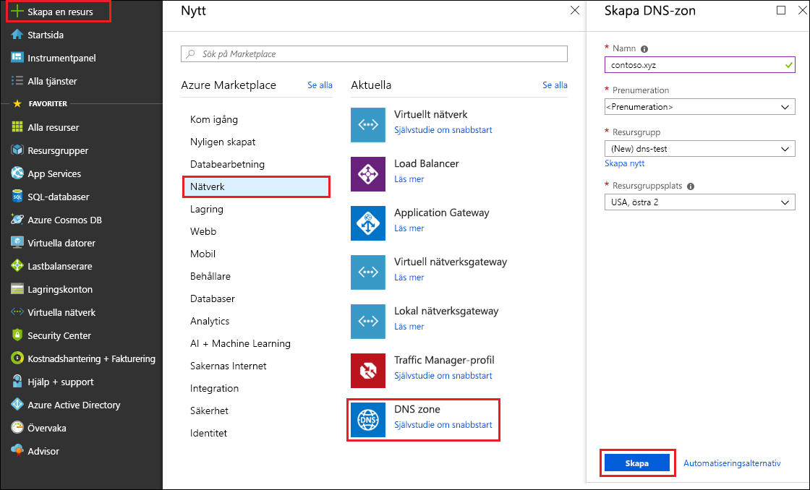
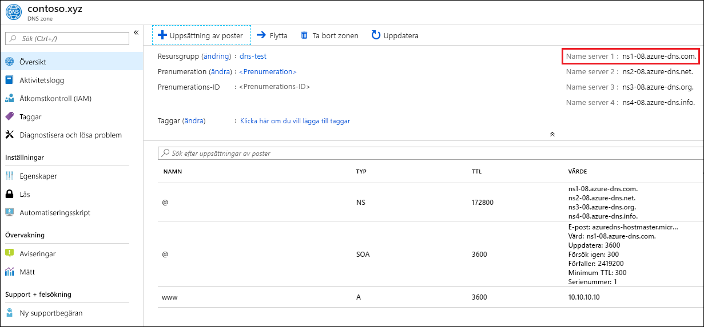

# <a name="quickstart-create-an-azure-dns-zone-and-record-using-the-azure-portal"></a>Snabbstart: Skapa en Azure DNS-zon och -post med hjälp av Azure portal

Du kan konfigurera Azure DNS för att matcha värdnamn i din offentliga domän. Exempel: Om du har köpt den *contoso.xyz* domännamn från en domännamnsregistrator kan du konfigurera Azure DNS till värden i *contoso.xyz* domän och Lös *www.contoso.xyz* till IP-adressen för din webb- eller webbapp.

I den här snabbstarten skapar du en testdomän och skapar sedan en adresspost för att matcha *www* mot IP-adressen *10.10.10.10*.

>[!IMPORTANT]
>Alla namn och IP-adresser i den här snabbstarten är exempel som inte representerar verkliga scenarier.

<!---
You can also perform these steps using [Azure PowerShell](dns-getstarted-powershell.md) or the cross-platform [Azure CLI](dns-getstarted-cli.md).
--->

Om du inte har en Azure-prenumeration kan du skapa ett [kostnadsfritt konto](https://azure.microsoft.com/free/?WT.mc_id=A261C142F) innan du börjar.

För alla portalsteg loggar du in på [Azure-portalen](https://portal.azure.com).

## <a name="create-a-dns-zone"></a>Skapa en DNS-zon

En DNS-zon innehåller DNS-poster för en domän. Om du vill låta Azure DNS vara värd för din domän skapar du en DNS-zon för det domännamnet. 

**Så här skapar du DNS-zonen:**

1. Längst upp till vänster väljer du **Skapa en resurs**, sedan **Nätverk** och därefter **DNS-zon**.

1. På sidan **Skapa DNS-zon** skriver eller väljer du följande värden:

   - **Namn**: Skriv *contoso.xyz* för det här snabbstartsexemplet. DNS-zonens namn kan vara valfritt värde som inte redan har konfigurerats på Azure DNS-servrarna. Ett verkligt värde skulle vara en domän som du har köpt från en domännamnsregistrator.
   - **Resursgrupp**: Välj **Skapa nytt**, ange *MyResourceGroup*, och välj **OK**. Resursgruppens namn måste vara unikt inom Azure-prenumerationen. 

1. Välj **Skapa**.

   

Det kan ta några minuter att skapa zonen.

## <a name="create-a-dns-record"></a>Skapa en DNS-post

Du skapar DNS-poster för din domän inuti DNS-zonen. Skapa en ny adresspost eller en ”A”-post för att matcha ett värdnamn mot en IPv4-adress.

**Så här skapar du en ”A”-post:**

1. I Azure-portalen under **alla resurser**öppnar den **contoso.xyz** DNS-zonen i den **MyResourceGroup** resursgrupp. Du kan ange *contoso.xyz* i rutan **Filtrera efter namn** för att hitta det enklare.

1. Längst upp på sidan **DNS-zon** väljer du **+ Postuppsättning**.

1. På sidan **Lägg till uppsättning av poster** skriver eller väljer du följande värden:

   - **Namn**: Skriv *www*. Postens namn är det värddatornamn som du vill lösa mot den angivna IP-adressen.
   - **Typ**: Välj **A**. ”A”-poster är de vanligaste, men det finns andra posttyper för e-postservrar (”MX”), IPv6-adresser (”AAAA”) och så vidare. 
   - **TTL**: Typ *1*. *Time-to-live* för DNS-begäran anger hur länge DNS-servrar och klienter kan cachelagra ett svar.
   - **TTL-enhet**: Välj **Timmar**. Det här är tidsenheten för **TTL**-värdet. 
   - **IP-adress**: För det här snabbstartsexemplet skriver du *10.10.10.10*. Det här värdet är den IP-adress som postnamnet matchar till. I ett verkligt scenario skulle du ange den offentliga IP-adressen för din webbserver.

Eftersom den här snabbstarten är bara för snabb testning, finns det inget behov att konfigurera Azure DNS-namnservrarna på en domännamnsregistrator. Med en verklig produktionsdomän vill vem som helst på Internet för att lösa värdnamnet för att ansluta till din webbserver eller app. Du besöker din domännamnsregistrator för att ersätta namnserverposterna med Azure DNS-namnservrarna. Mer information finns i [Självstudie: Använda Azure DNS som värd för din domän.](dns-delegate-domain-azure-dns.md#delegate-the-domain)

## <a name="test-the-name-resolution"></a>Testa namnmatchningen

Nu när du har en DNS-testzon med en ”A”-testpost kan du testa namnmatchningen med ett verktyg som heter *nslookup*. 

**Så här testar du DNS-namnmatchning:**

1. I Azure-portalen under **alla resurser**öppnar den **contoso.xyz** DNS-zonen i den **MyResourceGroup** resursgrupp. Du kan ange *contoso.xyz* i rutan **Filtrera efter namn** för att hitta det enklare.

1. Kopiera ett av namnservernamnen från namnlistan på sidan **Översikt**. 

   

1. Öppna en kommandotolk och kör följande kommando:

   ```
   nslookup www.contoso.xyz <name server name>
   ```

   Exempel:

   ```
   nslookup www.contoso.xyz ns1-08.azure-dns.com.
   ```

   Du bör se något som liknar följande skärm:

   

Värdnamnet **www\.contoso.xyz** motsvarar **10.10.10.10**, precis som du har konfigurerat den. Resultatet verifierar att namnmatchningen fungerar korrekt. 

## <a name="clean-up-resources"></a>Rensa resurser

När du inte längre behöver de resurser som du skapade i den här snabbstarten, tar du bort dem genom att ta bort den **MyResourceGroup** resursgrupp. Öppna den **MyResourceGroup** resource gruppen och välj **ta bort resursgrupp**.

## <a name="next-steps"></a>Nästa steg

> [!div class="nextstepaction"]
> [Skapa DNS-poster för en webbapp i en anpassad domän](./dns-web-sites-custom-domain.md)