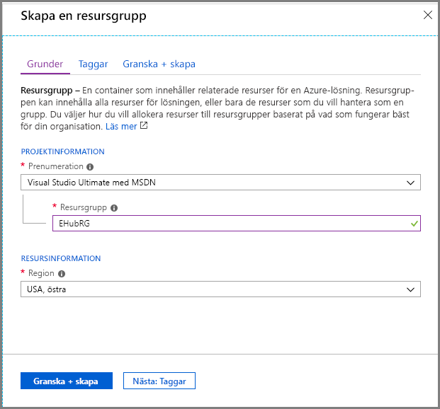
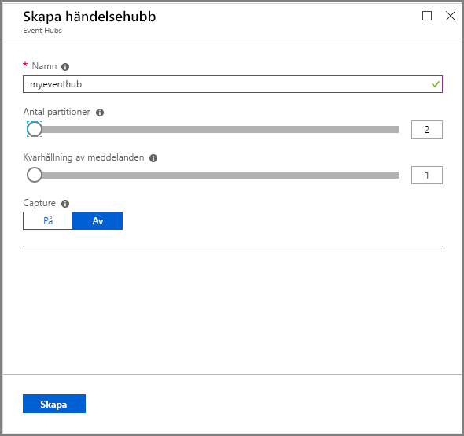

# Snabbstart: Skapa en händelsehubb med hjälp av Azure Portal
Azure Event Hubs är en strömningstjänst för stordata och händelseinmatningstjänst som kan ta emot och bearbeta flera miljoner händelser per sekund. Azure Event Hubs kan bearbeta och lagra händelser, data eller telemetri som produceras av distribuerade program och enheter. Data som skickas till en händelsehubb kan omvandlas och lagras med valfri provider för realtidsanalys eller batchbearbetnings-/lagringsadaptrar. En detaljerad översikt över Event Hubs finns i [Översikt över Event Hubs](event-hubs-about.md) och [Event Hubs-funktioner](event-hubs-features.md).

I den här snabbstarten skapar du en händelsehubb med hjälp av [Azure-portalen](https://portal.azure.com).

## Nödvändiga komponenter

För att slutföra den här snabbstarten behöver du följande:

- En Azure-prenumeration. Om du inte har ett konto kan du [skapa ett kostnadsfritt konto](https://azure.microsoft.com/free/) innan du börjar.
- [Visual Studio 2017 Update 3 (version 15.3, 26730.01)](https://www.visualstudio.com/vs) eller senare.
- [SDK för .NET Standard](https://www.microsoft.com/net/download/windows) version 2.0 eller senare.

## Skapa en resursgrupp

En resursgrupp är en logisk samling Azure-resurser. Alla resurser distribueras och hanteras i en resursgrupp. Skapa en resursgrupp på följande sätt:

1. Logga in på [Azure-portalen](https://portal.azure.com).
2. Klicka på **Resursgrupper** i det vänstra navigeringsfönstret. Klicka sedan på **Lägg till**.

   

2. Ange ett unikt namn för resursgruppen. Systemet kontrollerar direkt om namnet är tillgängligt i den valda Azure-prenumerationen.

3. I **Prenumeration** klickar du på namnet på den Azure-prenumeration som du vill skapa resursgruppen i.

4. Välj en geografisk plats för resursgruppen.

5. Klicka på **Skapa**.

   

## Skapa ett Event Hubs-namnområde

Ett Event Hubs-namnområde innehåller en unik omfattningscontainer som refereras till av dess fullständigt kvalificerade domännamn, där du skapar en eller flera händelsehubbar. Gör följande om du vill skapa ett namnområde i din resursgrupp med Portal:

1. I Azure-portalen klickar du på **Skapa en resurs** högst upp till vänster på skärmen.

2. Klicka på **Sakernas Internet** och sedan på **Event Hubs**.

3. Under **Skapa namnområde** anger du ett namn för namnområdet. Systemet kontrollerar omedelbart om namnet är tillgängligt.

   

4. När du har kontrollerat att namnområdet är tillgängligt väljer du prisnivå (Basic eller Standard). Välj även en Azure-prenumeration, resursgrupp och plats där du vill skapa resursen.
 
5. Klicka på **Skapa** för att skapa namnområdet. Du kan behöva vänta några minuter på att systemet ska bli klart med att etablera resurserna.
6. Välj **Aviseringar** och välj sedan **distributionen** med samma namn som namnet på händelsehubbens namnområde. 

   
6. Välj händelsehubbens namnområde i listan över resurser som skapats i distributionen. 

   
7. På sidan **Event Hubs-namnområde** väljer du **Policyer för delad åtkomst** och klickar sedan på **RootManageSharedAccessKey**.
    
8. Klicka på kopieringsknappen för att kopiera anslutningssträngen **RootManageSharedAccessKey** till Urklipp. Spara den här anslutningssträngen på en tillfällig plats, till exempel i Anteckningar, för senare användning.
    
## Skapa en händelsehubb

Gör följande om du vill skapa en händelsehubb i namnområdet:

1. På sidan Event Hubs-namnområde väljer du **Event Hubs**.
   
    

1. Klicka på **+ Event Hub** längst upp i fönstret.
   
    
1. Skriv ett namn för din händelsehubb och klicka sedan på **Skapa**.
   
    

Grattis! Du har skapat ett Event Hubs-namnområde och en händelsehubb i namnområdet med Portal. 

## Nästa steg

I den här artikeln har du skapat en resursgrupp, en Event Hubs-namnrymd och en händelsehubb. Stegvisa instruktioner för att skicka händelser till eller ta emot händelser från en händelsehubb finns i följande självstudier:  

- **Skicka händelser till en händelsehubb**: [.NET Standard](event-hubs-dotnet-standard-getstarted-send.md), [.NET Framework](event-hubs-dotnet-framework-getstarted-send.md), [Java](event-hubs-java-get-started-send.md), [Python](event-hubs-python-get-started-send.md), [Node.js](event-hubs-node-get-started-send.md), [Go](event-hubs-go-get-started-send.md), [C](event-hubs-c-getstarted-send.md)
- **Ta emot händelser från en händelsehubb**: [.NET Standard](event-hubs-dotnet-standard-getstarted-receive-eph.md), [.NET Framework](event-hubs-dotnet-framework-getstarted-receive-eph.md), [Java](event-hubs-java-get-started-receive-eph.md), [Python](event-hubs-python-get-started-receive.md), [Node.js](event-hubs-node-get-started-receive.md), [Go](event-hubs-go-get-started-receive-eph.md), [Apache Storm](event-hubs-storm-getstarted-receive.md)

[Azure portal]: https://portal.azure.com/
[3]: ./media/event-hubs-quickstart-portal/sender1.png
[4]: ./media/event-hubs-quickstart-portal/receiver1.png
