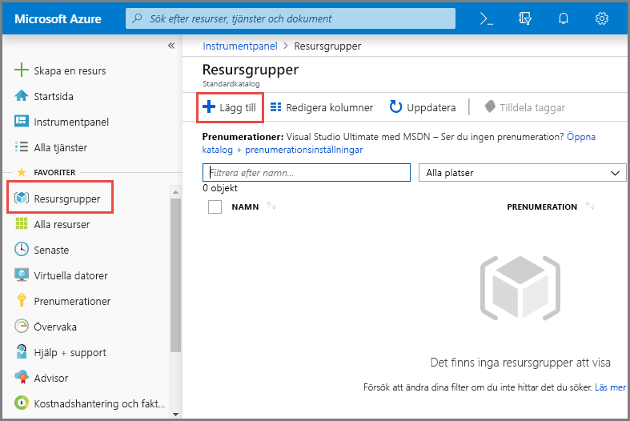
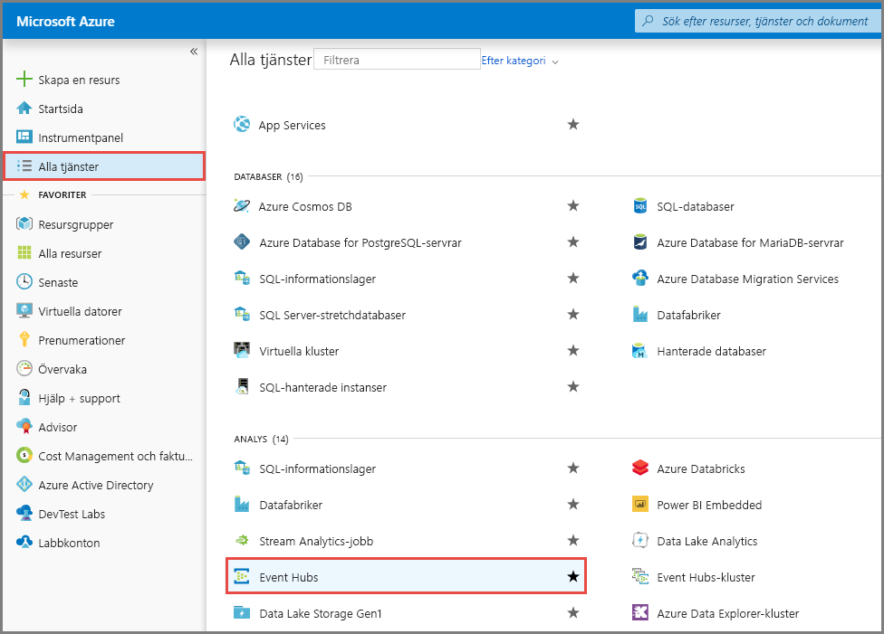
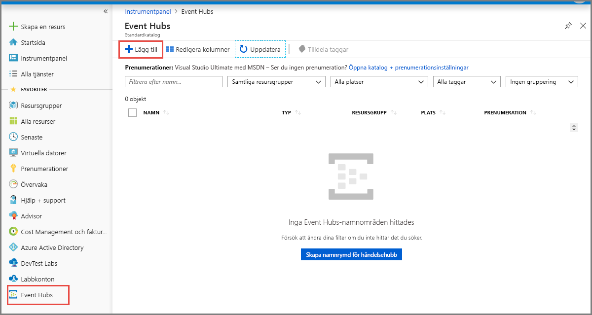
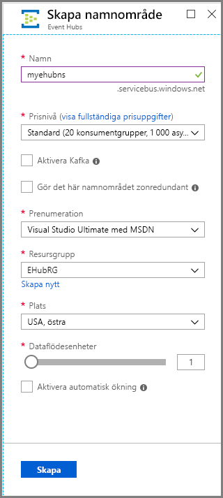
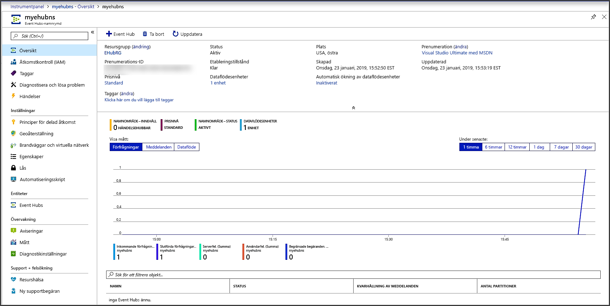
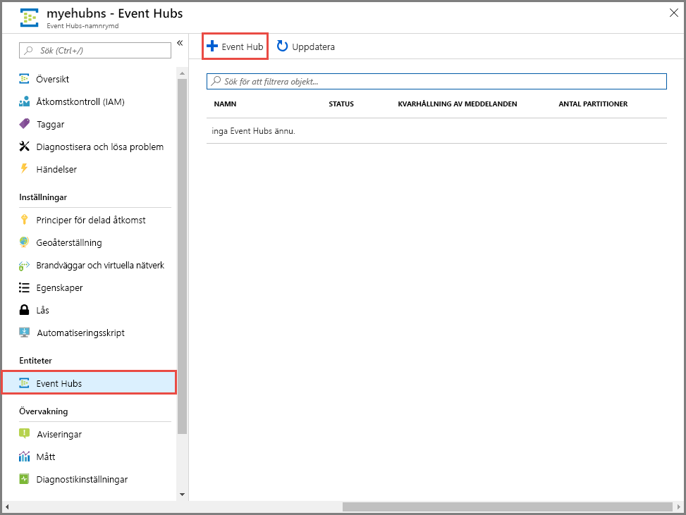
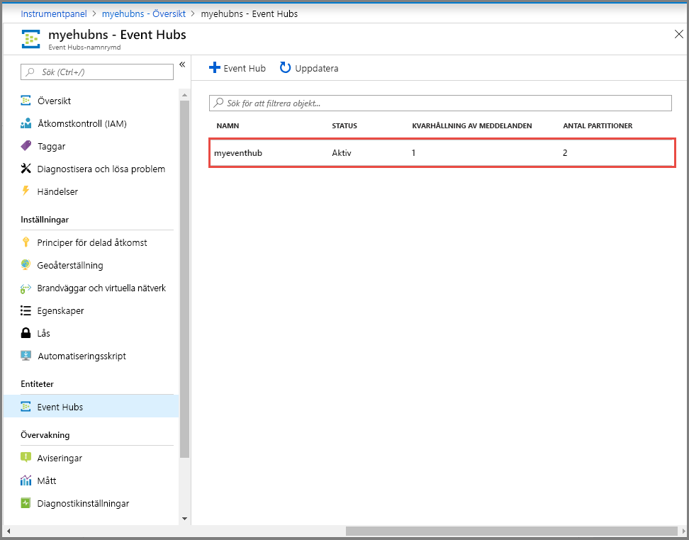

# Snabbstart: Skapa en händelsehubb med hjälp av Azure Portal
Azure Event Hubs är en strömningstjänst för stordata och händelseinmatningstjänst som kan ta emot och bearbeta flera miljoner händelser per sekund. Event Hubs kan bearbeta och lagra händelser, data eller telemetri som producerats av distribuerade program och enheter. Data som skickas till en händelsehubb kan omvandlas och lagras med valfri provider för realtidsanalys eller batchbearbetnings-/lagringsadapter. En detaljerad översikt över Event Hubs finns i [Översikt över Event Hubs](event-hubs-about.md) och [Event Hubs-funktioner](event-hubs-features.md).

I den här snabbstarten skapar du en händelsehubb med hjälp av [Azure-portalen](https://portal.azure.com).

## Krav

För att slutföra den här snabbstarten behöver du följande:

- En Azure-prenumeration. Om du inte har ett konto kan du [skapa ett kostnadsfritt konto](https://azure.microsoft.com/free/) innan du börjar.
- [Visual Studio 2019)](https://www.visualstudio.com/vs) eller senare.
- [SDK för .NET Standard](https://www.microsoft.com/net/download/windows) version 2.0 eller senare.

## Skapa en resursgrupp

En resursgrupp är en logisk samling Azure-resurser. Alla resurser distribueras och hanteras i en resursgrupp. Så här skapar du en resursgrupp:

1. Logga in på [Azure-portalen](https://portal.azure.com).
2. Klicka på **Resursgrupper** i det vänstra navigeringsfönstret. Klicka sedan på **Lägg till**.

   

2. För **Prenumeration** väljer du namnet på den Azure-prenumeration som du vill skapa resursgruppen i.
3. Ange ett unikt **namn på resursgruppen**. Systemet kontrollerar direkt om namnet är tillgängligt i den valda Azure-prenumerationen.
4. Välj en **region** för resursgruppen.
5. Välj **Granska + Skapa**.

   
6. Välj **Granska ** i fönstret **Granska + Skapa**. 

## Skapa ett Event Hubs-namnområde

Ett Event Hubs-namnområde innehåller en unik omfattningscontainer som refereras till av dess fullständigt kvalificerade domännamn, där du skapar en eller flera händelsehubbar. Gör följande om du vill skapa ett namnområde i din resursgrupp med Portal:

1. I Azure-portalen klickar du på **Skapa en resurs** högst upp till vänster på skärmen.
2. Välj **Alla tjänster** på den vänstra menyn och välj **stjärnan (`*`)** bredvid **Event Hubs** i kategorin **Analytics**. Bekräfta att **Event Hubs** läggs till i **FAVORITER** på den vänstra navigeringsmenyn. 
    
   
3. Välj **Event Hubs** under **FAVORITER** på den vänstra navigeringsmenyn och välj **Lägg till** i verktygsfältet.

   
4. Gör följande på sidan **Skapa namnområde**:
    1. Ange ett **namn** på namnområdet. Systemet kontrollerar omedelbart om namnet är tillgängligt.
    2. Välj **prisnivå** (Basic eller Standard).
    3. Observera att **alternativet Aktivera Kafka** aktiveras automatiskt. Azure Event Hubs ger dig en Kafka-slutpunkt. Med den här slutpunkten kan namnområdet Event Hubs förstå [Apache Kafka-meddelandeprotokoll](https://kafka.apache.org/intro) och API:er. Med den här funktionen kan du kommunicera med dina händelsehubbar på samma sätt som med Kafka-ämnen utan att ändra dina protokollklienter eller köra egna kluster. Event Hubs stöder [Apache Kafka version 1.0](https://kafka.apache.org/10/documentation.html) och senare.
    4. Välj den **prenumeration** som du vill skapa namnområdet i.
    5. Välj en befintlig **resursgrupp** eller skapa en ny resursgrupp. 
    4. Välj en **plats** för namnområdet.
    5. Välj **Skapa**. Du kan behöva vänta några minuter på att systemet blir klar med att etablera resurserna.

       
5. Uppdatera sidan **Händelsehubbar** och se händelsehubbens namnområde. Du kan kontrollera status för skapandet av händelsehubben i aviseringarna. 

    
6. Välj namnområdet. Du kan se startsidan för ditt **Event Hubs-namnområde** i portalen. 

   
    
## Skapa en händelsehubb

Gör följande om du vill skapa en händelsehubb i namnområdet:

1. På sidan Event Hubs-namnområde väljer du **Event Hubs** på den vänstra menyn.
1. Klicka på **+ Event Hub** längst upp i fönstret.
   
    
1. Skriv ett namn för din händelsehubb och klicka sedan på **Skapa**.
   
    
4. Du kan kontrollera status för skapandet av händelsehubben i aviseringarna. När händelsehubben har skapats kan se du den i listan över händelsehubbar som visas på följande bild:

    

Grattis! Du har skapat ett Event Hubs-namnområde och en händelsehubb i namnområdet med Portal. 

## Nästa steg

I den här artikeln har du skapat en resursgrupp, en Event Hubs-namnrymd och en händelsehubb. Stegvisa instruktioner för att skicka händelser till (eller) ta emot händelser från en händelsehubb finns i självstudiekurserna **Skicka och ta emot händelser:** 

- [.NET Core](get-started-dotnet-standard-send-v2.md)
- [Java](get-started-java-send-v2.md)
- [Python](get-started-python-send-v2.md)
- [Javascript](get-started-java-send-v2.md)
- [Kör](event-hubs-go-get-started-send.md)
- [C (skickar endast)](event-hubs-c-getstarted-send.md)
- [Apache Storm (tar endast emot)](event-hubs-storm-getstarted-receive.md)

[Azure portal]: https://portal.azure.com/
[3]: ./media/event-hubs-quickstart-portal/sender1.png
[4]: ./media/event-hubs-quickstart-portal/receiver1.png
