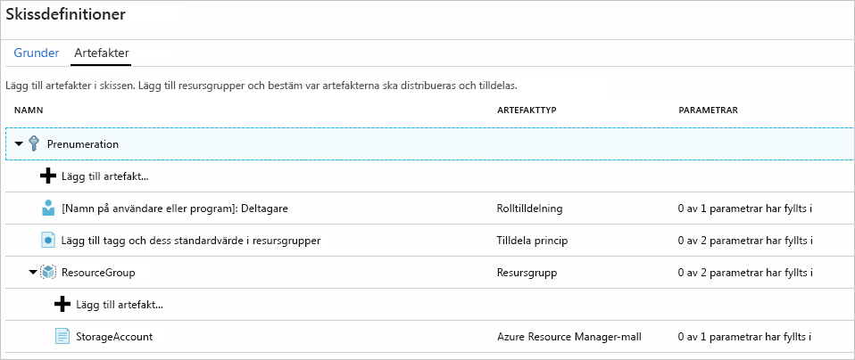
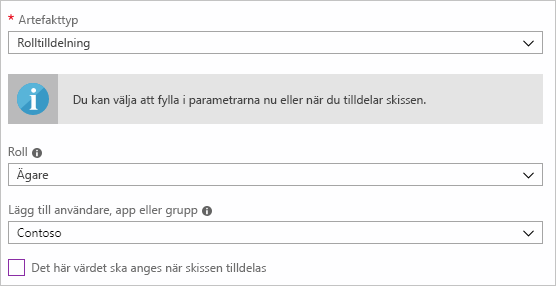
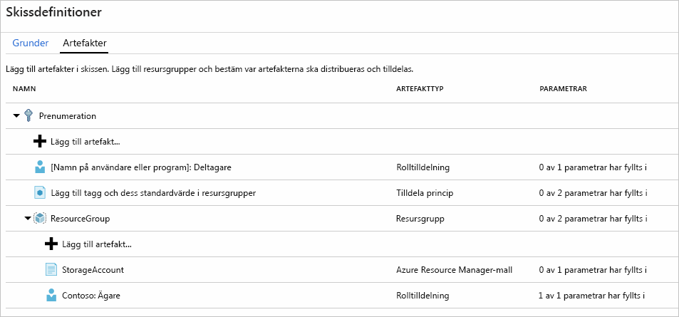

# <a name="quickstart-define-and-assign-a-blueprint-in-the-portal"></a>Snabb start: definiera och tilldela en skiss i portalen

När du lär dig hur du skapar och tilldelar ritningar kan du definiera vanliga mönster för att utveckla återanvändbara och snabbt distributions bara konfigurationer baserat på Azure Resource Manager mallar, principer, säkerhet och mycket annat. I den här självstudien får du lära dig att använda Azure-ritningar för att utföra några av de vanligaste uppgifterna för att skapa, publicera och tilldela en skiss i din organisation. Följande uppgifter är:

## <a name="prerequisites"></a>Förutsättningar

Om du inte har en Azure-prenumeration kan du skapa ett [kostnadsfritt konto](https://azure.microsoft.com/free) innan du börjar.

## <a name="create-a-blueprint"></a>Skapa en skiss

Det första steget när du definierar ett standardmönster för efterlevnad är att skapa en skiss från de tillgängliga resurserna. I det här exemplet skapar du en ny skiss som heter min **skiss** för att konfigurera roll-och princip tilldelningar för prenumerationen. Lägg sedan till en ny resurs grupp och skapa en Resource Manager-mall och roll tilldelning i den nya resurs gruppen.

1. Välj **Alla tjänster** i den vänstra rutan. Sök efter och välj **Skisser**.

1. Välj **skiss definitioner** på sidan till vänster och välj knappen **+ skapa skiss** överst på sidan.

   Eller Välj **skapa** från sidan **komma igång** för att gå direkt till att skapa en skiss.

   

1. Ange ett **skiss namn** , till exempel min **skiss**. (Använd upp till 48 bokstäver och siffror, men inga blank steg eller specialtecken). Lämna **skiss beskrivningen** tom för tillfället.

1. I rutan **definitions plats** väljer du ellipsen till höger, väljer [hanterings gruppen](../management-groups/overview.md) eller prenumerationen där du vill spara skissen och väljer **Välj**.

1. Kontrol lera att informationen är korrekt. Fälten **skiss namn** och **definitions plats** kan inte ändras senare. Välj sedan **Nästa: artefakter** längst ned på sidan eller på fliken **artefakter** högst upp på sidan.

1. Lägg till en roll tilldelning på prenumerations nivån:

   1. Välj raden **+ Lägg till artefakt** under **prenumeration**. Fönstret **Lägg till artefakt** öppnas på höger sida av webbläsaren.

   1. Välj **roll tilldelning** för **artefakt typ**.

   1. Under **roll**väljer du **deltagare**. Lämna rutan **Lägg till användare, app eller grupp** med kryss rutan som anger en dynamisk parameter.

   1. Välj **Lägg** till för att lägga till den här artefakten i skissen.

   

   > [!NOTE]
   > De flesta artefakter stöder parametrar. En parameter som tilldelas ett värde när skissen skapas är en *statisk parameter*. Om parametern tilldelas under skiss tilldelningen, är det en *dynamisk parameter*. Mer information finns [Skissparametrar](./concepts/parameters.md).

1. Lägg till en princip tilldelning på prenumerations nivån:

   1. Välj raden **+ Lägg till artefakt** under roll tilldelnings artefakten.

   1. Välj **princip tilldelning** för **artefakt typ**.

   1. Ändra **typ** till **inbyggd**. I **Sök**anger du **tagg**.

   1. Klicka på **Sök** om du vill genomföra filtrering. Välj **Lägg till tagg och dess standardvärde till resurs grupper**.

   1. Välj **Lägg** till för att lägga till den här artefakten i skissen.

1. Välj raden för princip tilldelningens **Lägg till-tagg och dess standardvärde till resurs grupper**.

1. Fönstret för att tillhandahålla parametrar till artefakten som en del av skiss definitionen öppnas och gör det möjligt att ange parametrar för alla tilldelningar (statiska parametrar) baserat på den här skissen i stället för under tilldelning (dynamiska parametrar). I det här exemplet används dynamiska parametrar under skiss tilldelningen, så lämna standardvärdena och välj **Avbryt**.

1. Lägg till en resurs grupp på prenumerations nivån:

   1. Välj raden **+ Lägg till artefakt** under **prenumeration**.

   1. Välj **resurs grupp** för **artefakt typ**.

   1. Lämna rutorna för **artefakt visnings namn**, **resurs grupp namn**och **plats** tomma, men se till att kryss rutan är markerad för varje parameter egenskap för att göra dem dynamiska parametrar.

   1. Välj **Lägg** till för att lägga till den här artefakten i skissen.

1. Lägg till en mall under resurs gruppen:

   1. Välj raden **+ Lägg till artefakt** under posten **ResourceGroup** .

   1. Välj **Azure Resource Manager mall** för **artefakt typ**, ange **artefakt visnings namnet** till **StorageAccount**och lämna **beskrivningen** tom.

   1. Klistra in följande Resource Manager-mall i redigeringsrutan på fliken **Mall**.
      När du har klistrat in mallen väljer du fliken **parametrar** och Observera att parametrarna **storageAccountType** och **location** har identifierats. Varje parameter identifierades automatiskt och fylldes i, men konfigureras som en dynamisk parameter.

      > [!IMPORTANT]
      > Om du importerar mallen kontrollerar du att filen endast är JSON och inkluderar inte HTML. När du pekar på en URL på GitHub bör du se till att du har valt **RAW** för att hämta den rena JSON-filen och inte den som är FIGURSATT med HTML för visning på GitHub. Ett fel inträffar om den importerade mallen inte är ren JSON.

      ```json
      {
          "$schema": "https://schema.management.azure.com/schemas/2015-01-01/deploymentTemplate.json#",
          "contentVersion": "1.0.0.0",
          "parameters": {
              "storageAccountType": {
                  "type": "string",
                  "defaultValue": "Standard_LRS",
                  "allowedValues": [
                      "Standard_LRS",
                      "Standard_GRS",
                      "Standard_ZRS",
                      "Premium_LRS"
                  ],
                  "metadata": {
                      "description": "Storage Account type"
                  }
              },
              "location": {
                  "type": "string",
                  "defaultValue": "[resourceGroup().location]",
                  "metadata": {
                      "description": "Location for all resources."
                  }
              }
          },
          "variables": {
              "storageAccountName": "[concat('store', uniquestring(resourceGroup().id))]"
          },
          "resources": [{
              "type": "Microsoft.Storage/storageAccounts",
              "name": "[variables('storageAccountName')]",
              "location": "[parameters('location')]",
              "apiVersion": "2018-07-01",
              "sku": {
                  "name": "[parameters('storageAccountType')]"
              },
              "kind": "StorageV2",
              "properties": {}
          }],
          "outputs": {
              "storageAccountName": {
                  "type": "string",
                  "value": "[variables('storageAccountName')]"
              }
          }
      }
      ```

   1. Avmarkera kryss rutan **storageAccountType** och Observera att den nedrullningsbara listan bara innehåller värden som ingår i Resource Manager-mallen under **allowedValues**. Markera rutan för att återställa den till en dynamisk parameter.

   1. Välj **Lägg** till för att lägga till den här artefakten i skissen.

   

1. Din färdiga skiss bör se ut som i det följande. Observera att varje artefakt har  **_x_ out of _y_ -parametrar** som är ifylld i kolumnen **parametrar** . De dynamiska parametrarna anges under varje tilldelning av skissen.

   

1. Nu när alla planerade artefakter har lagts till väljer du **Spara utkast** längst ned på sidan.

## <a name="edit-a-blueprint"></a>Redigera en skiss

I [skapa en skiss](#create-a-blueprint)angav du inte någon beskrivning eller lägger till roll tilldelningen i den nya resurs gruppen. Du kan åtgärda båda genom att följa dessa steg:

1. Välj **Skissdefinitioner** till vänster på sidan.

1. I listan över skisser högerklickar du på den som du skapade tidigare och väljer **Redigera skiss**.

1. I **Skissbeskrivning** anger du information om skissen och de artefakter som ingår i den. I det här fallet anger du något som: **den här skissen anger tag-princip och roll tilldelning för prenumerationen, skapar en ResourceGroup och distribuerar en resurs mal len och roll tilldelningen till den ResourceGroup.**

1. Välj **Nästa: artefakter** längst ned på sidan eller på fliken **artefakter** högst upp på sidan.

1. Lägg till en roll tilldelning under resurs gruppen:

   1. Välj raden **+ Lägg till artefakt** direkt under posten **ResourceGroup** .

   1. Välj **roll tilldelning** för **artefakt typ**.

   1. Under **roll**väljer du **ägare**och avmarkerar kryss rutan under rutan **Lägg till användare, app eller grupp** .

   1. Sök efter och välj en användare, app eller grupp som ska läggas till. Den här artefakten använder en statisk parameter som anges i varje tilldelning av den här skissen.

   e. Välj **Lägg** till för att lägga till den här artefakten i skissen.

   

1. Din färdiga skiss bör se ut som i det följande. Observera att den nyligen tillagda roll tilldelningen visar **1 av 1 parametrar har fyllts**i. Det innebär att det är en statisk parameter.

   

1. Välj **Spara utkast** nu som det har uppdaterats.

## <a name="publish-a-blueprint"></a>Publicera en skiss

Nu när alla de planerade artefakterna har lagts till i skissen är det dags att publicera den.
Med publicering blir skissen tillgänglig för att tilldelas en prenumeration.

1. Välj **Skissdefinitioner** till vänster på sidan.

1. Högerklicka på den som du skapade tidigare i listan med skisser och välj **publicera skiss**.

1. I fönstret som öppnas anger du en **version** (bokstäver, siffror och bindestreck med en maximal längd på 20 tecken), till exempel **v1**. Du kan också ange text i **ändrings anteckningar**, till exempel **första publiceringen**.

1. Välj **publicera** längst ned på sidan.

## <a name="assign-a-blueprint"></a>Tilldela en skiss

När en skiss har publicerats kan den tilldelas en prenumeration. Tilldela skissen som du skapade till en av prenumerationerna under din hanterings grupp hierarki. Om skissen sparas till en prenumeration kan den endast tilldelas till den prenumerationen.

1. Välj **Skissdefinitioner** till vänster på sidan.

1. I listan över skisser högerklickar du på den som du skapade tidigare (eller väljer ellipsen) och väljer **tilldela skiss**.

1. På sidan **tilldela skiss** i list rutan **prenumeration** väljer du de prenumerationer som du vill distribuera den här skissen till.

   Om det finns Enterprise-erbjudanden som stöds tillgängliga från [Azure-fakturering](../../billing/index.md) aktiveras länken **Skapa nytt** under rutan **Prenumeration**. Följ de här stegen:

   1. Välj länken **Skapa nytt** för att skapa en ny prenumeration i stället för att välja befintliga.

   1. Ange ett **Visningsnamn** för den nya prenumerationen.

   1. Välj det tillgängliga **erbjudandet** i list rutan.

   1. Använd ellipsen för att välja den [hanterings grupp](../management-groups/overview.md) som prenumerationen ska vara underordnad.

   1. Välj **Skapa** längst ned på sidan.

   

   > [!IMPORTANT]
   > Den nya prenumerationen skapas direkt efter att du har valt **skapa**.

   > [!NOTE]
   > En tilldelning skapas för varje prenumeration som du väljer. Du kan göra ändringar i en enskild prenumerations tilldelning vid ett senare tillfälle utan att framtvinga ändringar i resten av de valda prenumerationerna.

1. Ange ett unikt namn för tilldelningen för **tilldelnings namn**.

1. I **plats**väljer du en region för det hanterade identitet-och prenumerations objekt som ska skapas i. Azure Blueprint använder den här hanterade identiteten för att distribuera alla artefakter i den tilldelade skissen. Mer information finns i [Hanterade identiteter för Azure-resurser](../../active-directory/managed-identities-azure-resources/overview.md).

1. Lämna List rutan för **skiss definitions versions** val av **publicerade** versioner på **v1** -posten. (Standardinställningen är den senast publicerade versionen.)

1. Låt standardvärdet **Lås inte** vara för **Lås tilldelning**. Mer information finns i [resurs låsning för ritningar](./concepts/resource-locking.md).

   

1. Under **hanterad identitet**lämnar du standardvärdet **system Assigned**.

1. För prenumerationsnivåns rolltilldelning **[Användargrupp eller programnamn]: Deltagare**, så sök efter och välj en användare, en app eller grupp.

1. För princip tilldelningen på prenumerations nivå anger du **taggnamnet** till **CostCenter** och **ContosoIT**.

1. För **ResourceGroup**anger du **namnet** på **STORAGEACCOUNT** och en **plats** för **USA, östra 2** i list rutan.

   > [!NOTE]
   > För varje artefakt som du lagt till under resurs gruppen under skiss definitionen, dras den artefakten till att överensstämma med den resurs grupp eller det objekt som du ska distribuera den med.
   > Artefakter som antingen inte tar parametrar eller som inte har några parametrar som ska definieras vid tilldelningen visas bara för sammanhangsbaserad information.

1. På Azure Resource Manager mal len **StorageAccount**väljer du **Standard_GRS** för parametern **storageAccountType** .

1. Läs rutan information längst ned på sidan och välj sedan **tilldela**.

## <a name="track-deployment-of-a-blueprint"></a>Spåra distributionen av en skiss

När en skiss har tilldelats till en eller flera prenumerationer händer två saker:

- Skissen läggs till på sidan **tilldelade ritningar** för varje prenumeration.
- Processen för att distribuera alla artefakter som definieras av skissen börjar.

Nu när skissen har tilldelats en prenumeration kontrollerar du förloppet för distributionen:

1. Välj **Tilldelade skisser** på sidan till vänster.

1. I listan över skisser högerklickar du på den som du tidigare tilldelade och väljer **Visa tilldelnings information**.

   

1. På sidan **skiss tilldelning** kontrollerar du att alla artefakter lyckades distribueras och att det inte fanns några fel under distributionen. Om det uppstår fel, se [fel sökning av ritningar](./troubleshoot/general.md) för att avgöra vad som gått fel.

## <a name="clean-up-resources"></a>Rensa resurser

### <a name="unassign-a-blueprint"></a>Ta bort en skisstilldelning

Om du inte längre behöver en skiss tilldelning tar du bort den från en prenumeration. Skissen kan ha ersatts av en nyare skiss med uppdaterade mönster, principer och design. När en skiss tas bort blir artefakterna som tilldelats som en del av skissen kvar. Följ dessa steg om du vill ta bort en skisstilldelning:

1. Välj **Tilldelade skisser** på sidan till vänster.

1. I listan över ritningar väljer du den skiss som du vill ta bort tilldelningen för. Välj sedan knappen **ta bort tilldelning av skisser** högst upp på sidan.

1. Läs bekräftelse meddelandet och välj sedan **OK**.

### <a name="delete-a-blueprint"></a>Ta bort en skiss

1. Välj **Skissdefinitioner** till vänster på sidan.

1. Högerklicka på den skiss som du vill ta bort och välj **ta bort skiss**. Välj **Ja** i bekräftelse dialog rutan.

> [!NOTE]
> Om du tar bort en skiss i den här metoden raderas även alla publicerade versioner av den valda skissen.
> Om du vill ta bort en enda version öppnar du skissen, väljer fliken **publicerade versioner** , väljer den version som du vill ta bort och väljer sedan **ta bort den här versionen**. Du kan inte heller ta bort en skiss förrän du har tagit bort all skiss tilldelning av skiss definitionen.

## <a name="next-steps"></a>Nästa steg

I den här snabb starten har du skapat, tilldelat och tagit bort en skiss med Azure Portal. Om du vill veta mer om Azure-ritningar kan du fortsätta till ritnings livs cykel artikeln.

> [!div class="nextstepaction"]
> [Lär dig mer om skiss livs cykeln](./concepts/lifecycle.md)