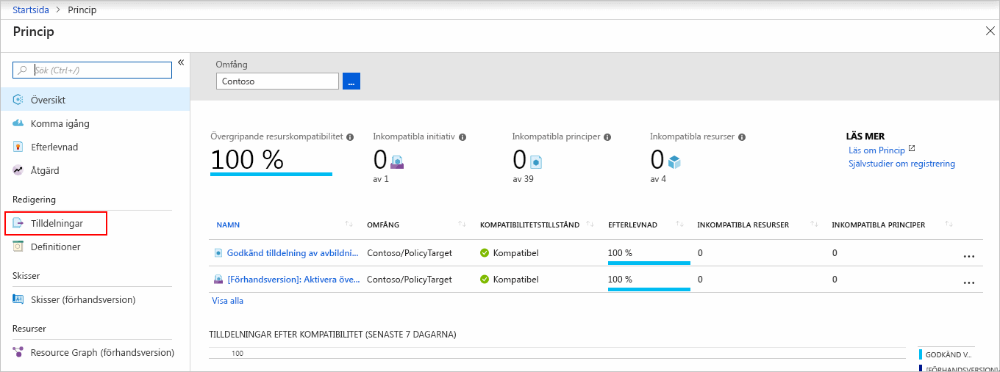
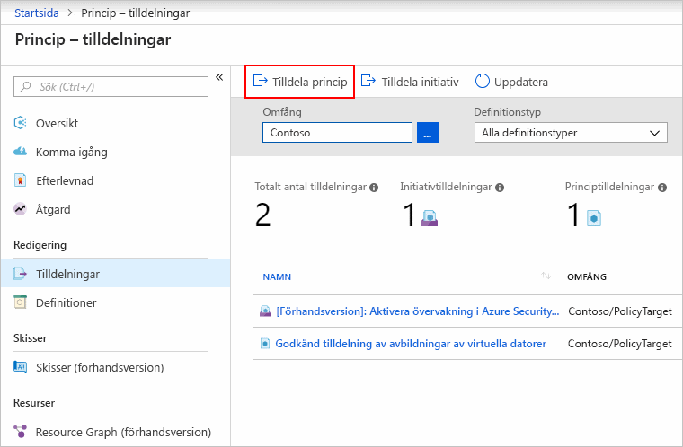
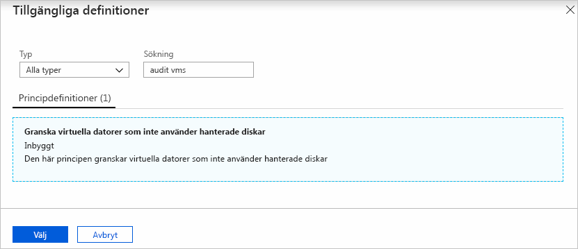
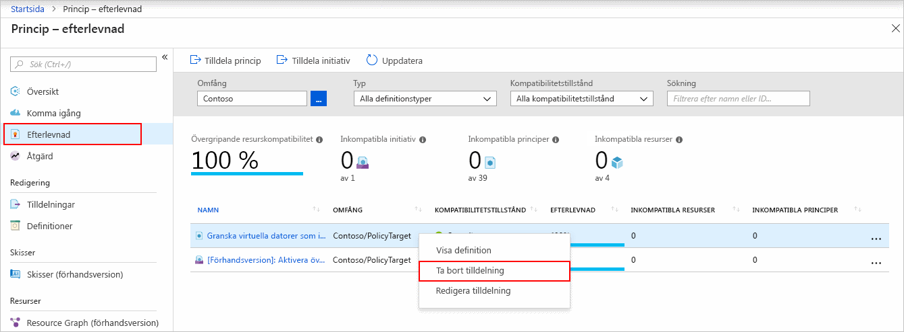

# Quickstart: Create a policy assignment to identify non-compliant resources

Det första steget mot att förstå kompatibilitet i Azure är att identifiera dina resursers status.
Denna snabbstart vägleder dig genom processen för att skapa en principtilldelning som identifierar virtuella datorer som inte använder hanterade diskar.

Efter den här genomgången kommer du att kunna identifiera virtuella datorer som inte använder hanterade diskar. De är *inkompatibla* med principtilldelningen.

Om du inte har en Azure-prenumeration kan du skapa ett [kostnadsfritt](https://azure.microsoft.com/free/) konto innan du börjar.

## Skapa en principtilldelning

I den här snabbstarten skapar du en principtilldelning och tilldelar policydefinitionen *Granska virtuella datorer som inte använder hanterade diskar*.

1. Starta Azure Policy-tjänsten i Azure Portal genom att klicka på **Alla tjänster** och sedan söka efter och välja **Princip**.

   

1. Välj **Tilldelningar** till vänster på sidan Azure Policy. En tilldelning är en princip som tilldelats ett specifikt område.

   

1. Välj **Tilldela princip** längst upp på sidan **Princip – Tilldelningar**.

   

1. På sidan **Tilldela princip** väljer du **Omfång** genom att klicka på ellipsen och antingen välja en hanteringsgrupp eller en prenumeration. Du kan även välja en resursgrupp. En omfattning avgör vilka resurser eller grupper med resurser som principtilldelningen används på. Klicka sedan på **Välj** längst ned på sidan **Omfång**.

   I det här exemplet används **Contoso-prenumerationen**. Din prenumeration skiljer sig.

1. Resurser som kan uteslutas baserat på **omfång**. **Undantag** startar på en nivå som är lägre än nivån för **Omfång**. **Undantag** är valfria, så lämna det tomt just nu.

1. Välj ellipsen **Principdefinition** för att öppna listan med tillgängliga definitioner. Azure Policy har inbyggda principdefinitioner som du kan använda. Många är tillgängliga, till exempel:

   - Framtvinga tagg och dess värde
   - Använd tagg och dess värde
   - Kräv SQL Server version 12.0

   For a partial list of available built-in policies, see [Azure Policy samples](./samples/index.md).

1. Sök igenom listan med principdefinitioner för att hitta definitionen *Granska virtuella datorer som inte använder hanterade diskar*. Klicka på principen och sedan på **Välj**.

   

1. **Tilldelningsnamn** fylls i automatiskt med namnet på principen som du valde, men du kan ändra det om du vill. I det här exemplet lämnar du *Granska virtuella datorer som inte använder hanterade diskar*. Du kan också lägga till en valfri **Beskrivning**. Beskrivningen innehåller information om den här principtilldelningen.
   **Assigned by** (Tilldelats av) anges automatiskt baserat på vem som är inloggad. Det här fältet är valfritt, så du kan ange anpassade värden.

1. Lämna **Skapa en hanterad identitet** avmarkerat. Den här rutan _måste_ markeras när principen eller initiativet omfattar en princip med effekten [deployIfNotExists](./concepts/effects.md#deployifnotexists). Eftersom principen som används för den här snabbstarten inte gör det kan du lämna det tomt. Mer information finns i avsnitten om [hanterade identiteter](../../active-directory/managed-identities-azure-resources/overview.md) och [hur reparationssäkerhet fungerar](./how-to/remediate-resources.md#how-remediation-security-works).

1. Klicka på **Tilldela**.

You're now ready to identify non-compliant resources to understand the compliance state of your environment.

## Identifiera icke-kompatibla resurser

Välj **Efterlevnad** till vänster på sidan. Leta sedan upp principtilldelningen **Granska virtuella datorer som inte använder hanterade diskar** som du skapade.

Om det finns befintliga resurser som inte är kompatibla med denna nya tilldelning visas de under **Icke-kompatibla resurser**.

När ett villkor utvärderas mot de befintliga resurserna och visas vara korrekt markeras dessa resurser som inkompatibla med principen. Följande tabell visar hur olika principåtgärder fungerar med villkorsutvärderingen för den efterlevnadsstatus som blir resultatet. Although you don't see the evaluation logic in the Azure portal, the compliance state results are shown. Resultatet för kompatibilitetstillståndet är antingen kompatibla eller icke-kompatibla resurser.

| **Resurstillstånd** | **Effekt** | **Principutvärdering** | **Kompatibilitetstillstånd** |
| --- | --- | --- | --- |
| Finns | Deny, Audit, Append\*, DeployIfNotExist\*, AuditIfNotExist\* | Sant | Icke-kompatibel |
| Finns | Deny, Audit, Append\*, DeployIfNotExist\*, AuditIfNotExist\* | Falskt | Uppfyller kraven |
| Nytt | Audit, AuditIfNotExist\* | Sant | Icke-kompatibel |
| Nytt | Audit, AuditIfNotExist\* | Falskt | Uppfyller kraven |

\* För åtgärderna Append, DeployIfNotExist och AuditIfNotExist måste IF-instruktionen är TRUE.
Åtgärderna kräver också att villkoret Finns är FALSE för att vara icke-kompatibla. När det är TRUE utlöser IF-villkoret utvärdering av villkoret Finns för de relaterade resurserna.

## Rensa resurser

Följ dessa steg för att ta bort tilldelningen som skapades:

1. Välj **Efterlevnad** (eller **Tilldelningar**) till vänster på sidan Azure Policy och leta upp principtilldelningen **Granska virtuella datorer som inte använder hanterade diskar** som du skapade.

1. Högerklicka på principtilldelningen **Granska virtuella datorer som inte använder hanterade diskar** och välj **Ta bort tilldelning**

   

## Nästa steg

I den här snabbstarten har du tilldelat en principdefinition till ett omfång och utvärderat dess efterlevnadsrapport.
Principdefinitionen kontrollerar att alla resurser i omfånget är kompatibla och identifierar vilka som inte är det.

Om du vill ha mer information om tilldelning av principer för att validera att de nya resurserna är kompatibla fortsätter du till självstudien för att:

> [!div class="nextstepaction"]
> [Skapa och hantera principer](./tutorials/create-and-manage.md)