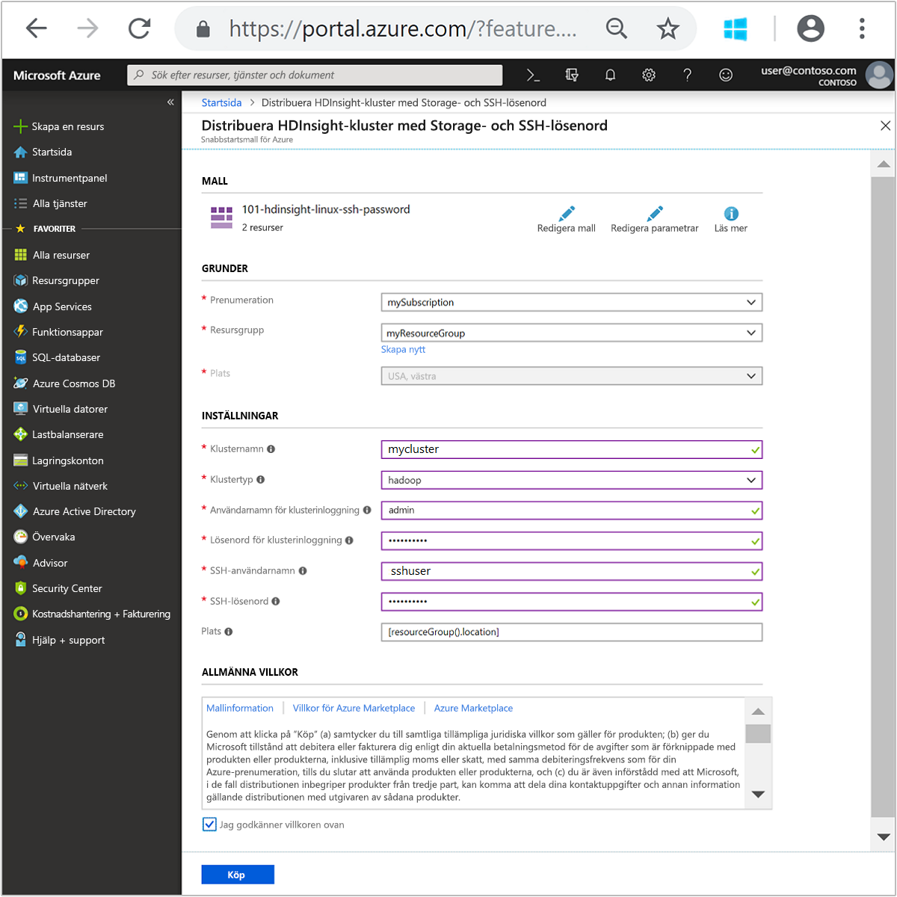

# Snabb start: skapa Apache Hadoop kluster i Azure HDInsight med Resource Manager-mall

I den här snabb starten använder du en Azure Resource Manager-mall för att skapa ett [Apache Hadoop](./apache-hadoop-introduction.md) kluster i Azure HDInsight. Hadoop var det ursprungliga ramverket med öppen källkod för distribuerad bearbetning och analys av stor data uppsättningar i kluster. Hadoop-eko systemet innehåller relaterad program vara och verktyg, inklusive Apache Hive, Apache HBase, Spark, Kafka och många andra.

[!INCLUDE [About Azure Resource Manager](../../../includes/resource-manager-quickstart-introduction.md)]
  
För närvarande innehåller HDInsight [sju olika klustertyper](../hdinsight-overview.md#cluster-types-in-hdinsight). Varje typ av kluster har stöd för olika komponentuppsättningar. Samtliga klustertyper stöder Hive. En lista över stödda komponenter som hanteras i HDInsight finns i [Vad är nytt i de Hadoop-klusterversioner som tillhandahålls av HDInsight?](../hdinsight-component-versioning.md)  

Om du inte har en Azure-prenumeration kan du skapa ett [kostnadsfritt](https://azure.microsoft.com/free/?WT.mc_id=A261C142F) konto innan du börjar.

## Skapa ett Apache Hadoop-kluster

### Granska mallen

Mallen som används i den här snabb starten är från [Azure snabb starts-mallar](https://github.com/Azure/azure-quickstart-templates/tree/master/101-hdinsight-linux-ssh-password).

:::code language="json" source="~/quickstart-templates/101-hdinsight-linux-ssh-password/azuredeploy.json" range="1-148":::

Två Azure-resurser definieras i mallen:

* [Microsoft. Storage/storageAccounts](https://docs.microsoft.com/azure/templates/microsoft.storage/storageaccounts): skapa ett Azure Storage-konto.
* [Microsoft. HDInsight/kluster](https://docs.microsoft.com/azure/templates/microsoft.hdinsight/clusters): skapa ett HDInsight-kluster.

### Distribuera mallen

1. Klicka på knappen **distribuera till Azure** nedan för att logga in på Azure och öppna Resource Manager-mallen.

    

1. Ange eller välj följande värden:

    |Egenskap  |Beskrivning  |
    |---------|---------|
    |Prenumeration|I list rutan väljer du den Azure-prenumeration som används för klustret.|
    |Resursgrupp|Välj din befintliga resurs grupp i list rutan eller Välj **Skapa ny**.|
    |Plats|Värdet fylls i automatiskt med den plats som används för resurs gruppen.|
    |Klusternamn|Ange ett globalt unikt namn. Använd bara gemena bokstäver och siffror för den här mallen.|
    |Typ av kluster | Välj **Hadoop**. |
    |Användarnamn för klusterinloggning|Ange användar namnet, standard är **administratör**.|
    |Lösenord för klusterinloggning|Ange ett lösen ord. Lösen ordet måste bestå av minst 10 tecken och måste innehålla minst en siffra, en versal och en gemen bokstav, ett icke-alfanumeriskt tecken (förutom tecknen "" "). |
    |Användar namn för SSH|Ange användar namnet, standard är **sshuser**|
    |SSH-lösenord|Ange lösen ordet.|

    Vissa egenskaper har hårdkodats i mallen.  Du kan konfigurera dessa värden från mallen. Fler förklaringar av dessa egenskaper finns i [Skapa Apache Hadoop-kluster i HDInsight](../hdinsight-hadoop-provision-linux-clusters.md).

    > [!NOTE]  
    > De värden som du anger måste vara unika och bör följa riktlinjerna för namngivning. Mallen utför inte några verifieringskontroller. Om de värden som du anger redan används, eller inte följer riktlinjerna, får du ett felmeddelande när du har skickat mallen.  

    

1. Granska de **allmänna**villkoren. Välj sedan **Jag accepterar villkoren som anges ovan**och **köp**. Du får ett meddelande om att distributionen pågår. Det tar cirka 20 minuter att skapa ett kluster.

## Granska distribuerade resurser

När klustret har skapats får du ett meddelande om att **distributionen har slutförts** med en **gå till resurs** länken. På sidan Resursgrupp visas en lista över ditt nya HDInsight-kluster och standardlagringsutrymmet som är associerat till klustret. Varje kluster har ett [Azure Storage](../hdinsight-hadoop-use-blob-storage.md) konto eller ett beroende för ett [Azure Data Lake Storage konto](../hdinsight-hadoop-use-data-lake-store.md) . Det kallas för standard lagrings kontot. HDInsight-klustret och dess standard lagrings konto måste samplaceras i samma Azure-region. Om du tar bort kluster tas inte lagrings kontot bort.

> [!NOTE]  
> För andra metoder för att skapa kluster och förstå de egenskaper som används i den här snabb starten, se [skapa HDInsight-kluster](../hdinsight-hadoop-provision-linux-clusters.md).

## Rensa resurser

När du har slutfört snabb starten kanske du vill ta bort klustret. Med HDInsight lagras dina data i Azure Storage, så att du på ett säkert sätt kan ta bort ett kluster när det inte används. Du debiteras också för ett HDInsight-kluster, även när det inte används. Eftersom avgifterna för klustret är flera gånger mer än avgifterna för lagring, är det ekonomiskt klokt att ta bort kluster när de inte används.

> [!NOTE]  
> Om du *omedelbart* fortsätter till nästa kurs för att lära dig hur man kör ETL-åtgärder med Hadoop på HDInsight vill du kanske låta klustret köra vidare. Detta beror på att du i självstudien måste skapa ett Hadoop-kluster igen. Men om du inte tänker göra nästa kurs direkt måste du ta bort klustret nu.

Från Azure Portal, navigera till klustret och välj **ta bort**.

Du kan också välja resursgruppnamnet för att öppna resursgruppsidan. Välj sedan **Ta bort resursgrupp**. Genom att ta bort resurs gruppen tar du bort både HDInsight-klustret och standard lagrings kontot.

## Nästa steg

I den här snabb starten har du lärt dig hur du skapar ett Apache Hadoop kluster i HDInsight med hjälp av en Resource Manager-mall. I nästa artikel får du lära dig hur du utför en extraktions-, transformations- eller inläsningsåtgärd (ETL) med Hadoop på HDInsight.

> [!div class="nextstepaction"]
> [Extrahera, transformera och läsa in data med interaktiv fråga på HDInsight](../interactive-query/interactive-query-tutorial-analyze-flight-data.md)
