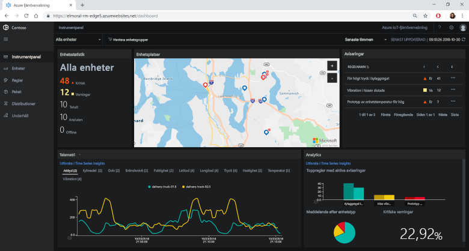

# Vad är Azure IoT-lösningsacceleratorer?

En molnbaserad IoT-lösning använder normalt anpassad kod och molntjänster för att hantera anslutningsmöjligheter för enheter, databearbetning och -analys samt presentation.

IoT-lösningsacceleratorer är kompletta och redo att distribuera IoT-lösningar som implementerar vanliga IoT-scenarier. Scenarierna omfattar fjärrövervakning, ansluten fabrik, förebyggande underhåll och enhetssimulering. När du distribuerar en lösningsaccelerator omfattar distributionen alla molnbaserade tjänster som krävs tillsammans med programkod som krävs.

Lösningsacceleratorerna är startpunkter för dina egna IoT-lösningar. Källkoden för alla lösningsacceleratorer är öppen källkod och finns i GitHub. Vi rekommenderar att du laddar ned och anpassar lösningsacceleratorerna så att de uppfyller dina krav.

Du kan även använda lösningsacceleratorerna som utbildningsverktyg innan du skapar en anpassad IoT-lösning från grunden. Lösningsacceleratorer implementerar beprövade metoder för molnbaserade IoT-lösningar som du måste följa.

Programkoden i varje lösningsaccelerator innehåller en webbapp som du kan använda för att hantera lösningsacceleratorn.

## IoT-scenarier som stöds

Det finns för närvarande fyra lösningsacceleratorer för dig att distribuera:

### Fjärrövervakning

Använd [acceleratorn för fjärrövervakningslösning](iot-accelerators-remote-monitoring-sample-walkthrough.md) för att samla in telemetri från fjärrenheter och kontrollera dem. Exempelenheter omfattar kylsystem installerade på kundernas platser eller valv installerade i fjärrpumpstationer.

Du kan använda instrumentpanelen för fjärrövervakning för att visa telemetri från dina anslutna enheter, etablera nya enheter eller uppgradera den inbyggda programvaran på de anslutna enheterna:

### Ansluten fabrik

Använd den [Fabriksanslutna lösningsacceleratorn](iot-accelerators-connected-factory-features.md) för att samla in telemetri från industriella tillgångar med ett [OPC Unified Architecture](https://opcfoundation.org/about/opc-technologies/opc-ua/)-gränssnitt och kontrollera dem. Industriella tillgångar kan omfatta sammansättnings- och teststationer vid monteringsbandet på en fabrik.

Du kan använda instrumentpanelen för ansluten fabrik för att övervaka och hantera dina industrienheter:

### Förutsägande underhåll

Använd [Lösningsacceleratorn för förutsägande underhåll](iot-accelerators-predictive-walkthrough.md) för att förutsäga när en det förväntas bli fel på enheten så att du kan utföra underhåll innan enheten kraschar. Den här lösningsacceleratorn använder maskininlärningsalgoritmer för att förutse fel utifrån enhetstelemetri. Exempel på enheter kan vara flygplansmotorer eller hissar.

Du kan använda instrumentpanelen för förutsägande underhåll för att visa analyser för förutsägande underhåll:

### Enhetssimulering

Använd [Lösningsacceleratorn för enhetssimulering](iot-accelerators-device-simulation-overview.md) för att köra simulerade enheter som genererar realistisk telemetri. Du kan använda den här lösningsacceleratorn till att testa beteendet för andra lösningsacceleratorer eller till att testa dina egna anpassade IoT-lösningar.

Du kan använda webbappen för enhetssimulering för att konfigurera och köra simuleringar:

## Designprinciper

Alla lösningsacceleratorer följer samma principer och mål. De har utformats att vara:

* **skalbara**, så att du kan ansluta och hantera miljontals anslutna enheter
* **utökningsbara**, så att du kan anpassa dem efter dina behov
* **begripliga**, så att du kan förstå hur de fungerar och hur de implementeras.
* **modulära**, så att du kan byta ut tjänster för alternativ
* **säkra**, med en kombination av Azure-säkerhet och inbyggda säkerhetsfunktioner för anslutningar och enheter.

## Arkitekturer och språk

De ursprungliga lösningsacceleratorerna skrevs med .NET med hjälp av en MVC-arkitektur (model-view-controller). Microsoft uppdaterar lösningsacceleratorerna till en ny arkitektur baserad på mikrotjänster. Följande tabell visar lösningsacceleratorernas aktuella status med länkar till GitHub-lagringsplatserna:

| Lösningsaccelerator   | Arkitektur  | Språk     |
| ---------------------- | ------------- | ------------- |
| Fjärrövervakning      | Mikrotjänster | [Java](https://github.com/Azure/azure-iot-pcs-remote-monitoring-java) och [.NET](https://github.com/Azure/azure-iot-pcs-remote-monitoring-dotnet) |
| Förutsägande underhåll | MVC           | [.NET](https://github.com/Azure/azure-iot-predictive-maintenance)          |
| Ansluten fabrik      | MVC           | [.NET](https://github.com/Azure/azure-iot-connected-factory)          |
| Enhetssimulering      | Mikrotjänster | [.NET](https://github.com/Azure/device-simulation-dotnet)          |

Läs mer om arkitektur för mikrotjänster i [Introduktion till Azure IoT-referensarkitektur](https://docs.microsoft.com/azure/architecture/reference-architectures/iot/).

## Distributionsalternativ

Du kan distribuera lösningsacceleratorerna från webbplatsen för [Microsoft Azure IoT-lösningsacceleratorer](https://www.azureiotsolutions.com/Accelerators#) eller från kommandoraden.

Du kan distribuera acceleratorn för fjärrövervakningslösningen i följande konfigurationer:

* **Standard:** Expanderad distribution av infrastruktur för att utveckla en produktionsdistribution. Azure Container Service distribuerar mikrotjänsterna till flera virtuella Azure-datorer. Kubernetes orkestrerar Docker-containrar som värdar för enskilda mikrotjänster.
* **Basic:** Version till reducerad kostnad för en demonstration eller för att testa en distribution. Alla mikrotjänster distribueras till en enda virtuell Azure-dator.
* **Lokal:** Distribution på lokala datorer för testning och utveckling. Den här metoden distribuerar mikrotjänsterna till en lokal Docker-container och ansluter till IoT Hub-, Azure Cosmos DB- och Azure Storage-tjänster i molnet.

Kostnaden för att köra en lösningsaccelerator är den sammanlagda [kostnaden för att köra de underliggande Azure-tjänsterna](https://azure.microsoft.com/pricing). Du ser information om Azure-tjänster som används när du väljer dina distributionsalternativ.

## Nästa steg

Ta en titt på snabbstarterna om du vill prova någon av IoT-lösningsacceleratorerna:

* [Testa en fjärrövervakningslösning](quickstart-remote-monitoring-deploy.md)
* [Testa en lösning för ansluten fabrik](quickstart-connected-factory-deploy.md)
* [Testa en lösning för förutsägande underhåll](quickstart-predictive-maintenance-deploy.md)
* [Testa en enhetssimuleringslösning](quickstart-device-simulation-deploy.md)
