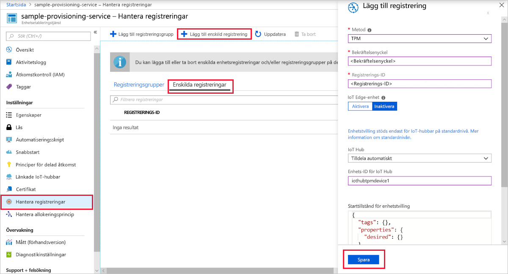
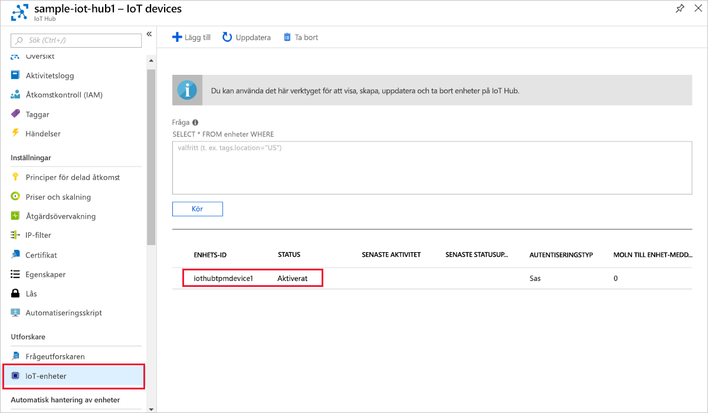

# <a name="create-and-provision-a-simulated-tpm-device-using-c-device-sdk-for-iot-hub-device-provisioning-service"></a>Skapa och etablera en simulerad TPM-enhet med C#-enhets-SDK för IoT Hub Device Provisioning-tjänsten

[!INCLUDE [iot-dps-selector-quick-create-simulated-device-tpm](../../includes/iot-dps-selector-quick-create-simulated-device-tpm.md)]

De här stegen visar hur du använder [Azure IoT-exempel för C# ](https://github.com/Azure-Samples/azure-iot-samples-csharp) för att simulera en TPM-enhet på en utvecklingsdator som kör Windows operativsystem. Exemplet ansluter även den simulerade enhet till en IoT Hub med hjälp av enhetsetableringstjänsten. 

Exempelkoden använder Windows TPM-simulatorn som enhetens [maskinvarusäkerhetsmodul (HSM)](https://azure.microsoft.com/blog/azure-iot-supports-new-security-hardware-to-strengthen-iot-security/). 

Om du inte känner till processen för automatisk etablering, bör du även gå igenom [Begrepp inom automatisk etablering](concepts-auto-provisioning.md). Se också till att slutföra stegen i [Set up IoT Hub Device Provisioning Service with the Azure portal](./quick-setup-auto-provision.md) (Konfigurera IoT Hub Device Provisioning-tjänsten med Azure Portal) innan du fortsätter. 

Azure IoT Device Provisioning Service stöder två typer av registreringar:

- [Registreringsgrupper](concepts-service.md#enrollment-group): Används för att registrera flera relaterade enheter.
- [Enskilda registreringar](concepts-service.md#individual-enrollment): Används för att registrera en enskild enhet.

Den här artikeln visar enskilda registreringar.

[!INCLUDE [IoT Device Provisioning Service basic](../../includes/iot-dps-basic.md)]

<a id="setupdevbox"></a>
## <a name="prepare-the-development-environment"></a>Förbereda utvecklingsmiljön 

1. Kontrol lera att du har [.net Core 2,1 SDK eller senare](https://www.microsoft.com/net/download/windows) installerad på datorn. 

1. Kontrollera att `git` är installerat på datorn och har lagts till i de miljövariabler som är tillgängliga för kommandofönstret. Se [Git-klientverktyg för Software Freedom Conservancy](https://git-scm.com/download/) för att få den senaste versionen av `git`-verktyg att installera, vilket omfattar **Git Bash**, kommandoradsappen som du kan använda för att interagera med det lokala Git-lagret. 

1. Öppna en kommandotolk eller Git Bash. Klona Azure IoT-exempel för C# GitHub-lagringsplatsen:

    ```cmd
    git clone https://github.com/Azure-Samples/azure-iot-samples-csharp.git
    ```

## <a name="provision-the-simulated-device"></a>Etablera den simulerade enheten

1. Logga in på Azure Portal. Klicka på knappen **Alla resurser** i menyn till vänster och öppna Device Provisioning-tjänsten. Från bladet **Översikt** antecknar du **_ID-omfång_** -värde.

     

2. I en kommandotolk ändrar du kataloger till projektkatalogen för TPM-enhetsetableringsexemplet.

    ```cmd
    cd .\azure-iot-samples-csharp\provisioning\Samples\device\TpmSample
    ```

2. Skriv följande kommando för att skapa och köra TPM-enhetsetableringsexemplet. Ersätt `<IDScope>`-värdet med ID-omfånget för etableringstjänsten. 

    ```cmd
    dotnet run <IDScope>
    ```

    Det här kommandot startar simulatorn för TPM-chip i en separat kommandotolk. I Windows kan du stöta på en Windows-säkerhetsavisering som frågar om du vill tillåta att Simulator. exe kommunicerar i offentliga nätverk. I det här exemplet kan du avbryta begäran.

1. Kommandofönstret visar **_bekräftelsenyckeln_** , **_registrerings-ID_** och ett föreslaget **_enhets-ID_** som behövs för enhetsregistreringen. Anteckna värdena. Du använder dessa värden för att skapa en enskild registrering i din instans av enhetsetableringstjänsten. 
   > [!NOTE]
   > Blanda inte ihop fönstret som innehåller utdata från kommandot med fönstret som innehåller utdata från TPM-simulatorn. Du kanske måste klicka på kommandofönstret för att placera det längst fram.

     

4. I Azure Portal, på sammanfattningsbladet för Device Provisioning-tjänsten väljer du **Hantera registreringar**. Välj fliken **Enskilda registreringar** och klicka på knappen **Lägg till enskild registrering** längst upp. 

5. Under **Lägg till registrering** anger du följande information:
   - Välj **TPM** som identitet för bestyrkande *mekanism*.
   - Ange *registrerings-ID* och *bekräftelsenyckel* för din TPM-enhet som du antecknade tidigare.
   - Alternativt väljer du en IoT-hubb som är länkad till din etableringstjänst.
   - Ange ett unikt enhets-ID. Du kan ange det enhets-ID som föreslås i exempelutdata eller ange ett eget. Om du använder ett eget ska du undvika känslig information när du namnger enheten. 
   - Du kan även uppdatera **inledande enhetstvillingstatus** med önskad inledande konfiguration för enheten.
   - Klicka på knappen **Spara** när det är klart. 

       

   Vid lyckad registrering visas *Registrerings-ID* för enheten i listan under fliken *Individual Enrollments* (Enskilda registreringar). 

6. Registrera den simulerade enheten genom att trycka på Retur i kommandofönstret (som visade **_bekräftelsenyckeln_** , **_registrerings-ID_** och ett föreslaget **_enhets-ID_** ). Lägg märke till de meddelanden som simulerar enhetsstart och anslutning till Device Provisioning-tjänsten för att hämta IoT-hubinformationen. 

1. Kontrollera att enheten har etablerats. Vid lyckad etablering av den simulerade enheten på IoT-hubben som är kopplad till etableringstjänsten visas enhets-ID på hubbens blad **IoT-enheter**. 

     

    Om du ändrade din *inledande enhetstvillingstatus* från standardvärdet i registreringsposten för din enhet kan den hämta önskad tvillingstatus från hubben och agera utifrån det. Mer information finns i [Understand and use device twins in IoT Hub](../iot-hub/iot-hub-devguide-device-twins.md) (Förstå och använda enhetstvillingar i IoT Hub)

## <a name="clean-up-resources"></a>Rensa resurser

Om du vill fortsätta att arbeta med och utforska enhetsklientexemplet ska du inte rensa de resurser som har skapats i den här snabbstarten. Om du inte planerar att fortsätta kan du använda stegen nedan för att ta bort alla resurser som har skapats i den här snabbstarten.

1. Stäng utdatafönstret för enhetsklientexemplet på datorn.
1. Stäng fönstret för TPM-simulatorn på datorn.
1. I den vänstra menyn i Azure-portalen klickar du på **Alla resurser** och väljer sedan Device Provisioning-tjänsten. Klicka på **Ta bort** överst på bladet **Alla resurser**.  
1. Klicka på **Alla resurser** på menyn till vänster på Azure-portalen och välj din IoT-hubb. Klicka på **Ta bort** överst på bladet **Alla resurser**.  

## <a name="next-steps"></a>Nästa steg

I den här snabbstarten har du skapat en TPM-simulerad enhet på datorn och etablerat den på IoT-hubben med hjälp av IoT Hub Device Provisioning-tjänsten. Information om hur du registrerar TPM-enheten programmässigt får du om du fortsätter till snabbstarten för programmässig registrering av en TPM-enhet. 

> [!div class="nextstepaction"]
> [Azure snabbstart – Registrera TPM-enhet på Azure IoT Hub Device Provisioning-tjänsten](quick-enroll-device-tpm-csharp.md)
