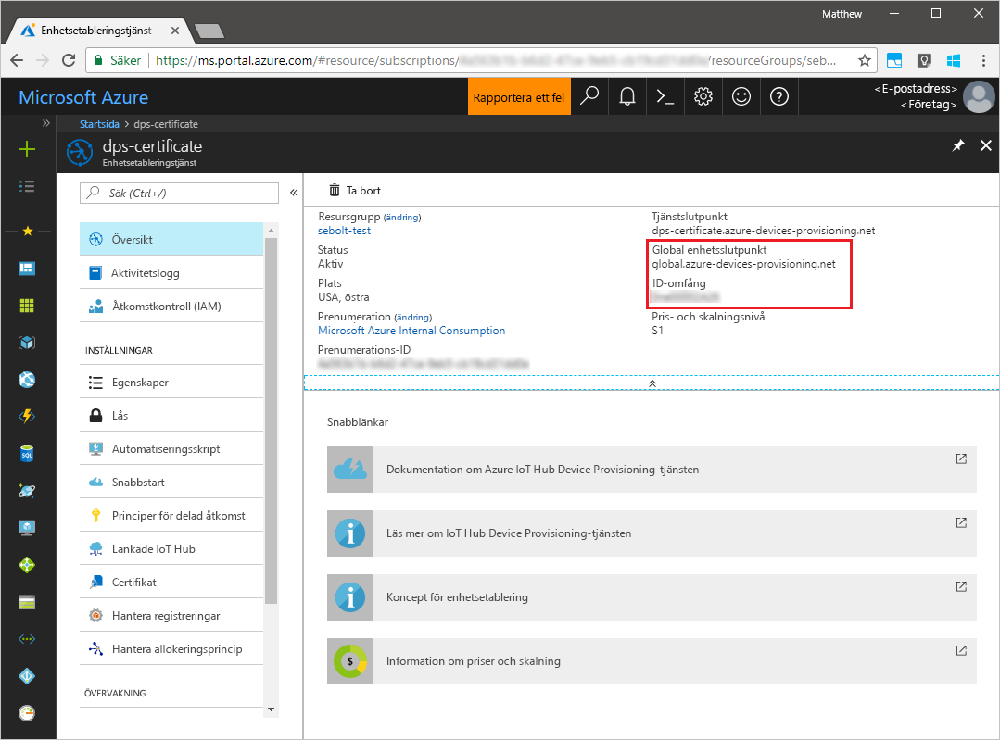
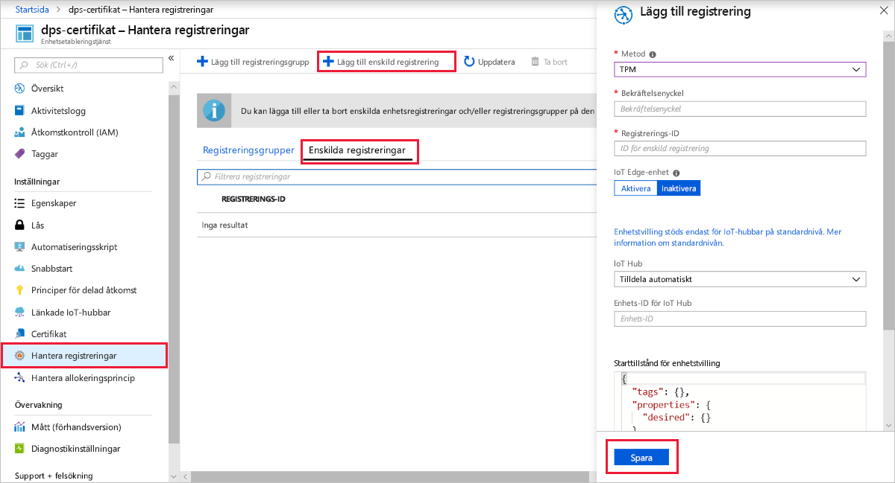
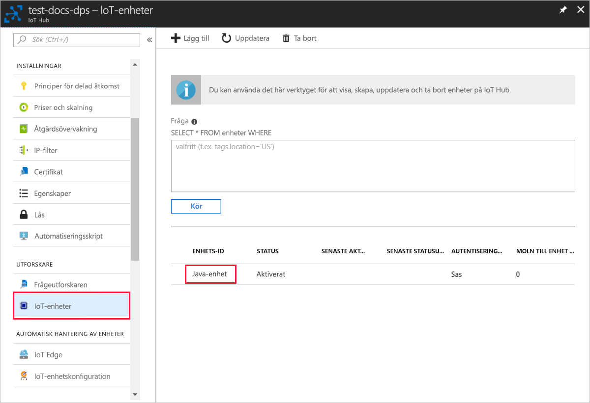

# <a name="quickstart-create-and-provision-a-simulated-tpm-device-using-java-device-sdk-for-azure-iot-hub-device-provisioning-service"></a>Quickstart: Create and provision a simulated TPM device using Java device SDK for Azure IoT Hub Device Provisioning Service

[!INCLUDE [iot-dps-selector-quick-create-simulated-device-tpm](../../includes/iot-dps-selector-quick-create-simulated-device-tpm.md)]

Dessa steg visar hur du skapar en simulerad enhet på utvecklingsdatorn som kör Windows OS, kör Windows TPM-simulatorn som [maskinvarusäkerhetsmodul (HSM)](https://azure.microsoft.com/blog/azure-iot-supports-new-security-hardware-to-strengthen-iot-security/) för enheten och använder kodexemplet för att ansluta till denna simulerade enhet med Device Provisioning-tjänsten och IoT-hubben. 

Om du inte känner till processen för automatisk etablering, bör du även gå igenom [Begrepp inom automatisk etablering](concepts-auto-provisioning.md). Se också till att slutföra stegen i [Set up IoT Hub Device Provisioning Service with the Azure portal](./quick-setup-auto-provision.md) (Konfigurera IoT Hub Device Provisioning-tjänsten med Azure Portal) innan du fortsätter. 

Azure IoT Device Provisioning Service stöder två typer av registreringar:
- [Registreringsgrupper](concepts-service.md#enrollment-group): används för att registrera flera relaterade enheter.
- [Enskilda registreringar](concepts-service.md#individual-enrollment): används för att registrera en enskild enhet.

Den här artikeln visar enskilda registreringar.

[!INCLUDE [IoT Device Provisioning Service basic](../../includes/iot-dps-basic.md)]

## <a name="prepare-the-environment"></a>Förbereda miljön 

1. Kontrollera att [Java SE Development Kit 8](https://aka.ms/azure-jdks) är installerat på datorn.

1. Ladda ned och installera [Maven](https://maven.apache.org/install.html).

1. Kontrollera att `git` är installerat på datorn och har lagts till i de miljövariabler som är tillgängliga för kommandofönstret. Se [Git-klientverktyg för Software Freedom Conservancy](https://git-scm.com/download/) för att få den senaste versionen av `git`-verktyg att installera, vilket omfattar **Git Bash**, kommandoradsappen som du kan använda för att interagera med det lokala Git-lagret. 

1. Öppna en kommandotolk. Klona GitHub-lagringsplatsen för enhetssimuleringens kodexempel.
    
    ```cmd/sh
    git clone https://github.com/Azure/azure-iot-sdk-java.git --recursive
    ```

1. Kör [TPM](https://docs.microsoft.com/windows/device-security/tpm/trusted-platform-module-overview)-simulatorn. Klicka på **Tillåt åtkomst** för att tillåta ändringar i inställningar för _Windows-brandväggen_. Den lyssnar via en socket på portarna 2321 och 2322. Do not close this window; you need to keep this simulator running until the end of this quickstart guide. 

    ```cmd/sh
    .\azure-iot-sdk-java\provisioning\provisioning-tools\tpm-simulator\Simulator.exe
    ```

    

1. Använd en separat kommandotolk för att navigera till rotmappen och skapa exempelberoenden.

    ```cmd/sh
    cd azure-iot-sdk-java
    mvn install -DskipTests=true
    ```

1. Navigera till exempelmappen.

    ```cmd/sh
    cd provisioning/provisioning-samples/provisioning-tpm-sample
    ```

1. Sign in to the Azure portal, select the **All resources** button on the left-hand menu and open your Device Provisioning service. Kom ihåg _ID-omfång_ och _Global slutpunkt för etableringstjänsten_.

    

1. Redigera `src/main/java/samples/com/microsoft/azure/sdk/iot/ProvisioningTpmSample.java` så att _ID-omfång_ och _Global slutpunkt för etableringstjänsten_ inkluderas enligt tidigare notering.  

    ```java
    private static final String idScope = "[Your ID scope here]";
    private static final String globalEndpoint = "[Your Provisioning Service Global Endpoint here]";
    private static final ProvisioningDeviceClientTransportProtocol PROVISIONING_DEVICE_CLIENT_TRANSPORT_PROTOCOL = ProvisioningDeviceClientTransportProtocol.HTTPS;
    ```
    Spara filen.

1. Use the following commands to build the project, navigate to the target folder, and execute the created .jar file. Replace the `version` placeholder with your version of Java.

    ```cmd/sh
    mvn clean install
    cd target
    java -jar ./provisioning-tpm-sample-{version}-with-deps.jar
    ```

1. Programmet börjar att köras. Note the _Endorsement key_ and _Registration ID_ for the next section and leave the program running.

    
    

## <a name="create-a-device-enrollment-entry"></a>Skapa en post för enhetsregistrering

1. Sign in to the Azure portal, select the **All resources** button on the left-hand menu and open your Device Provisioning service.

1. From the Device Provisioning Service menu, select **Manage enrollments**. Select **Individual Enrollments** tab and select the **Add individual enrollment** button at the top. 

1. In the **Add Enrollment** panel, enter the following information:
   - Välj **TPM** som identitet för bestyrkande *mekanism*.
   - Enter the *Registration ID* and *Endorsement key* for your TPM device from the values you noted previously.
   - Välj en IoT hub som är länkad till din etableringstjänst.
   - Du kan även ange följande information:
       - Enter a unique *Device ID*. Se till att undvika känsliga data när du namnger din enhet. If you choose not to provide one, the registration ID will be used to identify the device instead.
       - Uppdatera **inledande enhetstvillingstatus** med önskad inledande konfiguration för enheten.
   - Once complete, press the **Save** button. 

       

   Vid lyckad registrering visas *Registrerings-ID* för enheten i listan under fliken *Enskilda registreringar*. 


## <a name="simulate-the-device"></a>Simulera enheten

1. On the command window running the Java sample code on your machine, press *Enter* to continue running the application. Lägg märke till de meddelanden som simulerar enhetsstart och anslutning till Device Provisioning-tjänsten för att hämta IoT-hubinformationen.  

    

1. On successful provisioning of your simulated device to the IoT hub linked with your provisioning service, the device ID appears on the hub's **IoT devices** blade.

     

    Om du ändrade din *inledande enhetstvillingstatus* från standardvärdet i registreringsposten för din enhet kan den hämta önskad tvillingstatus från hubben och agera utifrån det. Mer information finns i [Understand and use device twins in IoT Hub](../iot-hub/iot-hub-devguide-device-twins.md) (Förstå och använda enhetstvillingar i IoT Hub).


## <a name="clean-up-resources"></a>Rensa resurser

If you plan to continue working on and exploring the device client sample, do not clean up the resources created in this quickstart. If you do not plan to continue, use the following steps to delete all resources created by this quickstart.

1. Stäng utdatafönstret för enhetsklientexemplet på datorn.
1. Stäng fönstret för TPM-simulatorn på datorn.
1. From the left-hand menu in the Azure portal, select **All resources** and then select your Device Provisioning service. Open the **Manage Enrollments** blade for your service, and then select the **Individual Enrollments** tab. Select the check box next to the *REGISTRATION ID* of the device you enrolled in this quickstart, and press the **Delete** button at the top of the pane. 
1. From the left-hand menu in the Azure portal, select **All resources** and then select your IoT hub. Open the **IoT devices** blade for your hub, select the check box next to the *DEVICE ID* of the device you registered in this quickstart, and then press the **Delete** button at the top of the pane.

## <a name="next-steps"></a>Nästa steg

In this quickstart, you’ve created a TPM simulated device on your machine and provisioned it to your IoT hub using the IoT Hub Device Provisioning Service. To learn how to enroll your TPM device programmatically, continue to the quickstart for programmatic enrollment of a TPM device. 

> [!div class="nextstepaction"]
> [Azure quickstart - Enroll TPM device to Azure IoT Hub Device Provisioning Service](quick-enroll-device-tpm-java.md)
