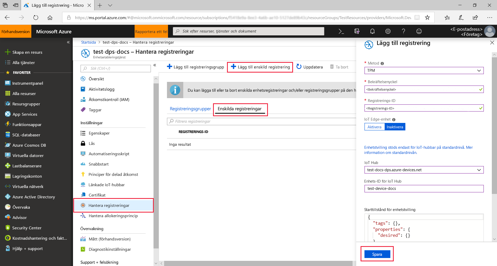
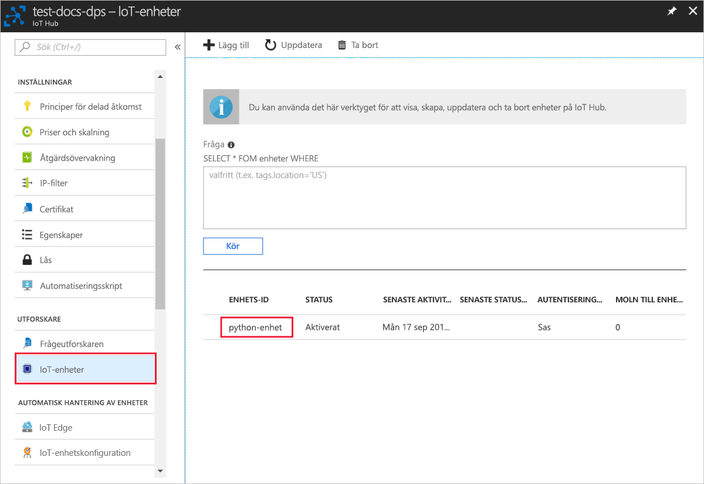

# <a name="quickstart-create-and-provision-a-simulated-tpm-device-using-python-device-sdk-for-iot-hub-device-provisioning-service"></a>Snabbstart: Skapa och etablera en simulerad TPM-enhet med Python-enheten SDK för IoT Hub Device Provisioning Service

[!INCLUDE [iot-dps-selector-quick-create-simulated-device-tpm](../../includes/iot-dps-selector-quick-create-simulated-device-tpm.md)]

I den här snabbstarten skapar du en simulerad IoT-enhet på en Windows-dator. Den simulerade enheten innehåller en TPM-simulator som en maskinvarusäkerhetsmodul (HSM). Du använder enhetsexempelet Python-kod för att ansluta den här simulerade enheten till din IoT-hubb med hjälp av en individuell registrering med DPS (Device Provisioning Service).

## <a name="prerequisites"></a>Krav

- Översyn av [begrepp för automatisk etablering](concepts-auto-provisioning.md).
- Slutförande av [konfigurera IoT Hub Device Provisioning Service med Azure-portalen](./quick-setup-auto-provision.md).
- Ett Azure-konto med en aktiv prenumeration. [Skapa en gratis](https://azure.microsoft.com/free/?ref=microsoft.com&utm_source=microsoft.com&utm_medium=docs&utm_campaign=visualstudio).
- [Visual Studio 2015+](https://visualstudio.microsoft.com/vs/) med skrivbordsutveckling med C++.
- [CMake bygga system](https://cmake.org/download/).
- [Git](https://git-scm.com/download/).

> [!IMPORTANT]
> Den här artikeln gäller endast den inaktuella V1 Python SDK. Enhets- och tjänstklienter för Iot Hub Device Provisioning Service är ännu inte tillgängliga i V2. Teamet arbetar för närvarande hårt för att få V2 att funktionen paritet.

[!INCLUDE [IoT Device Provisioning Service basic](../../includes/iot-dps-basic.md)]

## <a name="prepare-the-environment"></a>Förbereda miljön 

1. Kontrollera att du har installerat visual [studio](https://visualstudio.microsoft.com/vs/) 2015 eller senare, med arbetsbelastningen "Skrivbordsutveckling med C++" aktiverat för din Visual Studio-installation.

1. Hämta och installera [CMake-buildsystemet](https://cmake.org/download/).

1. Kontrollera att `git` är installerat på datorn och har lagts till i de miljövariabler som är tillgängliga för kommandofönstret. Se [Git-klientverktyg för Software Freedom Conservancy](https://git-scm.com/download/) för att få den senaste versionen av `git`-verktyg att installera, vilket omfattar **Git Bash**, kommandoradsappen som du kan använda för att interagera med det lokala Git-lagret. 

1. Öppna en kommandotolk eller Git Bash. Klona GitHub-lagringsplatsen för enhetssimuleringens kodexempel:
    
    ```cmd/sh
    git clone --single-branch --branch v1-deprecated https://github.com/Azure/azure-iot-sdk-python.git --recursive
    ```

1. Skapa en mapp på den lokala kopian av denna GitHub-lagringsplats för CMake-buildprocessen. 

    ```cmd/sh
    cd azure-iot-sdk-python/c
    mkdir cmake
    cd cmake
    ```

1. Kodexemplet använder en Windows TPM-simulator. Kör följande kommando för att aktivera autentisering med SAS-token. Det genererar även en Visual Studio-lösning för den simulerade enheten.

    ```cmd/sh
    cmake -Duse_prov_client:BOOL=ON -Duse_tpm_simulator:BOOL=ON ..
    ```

1. I en separat kommandotolk navigerar du till TPM-simulatormappen och kör [TPM-simulatorn](https://docs.microsoft.com/windows/device-security/tpm/trusted-platform-module-overview) för att vara [HSM](https://azure.microsoft.com/blog/azure-iot-supports-new-security-hardware-to-strengthen-iot-security/) för den simulerade enheten. Klicka på **Tillåt åtkomst**. Den lyssnar via en socket på portarna 2321 och 2322. Stäng inte det här kommandofönstret. du måste hålla denna simulator igång till slutet av denna snabbstart guide. 

    ```cmd/sh
    .\azure-iot-sdk-python\c\provisioning_client\deps\utpm\tools\tpm_simulator\Simulator.exe
    ```

    


## <a name="create-a-device-enrollment-entry"></a>Skapa en post för enhetsregistrering

Azure IoT Device Provisioning Service stöder två typer av registreringar:

- [Registreringsgrupper](concepts-service.md#enrollment-group): används för att registrera flera relaterade enheter.
- [Individuella registreringar](concepts-service.md#individual-enrollment): Används för att registrera en enda enhet.

Den här artikeln visar enskilda registreringar.

1. Öppna den lösning som har genererats i mappen *cmake* med namnet `azure_iot_sdks.sln`, och skapa den i Visual Studio.

1. Högerklicka på projektet **tpm_device_provision** och markera **Set as Startup Project** (Ange som startprojekt). Kör lösningen. Utdatafönstret visar **_bekräftelsenyckeln_** och **_registrerings-ID:t_** som behövs för enhetsregistrering. Anteckna dessa värden. 

    

1. Logga in på Azure-portalen, välj knappen **Alla resurser** på menyn till vänster och öppna tjänsten Enhetsetablering.

1. Välj **Hantera registreringar**på menyn Tjänst för enhetsetablering . Välj fliken **Enskilda registreringar** och välj knappen **Lägg till individuell registrering** högst upp. 

1. Ange följande information på panelen **Lägg till registrering:**
   - Välj **TPM** som identitet för bestyrkande *mekanism*.
   - Ange *registrerings-ID* och *bekräftelsenyckel* för din TPM-enhet från de värden som du noterade tidigare.
   - Välj en IoT hub som är länkad till din etableringstjänst.
   - Du kan även ange följande information:
       - Ange ett unikt *enhets-ID*. Se till att undvika känsliga data när du namnger din enhet. Om du väljer att inte ange ett används registrerings-ID:et för att identifiera enheten i stället.
       - Uppdatera **inledande enhetstvillingstatus** med önskad inledande konfiguration för enheten.
   - När du är klar trycker du på **knappen Spara.** 

       

   Vid lyckad registrering visas *Registrerings-ID* för enheten i listan under fliken *Individual Enrollments* (Enskilda registreringar). 


## <a name="simulate-the-device"></a>Simulera enheten

1. Ladda ned och installera [Python 2.x eller 3.x](https://www.python.org/downloads/). Se till att använda en 32-bitars eller 64-bitars installation beroende på vad som krävs för din konfiguration. Se till att du lägger till Python i de plattformsspecifika miljövariablerna när du uppmanas att göra det under installationen.
    - Om du använder Windows OS installerar du [Visual C++ redistributable package](https://support.microsoft.com/help/2977003/the-latest-supported-visual-c-downloads) så att du kan använda native-DLL:er från Python.

1. Skapa Python-paketen med hjälp av [de här instruktionerna](https://github.com/Azure/azure-iot-sdk-python/blob/v1-deprecated/doc/python-devbox-setup.md).

   > [!NOTE]
   > Om du kör `build_client.cmd` använder du `--use-tpm-simulator`-flagan.
   > 
   > [!NOTE]
   > Om du använder `pip` ska du även installera `azure-iot-provisioning-device-client`-paketet. Obs! De utgivna PIP-paketen använder verkliga TPM, inte simulatorn. Om du vill använda simulatorn måste du kompilera från källan med `--use-tpm-simulator`-flaggan.

1. Navigera till exempelmappen.

    ```cmd/sh
    cd azure-iot-sdk-python/provisioning_device_client/samples
    ```

1. Med Python IDE redigerar du python-skriptet **provisioning\_device\_client\_sample.py**. Ändra variablerna *GLOBAL\_PROV\_URI* och *ID\_SCOPE* till de värden som noterats tidigare. Kontrollera också att *SECURITY\_DEVICE\_TYPE* har getts värdet `ProvisioningSecurityDeviceType.TPM`

    ```python
    GLOBAL_PROV_URI = "{globalServiceEndpoint}"
    ID_SCOPE = "{idScope}"
    SECURITY_DEVICE_TYPE = ProvisioningSecurityDeviceType.TPM
    PROTOCOL = ProvisioningTransportProvider.HTTP
    ```

    

1. Kör exemplet. 

    ```cmd/sh
    python provisioning_device_client_sample.py
    ```

1. Lägg märke till de meddelanden som simulerar enhetsstart och anslutning till Device Provisioning-tjänsten för att hämta IoT-hubinformationen. 

    

1. När din simulerade enhet har etablerats till IoT-hubben som är länkad till etableringstjänsten visas enhets-ID:et på hubbens **IoT-enhetsblad.**

     

    Om du ändrade din *inledande enhetstvillingstatus* från standardvärdet i registreringsposten för din enhet kan den hämta önskad tvillingstatus från hubben och agera utifrån det. Mer information finns i [Förstå och använda enhetstvillingar i IoT Hub](../iot-hub/iot-hub-devguide-device-twins.md)


## <a name="clean-up-resources"></a>Rensa resurser

Om du planerar att fortsätta arbeta med och utforska enhetsklientexemplet ska du inte rensa de resurser som skapas i den här snabbstarten. Om du inte planerar att fortsätta använder du följande steg för att ta bort alla resurser som skapats av den här snabbstarten.

1. Stäng utdatafönstret för enhetsklientexemplet på datorn.
1. Stäng fönstret för TPM-simulatorn på datorn.
1. På menyn till vänster i Azure-portalen väljer du **Alla resurser** och väljer sedan din enhetsetableringstjänst. Öppna bladet **Hantera registreringar** för tjänsten och markera sedan fliken **Enskilda registreringar.** *REGISTRATION ID* **Delete** 
1. På menyn till vänster i Azure-portalen väljer du **Alla resurser** och väljer sedan din IoT-hubb. Öppna **ioT-enhetsbladet** för navet, markera kryssrutan bredvid *DEVICE-ID:t* för den enhet som du registrerade i den här snabbstarten och tryck sedan på knappen **Ta bort** högst upp i fönstret.

## <a name="next-steps"></a>Nästa steg

I den här snabbstarten har du skapat en TPM-simulerad enhet på datorn och etablerat den i din IoT-hubb med hjälp av IoT Hub Device Provisioning Service. Om du vill veta hur du registrerar TPM-enheten programmässigt fortsätter du till snabbstarten för programmatisk registrering av en TPM-enhet. 

> [!div class="nextstepaction"]
> [Snabbstart i Azure – Registrera TPM-enhet till Azure IoT Hub Device Provisioning Service](quick-enroll-device-tpm-python.md)
