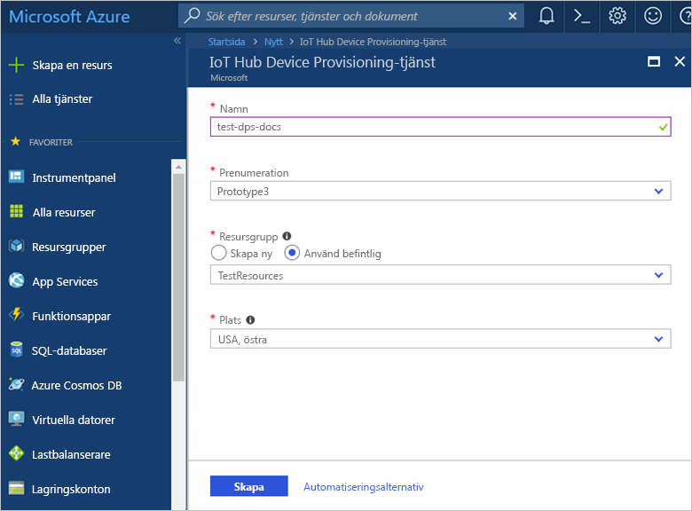

# Snabbstart: Konfigurera etableringstjänsten för IoT Hub Device med Azure-portalen

IoT Hub Device Provisioning Service kan användas med IoT Hub för att möjliggöra zero-touch, just-in-time etablering till önskad IoT-hubb utan att kräva mänsklig inblandning, så att kunderna kan tillhandahålla miljontals IoT-enheter på ett säkert och skalbart sätt. Azure IoT Hub Device Provisioning Service stöder IoT-enheter med TPM, symmetrisk nyckel och X.509 certifikatautentiseringar. Mer information finns i [översikt över IoT Hub Device Provisioning Service](./about-iot-dps.md)

I den här snabbstarten får du lära dig hur du konfigurerar IoT Hub Device Provisioning Service i Azure Portal för etablering av dina enheter med följande steg:
> [!div class="checklist"]
> * Använda Azure-portalen för att skapa en IoT-hubb
> * Använd Azure-portalen för att skapa en IoT Hub Device Provisioning-tjänst och hämta ID-omfånget
> * Länka IoT-hubben till Device Provisioning-tjänsten

Om du inte har en Azure-prenumeration kan du skapa ett [kostnadsfritt](https://azure.microsoft.com/free/?WT.mc_id=A261C142F) konto innan du börjar.

## Skapa en IoT Hub

[!INCLUDE [iot-hub-include-create-hub](../../includes/iot-hub-include-create-hub.md)]

## Skapa en ny etableringstjänst för IoT Hub Device

1. Välj knappen **+ Skapa en resurs** igen.

2. *Sök på Marketplace* efter **tjänsten Enhetsetablering**. Välj **IoT Hub Device Provisioning Service** och tryck på knappen **Skapa.** 

3. Ange följande information för den nya enhetsetableringstjänsten-instansen och tryck på **Skapa**.

    * **Namn:** Ange ett unikt namn för den nya enhetsetableringstjänstinstansen. Om namnet som du anger är tillgängligt visas en grön bockmarkering.
    * **Prenumeration:** Välj den prenumeration som du vill använda för att skapa den här enhetsetableringstjänstinstansen.
    * **Resursgrupp:** I det här fältet kan du skapa en ny resursgrupp eller välja en befintlig som ska innehålla den nya instansen. Välj resursgruppen som innehåller den IoT-hubb du skapade, till exempel **TestResources**. Genom att lägga till alla relaterade resurser i en grupp kan du hantera dem tillsammans. Till exempel tas alla resurser som ingår i gruppen bort om resursgruppen tas bort. Mer information finns i [Hantera Azure Resource Manager-resursgrupper](../azure-resource-manager/management/manage-resource-groups-portal.md).
    * **Plats:** Välj den närmaste platsen för dina enheter.

        

4. Välj meddelandeknappen för att övervaka skapandet av resursinstansen. När tjänsten har distribuerats väljer du **Fäst på instrumentpanelen**och går sedan **till resursen**.

    

## Länka IoT-hubben och enhetens etableringstjänst

I det här avsnittet lägger du till en konfiguration i instansen av enhetsetableringstjänsten. Den här konfigurationen anger den IoT-hubb för vilken enheter tillhandahålls.

1. Välj knappen **Alla resurser** på menyn Till vänster i Azure-portalen. Välj Device Provisioning-tjänstinstansen som du skapade i det föregående avsnittet. 

    Om menyn är konfigurerad med **utfällbart** läge i stället för **dockat** läge i portalinställningarna måste du klicka på de tre linjerna längst upp till vänster för att öppna portalmenyn till vänster.  

2. Välj **Länkade IoT-hubbar**på menyn Enhetsetableringstjänsten . Tryck på **knappen + Lägg till** som visas högst upp. 

3. På sidan **Lägg till länk till IoT-hubb** anger du följande information för att länka den nya enhetsetableringstjänsten till en IoT-hubb. Tryck sedan **på Spara**. 

    * **Prenumeration:** Välj den prenumeration som innehåller den IoT-hubb som du vill länka till den nya enhetsetableringstjänsten-instansen.
    * **Iot nav:** Välj den IoT-hubb som ska länkas till den nya enhetsetableringstjänsten-instansen.
    * **Åtkomstprincip:** Välj **iothubowner** som autentiseringsuppgifter när du upprättar länken till IoT-hubben.  

        

3. Nu bör den valda hubben visas under bladet **Linked IoT hubs** (Länkade IoT-hubbar). Du kan behöva trycka på **Uppdatera** för att den ska visas.

## Rensa resurser

De andra snabbstarterna i den här samlingen bygger på den här snabbstarten. Om du planerar att fortsätta att arbeta med efterföljande snabbstarter eller med självstudierna ska du inte rensa resurserna som skapas i denna snabbstart. Om du inte planerar att fortsätta kan du använda stegen nedan för att ta bort alla resurser som har skapats i den här snabbstarten i Azure-portalen.

1. På menyn till vänster i Azure-portalen väljer du **Alla resurser** och väljer sedan din enhetsetableringstjänst. Högst upp i enhetsinformationsfönstret väljer du **Ta bort**.  
2. På menyn till vänster i Azure-portalen väljer du **Alla resurser** och väljer sedan din IoT-hubb. Välj **Ta bort**högst upp i navigeringsinformationsfönstret .  

## Nästa steg

I den här snabbstarten har du distribuerat en IoT-hubb och en enhetsetableringstjänstinstans och länkat de två resurserna. Om du vill veta hur du använder den här inställningen för att etablera en simulerad enhet fortsätter du till snabbstarten för att skapa en simulerad enhet.

> [!div class="nextstepaction"]
> [Snabbstart för att skapa en simulerad enhet](./quick-create-simulated-device-symm-key.md)
