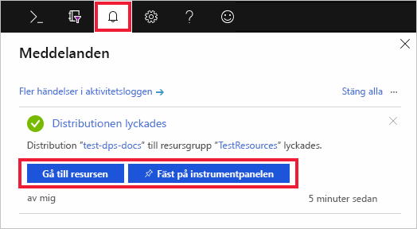

# Konfigurera tjänsten IoT Hub Device Provisioning på Azure Portal

Dessa steg beskriver hur du konfigurerar Azure-molnresurserna på portalen för att etablera dina enheter. I den här artikeln hittar du anvisningar för att: skapa en IoT-hubb, skapa en ny instans av IoT Hub Device Provisioning-tjänsten och länka de två tjänsterna. 

Om du inte har en Azure-prenumeration kan du skapa ett [kostnadsfritt konto](https://azure.microsoft.com/free/?WT.mc_id=A261C142F) innan du börjar.

## Skapa en IoT Hub

[!INCLUDE [iot-hub-include-create-hub](../../includes/iot-hub-include-create-hub.md)]

## Skapa en ny instans av IoT Hub Device Provisioning-tjänsten

1. Klicka på knappen **Skapa en resurs** längst upp till vänster i Azure Portal.

2. Sök efter **Device Provisioning Service** på *Marketplace*. Välj **IoT Hub Device Provisioning Service** och klicka på **Skapa**. 

3. Ange följande information för den nya instansen av enhetsetableringstjänsten och klicka på **Skapa**.

    * **Namn:** Ange ett unikt namn för den nya instansen av enhetsetableringstjänsten. Om namnet som du anger är tillgängligt visas en grön bockmarkering.
    * **Prenumeration:** Välj den prenumeration som du vill använda för att skapa instansen av enhetsetableringstjänsten.
    * **Resursgrupp:** I det här fältet kan du skapa en ny resursgrupp eller välja en befintlig som ska innehålla den nya instansen. Välj resursgruppen som innehåller den IoT-hubb du skapade, till exempel **TestResources**. Genom att lägga till alla relaterade resurser i en grupp kan du hantera dem tillsammans. Till exempel tas alla resurser som ingår i gruppen bort om resursgruppen tas bort. Mer information finns i [Hantera Azure Resource Manager-resursgrupper](../azure-resource-manager/manage-resource-groups-portal.md).
    * **Plats:** Välj den plats som är närmast enheterna.

        

4. Klicka på meddelandet för att övervaka skapandet av resursinstansen. När tjänsten har distribuerats klickar du på **Fäst vid instrumentpanelen** och sedan **Gå till resurs**.

    

## Länka IoT-hubben och Device Provisioning-tjänstinstansen

I det här avsnittet lägger du till en konfiguration till instansen av enhetsetableringstjänsten. Den här konfigurationen anger den IoT-hubb för vilken enheter tillhandahålls.

1. Klicka på knappen **Alla resurser** på menyn till höger på Azure-portalen. Välj instansen av enhetsetableringstjänsten som du skapade i det föregående avsnittet.  

2. Välj **Linked IoT hubs** (Länkade IoT-hubbar) på sammanfattningsbladet för Device Provisioning-tjänsten. Klicka på knappen **+ Lägg till** som visas överst på bladet. 

3. På sidan **Lägg till länk i IoT Hub** fyller du i följande information för att länka den nya instansen av enhetsetableringstjänsten till en IoT-hubb. Klicka sedan på **Spara**. 

    * **Prenumeration:** Välj den prenumeration som innehåller den IoT-hubb som du vill länka till den nya instansen av enhetsetableringstjänsten.
    * **IoT-hubb:** Välj den IoT-hubb som du vill länka till den nya instansen av enhetsetableringstjänsten.
    * **Åtkomstprincip:** Välj **iothubowner** som autentiseringsuppgifter när du upprättar länken till IoT-hubben.  

        

3. Nu bör den valda hubben visas under bladet **Linked IoT hubs** (Länkade IoT-hubbar). Du kan behöva klicka på **Uppdatera** för att visa **Länkade IoT-hubbar**.

## Rensa resurser

De andra snabbstarterna i den här samlingen bygger på den här snabbstarten. Om du vill fortsätta med efterföljande snabbstarter eller självstudier låter du bli att rensa resurserna som du har skapat i den här snabbstarten. Om du inte planerar att fortsätta följer du stegen nedan för att ta bort alla resurser som du har skapat i den här snabbstarten på Azure-portalen.

1. Klicka på **Alla resurser** på menyn till vänster på Azure-portalen och välj din Device Provisioning-tjänst. Klicka på **Ta bort** överst på bladet **Alla resurser**.  
2. Klicka på **Alla resurser** på menyn till vänster på Azure-portalen och välj din IoT-hubb. Klicka på **Ta bort** överst på bladet **Alla resurser**.  

## Nästa steg

I den här snabbstarten har du skapat en IoT-hubb och en instans av enhetsetableringstjänsten och länkat de två resurserna. Om du vill lära dig hur du använder den här konfigurationen för att etablera en simulerad enhet fortsätter du till Snabbstart för att skapa en simulerad enhet.

> [!div class="nextstepaction"]
> [Snabbstart för att skapa en simulerad enhet](./quick-create-simulated-device.md)
