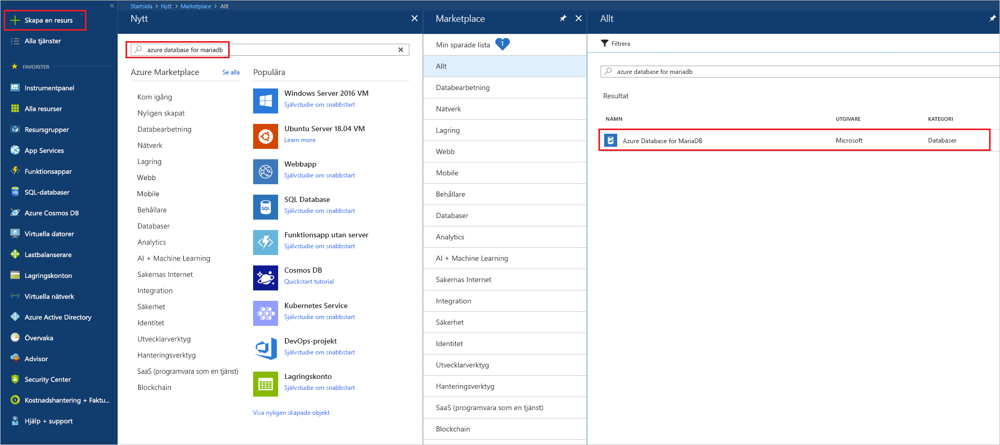
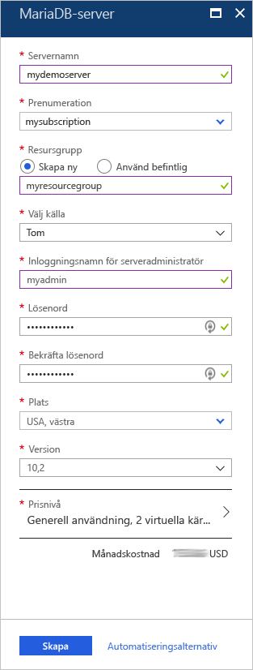
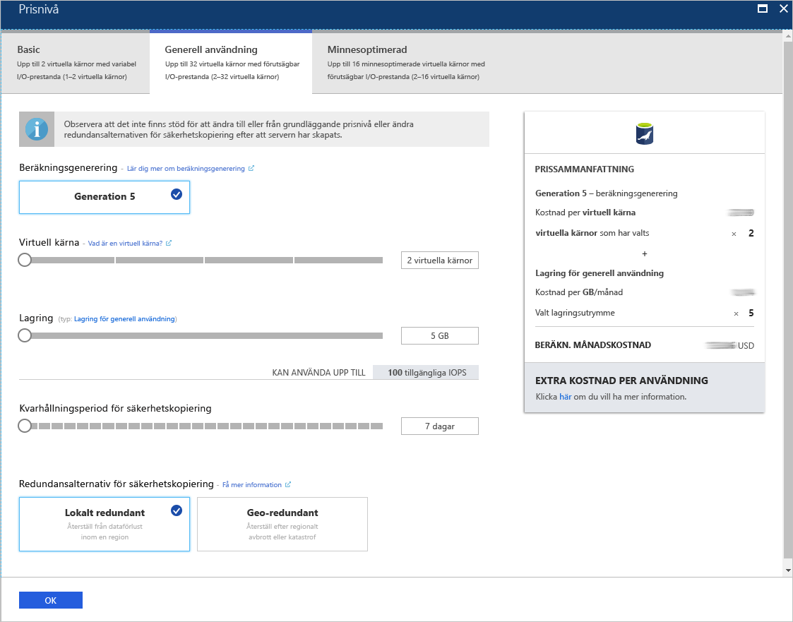

# <a name="create-an-azure-database-for-mariadb-server-by-using-the-azure-portal"></a>Skapa en Azure Database for MariaDB-server med Azure-portalen

Azure Database for MariaDB är en hanterad tjänst som du kan använda för att köra, hantera och skala högtillgängliga MariaDB-databaser i molnet. Den här snabbstarten visar hur du skapar en Azure Database for MariaDB-server på ungefär fem minuter med Azure-portalen.  

Om du inte har en Azure-prenumeration kan du skapa ett [kostnadsfritt Azure-konto](https://azure.microsoft.com/free/) innan du börjar.

## <a name="sign-in-to-the-azure-portal"></a>Logga in på Azure Portal

Öppna en webbläsare och gå till [Azure-portalen](https://portal.azure.com/). Ange dina autentiseringsuppgifter och logga in på portalen. Standardvyn är instrumentpanelen.

## <a name="create-an-azure-database-for-mariadb-server"></a>Skapa en Azure Database for MariaDB-server

Du skapar en Azure Database for MariaDB-server med en definierad uppsättning [beräknings- och lagringsresurser](concepts-pricing-tiers.md). Du skapar servern i en [Azure-resursgrupp](../azure-resource-manager/management/overview.md).

Skapa en Azure Database for MariaDB-server:

1. Välj knappen **Skapa en resurs** (+) i det övre vänstra hörnet i portalen.

2. Välj **databaser** > **Azure Database for MariaDB**. Du kan också skriva **MariaDB** i sökrutan för att hitta tjänsten.

   

3. Ange eller välj följande serverinformation:
   
   

    Inställning | Föreslaget värde | Beskrivning
    ---|---|---
    servernamn | *ett unikt servernamn* | Välj ett unikt namn för Azure Database for MariaDB-server. Till exempel **mydemoserver**. Domännamnet *.mariadb.database.azure.com* läggs till i det servernamn du anger. Ditt servernamn får bara innehålla gemener, siffror och bindestreck. Det måste innehålla mellan 3 och 63 tecken.
    Prenumeration | *din prenumeration* | Välj den Azure-prenumeration som ska användas för servern. Om du har flera prenumerationer väljer du den prenumeration som resursen ska debiteras till.
    Resursgrupp | **myresourcegroup** | Ange ett nytt resursgruppsnamn eller välj en befintlig resursgrupp. 
    Välj källa | **Tom** | Välj **Tom** om du vill skapa en ny server från början. (Välj **Säkerhetskopiering** om du vill skapa en server från en geo-säkerhetskopia av en befintlig Azure Database for MariaDB-server.)
    inloggning för serveradministratör | **myadmin** | Ett inloggningskonto som du använder när du ansluter till servern. Inloggningsnamnet för administratören får inte vara **azure_superuser**, **admin**, **administrator**, **root**, **guest** eller **public**.
    lösenord | *ditt val* | Ange ett nytt lösenord för serverns administratörskonto. Det måste innehålla mellan 8 och 128 tecken. Lösenordet måste innehålla tecken från tre av följande kategorier: engelska versala bokstäver, engelska gemena bokstäver, siffror (0-9) och icke-alfanumeriska tecken (!, $, #, % osv).
    Bekräfta lösenord | *ditt val*| Bekräfta administratörslösenordet.
    Location | *den region som är närmast dina användare*| Välj den plats som är närmast dina användare eller dina andra Azure-program.
    Version | *den senaste versionen*| Välj den senaste versionen (om du inte har särskilda krav på att använda en annan version).
    Prisnivå | Se beskrivningen. | Konfigurationerna för beräkning, lagring och säkerhetskopiering för den nya servern. Välj **Prisnivå** > **Generell användning**. Behåll standardvärdena för följande inställningar:<br><ul><li>**Compute-generering** (Gen 5)</li><li>**vCore** (4 virtuella kärnor)</li><li>**Lagring** (100 GB)</li><li>**Kvarhållningsperiod för säkerhetskopiering** (7 dagar)</li></ul><br>Välj **Geografiskt redundant** bland **redundansalternativen för säkerhetskopiering** om du vill använda geo-redundant lagring för dina serversäkerhetskopior. <br><br>Spara den valda prisnivån genom att välja **OK**. På nästa skärmbild visas dessa val.
  
   > [!NOTE]
   > Överväg att använda prisnivån Basic om lätt beräkning och I/O är lämpligt för din arbetsbelastning. Observera att servrar som skapas på prisnivån Basic inte senare kan skalas till Generell användning eller Minnesoptimerad. Mer information finns på [sidan med prissättning](https://azure.microsoft.com/pricing/details/mariadb/).
   > 

   

4.  Välj **Skapa** för att etablera servern. Etableringen kan ta upp till 20 minuter.
   
5.  Välj **Aviseringar** (klockikonen) i verktygsfältet för att övervaka distributionsprocessen.
   
Som standard skapas följande databaser i din server: **information_schema**, **mysql**, **performance_schema** och **sys**.


## <a name="configure-firewall-rule"></a>Konfigurera en brandväggsregel på servernivå

Azure Database for MariaDB-tjänsten skapar en brandvägg på servernivå. Brandväggen förhindrar att externa program och verktyg ansluter till servern eller databaser på servern, om inte en brandväggsregel konfigureras som öppnar brandväggen för specifika IP-adresser. 

Skapa en brandväggsregel på servernivå:

1. När distributionen är klar letar du reda på servern. Om det behövs kan du söka efter den. Välj till exempel **Alla resurser** i menyn till vänster. Ange sedan servernamnet. Ange till exempel **mydemoserver** för att söka efter den nya servern. Välj servernamnet i sökresultatlistan. **Översiktssidan** för servern öppnas. Du kan ändra ytterligare inställningar på den här sidan.

2. På serverns översiktssida väljer du **Anslutningssäkerhet**.

3. Under **Brandväggsregler** väljer du den tomma textrutan i kolumnen **Regelnamn** och börjar skapa brandväggsregeln. Ange de exakta IP-adressintervallen för de klienter som ska ansluta till den här servern.
   
   

4. Välj **Spara** i det övre verktygsfältet på sidan **Anslutningssäkerhet**. Innan du fortsätter väntar du tills du ser meddelandet som säger att uppdateringen är klar. 

   > [!NOTE]
   > Anslutningar till Azure Database for MariaDB kommunicerar via port 3306. Om du försöker ansluta inifrån ett företagsnätverk tillåts kanske inte utgående trafik via port 3306. I det här fallet måste IT-avdelningen öppna 3306 för att ansluta till servern.
   > 

## <a name="get-connection-information"></a>Hämta anslutningsinformation

Du behöver det fullständiga servernamnet och inloggningsuppgifterna för administratör för att ansluta till databasservern. Du kan ha antecknat dessa värden tidigare i den här artikeln. I annat fall hittar du enkelt servernamnet och inloggningsuppgifterna på sidan **Översikt** eller **Egenskaper** för servern på Azure-portalen:

1. Gå till serverns **översiktssida**. Anteckna värdena för **servernamn** och **inloggningsnamnet för serveradministratören**. 

2. Kopiera värdena genom att placera markören över det fält du vill kopiera. Kopieringsikonen visas till höger om texten. Välj kopieringssymbolen för att kopiera värdena.

I vårt exempel är Server namnet **mydemoserver.MariaDB.Database.Azure.com** och inloggnings namnet för Server administratören är **admin\@mydemoserver**.

## <a name="connect-to-azure-database-for-mariadb-by-using-the-mysql-command-line"></a>Ansluta till Azure Database for MariaDB med hjälp av mysql-kommandoraden

Du kan använda en mängd olika program för att ansluta till Azure Database for MariaDB-servern.

Först använder vi [mysql](https://dev.mysql.com/doc/refman/5.7/en/mysql.html)-kommandoradsverktyget för att visa hur man ansluter till servern. Du kan även använda en webbläsare och Azure Cloud Shell utan att installera programvara. Om mysql-verktyget är installerat lokalt kan du även ansluta därifrån.

1. Starta Azure Cloud Shell via terminalikonen ( **>_** ) i verktygsfältet överst till höger på Azure-portalen.
   

2. Azure Cloud Shell öppnas i webbläsaren. Du kan använda bash shell-kommandon i Cloud Shell.

   

3. I Cloud Shell-kommandotolken ansluter du till din Azure Database for MariaDB-server genom att skriva in mysql-kommandoraden.

    Använd följande format för att ansluta till en Azure Database for MariaDB-server med mysql-verktyget:

    ```bash
    mysql --host <fully qualified server name> --user <server admin login name>@<server name> -p
    ```

    Till exempel ansluter följande kommando till vår exempelserver:

    ```azurecli-interactive
    mysql --host mydemoserver.mariadb.database.azure.com --user myadmin@mydemoserver -p
    ```

    mysql-parameter |Föreslaget värde|Beskrivning
    ---|---|---
    --host | *servernamn* | Servernamnsvärdet som du använde när du skapade Azure Database for MariaDB-servern. Exempelservern är **mydemoserver.mariadb.database.azure.com**. Använd det fullständiga domännamnet ( **\*.mariadb.database.azure.com**) som i det här exemplet. Om du inte kommer ihåg namnet på servern följer du anvisningarna i föregående avsnitt för att hitta anslutningsinformation.
    --användare | *inloggning för serveradministratör* |Inloggningen för serveradministratör som du har använt för att skapa Azure Database for MariaDB-server. Om du inte kommer ihåg användarnamnet följer du anvisningarna i föregående avsnitt för att hitta anslutningsinformation. Formatet är *användar namn\@servername*.
    -p | *ditt lösenord*<br>(vänta på uppmaning) |När du uppmanas anger du det lösenord du använde för att skapa servern. Det angivna lösenordet visas inte i bash-kommandotolken när du skriver. Tryck på RETUR när du har angett lösenordet.

   När mysql-verktyget är anslutet visas en `mysql>`-kommandotolk. Du kan ange kommandon i kommandotolken. 

   Här är ett exempel på mysql-utdata:

    ```bash
    Welcome to the MySQL monitor.  Commands end with ; or \g.
    Your MySQL connection id is 65505
    Server version: 5.6.39.0 MariaDB Server
    
    Copyright (c) 2000, 2017, Oracle and/or its affiliates. All rights reserved.
    
    Oracle is a registered trademark of Oracle Corporation and/or its
    affiliates. Other names may be trademarks of their respective
    owners.

    Type 'help;' or '\h' for help. Type '\c' to clear the current input statement.
    
    mysql>
    ```
    
    > [!TIP]
    > Om brandväggen inte är konfigurerad att tillåta IP-adressen för Azure Cloud Shell uppstår följande fel:
    >
    >   ERROR 2003 (28000): Client with IP address 123.456.789.0 is not allowed to access the server. (Klienten med IP-adress 123.456.789.0 har inte tillstånd att ansluta till servern.)
    >
    > Lös felet genom att se till att serverkonfigurationen som matchar steget som beskrivs i [Konfigurera en brandväggsregel på servernivå](#configure-firewall-rule).

4. Verifiera anslutningen genom att ange **status** i `mysql>`-kommandotolken för att kontrollera serverstatusen.

    ```sql
    status
    ```

   > [!TIP]
   > Fler kommandon finns i [referenshandboken för MySQL 5.7 – kapitel 4.5.1](https://dev.mysql.com/doc/refman/5.7/en/mysql.html).

5. Skapa en tom databas i `mysql>`-kommandotolken genom att ange följande kommando:

   ```sql
   CREATE DATABASE quickstartdb;
   ```
   Det kan ta några minuter att slutföra kommandot. 

   Du kan skapa en eller flera databaser på en Azure Database for MariaDB-server. Du kan skapa en databas per server om du vill använda dig av samtliga resurser eller så kan du skapa flera databaser som får dela på resurserna. Det finns ingen gräns för hur många databaser du kan skapa, men flera databaser delar samma serverresurser. 

6. Lista databaserna i `mysql>`-kommandotolken genom att ange följande kommando:

    ```sql
    SHOW DATABASES;
    ```

7. Ange **\q** och tryck sedan på RETUR för att stänga mysql-verktyget. Sedan kan du stänga Azure Cloud Shell.

Du har anslutit till Azure Database for MariaDB-server och skapat en tom användardatabas. I nästa avsnitt ansluter du till samma server genom att använda ett annat vanligt verktyg MySQL Workbench.

## <a name="connect-to-the-server-by-using-mysql-workbench"></a>Ansluta till servern med MySQL Workbench

Ansluta till servern med MySQL Workbench:

1. Öppna MySQL Workbench på klientdatorn. Du kan ladda ned och installera MySQL Workbench i [här](https://dev.mysql.com/downloads/workbench/).

2. Skapa en ny anslutning genom att välja plusikonen ( **+** ) bredvid rubriken **MySQL-anslutningar**.

3. I dialogrutan **Konfigurera ny anslutning** anger du informationen om serveranslutningen på fliken **Parametrar**. Platshållarvärden visas som ett exempel. Ersätt **Värddatornamn**, **Användarnamn** och **Lösenord** med dina egna värden.

   

    |Inställning |Föreslaget värde|Fältbeskrivning|
    |---|---|---|
     Anslutningsnamn | **Demoanslutning** | En etikett för anslutningen. |
    Anslutningsmetod | **Standard (TCP/IP)** | Standard (TCP/IP) är tillräckligt. |
    Värdnamn | *servernamn* | Servernamnsvärdet som du använde när du skapade Azure Database for MariaDB-servern. Exempelservern är **mydemoserver.mariadb.database.azure.com**. Använd det fullständiga domännamnet ( **\*.mariadb.database.azure.com**) som i det här exemplet. Om du inte kommer ihåg servernamnet slutför du stegen ovan i den här artikeln för att hämta anslutningsinformationen.|
     Port | 3306 | Den port som ska användas när du ansluter till din Azure Database for MariaDB-server. |
    Användarnamn |  *inloggning för serveradministratör* | Inloggningsinformationen för server som du använde för att skapa Azure Database for MariaDB-servern. Vårt exempel användar namn är min **admin\@mydemoserver**. Om du inte kommer ihåg användarnamnet slutför du stegen ovan i den här artikeln för att hämta anslutningsinformationen. Formatet är *användar namn\@servername*.
    lösenord | *ditt lösenord* | Klicka på knappen **Spara i valvet** för att spara lösenordet. |

4. Välj **Testanslutning** för att kontrollera att alla parametrar är rätt konfigurerade. Välj **OK** för att spara anslutningen. 

    > [!NOTE]
    > SSL tillämpas som standard på servern. Det kräver ytterligare konfiguration för att ansluta. Se [Konfigurera SSL-anslutning i din app för säker anslutning till Azure Database for MariaDB](./howto-configure-ssl.md) för mer information. Om du vill inaktivera SSL för den här snabbstarten på serverns översiktssida i Azure-portalen väljer du **Anslutningssäkerhet** i menyn. Vid **Framtvinga SSL-anslutning**väljer du **Inaktiverad**.
    >

## <a name="clean-up-resources"></a>Rensa resurser

Du kan rensa de resurser som du skapade i snabbstarten på två sätt. Du kan ta bort [Azure-resursgruppen](../azure-resource-manager/management/overview.md). Det här alternativet tar bort alla resurser i resursgruppen. Om du vill bevara alla andra resurser tar du bara bort en serverresurs.

> [!TIP]
> De andra snabbstarterna i den här samlingen bygger på den här snabbstarten. Rensa inte upp resurserna som du skapade i den här snabbstarten om du tänker fortsätta att arbeta med Azure Database for MariaDB-snabbstarter. Om du inte planerar att fortsätta kan du använda följande steg för att ta bort alla resurser som du skapade i den här snabbstarten.
>

Ta bort hela resursgruppen, inklusive den nya servern:

1.  Leta reda på resursgruppen på Azure-portalen. Klicka på **Resursgrupper** på den vänstra menyn och sedan på namnet på resursgruppen (**myresourcegroup** i vårt exempel).

2.  Välj **Ta bort** på resursgruppssidan. Ange sedan namnet på din resursgrupp (**myresourcegroup** i vårt exempel) för att bekräfta borttagningen. Välj **Ta bort**.

Ta bort bara den nyligen skapade servern:

1. Leta upp din server i Azure-portalen om du inte redan har den öppen. Välj **Alla resurser** i menyn till vänster. Sök sedan efter den server som du skapade.

2. Välj **Ta bort** på sidan **Översikt**. 

   

3. Bekräfta namnet på den server du vill ta bort. Visa databaserna under den som påverkas av borttagningen. Ange servernamnet (**mydemoserver** i vårt exempel) för att bekräfta borttagningen. Välj **Ta bort**.

## <a name="next-steps"></a>Nästa steg

- [Skapa din första Azure Database for MariaDB-databas](./tutorial-design-database-using-portal.md)
