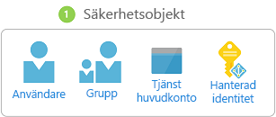
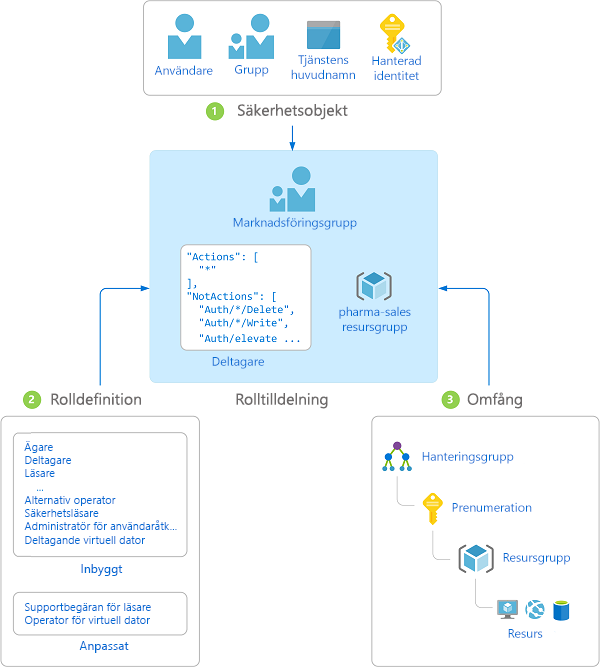
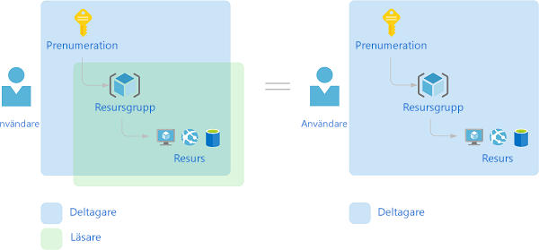

# Vad är rollbaserad åtkomstkontroll (RBAC) för Azure-resurser?

Åtkomsthantering för molnresurser är en viktig funktion för alla organisationer som använder molnet. Rollbaserad åtkomstkontroll (RBAC) hjälper till vid hantering av vem som ska ha åtkomst till Azure-resurser, vad de ska kunna göra med resurserna och till vilka områden de ska ha åtkomst.

RBAC är ett auktoriseringssystem som bygger på [Azure Resource Manager](../azure-resource-manager/management/overview.md) och ger detaljerad åtkomsthantering av resurser i Azure.

## Vad kan jag göra med RBAC?

Här följer några exempel på vad du kan göra med RBAC:

- Tillåta en användare att hantera virtuella datorer i en prenumeration och en annan användare att hantera virtuella nätverk
- Tillåta en DBA-grupp att hantera SQL-databaser i en prenumeration
- Tillåta en användare att hantera alla resurser i en resursgrupp, till exempel virtuella datorer, webbplatser och undernät
- Tillåta att ett program får åtkomst till alla resurser i en resursgrupp

## Så fungerar RBAC

Du styr åtkomst till resurser med hjälp av RBAC genom att skapa rolltilldelningar. Det här är ett viktigt begrepp att förstå – det är hur behörigheter tillämpas. En rolltilldelning består av tre delar: säkerhetsobjekt, rolldefinition och omfång.

### Säkerhetsobjekt

En *säkerhetsobjekt* är ett objekt som representerar en användare, en grupp, tjänstens huvudnamn eller hanterad identitet som begär åtkomst till Azure-resurser.

- Användare – en person som har en profil i Azure Active Directory. Du kan även tilldela roller till användare i andra klientorganisationer. Information om användare i andra organisationer finns i [Azure Active Directory B2B](../active-directory/b2b/what-is-b2b.md).
- Grupp – en uppsättning användare som skapas i Azure Active Directory. När du tilldelar en roll till en grupp får alla användare i gruppen den rollen. 
- Tjänstens huvudnamn – en säkerhetsidentitet som används av program eller tjänster för att få åtkomst till specifika Azure-resurser. Du kan se det som en *användaridentitet* (användarnamn och lösenord eller certifikat) för ett program.
- Hanterad identitet – en identitet i Azure Active Directory som hanteras automatiskt av Azure. Normalt använder du [hanterade identiteter](../active-directory/managed-identities-azure-resources/overview.md) när du utvecklar molnbaserade program för att hantera uppgifterna för autentisering i Azure-tjänster.

### Rolldefinition

En *rolldefinition* är en uppsättning behörigheter. Den brukar bara kallas en *roll*. En rolldefinition listar de åtgärder som kan utföras, till exempel läsa, skriva och ta bort. Roller kan vara på hög nivå, som ägare, eller specifika, som läsare för virtuell dator.

Azure innehåller flera [inbyggda roller](built-in-roles.md) som du kan använda. Följande listar fyra grundläggande inbyggda roller. De första tre gäller för alla resurstyper.

- [Ägare](built-in-roles.md#owner) – har fullständig åtkomst till alla resurser inklusive rätten att delegera åtkomst till andra.
- [Deltagare](built-in-roles.md#contributor) – kan skapa och hantera alla typer av Azure-resurser, men kan inte bevilja åtkomst till andra.
- [Läsare](built-in-roles.md#reader) – kan visa befintliga Azure-resurser.
- [Administratör för användaråtkomst](built-in-roles.md#user-access-administrator) – gör att du kan hantera användarnas åtkomst till Azure-resurser.

Resten av de inbyggda rollerna tillåter hantering av specifika Azure-resurser. Till exempel tillåter rollen [Virtuell datordeltagare](built-in-roles.md#virtual-machine-contributor) att en användare skapar och hanterar virtuella datorer. Om de inbyggda rollerna inte uppfyller organisationens specifika krav, kan du skapa egna [anpassade roller för Azure-resurser](custom-roles.md).

Azure har data åtgärder som gör att du kan bevilja åtkomst till data i ett objekt. Till exempel kan en användare med dataläsningsåtkomst till ett lagringskonto läsa blobar eller meddelanden i det lagringskontot. Mer information finns i [Förstå rolldefinitioner för Azure-resurser](role-definitions.md).

### Omfång

*Omfång* är den uppsättning resurser som åtkomsten som gäller för. När du tilldelar en roll kan du ytterligare begränsa de åtgärder som tillåts genom att definiera ett omfång. Det här är användbart om du vill göra någon till en [Webbplatsdeltagare](built-in-roles.md#website-contributor) men endast för en resursgrupp.

I Azure kan du ange ett omfång på flera nivåer: [hanteringsgrupp](../governance/management-groups/overview.md), prenumeration, resursgrupp eller resurs. Omfång är strukturerade i en överordnad/underordnad-relation.

När du beviljar åtkomst i ett överordnat omfång ärvs dessa behörigheter av underordnade omfång. Ett exempel:

- Om du tilldelar rollen [Ägare](built-in-roles.md#owner) till en användare i hanteringsgruppsomfånget kan den användaren hantera allt i alla prenumerationer i hanteringsgruppen.
- Om du tilldelar rollen [Läsare](built-in-roles.md#reader) till en grupp i prenumerationsomfånget kan medlemmarna i den gruppen visa alla resursgrupper och resurser i prenumerationen.
- Om du tilldelar rollen [Deltagare](built-in-roles.md#contributor) till ett program i resursgruppomfånget kan den hantera resurser av alla typer i den resursgruppen, men inte i andra resursgrupper i prenumerationen.

### Rolltilldelningar

En *rolltilldelning* är processen att koppla en rolldefinition till en användare, grupp, tjänstens huvudnamn eller hanterad identitet i ett visst omfång för att bevilja åtkomst. Åtkomst beviljas genom att en rolltilldelning skapas, och åtkomst återkallas genom att en rolltilldelning tas bort.

Följande diagram visar ett exempel på en rolltilldelning. I det här exemplet har marknadsföringsgruppen tilldelats rollen [Deltagare](built-in-roles.md#contributor) för resursgruppen pharma-sales (läkemedelsförsäljning). Det innebär att användare i marknadsföringsgruppen kan skapa och hantera vilka Azure-resurser som helst i resursgruppen pharma-sales. Marknadsföringsanvändare har inte åtkomst till resurser utanför resursgruppen pharma-sales såvida de inte är en del av en annan rolltilldelning.

Du kan skapa rolltilldelningar med hjälp av Azure-portalen, Azure CLI, Azure PowerShell, Azure-SDK:er eller REST-API:er. Du kan ha upp till **2000** roll tilldelningar i varje prenumeration och **500** roll tilldelningar i varje hanterings grupp. För att kunna skapa och ta bort rolltilldelningar behöver du ha `Microsoft.Authorization/roleAssignments/*`-behörighet. Den här behörigheten beviljas via rollerna [Ägare](built-in-roles.md#owner) eller [Administratör för användaråtkomst](built-in-roles.md#user-access-administrator).

## Flera rolltilldelningar

Så vad händer om du har flera överlappande rolltilldelningar? RBAC är en additiv modell, så dina effektiva behörigheter är summan av dina roll tilldelningar. Fundera på följande exempel där en användare beviljas deltagarrollen i prenumerationsomfånget och läsarrollen på en resursgrupp. Summan av deltagar behörigheterna och läsar behörigheten är effektivt i rollen deltagare för resurs gruppen. Därför har läsarrolltilldelningen ingen inverkan i det här fallet.

## Avvisa tilldelning

Tidigare var RBAC en tillåt endast-modell med inga nekanden, men nu har RBAC stöd för tilldelningsnekanden begränsad utsträckning. På samma sätt som en rolltilldelning kopplar ett *tilldelningsnekande* en uppsättning nekandeåtgärder till en användare, grupp, tjänstens huvudnamn eller hanterad identitet i ett visst omfång för att neka åtkomst. En rolltilldelning definierar en uppsättning åtgärder som är *tillåtna*, medan en nekandetilldelning definierar en uppsättning åtgärder som *inte är tillåtna*. Med andra ord blockerar tilldelningsnekanden användare från att utföra angivna åtgärder, även om en rolltilldelning ger dem åtkomst. Tilldelningsnekanden åsidosätter rolltilldelningar. Mer information finns i [förstå neka tilldelningar för Azure-resurser](deny-assignments.md).

## Hur RBAC avgör om en användare har åtkomst till en resurs

Följande är de övergripande stegen som RBAC använder för att avgöra om du har åtkomst till en resurs på hanteringsplanet. Det här är bra att förstå om du vill felsöka ett problem med åtkomst.

1. En användare (eller tjänstens huvudnamn) hämtar en token för Azure Resource Manager.

    Token innehåller användarens gruppmedlemskap (inklusive transitiva gruppmedlemskap).

1. Användaren gör ett REST API-anrop till Azure Resource Manager med den token som är ansluten.

1. Azure Resource Manager hämtar alla rolltilldelningar och avvisar tilldelningar som tillämpas på resursen som åtgärden som utförs på.

1. Azure Resource Manager begränsar rolltilldelningarna som gäller för den här användaren eller gruppen och avgör vilka roller som användaren har för den här resursen.

1. Azure Resource Manager anger om åtgärden i API-anropet ingår i de roller som användaren har för den här resursen.

1. Om användaren inte har någon roll med åtgärden i det begärda omfånget beviljas inte åtkomst. I annat fall kontrollerar Azure Resource Manager om det gäller ett tilldelningsnekande.

1. Om det gäller ett tilldelningsnekanden blockeras åtkomsten. Annars beviljas åtkomst.

## Licenskrav

[!INCLUDE [Azure AD free license](../../includes/active-directory-free-license.md)]

## Nästa steg

- [Snabb start: Visa en användares åtkomst till Azure-resurser med hjälp av Azure Portal](check-access.md)
- [Hantera åtkomst till Azure-resurser med hjälp av RBAC och Azure-portalen](role-assignments-portal.md)
- [Förstå de olika rollerna i Azure](rbac-and-directory-admin-roles.md)
- [Ramverk för moln införande: resurs åtkomst hantering i Azure](/azure/cloud-adoption-framework/govern/resource-consistency/resource-access-management)
