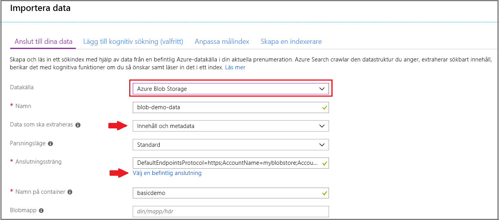
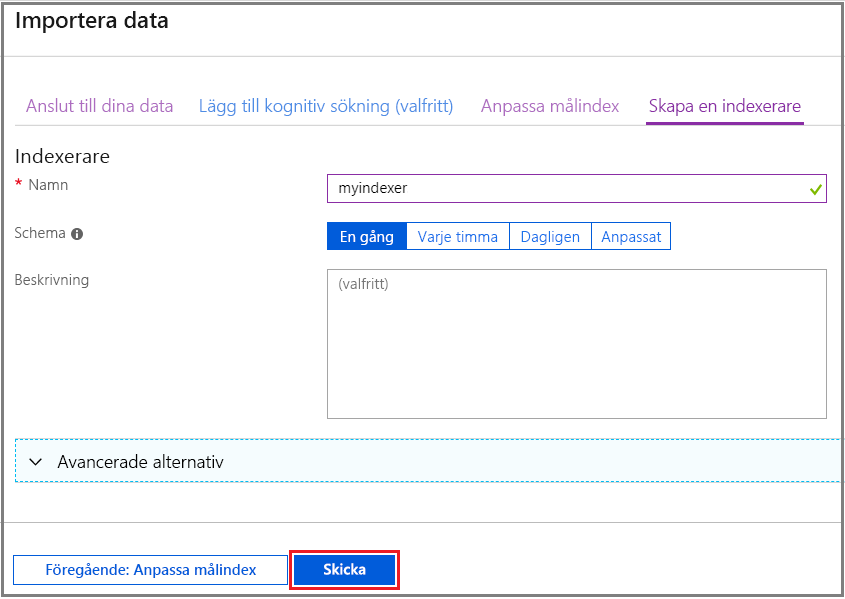

# Snabbstart: Skapa en AI-indexerings pipeline med kognitiva kunskaper i Azure Search

Azure Search integreras med [Cognitive Services](https://azure.microsoft.com/services/cognitive-services/), lägga till extrahering av innehåll, NLP (Natural Language Processing) och bild bearbetnings kunskaper till en Azure Search indexerings pipeline, vilket gör att det inte går att söka efter eller ostrukturerat innehåll mer sökbar. 

Många Cognitive Services resurser – till exempel [OCR](cognitive-search-skill-ocr.md), [språk identifiering](cognitive-search-skill-language-detection.md), [enhets igenkänning](cognitive-search-skill-entity-recognition.md) för att namnge ett fåtal – kan kopplas till en indexerings process. AI-algoritmer för Cognitive Services används för att hitta mönster, funktioner och egenskaper i källdata, returnera strukturer och textinnehåll som kan användas för textsökningslösningar som bygger på Azure Search.

I den här snabbstarten skapar du din första berikningspipeline i [Azure Portal](https://portal.azure.com) utan att skriva en enda rad med kod:

> [!div class="checklist"]
> * Börja med exempeldata i Azure Blob Storage
> * Konfigurera guiden [**Importera data**](search-import-data-portal.md) för kognitiv indexering och berikning 
> * Kör guiden (en entitetskunskap upptäcker personer, platser och organisationer)
> * Använd [**Sökutforskaren**](search-explorer.md) för att köra frågor mot berikade data

Den här snabb starten körs på den kostnads fria tjänsten, men antalet kostnads fria transaktioner är begränsat till 20 dokument per dag. Om du vill köra den här snabb starten mer än en gång per dag kan du använda en mindre fil uppsättning så att du får plats i fler körningar.

> [!NOTE]
> När du utökar omfattningen genom att öka frekvensen för bearbetning, lägga till fler dokument eller lägga till fler AI-algoritmer måste du [koppla en fakturerbar Cognitive Services-resurs](cognitive-search-attach-cognitive-services.md). Avgifterna påförs när API: er anropas i Cognitive Services, och för avbildnings extrahering som en del av dokument-cracking-fasen i Azure Search. Det finns inga kostnader för text extrahering från dokument.
>
> Körningen av inbyggda kunskaper debiteras enligt den befintliga [Cognitive Services betala per](https://azure.microsoft.com/pricing/details/cognitive-services/)användning-pris. Priser för avbildnings extrahering beskrivs på [sidan Azure Search priser](https://go.microsoft.com/fwlink/?linkid=2042400).

Om du inte har en Azure-prenumeration kan du skapa ett [kostnadsfritt konto](https://azure.microsoft.com/free/?WT.mc_id=A261C142F) innan du börjar.

## Förutsättningar

[Skapa en Azure Search tjänst](search-create-service-portal.md) eller [hitta en befintlig tjänst](https://ms.portal.azure.com/#blade/HubsExtension/BrowseResourceBlade/resourceType/Microsoft.Search%2FsearchServices) under din aktuella prenumeration. Du kan använda en kostnads fri tjänst för den här snabb starten.

[Cognitive Services](https://azure.microsoft.com/services/cognitive-services/) innehåller AI. Den här snabb starten innehåller steg för att lägga till dessa resurser i rad när du anger pipelinen. Du behöver inte konfigurera konton i förväg.

Azure-tjänster krävs för att tillhandahålla indata till indexerings pipelinen. Du kan använda vilken data källa som helst som stöds av [Azure Search indexerare](search-indexer-overview.md) förutom Azure Table Storage, vilket inte stöds för AI-indexering. I den här snabb starten används [Azure Blob Storage](https://azure.microsoft.com/services/storage/blobs/) som en behållare för källfiler för data. 

### Konfigurera Azure Blob Service och läsa in exempeldata

1. [Ladda ned exempeldata](https://1drv.ms/f/s!As7Oy81M_gVPa-LCb5lC_3hbS-4) som består av en liten filuppsättning med olika typer av data. 

1. [Registrera dig för Azure Blob Storage](https://docs.microsoft.com/azure/storage/common/storage-quickstart-create-account?tabs=azure-portal), skapa ett lagrings konto, öppna BLOB Services-sidorna och skapa en behållare.  Skapa lagrings kontot i samma region som Azure Search.

1. I den container du skapade klickar du på **Ladda upp** för att ladda upp de exempelfiler som du laddade ned i ett tidigare steg.

   

## Skapa berikningspipelinen

Gå tillbaka till instrumentpanelsidan i Azure Search och klicka på **Importera data** i kommandofältet för att konfigurera kognitiv berikning i fyra steg.

  

### Steg 1: Skapa en datakälla

I **Anslut till dina data** väljer du **Azure Blob Storage** och väljer kontot och containern som du skapade. Namnge datakällan och lämna standardvärdena för resten av inställningarna. 

  

Fortsätt till nästa sida.

  

### Steg 2: Lägg till kognitiva färdigheter

Nu ska du lägga till berikningssteg till indexeringspipelinen. Om du inte har en resurs för Cognitive Services kan du registrera dig för en kostnadsfri version som ger dig 20 transaktioner per dag. Exempeldata består av 14 filer, så din dagliga allokering kommer främst att användas när du kör den här guiden.

1. Expandera **Bifoga Cognitive Services** för att visa alternativ för resursindelning av API:er för Cognitive Services. För den här självstudiekursen kan du använda den **kostnadsfria** resursen.

   

2. Expandera **Lägg till berikanden** och välj färdigheter som utför bearbetning av naturligt språk. I den här snabbstarten väljer du entitetsigenkänning för personer, organisationer och platser.

   

   Portalen ger inbyggda kunskaper för OCR-bearbetning och textanalys. På portalen körs en kunskapsuppsättning mot ett enda källfält. Det kan verka som ett litet mål, men för Azure-blobar innehåller fältet `content` merparten av blobdokumentet (till exempel ett Word-dokument eller en PowerPoint-presentation). Därför är det här fältet idealiskt, eftersom allt innehåll i en blob finns där.

3. Fortsätt till nästa sida.

   

> [!NOTE]
> Kunskaper för bearbetning av naturligt språk körs på textinnehåll i exempeldatamängden. Eftersom vi inte valde OCR-alternativet bearbetas inte JPEG- och PNG-filerna som finns i exempeldatauppsättningen i den här snabbstarten. 

### Steg 3: Konfigurera indexet

Guiden kan vanligtvis härleda ett standardindex. I det här steget kan du visa det skapade indexets schema och ändra inställningar om det behövs. Nedan hittar du det skapade standardindexet för demo-Blob-datauppsättningen.

I den här snabbstarten passar guidens standardinställningar bra: 

+ Standardnamnet är *azureblob-index* baserat på datakällans typ. 

+ Standardfält baseras på det ursprungliga källdatafältet (`content`), plus utdatafälten (`people`, `organizations` och `locations`) som skapas av den kognitiva pipelinen. Standarddatatyperna härleds från metadata och datasampling.

+ Standardnyckeln är *metadata_storage_path* (det här fältet innehåller unika värden).

+ Standardattributen är **Hämtningsbart** och **Sökbart** i dessa fält. **Sökbar** anger att det går att söka i ett fält. **Hämtbar** betyder att det kan returneras i resultat. Guiden förutsätter att du vill att dessa fält ska vara hämtningsbara och sökbara, eftersom du har skapat dem via en kompetensuppsättning.

  

Observera genomstrykningen och frågetecknet i attributet **Hämtningsbart** i fältet `content`. I textbaserade blobbdokument innehåller fältet `content` den största delen av filen, som skulle kunna köras som tusentals rader. Om du vill skicka filens innehåll till klientkod, ser du till att **Hämtningsbart** förblir markerat. Annars kan du ta bort attributet i `content` om de extraherade elementen (`people`, `organizations` och `locations`) är tillräckliga för dina syften.

Att ett fält markeras som **Hämtningsbart** innebär inte att fältet *måste* finnas i sökresultaten. Du kan detaljstyra sammansättningen av sökresultat med hjälp av frågeparametern **$select** om du vill ange vilka fält som ska inkluderas. I textintensiva fält som `content`, är parametern **$select** din lösning för att dina programanvändare ska få hanterbara sökresultat, samtidigt som du säkerställer att klientkoden har åtkomst till all information som behövs via attributet **Hämtningsbart**.
  
Fortsätt till nästa sida.

  

### Steg 4: Konfigurera indexeraren

Indexeraren är en övergripande resurs som styr indexeringen. Indexeraren definierar datakällans namn, ett målindex och körningsfrekvensen. Slutresultatet av guiden **Importera data** är alltid en indexerare som du kan köra flera gånger.

På sidan **indexerare** kan du acceptera standardnamnet och använda schemaalternativet **Kör en gång** för att köra det direkt. 

  

Klicka på **Skicka** för att skapa och köra indexeraren samtidigt.

## Övervaka indexering

Berikande steg tar längre tid än en typisk textbaserad indexering. Guiden ska öppna listan med indexerare på översiktssidan så att du kan följa förloppet. För självnavigering går du till översikten över sidan och klickar på **indexerare**.

Varningen beror på att JPG- och PNG-filer är bildfiler, och vi utelämnade OCR-kunskaper från denna pipeline. Du hittar också trunkering av meddelanden. Azure Search begränsar extrahering till 32 000 tecken på den kostnadsfria nivån.

  

Eftersom indexeringen och berikningen kan ta tid rekommenderar vi att du börjar med mindre datamängder. 

## Fråga i Sökutforskaren

När ett index har skapats kan du skicka frågor för att returnera dokument från indexet. Använd **Sökutforskaren** i portalen till att köra frågor och visa resultat. 

1. Klicka på **Sökutforskaren** i kommandofältet på söktjänstens instrumentpanelsida.

1. Välj **Ändra index** längst upp och välj det index som du skapade.

1. Ange en söksträng för att fråga indexet, till exempel `search=Microsoft&searchFields=organizations`.

Resultatet returneras i JSON, som kan vara relativt utförligt och svårläst, särskilt i stora dokument som kommer från Azure-blobar. Om det är svårt att överblicka resultatet använder du CTRL-F för att söka i dokument. För den här frågan kan du söka i JSON för specifika villkor. 

Du kan också använda CTRL-F för att se hur många dokument det finns i en viss resultatuppsättning. För Azure-blobar väljer portalen ”metadata_storage_path” som nyckel eftersom varje värde är unikt för dokumentet. Använd CTRL-F och sök efter ”metadata_storage_path” för att se antalet dokument. 

  

## Lärdomar

Nu har du slutfört din första övning i kognitiv berikad indexering. Syftet med den här snabbstarten var att introducera viktiga begrepp och att vägleda dig genom guiden så att du snabbt kan börja skapa lösningar för kognitiv sökning med dina egna data.

Bland de viktigaste lärdomarna som vi hoppas att du tar med dig är beroendet av Azure-datakällor. Berikad kognitiv sökning är bundet till indexerare, och indexerare är Azure- och källspecifika. I den här snabbstarten används Azure Blob Storage, men det går att använda andra Azure-datakällor. Mer information finns i [Indexerare i Azure Search](search-indexer-overview.md).

En annan viktig aspekt är att kunskaper körs på indatafält. På portalen måste du välja ett enda fält för alla kunskaper. I koden kan indata vara andra fält, eller utdata från en överordnad kunskap.

 Indata för en kunskap mappas till ett utdatafält i ett index. Internt konfigurerar portalen [anteckningar](cognitive-search-concept-annotations-syntax.md) och definierar en [kunskapsuppsättning](cognitive-search-defining-skillset.md), som definierar ordningen på åtgärder och det allmänna flödet. Dessa steg är dolda på portalen, men när du börjar skriva kod blir dessa begrepp viktiga.

Slutligen lärde du dig hur du visar resultat genom att fråga indexet. Vad Azure Search erbjuder är i grunden ett sökbart index, som du kan fråga med [enkel](https://docs.microsoft.com/rest/api/searchservice/simple-query-syntax-in-azure-search) eller [utökad frågesyntax](https://docs.microsoft.com/rest/api/searchservice/lucene-query-syntax-in-azure-search). Ett index som innehåller berikade fält är precis som andra fält. Om du vill använda standardanalysverktyg eller [anpassade analysverktyg](search-analyzers.md), [bedömningsprofiler](https://docs.microsoft.com/rest/api/searchservice/add-scoring-profiles-to-a-search-index), [synonymer](search-synonyms.md), [fasetterade filter](search-filters-facets.md), geo-sökning eller andra Azure Search-funktioner kan du självklart göra det.

## Rensa

När du arbetar med din egen prenumeration är det en bra idé i slutet av ett projekt för att identifiera om du fortfarande behöver de resurser som du har skapat. Resurser som har lämnats igång kostar dig pengar. Du kan ta bort resurser individuellt eller ta bort resurs gruppen för att ta bort hela uppsättningen resurser.

Du kan hitta och hantera resurser i portalen med hjälp av länken **alla resurser** eller **resurs grupper** i det vänstra navigerings fönstret.

Kom ihåg att du är begränsad till tre index, indexerare och data källor om du använder en kostnads fri tjänst. Du kan ta bort enskilda objekt i portalen för att hålla dig under gränsen. 

## Nästa steg

Beroende på hur du har etablerat resursen Cognitive Services, kan du experimentera med indexering och berikning genom att köra guiden igen med olika kunskaper och källdatafält. Om du vill upprepa stegen tar du bort indexet och indexeraren och återskapar sedan indexeraren med en ny kombination av val.

+ Markera det index som du skapade i **Översikt** > **Index** och klicka sedan på **Ta bort**.

+ Dubbelklicka på panelen **Indexerare** i **Översikt**. Leta upp indexeraren som du skapade och ta bort den.

Alternativt kan du återanvända de exempeldata och tjänster som du skapat och lära dig hur du utför samma åtgärder via programmering i nästa självstudiekurs. 

> [!div class="nextstepaction"]
> [Självstudier: Lär dig mer om REST API:er för kognitiv sökning](cognitive-search-tutorial-blob.md)
