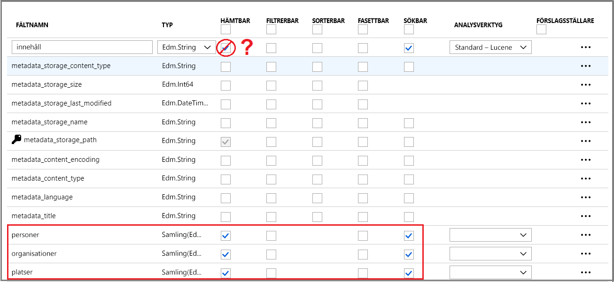
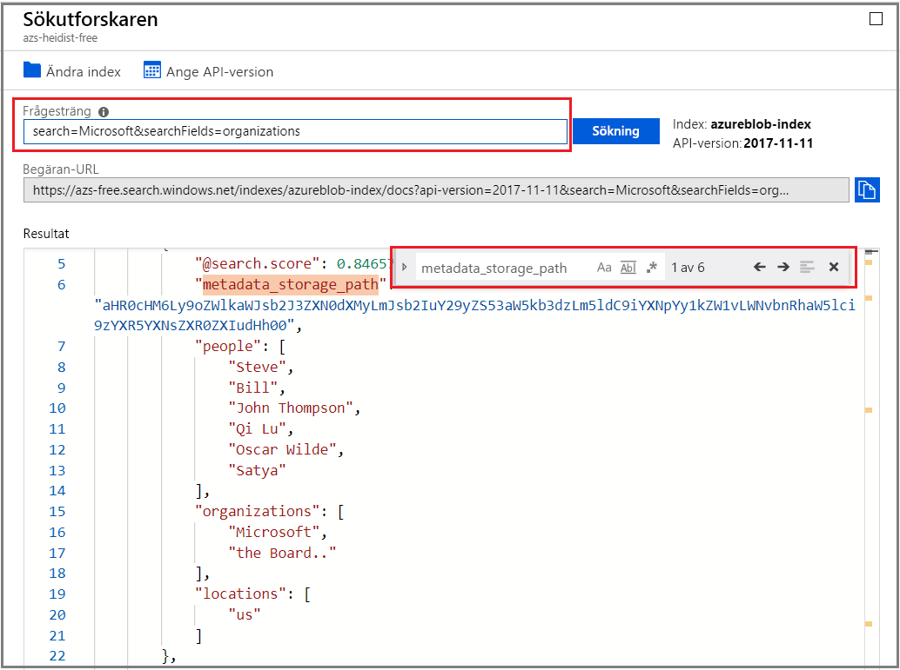

# Quickstart: Create an Azure Cognitive Search cognitive skillset in the Azure portal

A skillset is an AI feature that extracts information and structure from large undifferentiated text or image files, and makes it indexable and searchable for full text search queries in Azure Cognitive Search. 

In this quickstart, you'll combine services and data in the Azure cloud to create the skillset. Once everything is in place, you'll run the **Import data** wizard in the portal to pull it all together. The end result is a searchable index populated with data created by AI processing that you can query in the portal ([Search explorer](search-explorer.md)).

Om du inte har en Azure-prenumeration kan du skapa ett [kostnadsfritt konto](https://azure.microsoft.com/free/?WT.mc_id=A261C142F) innan du börjar.

## Create services and load data

This quickstart uses Azure Cognitive Search, Azure Blob storage, and [Azure Cognitive Services](https://azure.microsoft.com/services/cognitive-services/) for the AI. 

Because the workload is so small, Cognitive Services is tapped behind the scenes to provide free processing for up to 20 transactions daily when invoked from Azure Cognitive Search. As long as you use the sample data we provide, you can skip creating or attaching a Cognitive Services resource.

1. [Ladda ned exempeldata](https://1drv.ms/f/s!As7Oy81M_gVPa-LCb5lC_3hbS-4) som består av en liten filuppsättning med olika typer av data. Unzip the files.

1. [Create an Azure storage account](https://docs.microsoft.com/azure/storage/common/storage-quickstart-create-account?tabs=azure-portal) or [find an existing account](https://ms.portal.azure.com/#blade/HubsExtension/BrowseResourceBlade/resourceType/Microsoft.Storage%2storageAccounts/) under your current subscription. 

   Choose the same region as Azure Cognitive Search. Choose the StorageV2 (general purpose V2) account type if you want to try out the knowledge store feature later, in another walkthrough. Otherwise, choose any type.

1. Open the Blob services pages and create a container. You can use the default public access level. 

1. In container, click **Upload** to upload the sample files you downloaded in the first step. Notice that you have a wide range of content types, including images and application files that are not full text searchable in their native formats.

   

1. [Create an Azure Cognitive Search service](search-create-service-portal.md) or [find an existing service](https://ms.portal.azure.com/#blade/HubsExtension/BrowseResourceBlade/resourceType/Microsoft.Search%2FsearchServices) under the same subscription. You can use a free service for this quickstart.

<!-- 1. You are almost done with this resource, but before you leave these pages, use a link on the left navigation pane to open the **Access Keys** page. In many tutorials, especially those that use the REST API, you will need a connection string to retrieve data from Blob storage. A connection string looks similar to the following example: `DefaultEndpointsProtocol=https;AccountName=<YOUR-ACCOUNT-NAME>;AccountKey=<YOUR-ACCOUNT-KEY>;EndpointSuffix=core.windows.net` -->

You are now ready to move on the Import data wizard.

## Run the Import data wizard

In the search service Overview page, click **Import data** on the command bar to set up cognitive enrichment in four steps.

  

### Steg 1: Skapa en datakälla

1. In **Connect to your data**, choose **Azure Blob storage**, select the Storage account and container you created. Namnge datakällan och lämna standardvärdena för resten av inställningarna. 

   

1. Fortsätt till nästa sida.

### Steg 2: Lägga till kognitiva kunskaper

Next, add cognitive skills to invoke natural language processing. The sample data consists of 12 files, so the free allotment of 20 transaction on Cognitive Services is sufficient for this quickstart. Because we aren't using OCR, only the non-image files will be counted, cracked, and used in this process.

1. For this quickstart, we are using the **Free** Cognitive Services resource.

   

1. Expand **Add skills** and select skills that perform natural language processing. I den här snabbstarten väljer du entitetsigenkänning för personer, organisationer och platser.

   

1. Accept the default source field: `content`. This might seem like a small target, but for Azure blobs the `content` field contains most of the blob document (for example, a Word doc or PowerPoint deck), which makes it a good candidate.

1. Fortsätt till nästa sida.

> [!NOTE]
> Kunskaper för bearbetning av naturligt språk körs på textinnehåll i exempeldatamängden. Eftersom vi inte valde OCR-alternativet bearbetas inte JPEG- och PNG-filerna som finns i exempeldatauppsättningen i den här snabbstarten. 

### Steg 3: Konfigurera indexet

In Azure Cognitive Search, an index contains your searchable content and the **Import data** wizard can usually create the schema for you by sampling the data source. In this step, review the generated schema and potentially revise any settings. Below is the default schema created for the demo Blob data set.

I den här snabbstarten passar guidens standardinställningar bra: 

+ Standardnamnet är *azureblob-index* baserat på datakällans typ. 

+ Default fields are based on the original source data field (`content`), plus the output fields (`people`, `organizations`, and `locations`) created by the cognitive skills. Standarddatatyperna härleds från metadata och datasampling.

+ Default document key is *metadata_storage_path* (selected because the field contains unique values).

+ Standardattributen är **Hämtningsbart** och **Sökbart** i dessa fält. **Sökbar** anger att det går att söka i ett fält. **Hämtbar** betyder att det kan returneras i resultat. Guiden förutsätter att du vill att dessa fält ska vara hämtningsbara och sökbara, eftersom du har skapat dem via en kompetensuppsättning.

  

Observera genomstrykningen och frågetecknet i attributet **Hämtningsbart** i fältet `content`. I textbaserade blobbdokument innehåller fältet `content` den största delen av filen, som skulle kunna köras som tusentals rader. Om du vill skicka filens innehåll till klientkod, ser du till att **Hämtningsbart** förblir markerat. Annars kan du ta bort attributet i `content` om de extraherade elementen (`people`, `organizations` och `locations`) är tillräckliga för dina syften.

Att ett fält markeras som **Hämtningsbart** innebär inte att fältet *måste* finnas i sökresultaten. Du kan detaljstyra sammansättningen av sökresultat med hjälp av frågeparametern **$select** om du vill ange vilka fält som ska inkluderas. I textintensiva fält som `content`, är parametern **$select** din lösning för att dina programanvändare ska få hanterbara sökresultat, samtidigt som du säkerställer att klientkoden har åtkomst till all information som behövs via attributet **Hämtningsbart**.
  
Fortsätt till nästa sida.

### Steg 4: Konfigurera indexeraren

Indexeraren är en övergripande resurs som styr indexeringen. Indexeraren definierar datakällans namn, ett målindex och körningsfrekvensen. The **Import data** wizard creates several objects, and of them is always an indexer that you can run repeatedly.

1. In the **Indexer** page, you can accept the default name and click the **Once** schedule option to run it immediately. 

   

1. Klicka på **Skicka** för att skapa och köra indexeraren samtidigt.

## Monitor status

Cognitive skills indexing takes longer to complete than typical text-based indexing. To monitor progress, go to the Overview page and click **Indexers** in the middle of page.

The warning occurs because JPG and PNG image files are in the data source, and we omitted the OCR skill from this pipeline. Du hittar också trunkering av meddelanden. Extraction is limited to 32,000 characters on the Free tier.

  

Eftersom indexeringen och berikningen kan ta tid rekommenderar vi att du börjar med mindre datamängder. 

In the Azure portal, you can also monitor the Notifications activity log for a clickable **Azure Cognitive Search notification** status link. Execution may take several minutes to complete.

## Fråga i Sökutforskaren

När ett index har skapats kan du skicka frågor för att returnera dokument från indexet. Använd **Sökutforskaren** i portalen till att köra frågor och visa resultat. 

1. Klicka på **Sökutforskaren** i kommandofältet på söktjänstens instrumentpanelsida.

1. Välj **Ändra index** längst upp och välj det index som du skapade.

1. Ange en söksträng för att fråga indexet, till exempel `search=Microsoft&searchFields=Organizations`.

Resultatet returneras i JSON, som kan vara relativt utförligt och svårläst, särskilt i stora dokument som kommer från Azure-blobar. Om det är svårt att överblicka resultatet använder du CTRL-F för att söka i dokument. För den här frågan kan du söka i JSON för specifika villkor. 

Du kan också använda CTRL-F för att se hur många dokument det finns i en viss resultatuppsättning. För Azure-blobar väljer portalen ”metadata_storage_path” som nyckel eftersom varje värde är unikt för dokumentet. Använd CTRL-F och sök efter ”metadata_storage_path” för att se antalet dokument. 

  

## Lärdomar

You've now created your first skillset and learned important concepts useful for prototyping an enriched search solution using your own data.

Bland de viktigaste lärdomarna som vi hoppas att du tar med dig är beroendet av Azure-datakällor. A skillset is bound to an indexer, and indexers are Azure and source-specific. I den här snabbstarten används Azure Blob Storage, men det går att använda andra Azure-datakällor. For more information, see [Indexers in Azure Cognitive Search](search-indexer-overview.md).

En annan viktig aspekt är att kunskaper körs på indatafält. På portalen måste du välja ett enda fält för alla kunskaper. I koden kan indata vara andra fält, eller utdata från en överordnad kunskap.

Output is directed to a search index, and there is a mapping between name-value pairs created during indexing and individual fields in your index. Internt konfigurerar portalen [anteckningar](cognitive-search-concept-annotations-syntax.md) och definierar en [kunskapsuppsättning](cognitive-search-defining-skillset.md), som definierar ordningen på åtgärder och det allmänna flödet. Dessa steg är dolda på portalen, men när du börjar skriva kod blir dessa begrepp viktiga.

Finally, you learned that can verify content by querying the index. In the end, what Azure Cognitive Search provides is a searchable index, which you can query using either the [simple](https://docs.microsoft.com/rest/api/searchservice/simple-query-syntax-in-azure-search) or [fully extended query syntax](https://docs.microsoft.com/rest/api/searchservice/lucene-query-syntax-in-azure-search). Ett index som innehåller berikade fält är precis som andra fält. If you want to incorporate standard or [custom analyzers](search-analyzers.md), [scoring profiles](https://docs.microsoft.com/rest/api/searchservice/add-scoring-profiles-to-a-search-index), [synonyms](search-synonyms.md), [faceted filters](search-filters-facets.md), geo-search, or any other Azure Cognitive Search feature, you can certainly do so.

## Rensa resurser

When you're working in your own subscription, it's a good idea at the end of a project to identify whether you still need the resources you created. Resources left running can cost you money. You can delete resources individually or delete the resource group to delete the entire set of resources.

You can find and manage resources in the portal, using the **All resources** or **Resource groups** link in the left-navigation pane.

If you are using a free service, remember that you are limited to three indexes, indexers, and data sources. You can delete individual items in the portal to stay under the limit. 

> [!Tip]
> If you want to repeat this exercise or try a different AI enrichment walkthrough, delete the indexer in the portal. Deleting the indexer resets the free daily transaction counter back to zero for Cognitive Services processing.

## Nästa steg

You can create skillsets using the portal, .NET SDK, or REST API. To further your knowledge, try the REST API using Postman and more sample data.

> [!div class="nextstepaction"]
> [Tutorial: Add structure to "unstructured content" with AI enrichment](cognitive-search-tutorial-blob.md)