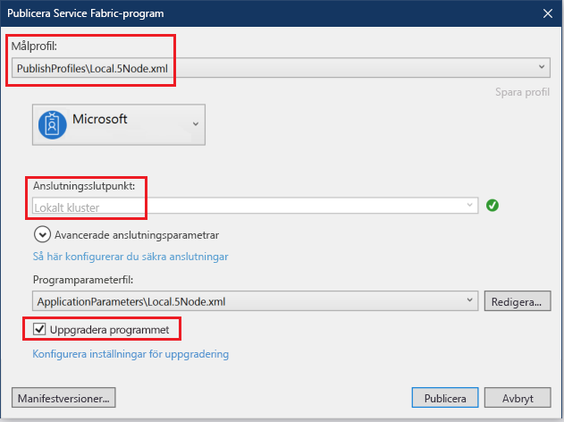
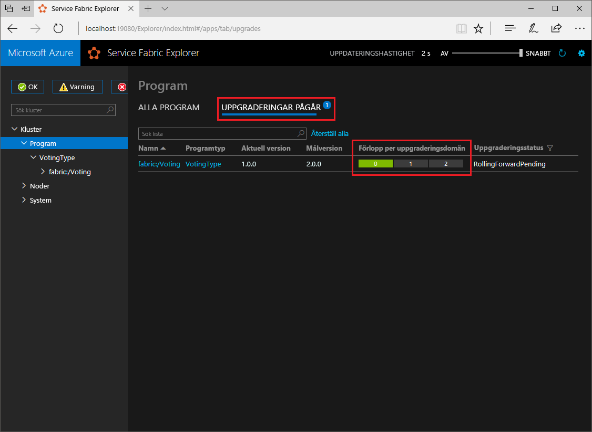

# <a name="quickstart-deploy-a-net-reliable-services-application-to-service-fabric"></a>Snabbstart: Distribuera en .NET-app (tillförlitliga tjänster) till Service Fabric

Azure Service Fabric är en plattform för distribuerade system för distribution och hantering av skalbara och tillförlitliga mikrotjänster och containrar.

Den här snabbstarten visar hur du distribuerar ditt första .NET-program i Service Fabric. När du är klar har du ett röstningsprogam med en ASP.NET Core-klientdel som sparar röstningsresultat i en tillståndskänslig serverdelstjänst i klustret.


Med det här programmet får du lära dig att:

* Skapa ett program med .NET och Service Fabric
* Använd ASP.NET Core som en front webb
* Lagra programdata i en tillståndskänslig tjänst
* Felsöka programmet lokalt
* Skala ut programmet över flera noder
* Utföra en löpande programuppgradering

## <a name="prerequisites"></a>Krav

För att slutföra den här snabbstarten behöver du:

1. [Installera Visual Studio 2019](https://www.visualstudio.com/) med arbets belastningarna **Azure Development** och **ASP.net och webb utveckling** .
2. [Installera Git](https://git-scm.com/)
3. [Installera Microsoft Azure Service Fabric SDK](https://www.microsoft.com/web/handlers/webpi.ashx?command=getinstallerredirect&appid=MicrosoftAzure-ServiceFabric-CoreSDK)
4. Kör följande kommando för att aktivera Visual Studio för distribution till det lokala Service Fabric-klustret:

   ```powershell
   Set-ExecutionPolicy -ExecutionPolicy Unrestricted -Force -Scope CurrentUser
   ```
    
## <a name="build-a-cluster"></a>Bygga ett kluster

När du har installerat runtime, SDK:er, Visual Studio Tools, Docker och har Docker igång skapar du ett lokalt utvecklingskluster med fem noder.

> [!Note]
> Anledningen till att ha Docker körandes när du skapar klustret är att klustret skapas med containerfunktioner aktiverade. Om Docker inte körs måste du återskapa klustret för att aktivera containerfunktioner.
> Även om det är inte nödvändigt för den här specifika snabbstarten ingår anvisningen om att ha Docker körandes när du skapar klustret som bästa praxis.
> Testa att Docker körs genom att öppna ett terminalfönster och köra `docker ps` för att se om det uppstår något fel. Om svaret inte indikerar något fel körs Docker och du är redo att skapa ett kluster.
>
> [Konfigurera Windows 10 eller Windows Server för behållare](https://docs.microsoft.com/virtualization/windowscontainers/quick-start/set-up-environment?tabs=Windows-10-Client)

1. Öppna ett nytt, upphöjt PowerShell-fönster som administratör.
2. Kör följande PowerShell-kommando för att skapa till ett utvecklingskluster:

   ```powershell
   . "C:\Program Files\Microsoft SDKs\Service Fabric\ClusterSetup\DevClusterSetup.ps1"
   ```
3. Kör följande kommando för att starta det lokala klusterhanteringsverktyget:

   ```powershell
   . "C:\Program Files\Microsoft SDKs\Service Fabric\Tools\ServiceFabricLocalClusterManager\ServiceFabricLocalClusterManager.exe"
   ```

>[!NOTE]
> Exempelprogrammet i denna snabbstart använder funktioner som inte är tillgängliga på Windows 7.
>

## <a name="download-the-sample"></a>Hämta exemplet

Kör följande kommando i ett kommandofönster för att klona databasen för exempelappen till den lokala datorn.

```git
git clone https://github.com/Azure-Samples/service-fabric-dotnet-quickstart
```

## <a name="run-the-application-locally"></a>Kör programmet lokalt

Högerklicka på Visual Studio-ikonen på startmenyn och välj **Kör som administratör**. Om du vill koppla fel sökaren till dina tjänster måste du köra Visual Studio som administratör.

Öppna Visual Studio-lösningen **Voting.sln** från den lagringsplats du har klonat.

Röstningsprogrammet är som standard inställt på att lyssna på port 8080.  Programporten ställs in i filen */VotingWeb/PackageRoot/ServiceManifest.xml*.  Du kan ändra programporten genom att uppdatera attributet **Port** för elementet **Slutpunkt**.  Om du vill distribuera och köra programmet lokalt måste programporten vara öppen och tillgänglig på datorn.  Om du ändrar program porten ersätter du det nya programmets port värde för "8080" i den här artikeln.

Distribuera programmet genom att trycka på **F5**.

> [!NOTE]
> I ditt Visual Studio-utdatafönster visas ett meddelande om att programmets URL är inte inställd eller inte är en HTTP-/HTTPS-URL och att webbläsaren därför inte öppnas i programmet.  Det här meddelandet anger inte ett fel, utan att webbläsaren inte kommer att startas automatiskt.

När distributionen är klar, startar du en webbläsare och öppnar `http://localhost:8080` för att visa programmets klientdel.


Du kan nu lägga till en uppsättning röstningsalternativ och börja ta emot röster. Programmet körs och lagrar alla data i Service Fabric-klustret, utan att en separat databas krävs.

## <a name="walk-through-the-voting-sample-application"></a>Gå igenom exempelprogrammet för röstning

Röstningsprogrammet består av två tjänster:

* Webbklienttjänst (VotingWeb) – En webbklienttjänst för ASP.NET Core som används av webbsidan och visar webb-API:er för att kommunicera med serverdelstjänsten.
* Serverdelstjänst (VotingData) – En webbtjänst för ASP.NET Core som visar en API för att lagra röstningsresultat i en tillförlitlig ordlista på disken.


När du rösta i programmet inträffar följande händelser:

1. Ett JavaScript skickar röstningsbegäran till webb-API i webbklienttjänsten som en HTTP PUT-begäran.

2. Webbklienttjänsten använder en proxy för att hitta och vidarebefordra en HTTP PUT-begäran till serverdelstjänsten.

3. Serverdelstjänsten tar den inkommande begäran och lagrar det uppdaterade resultatet i en tillförlitlig ordlista, som replikeras till flera noder i klustret och sparas på disken. Alla programdata lagras i klustret, så det behövs ingen databas.

## <a name="debug-in-visual-studio"></a>Felsökning i Visual Studio

Programmet bör köras som det ska, men du kan använda felsökaren och se hur viktiga delar av programmet fungerar. När du felsöker programmet i Visual Studio använder du ett lokalt Service Fabric utvecklings kluster. Du kan ändra fel söknings upplevelsen för ditt scenario. I det här programmet lagras data i serverdelstjänsten med hjälp av en tillförlitlig ordlista. Visual Studio tar som standard bort programmet när du stoppar felsökningsprogrammet. När programmet tas bort kommer även data i serverdelstjänsten att tas bort. Om du vill spara data mellan felsökningssessionerna kan du ändra **programmets felsökningsläge** som en egenskap i projektet **Voting** i Visual Studio.

Gör så här om du vill se vad som händer i koden:

1. Öppna filen **/VotingWeb/Controllers/VotesController.cs** och konfigurera en brytpunkt i webb-API:ns metod **Put** (rad 69). Du kan söka efter filen i Solution Explorer i Visual Studio.

2. Öppna filen **/VotingData/Controllers/VoteDataController.cs** och konfigurera en brytpunkt i denna webb-API:s metod **Put** (rad 54).

3. Gå tillbaka till webbläsaren och klicka på ett röstningsalternativ eller lägg till ett nytt röstningsalternativ. Du kommer till den första brytpunkten i webbklientdelens api-kontroll.
   * Det här steget är den plats där Java Script i webbläsaren skickar en begäran till webb-API-styrenheten i front-end-tjänsten.

     

   * Skapa först URL:en till ReverseProxy för serverdelstjänsten **(1)**.
   * Skicka sedan HTTP-begäran till ReverseProxy **(2)**.
   * Till sist returneras svaret från serverdelstjänsten till klienten **(3)**.

4. Tryck på **F5** för att fortsätta
   - Om du uppmanas av webbläsaren ska du ge gruppen ServiceFabricAllowedUsers läs- och körbehörighet för felsökningsläge.
   - Du befinner dig nu på Bryt punkten i Server dels tjänsten.

     

   - På den första raden i metoden **(1)** kommer `StateManager` hämta eller lägga till en tillförlitlig ordlista med namnet `counts`.
   - All interaktion med värden i en tillförlitlig ordlista kräver en transaktion, den här använder instruktionen **(2)** som skapar den transaktionen.
   - I transaktionen uppdaterar du värdet för den relevanta nyckeln för röstningsalternativet och utför åtgärden **(3)**. När utförandemetoden returneras uppdateras data i ordlistan och replikeras till andra noder i klustret. Data har nu lagrats i klustret och serverdelstjänsten kan redundansväxla till andra noder och fortfarande ha data tillgängliga.
5. Tryck på **F5** för att fortsätta

Stoppa felsökningssessionen genom att trycka på **Skift + F5**.

## <a name="perform-a-rolling-application-upgrade"></a>Utföra en löpande programuppgradering

När du distribuerar nya uppdateringar till programmet, sprider Service Fabric uppdateringen på ett säkert sätt. Med löpande uppgraderingar slipper du driftstopp under uppgraderingen och du får även automatisk återställning om det uppstår fel.

Gör så här om du vill uppgradera programmet:

1. Öppna filen **/VotingWeb/Views/Home/Index.cshtml** i Visual Studio.
2. Ändra rubriken på sidan genom att lägga till eller uppdatera texten. Du kan till exempel ändra rubriken till "Service Fabric Voting Sample v2".
3. Spara filen.
4. Högerklicka på **Röstning** i Solution Explorer och välj **Publicera**. Dialogrutan Publicera visas.
5. Högerklicka på knappen **Manifestversion** om du vill ändra version för tjänsten och programmet.
6. Ändra versionen av elementet **Kod** under **VotingWebPkg** till exempelvis "2.0.0" och klicka på **Spara**.

    
7. I dialogrutan för att **publicera Service Fabric-program** markerar du **kryssrutan för att uppgradera programmet**.
8.  Ändra **målprofilen** till **PublishProfiles\Local.5Node.xml** och se till att **anslutningsslutpunkten** är inställd på **lokalt kluster**. 
9. Välj **Upgrade the Application** (Uppradera programmet).

    

10. Klicka på **Publicera**.

    Du kan fortfarande använda programmet när uppgraderingen körs. Eftersom du har två instanser av tjänsten som körs i klustret kan en del förfrågningar få en uppgraderad version av programmet, medan andra kan få den gamla versionen.

11. Öppna webbläsaren och bläddra till klusteradressen på port 19080. Till exempel `http://localhost:19080/`.
12. Klicka på noden **Program** i trädvyn och sedan **Pågående uppgraderingar** i det högra fönstret. Du kan se hur uppgraderingen går igenom uppgraderingsdomänerna i klustret och ser till att varje domän fungerar som den ska innan den går vidare till nästa. En uppgraderingsdomän i förloppsfältet visas som grön när domänens hälsotillstånd har verifierats.
    

    Service Fabric gör uppgraderingar på ett säkert sätt genom att vänta två minuter efter uppgradering av tjänsten på varje nod i klustret. Du kan förvänta dig att hela uppgraderingen tar cirka åtta minuter.

## <a name="next-steps"></a>Nästa steg

I den här snabbstarten har du lärt dig att:

* Skapa ett program med .NET och Service Fabric
* Använd ASP.NET Core som en front webb
* Lagra programdata i en tillståndskänslig tjänst
* Felsöka programmet lokalt
* Skala ut programmet över flera noder
* Utföra en löpande programuppgradering

Titta på den här självstudien om du vill veta mer om Service Fabric och .NET:
> [!div class="nextstepaction"]
> [.NET-program på Service Fabric](service-fabric-tutorial-create-dotnet-app.md)
