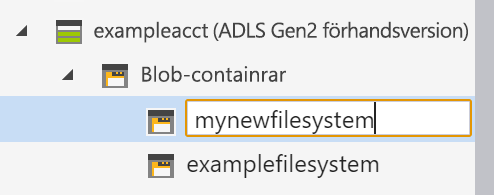

# Use Azure Storage Explorer with Azure Data Lake Storage Gen2

I den här snabbstarten får du lära dig hur du skapar en katalog och en blob med [Azure Storage Explore](https://azure.microsoft.com/features/storage-explorer/). Du får lära dig hur du hämtar bloben till din lokala dator och hur du visar alla blobar i en katalog. Du får också lära dig hur du skapar en ögonblicksbild av en blob, hanterar åtkomstprinciper för kataloger och skapar en signatur för delad åtkomst.

## Krav

[!INCLUDE [storage-quickstart-prereq-include](../../../includes/storage-quickstart-prereq-include.md)]

För den här snabbstarten krävs att du installerar Azure Storage Explorer. Information om hur du installerar Azure Storage Explorer för Windows, Macintosh och Linux finns i [Azure Storage Explorer](https://azure.microsoft.com/features/storage-explorer/).

## Sign in to Storage Explorer

Första gången programmet startas visas fönstret **Microsoft Azure Storage Explorer – anslut**. Storage Explorer erbjuder flera sätt att ansluta till lagringskonton, men för närvarande stöds bara ett sätt för att hantera ACL: er.

|Aktivitet|Syfte|
|---|---|
|Lägga till ett Azure-konto | Omdirigerar dig till din organisations inloggningssida för att autentisera dig i Azure. Det här är för närvarande den enda autentiseringsmetod som stöds om du vill hantera och ange ACL: er. |

Select **Add an Azure Account** and click **Sign in..** . Follow the on-screen prompts to sign into your Azure account.

När anslutningen är klar läses Azure Storage Explorer in med fliken **Utforskaren** öppen. I den här vyn får du information om alla dina lagringskonton i Azure samt lokal lagring som konfigurerats via [Azure Storage-emulatorn](../common/storage-use-emulator.md?toc=%2fazure%2fstorage%2fblobs%2ftoc.json), [Cosmos DB](../../cosmos-db/storage-explorer.md?toc=%2fazure%2fstorage%2fblobs%2ftoc.json) -konton eller [Azure Stack](/azure-stack/user/azure-stack-storage-connect-se?toc=%2fazure%2fstorage%2fblobs%2ftoc.json)miljöer.

## Skapa en container

Blobar laddas alltid upp till en katalog. På så vis kan du ordna grupper av blobar på samma sätt som du ordnar filer i mappar på datorn.

Om du vill skapa en katalog ska du expandera det lagringskonto som du skapade i föregående steg. Välj **Blob container** (Blobbehållare), högerklicka och välj **Create Blobcontainer** (Skapa blobbehållare). Enter the name for your container. When complete, press **Enter** to create the container. När blobkatalogen har skapats visas den i mappen **Blog container** (Blobbehållare) för det valda lagringskontot.

## Ladda upp blobar till katalogen

Blob Storage stöder blockblobar, tilläggsblobar och sidblobar. VHD-filer som används för att backa upp virtuella datorer i IaaS är sidblobar. Tilläggsblobar används för loggning, till exempel när du vill skriva till en fil och sedan fortsätta att lägga till mer information. De flesta filer som lagras i Blob Storage är blockblobar.

Välj **Ladda upp** i menyfliksområdet för kataloger. Den här åtgärden ger dig möjlighet att ladda upp en mapp eller fil.

Välj de filer eller mappar du vill ladda upp. Välj **typ av blob**. Godkända alternativ är **Append**, **Page** eller **Block** blob (tilläggs-, sid- eller blockblob).

Om du laddar upp en VHD- eller VHDX-fil, välj **Upload .vhd/.vhdx files as page blobs (recommended)** (Ladda upp VHD-/VHDX-filer som sidblobar (rekommenderas)).

I fältet **Upload to folder (optional)** (Ladda upp i mapp (valfritt)) kan du ange ett mappnamn för att lagra filerna eller mapparna i en mapp under katalogen. Om ingen mapp anges laddas filerna upp direkt under katalogen.

När du väljer **OK** sätts de valda filerna i kö för uppladdning och varje fil laddas upp. När uppladdningen är klar visas resultatet i fönstret **Activities** (Aktiviteter).

## Visa blobar i en katalog

I programmet **Azure Storage Explorer** väljer du en katalog under ett lagringskonto. I huvudrutan visas en lista över blobarna i den valda katalogen.

## Ladda ned blobbar

Ladda ned blobar med hjälp av **Azure Storage Explorer** genom att markera en blob och välja **Download** (Ladda ned) i menyfliksområdet. En fildialogruta öppnas och där du kan ange ett filnamn. Välj **Spara** att starta nedladdningen av en blob till den lokala platsen.

## Nästa steg

I den här snabbstarten har du lärt dig hur du överför filer mellan en lokal disk och Azure Blob Storage med **Azure Storage Explorer**. För mer information om hur du anger ACL: er för filer och kataloger ska du fortsätta till avsnittet Så här anger du ACL:er för filer och kataloger.

> [!div class="nextstepaction"]
> [Så här anger du ACL:er för filer och kataloger](data-lake-storage-how-to-set-permissions-storage-explorer.md)
