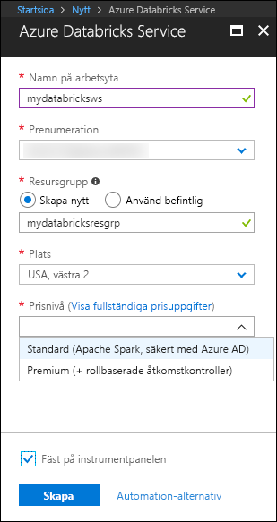
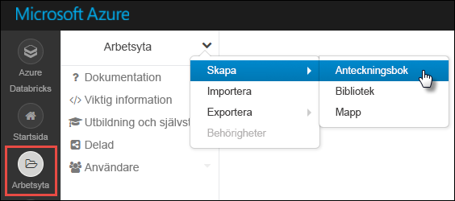
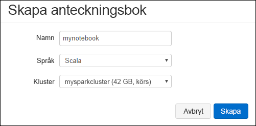
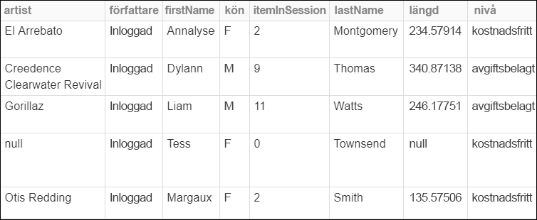
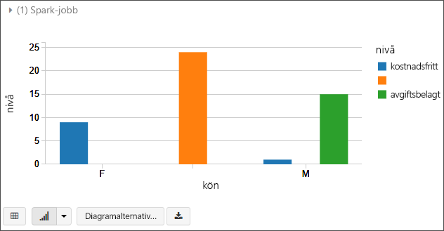
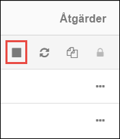

# <a name="quickstart-analyze-data-in-azure-data-lake-storage-gen2-by-using-azure-databricks"></a>Snabbstart: Analysera data i Azure Data Lake Storage Gen2 med hjälp av Azure Databricks

Den här självstudien visar hur du kör ett Apache Spark-jobb med hjälp av Azure Databricks för att utföra analyser på data som lagras i ett lagringskonto med Azure Data Lake Storage Gen2 aktiverat.

Som en del av Spark-jobbet analyserar du prenumerationsdata för en radiokanal, så att du får insikter om kostnadsfri/betald användning baserat på demografiska data.

Om du inte har en Azure-prenumeration kan du [skapa ett kostnadsfritt konto ](https://azure.microsoft.com/free/) innan du börjar.

## <a name="prerequisites"></a>Nödvändiga komponenter

- [Skapa ett lagringskonto med Data Lake Storage Gen2 aktiverat](data-lake-storage-quickstart-create-account.md)

<a id="config"/>

## <a name="get-the-name-of-your-storage-account"></a>Hämta namnet på ditt lagringskonto

Du kan få fram namnet på ditt lagringskonto i Azure-portalen genom att välja **Alla tjänster** och filtrera på *lagring*. Välj sedan **Lagringskonton** och leta rätt på ditt lagringskonto.

Klistra in det namnet i en textfil. Du behöver det snart.

<a id="service-principal"/>

## <a name="create-a-service-principal"></a>Skapa ett huvudnamn för tjänsten

Skapa ett huvudnamn för tjänsten genom att följa anvisningarna i det här avsnittet: [Anvisningar: Använd portalen för att skapa ett Azure AD-program och huvudnamn för tjänsten som kan komma åt resurser](https://docs.microsoft.com/azure/active-directory/develop/howto-create-service-principal-portal).

Det finns några saker som du måste göra när du utför stegen i den här artikeln.

:heavy_check_mark: När du utför stegen i avsnittet [Tilldela programmet till en roll](https://docs.microsoft.com/azure/active-directory/develop/howto-create-service-principal-portal#assign-the-application-to-a-role) i artikeln måste du tilldela programmet till **deltagarrollen för bloblagring**.

:heavy_check_mark: När du utför stegen i avsnittet [Hämta värden för att logga in](https://docs.microsoft.com/azure/active-directory/develop/howto-create-service-principal-portal#get-values-for-signing-in) i artikeln klistrar du in värdena för klient-ID, program-ID och autentiseringsnyckel i en textfil. Du kommer att behöva dem snart.

## <a name="create-an-azure-databricks-workspace"></a>Skapa en Azure Databricks-arbetsyta

I det här avsnittet skapar du en Azure Databricks-arbetsyta med Azure-portalen.

1. Välj **Skapa en resurs** > **Analys** > **Azure Databricks** i Azure-portalen.

    

2. Under **Azure Databricks-tjänst** anger du värden för att skapa en Databricks-arbetsyta.

    

    Ange följande värden:

    |Egenskap  |Beskrivning  |
    |---------|---------|
    |**Namn på arbetsyta**     | Ange ett namn för Databricks-arbetsytan        |
    |**Prenumeration**     | I listrutan väljer du din Azure-prenumeration.        |
    |**Resursgrupp**     | Ange om du vill skapa en ny resursgrupp eller använda en befintlig. En resursgrupp är en container som innehåller relaterade resurser för en Azure-lösning. Mer information finns i [översikten över Azure-resursgrupper](../../azure-resource-manager/resource-group-overview.md). |
    |**Plats**     | Välj **USA, västra 2**. Du kan välja en annan offentlig region om du vill.        |
    |**Prisnivå**     |  Välj mellan **Standard** och **Premium**. Mer information om de här nivåerna finns på [prissättningssidan för Databricks](https://azure.microsoft.com/pricing/details/databricks/).       |

    Markera **Fäst på instrumentpanelen** och klicka sedan på **Skapa**.

3. Det tar en stund att skapa arbetsytan. Medan arbetsytan skapas visas panelen för att **skicka distribution för Azure Databricks** på höger sida. Du kanske behöver rulla åt höger på instrumentpanelen för att se panelen. En förloppsindikator visas också längst upp på skärmen. Båda dessa områden visar förloppet.

    

## <a name="create-a-spark-cluster-in-databricks"></a>Skapa ett Spark-kluster i Databricks

1. I Azure-portalen går du till Databricks-arbetsytan som du skapade. Välj sedan **Starta arbetsyta**.

2. Du omdirigeras till Azure Databricks-portalen. Välj **Nytt** > **Kluster** i Portal.

    

3. På sidan **Nytt kluster** anger du värdena för att skapa ett kluster.

    

    Godkänn alla övriga standardvärden, förutom följande:

    * Ange ett namn för klustret.
    * Skapa ett kluster med körningen **5.1**.
    * Se till att markera kryssrutan **Avsluta efter 120 minuters inaktivitet**. Ange en varaktighet (i minuter) för att avsluta klustret om klustret inte används.

4. Välj **Skapa kluster**. När klustret körs kan du ansluta anteckningsböcker till klustret och köra Spark-jobb.

Mer information om att skapa kluster finns i [Skapa ett Spark-kluster i Azure Databricks](https://docs.azuredatabricks.net/user-guide/clusters/create.html).

## <a name="create-storage-account-file-system"></a>Skapa filsystem för lagringskonto

I det här avsnittet skapar du en anteckningsbok på Azure Databricks-arbetsytan och kör sedan kodfragment för att konfigurera lagringskontot.

1. Gå till arbetsytan Azure Databricks som du skapat i [Azure-portalen](https://portal.azure.com). Välj sedan **Starta arbetsyta**.

2. Välj **Arbetsyta** i det vänstra fönstret. I listrutan **Arbetsyta** väljer du **Skapa** > **Anteckningsbok**.

    

3. Ge anteckningsboken ett namn i dialogrutan **Skapa anteckningsbok**. Välj **Scala** som språk och välj sedan det Spark-kluster som du skapade tidigare.

    

    Välj **Skapa**.

4. Kopiera och klistra in följande kodblock i den första cellen, men kör inte den här koden än.

   ```scala
   spark.conf.set("fs.azure.account.auth.type.<storage-account-name>.dfs.core.windows.net", "OAuth")
   spark.conf.set("fs.azure.account.oauth.provider.type.<storage-account-name>.dfs.core.windows.net", "org.apache.hadoop.fs.azurebfs.oauth2.ClientCredsTokenProvider")
   spark.conf.set("fs.azure.account.oauth2.client.id.<storage-account-name>.dfs.core.windows.net", "<application-id>")
   spark.conf.set("fs.azure.account.oauth2.client.secret.<storage-account-name>.dfs.core.windows.net", "<authentication-key>")
   spark.conf.set("fs.azure.account.oauth2.client.endpoint.<storage-account-name>.dfs.core.windows.net", "https://login.microsoftonline.com/<tenant-id>/oauth2/token")
   spark.conf.set("fs.azure.createRemoteFileSystemDuringInitialization", "true")
   dbutils.fs.ls("abfss://<file-system-name>@<storage-account-name>.dfs.core.windows.net/")
   spark.conf.set("fs.azure.createRemoteFileSystemDuringInitialization", "false")

   ```
 
    > [!NOTE]
    > Det här kodblocket kommer åt Data Lake Gen2-slutpunkten direkt genom OAuth, men det finns även andra sätt att ansluta Databricks-arbetsytan till ditt Data Lake Storage Gen2-konto. Du kan till exempel montera filsystemet med hjälp av OAuth eller tillämpa direktåtkomst med delad nyckel. <br>Exempel på de här metoderna finns i artikeln om [Azure Data Lake Storage Gen2](https://docs.azuredatabricks.net/spark/latest/data-sources/azure/azure-datalake-gen2.html) på Azure Databricks-webbplatsen.

5. I det här kodblocket ersätter du platshållarvärdena `storage-account-name`, `application-id`, `authentication-id` och `tenant-id` med de värden som du hämtade när du genomförde stegen i avsnitten [Get the name of your storage account](#config) (Hämta namnet på lagringskontot) och [Skapa ett huvudnamn för tjänsten](#service-principal) i den här artikeln.  Ange det namn du vill använda för filsystemet med platshållarvärdet `file-system-name`.

6. Tryck på **SKIFT + RETUR** för att köra koden i det här blocket.

## <a name="ingest-sample-data"></a>Mata in exempeldata

Innan du börjar med det här avsnittet måste du slutföra följande krav:

Ange följande kod i en cell i en arbetsbok:

    %sh wget -P /tmp https://raw.githubusercontent.com/Azure/usql/master/Examples/Samples/Data/json/radiowebsite/small_radio_json.json

Kör koden genom att trycka på **SKIFT + RETUR** i cellen.

I en ny cell nedanför denna anger du följande kod, och ersätter värdena inom hakparentes med samma värden som du använde tidigare:

    dbutils.fs.cp("file:///tmp/small_radio_json.json", "abfss://<file-system>@<account-name>.dfs.core.windows.net/")

Kör koden genom att trycka på **SKIFT + RETUR** i cellen.

## <a name="run-a-spark-sql-job"></a>Köra ett Spark SQL-jobb

Utför följande åtgärder för att köra ett Spark SQL-jobb på data.

1. Kör en SQL-instruktion för att skapa en temporär tabell med data från exempel-JSON-datafilen **small_radio_json.json**. I följande kodfragment ersätter du platshållarens värden med namnet på ditt filsystem och namnet på ditt lagringskonto. Använd anteckningsboken du skapade tidigare för att klistra in följande kodfragment i en kodcell och tryck sedan på SKIFT+RETUR.

    ```sql
    %sql
    DROP TABLE IF EXISTS radio_sample_data;
    CREATE TABLE radio_sample_data
    USING json
    OPTIONS (
     path  "abfss://<file-system-name>@<storage-account-name>.dfs.core.windows.net/<PATH>/small_radio_json.json"
    )
    ```

    När kommandot har slutförts har du alla data från JSON-filen som en tabell i Databricks-klustret.

    Med det magiska språkkommandot `%sql` kan du köra en SQL-kod från anteckningsboken även om anteckningsboken är av en annan typ. Mer information finns i [Mixing languages in a notebook](https://docs.azuredatabricks.net/user-guide/notebooks/index.html#mixing-languages-in-a-notebook) (Blanda språk i en anteckningsbok).

2. Nu ska vi titta på en ögonblicksbild av JSON-exempeldata för att bättre förstå den fråga som körs. Klistra in följande kodfragment i kodcellen och tryck på **SKIFT + RETUR**.

    ```sql
    %sql
    SELECT * from radio_sample_data
    ```

3. Du ser en tabellvy som i följande skärmbild (endast vissa kolumner visas):

    

    Bland annat fångar exempeldata in könet på en radiokanals målgrupp (kolumnnamn, **kön**) och om deras prenumeration är kostnadsfri eller om den betalas (kolumnnamn, **nivå**).

4. Nu skapar du en visuell representation av dessa data för att visa hur många användare av varje kön som har kostnadsfria konton och hur många som är betalande prenumeranter. Längst ned i tabellvyn klickar du på ikonen **Stapeldiagram** och sedan på **Ritalternativ**.

    

5. I **Anpassa ritning** drar och släpper du värden enligt skärmbilden.

    

    - Ställ in **Nycklar** på **kön**.
    - Ställ in **Seriegrupperingar** på **nivå**.
    - Ställ in **Värden** på **nivå**.
    - Ställ in **Sammansättning** på **COUNT** (Antal).

6. Klicka på **Verkställ**.

7. Utdata visar den visuella representationen som visas i följande skärmbild:

     

## <a name="clean-up-resources"></a>Rensa resurser

Du kan avsluta klustret när du är klar med den här artikeln. I Azure Databricks-arbetsytan väljer du **Kluster** och letar reda på det kluster som du vill avsluta. För markören över de tre punkterna under kolumnen **Åtgärder**. Välj sedan ikonen **Avsluta**.



Om du inte manuellt avslutar klustret kommer det att stoppas automatiskt, förutsatt att du har markerat kryssrutan **Avsluta efter \_\_ minuters inaktivitet** när klustret skapades. Om du väljer det här alternativet avslutas klustret när det har varit inaktivt i den tid som angetts.

## <a name="next-steps"></a>Nästa steg

I den här artikeln skapade du ett Spark-kluster i Azure Databricks och körde ett Spark-jobb med hjälp av data i ett lagringskonto med Data Lake Storage Gen2 aktiverat. Du kan också titta på [Spark-datakällor](https://docs.azuredatabricks.net/spark/latest/data-sources/index.html) för att lära dig att importera data från andra datakällor till Azure Databricks. Gå till nästa artikel om du vill lära dig hur du utför en ETL-åtgärd (extrahera, transformera och läsa in data) med Azure Databricks.

> [!div class="nextstepaction"]
>[Extrahera, transformera och läsa in data med Azure Databricks](../../azure-databricks/databricks-extract-load-sql-data-warehouse.md)
