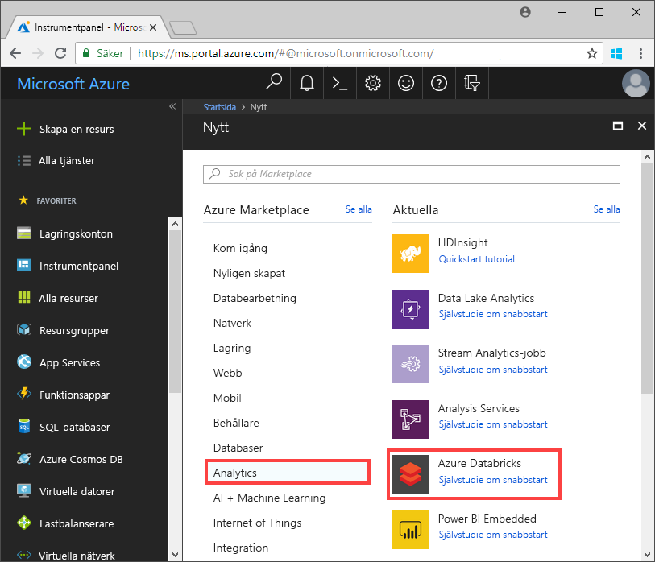
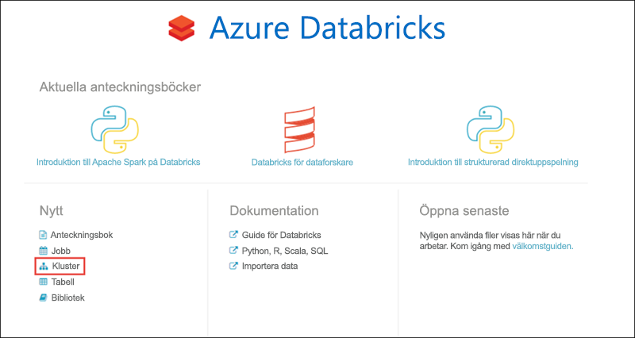
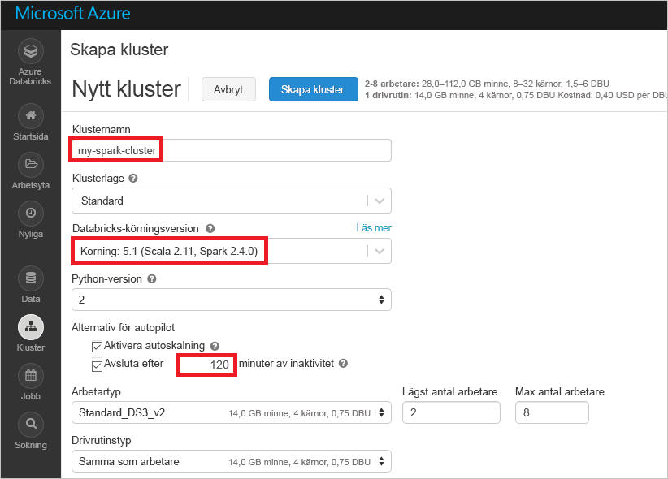
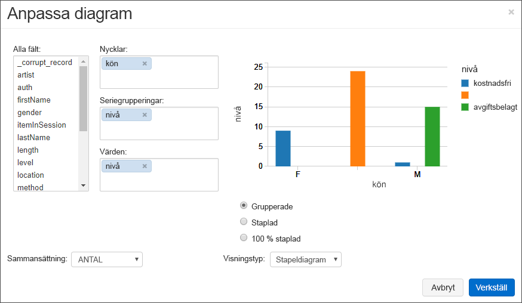

# <a name="quickstart-analyze-data-with-databricks"></a>Snabb start: analysera data med Databricks

I den här snabb starten kör du ett Apache Spark jobb med Azure Databricks för att utföra analyser på data som lagras i ett lagrings konto. Som en del av Spark-jobbet analyserar du prenumerationsdata för en radiokanal, så att du får insikter om kostnadsfri/betald användning baserat på demografiska data.

## <a name="prerequisites"></a>Förutsättningar

* Ett Azure-konto med en aktiv prenumeration. [Skapa ett konto kostnads fritt](https://azure.microsoft.com/free/?ref=microsoft.com&utm_source=microsoft.com&utm_medium=docs&utm_campaign=visualstudio).

* Namnet på ditt Azure Data Lake Gen2-lagrings konto. [Skapa ett Azure Data Lake Storage Gen2 lagrings konto](data-lake-storage-quickstart-create-account.md).

* Klient-ID, app-ID och lösen ord för ett Azure-tjänstens huvud namn med en tilldelad roll för **data deltagare i Storage BLOB**. [Skapa ett huvud namn för tjänsten](../../active-directory/develop/howto-create-service-principal-portal.md).

  > [!IMPORTANT]
  > Tilldela rollen i omfånget för Data Lake Storage Gen2 lagrings kontot. Du kan tilldela en roll till den överordnade resursgruppen eller prenumerationen, men du får behörighetsrelaterade fel tills de rolltilldelningarna propageras till lagringskontot.

## <a name="create-an-azure-databricks-workspace"></a>Skapa en Azure Databricks-arbetsyta

I det här avsnittet skapar du en Azure Databricks-arbetsyta med Azure-portalen.

1. Välj **Skapa en resurs** > **Analys** > **Azure Databricks** i Azure Portal.

    

2. Under **Azure Databricks Service** (Azure Databricks-tjänsten) fyller du i värdena för att skapa en Databricks-arbetsyta.

    

    Ange följande värden:

    |Egenskap  |Beskrivning  |
    |---------|---------|
    |**Namn på arbetsyta**     | Ange ett namn för Databricks-arbetsytan        |
    |**Prenumeration**     | I listrutan väljer du din Azure-prenumeration.        |
    |**Resursgrupp**     | Ange om du vill skapa en ny resursgrupp eller använda en befintlig. En resursgrupp är en container som innehåller relaterade resurser för en Azure-lösning. Mer information finns i [översikten över Azure-resursgrupper](../../azure-resource-manager/management/overview.md). |
    |**Plats**     | Välj **USA, västra 2**. Du kan välja en annan offentlig region om du vill.        |
    |**Prisnivå**     |  Välj mellan **Standard** och **Premium**. Mer information om de här nivåerna finns på [prissättningssidan för Databricks](https://azure.microsoft.com/pricing/details/databricks/).       |

3. Det tar några minuter att skapa kontot. Du kan övervaka åtgärdsstatusen i förloppsindikatorn längst upp.

4. Välj **Fäst på instrumentpanelen** och välj sedan **Skapa**.

## <a name="create-a-spark-cluster-in-databricks"></a>Skapa ett Spark-kluster i Databricks

1. I Azure-portalen går du till Databricks-arbetsytan som du skapade. Välj sedan **Starta arbetsyta**.

2. Du omdirigeras till Azure Databricks-portalen. Välj **Nytt** > **Kluster** i Portal.

    

3. På sidan **Nytt kluster** anger du värdena för att skapa ett kluster.

    

    Fyll i värden för följande fält och godkänn standardvärdena för de andra fälten:

    - Ange ett namn för klustret.
     
    - Se till att markera kryssrutan **Avsluta efter 120 minuters inaktivitet**. Ange en varaktighet (i minuter) för att avsluta klustret om klustret inte används.

4. Välj **Skapa kluster**. När klustret körs kan du ansluta anteckningsböcker till klustret och köra Spark-jobb.

Mer information om att skapa kluster finns i [Skapa ett Spark-kluster i Azure Databricks](https://docs.azuredatabricks.net/user-guide/clusters/create.html).

## <a name="create-storage-account-container"></a>Skapa lagrings konto behållare

I det här avsnittet skapar du en anteckningsbok på Azure Databricks-arbetsytan och kör sedan kodfragment för att konfigurera lagringskontot.

1. Gå till arbetsytan Azure Databricks som du skapat i [Azure-portalen](https://portal.azure.com). Välj sedan **Starta arbetsyta**.

2. Välj **Arbetsyta** i det vänstra fönstret. I listrutan **Arbetsyta** väljer du **Skapa** > **Anteckningsbok**.

    

3. Ge anteckningsboken ett namn i dialogrutan **Skapa anteckningsbok**. Välj **Scala** som språk och välj sedan det Spark-kluster som du skapade tidigare.

    

    Välj **Skapa**.

4. Kopiera och klistra in följande kodblock i den första cellen, men kör inte den här koden än.

   ```scala
   spark.conf.set("fs.azure.account.auth.type.<storage-account-name>.dfs.core.windows.net", "OAuth")
   spark.conf.set("fs.azure.account.oauth.provider.type.<storage-account-name>.dfs.core.windows.net", "org.apache.hadoop.fs.azurebfs.oauth2.ClientCredsTokenProvider")
   spark.conf.set("fs.azure.account.oauth2.client.id.<storage-account-name>.dfs.core.windows.net", "<appID>")
   spark.conf.set("fs.azure.account.oauth2.client.secret.<storage-account-name>.dfs.core.windows.net", "<password>")
   spark.conf.set("fs.azure.account.oauth2.client.endpoint.<storage-account-name>.dfs.core.windows.net", "https://login.microsoftonline.com/<tenant-id>/oauth2/token")
   spark.conf.set("fs.azure.createRemoteFileSystemDuringInitialization", "true")
   dbutils.fs.ls("abfss://<container-name>@<storage-account-name>.dfs.core.windows.net/")
   spark.conf.set("fs.azure.createRemoteFileSystemDuringInitialization", "false")

   ```
5. I det här kodblocket ersätter du platshållarvärdena `storage-account-name`, `appID`, `password` och `tenant-id` i det här kodblocket med de värden som du hämtade när du skapade tjänsthuvudnamnet. Ange `container-name` placeholder-värde till det namn som du vill ge behållaren.

6. Tryck på **SKIFT + RETUR** för att köra koden i det här blocket.

## <a name="ingest-sample-data"></a>Mata in exempeldata

Innan du börjar med det här avsnittet måste du slutföra följande krav:

Ange följande kod i en cell i en arbetsbok:

    %sh wget -P /tmp https://raw.githubusercontent.com/Azure/usql/master/Examples/Samples/Data/json/radiowebsite/small_radio_json.json

Kör koden genom att trycka på **SKIFT + RETUR** i cellen.

I en ny cell nedanför denna anger du följande kod, och ersätter värdena inom hakparentes med samma värden som du använde tidigare:

    dbutils.fs.cp("file:///tmp/small_radio_json.json", "abfss://<container-name>@<storage-account-name>.dfs.core.windows.net/")

Kör koden genom att trycka på **SKIFT + RETUR** i cellen.

## <a name="run-a-spark-sql-job"></a>Köra ett Spark SQL-jobb

Utför följande åtgärder för att köra ett Spark SQL-jobb på data.

1. Kör en SQL-instruktion för att skapa en temporär tabell med data från exempel-JSON-datafilen **small_radio_json.json**. I följande kodfragment ersätter du platshållarens värden med din containers namn och namnet på ditt lagringskonto. Använd anteckningsboken du skapade tidigare för att klistra in följande kodfragment i en kodcell och tryck sedan på SKIFT+RETUR.

    ```sql
    %sql
    DROP TABLE IF EXISTS radio_sample_data;
    CREATE TABLE radio_sample_data
    USING json
    OPTIONS (
     path  "abfss://<container-name>@<storage-account-name>.dfs.core.windows.net/small_radio_json.json"
    )
    ```

    När kommandot har slutförts har du alla data från JSON-filen som en tabell i Databricks-klustret.

    Med det magiska språkkommandot `%sql` kan du köra en SQL-kod från anteckningsboken även om anteckningsboken är av en annan typ. Mer information finns i [Mixing languages in a notebook](https://docs.azuredatabricks.net/user-guide/notebooks/index.html#mixing-languages-in-a-notebook) (Blanda språk i en anteckningsbok).

2. Nu ska vi titta på en ögonblicksbild av JSON-exempeldata för att bättre förstå den fråga som körs. Klistra in följande kodfragment i kodcellen och tryck på **SKIFT + RETUR**.

    ```sql
    %sql
    SELECT * from radio_sample_data
    ```

3. Du ser en tabellvy som i följande skärmbild (endast vissa kolumner visas):

    

    Bland annat fångar exempeldata in könet på en radiokanals målgrupp (kolumnnamn, **kön**) och om deras prenumeration är kostnadsfri eller om den betalas (kolumnnamn, **nivå**).

4. Nu skapar du en visuell representation av dessa data för att visa hur många användare av varje kön som har kostnadsfria konton och hur många som är betalande prenumeranter. Längst ned i tabellvyn klickar du på ikonen **Stapeldiagram** och sedan på **Ritalternativ**.

    

5. I **Anpassa ritning** drar och släpper du värden enligt skärmbilden.

    

    - Ställ in **Nycklar** på **kön**.
    - Ställ in **Seriegrupperingar** på **nivå**.
    - Ställ in **Värden** på **nivå**.
    - Ställ in **Sammansättning** på **COUNT** (Antal).

6. Klicka på **Verkställ**.

7. Utdata visar den visuella representationen som visas i följande skärmbild:

     

## <a name="clean-up-resources"></a>Rensa resurser

Du kan avsluta klustret när du är klar med den här artikeln. I Azure Databricks-arbetsytan väljer du **Kluster** och letar reda på det kluster som du vill avsluta. För markören över de tre punkterna under kolumnen **Åtgärder**. Välj sedan ikonen **Avsluta**.


Om du inte manuellt avslutar klustret kommer det att stoppas automatiskt, förutsatt att du har markerat kryssrutan **Avsluta efter \_\_ minuters inaktivitet** när klustret skapades. Om du väljer det här alternativet avslutas klustret när det har varit inaktivt i den tid som angetts.

## <a name="next-steps"></a>Nästa steg

I den här artikeln skapade du ett Spark-kluster i Azure Databricks och körde ett Spark-jobb med hjälp av data i ett lagringskonto med Data Lake Storage Gen2 aktiverat.

Gå till nästa artikel om du vill lära dig hur du utför en ETL-åtgärd (extrahera, transformera och läsa in data) med Azure Databricks.

> [!div class="nextstepaction"]
>[Extrahera, transformera och läsa in data med Azure Databricks](../../azure-databricks/databricks-extract-load-sql-data-warehouse.md).

- Information om hur du importerar data från andra data källor till Azure Databricks finns i [Spark-datakällor](https://docs.azuredatabricks.net/spark/latest/data-sources/index.html).

- Information om andra sätt att komma åt Azure Data Lake Storage Gen2 från en Azure Databricks arbets yta finns i [Azure Data Lake Storage Gen2](https://docs.azuredatabricks.net/spark/latest/data-sources/azure/azure-datalake-gen2.html).
