# <a name="quickstart-create-a-stream-analytics-job-by-using-the-azure-portal"></a>Snabbstart: Skapa ett Stream Analytics-jobb med hjälp av Azure-portalen

Den här snabbstarten visar hur du kommer igång med att skapa ett Stream Analytics-jobb. I den här snabbstarten definierar du ett Stream Analytics-jobb som läser realtidsbaserade strömningsdata och filtrerar meddelanden med en temperatur högre än 27. Ditt Stream Analytics-jobb läser data från IoT Hub, omvandlar data och skriver tillbaka data till en behållare i blob-lagring. De indata som används i den här snabbstarten genereras av en Raspberry Pi-onlinesimulator. 

## <a name="before-you-begin"></a>Innan du börjar

* Om du inte har en Azure-prenumeration skapar du ett [kostnadsfritt konto](https://azure.microsoft.com/free/).

* Logga in på [Azure-portalen](https://portal.azure.com/).

## <a name="prepare-the-input-data"></a>Förbereda indata

Innan du definierar Stream Analytics-jobbet bör du förbereda indata. Sensordata i realtid matas in på IoT Hub, som senare konfigurerades som jobbinmatning. Förbered de indata som krävs för jobbet genom att utföra följande steg:

1. Logga in på [Azure-portalen](https://portal.azure.com/).

2. Välj Skapa ett**resurs-Internet** >  **Create a resource** > för**saker IoT Hub**.

3. I rutan **IoT-hubb** anger du följande information:
   
   |**Inställning**  |**Föreslaget värde**  |**Beskrivning**  |
   |---------|---------|---------|
   |Prenumeration  | \<Din prenumeration\> |  Ange den prenumeration som du vill använda. |
   |Resursgrupp   |   asaquickstart-resourcegroup  |   Välj **Skapa ny** och ange ett nytt resursgruppsnamn för ditt konto. |
   |Region  |  \<Välj den region som är närmast dina användare\> | Välj en geografisk plats där du kan hantera din IoT-hubb. Använd den plats som är närmast dina användare. |
   |IoT-hubbnamn  | MyASAIoTHub  |   Välj ett namn för din IoT-hubb.   |

   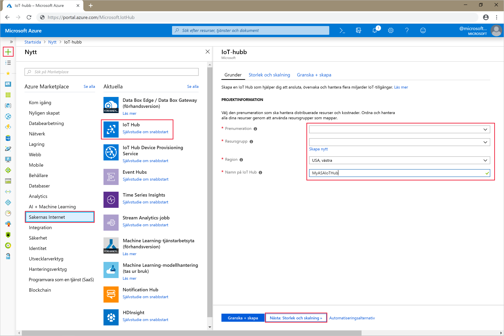

4. Välj **Nästa: Ange storlek och skala**.

5. Välj **pris- och skalningsnivå**. För den här snabbstarten väljer du nivån **F1 – kostnadsfri** om den fortfarande är tillgänglig för din prenumeration. Mer information finns i [Prissättning för IoT-hubb](https://azure.microsoft.com/pricing/details/iot-hub/).

   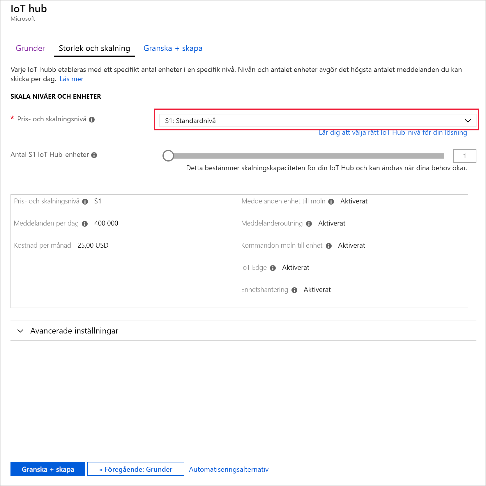

6. Välj **Granska + skapa**. Gå igenom informationen om IoT-hubben och klicka på **Skapa**. Det kan ta några minuter innan IoT-hubben skapas. Du kan övervaka förloppet i **meddelandefönstret**.

7. I navigeringsmenyn för din IoT-hubb klickar du på **Lägg till** under **IoT-enheter**. Lägg till ett **Enhets-ID** och klicka på **Spara**.

   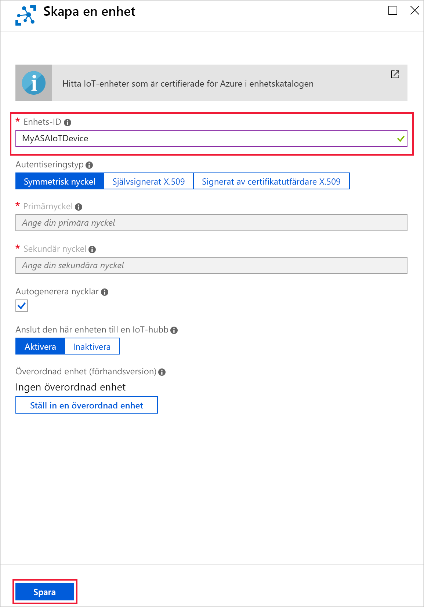

8. När enheten har skapats öppnar du enheten från listan över **IoT-enheter**. Kopiera **Anslutningssträng – primärnyckel** och spara den i en anteckningsfil för senare användning.

   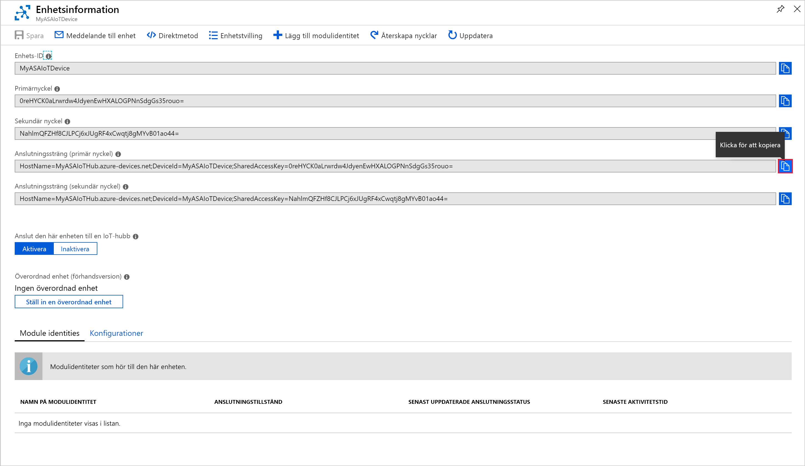

## <a name="create-blob-storage"></a>Skala bloblagring

1. Välj Skapa ett > **resurslagringslagringskonto** > **Storage account** **Create a resource**i det övre vänstra hörnet i Azure-portalen .

2. I fönsterrutan **Skapa lagringskonto** anger du namn, plats och resursgrupp för lagringskonto. Välj samma plats och resursgrupp som den IoT-hubb som du skapade. Klicka sedan på **Granska + skapa** för att skapa kontot.

   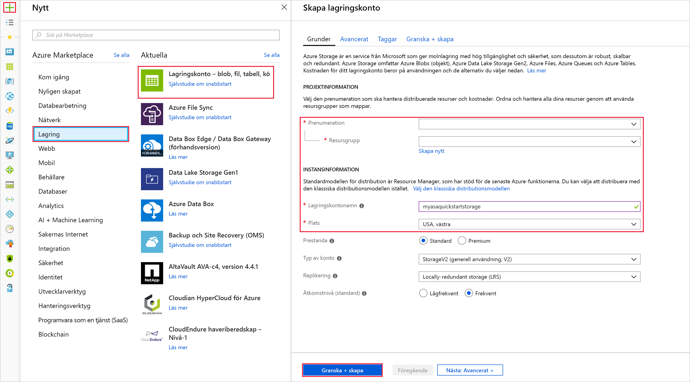

3. När ditt lagringskonto har skapats väljer du panelen **Blobar** på panelen **Översikt**.

   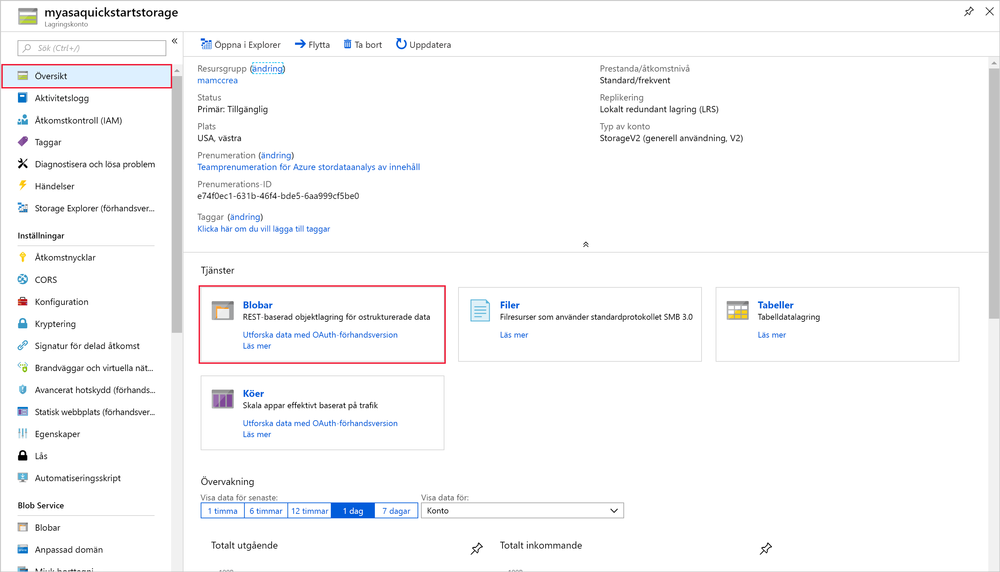

4. Från sidan **Blob Service** väljer du **Container** och anger ett namn för containern, till exempel *container1*. Låt **Offentlig åtkomstnivå** vara **Privat (ingen anonym åtkomst)** och välj **OK**.

   

## <a name="create-a-stream-analytics-job"></a>Skapa ett Stream Analytics-jobb

1. Logga in på Azure Portal.

2. Klicka på **Skapa en resurs** längst upp till vänster i Azure-portalen.  

3. Välj **Analytics** > **Stream Analytics-jobb** i resultatlistan.  

4. Fyll i sidan för Stream Analytics-jobbet med följande information:

   |**Inställning**  |**Föreslaget värde**  |**Beskrivning**  |
   |---------|---------|---------|
   |Jobbnamn   |  MyASAJob   |   Ange ett namn som identifierar Stream Analytics-jobbet. Stream Analytics-jobbets namn får enbart innehålla alfanumeriska tecken, bindestreck och understreck och måste vara mellan 3 och 63 tecken långt. |
   |Prenumeration  | \<Din prenumeration\> |  Välj den Azure-prenumeration som du vill använda för jobbet. |
   |Resursgrupp   |   asaquickstart-resourcegroup  |   Använd samma resursgrupp som din IoT-hubb. |
   |Location  |  \<Välj den region som är närmast dina användare\> | Välj den geografiska plats där du kan ha ditt Stream Analytics-jobb. Använd den plats som är närmast dina användare för att få bättre prestanda och minska kostnaderna för dataöverföring. |
   |Strömningsenheter  | 1  |   Strömningsenheter representerar de bearbetningsresurser som krävs för att köra ett jobb. Standardvärdet är 1. Mer information om skalning av strömningsenheter finns i artikeln om att [förstå och justera strömningsenheter](stream-analytics-streaming-unit-consumption.md).   |
   |Värdmiljö  |  Molnet  |   Stream Analytics-jobb kan distribueras till molnet eller edge. Cloud kan du distribuera till Azure Cloud, och Edge kan du distribuera till en IoT Edge-enhet. |

   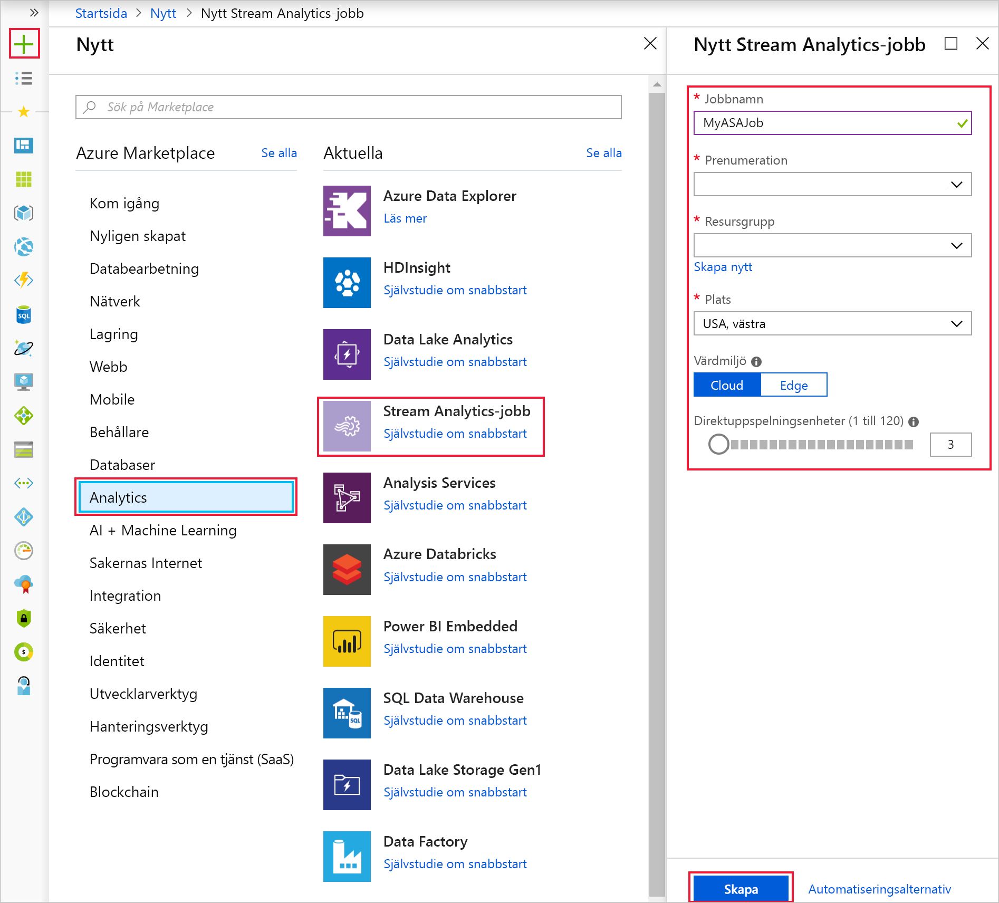

5. Markera kryssrutan **Fäst på instrumentpanelen** så att jobbet placeras på instrumentpanelen, och klicka sedan på **Skapa**.  

6. Meddelandet *Distribution pågår...* bör nu visas längst upp till höger i webbläsarfönstret. 

## <a name="configure-job-input"></a>Konfigurera jobbindata

I det här avsnittet konfigurerar du en IoT-hubbenhetsinmatning till Stream Analytics-jobbet. Använd den IoT-hubb som du skapade i föregående avsnitt i snabbstarten.

1. Gå till Stream Analytics-jobbet.  

2. Välj **Indata** > Lägg till**indata-IoT-hubb**.**Add Stream input** >   

3. Fyll sodan **IoT-hubb** med följande värden:

   |**Inställning**  |**Föreslaget värde**  |**Beskrivning**  |
   |---------|---------|---------|
   |Inmatat alias  |  IoTHubInput   |  Ange ett namn som identifierar jobbets indata.   |
   |Prenumeration   |  \<Din prenumeration\> |  Välj den Azure-prenumeration där det lagringskonto som du skapade finns. Lagringskontot kan vara i samma eller en annan prenumeration. I det här exemplet förutsätts att du har skapat lagringskontot i samma prenumeration. |
   |IoT Hub  |  MyASAIoTHub |  Ange namnet på den IoT-hubb som du skapade i föregående avsnitt. |

4. Låt standardvärdena stå kvar för övriga alternativ och välj **Spara** för att spara inställningarna.  

   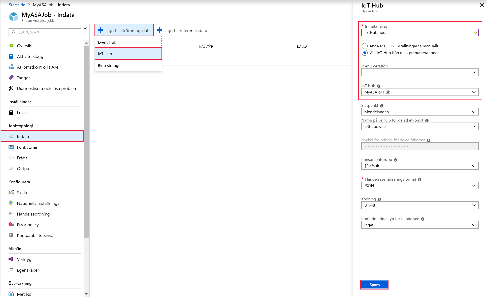
 
## <a name="configure-job-output"></a>Konfigurera jobbutdata

1. Gå till Stream Analytics-jobbet som du skapade tidigare.  

2. Välj **Utdata** > **Lägg till** > **Blob-lagring**.  

3. Fyll i följande värden på sidan **Blob Storage**:

   |**Inställning**  |**Föreslaget värde**  |**Beskrivning**  |
   |---------|---------|---------|
   |Utdataalias |   BlobOutput   |   Ange ett namn som identifierar jobbets utdata. |
   |Prenumeration  |  \<Din prenumeration\>  |  Välj den Azure-prenumeration där det lagringskonto som du skapade finns. Lagringskontot kan vara i samma eller en annan prenumeration. I det här exemplet förutsätts att du har skapat lagringskontot i samma prenumeration. |
   |Lagringskonto |  asaquickstartstorage |   Välj eller ange lagringskontots namn. Lagringskontonamn identifieras automatiskt om de skapas i samma prenumeration.       |
   |Container |   container1  |  Välj en befintlig container som du skapade i ditt lagringskonto.   |

4. Låt standardvärdena stå kvar för övriga alternativ och välj **Spara** för att spara inställningarna.  

   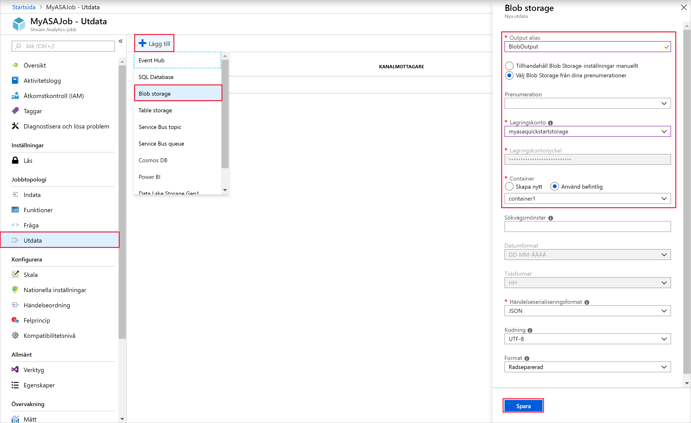
 
## <a name="define-the-transformation-query"></a>Definiera transformationsfrågan

1. Gå till Stream Analytics-jobbet som du skapade tidigare.  

2. Välj **Fråga** och uppdatera frågan på följande sätt:  

   ```sql
   SELECT *
   INTO BlobOutput
   FROM IoTHubInput
   HAVING Temperature > 27
   ```

3. I det här exemplet läser frågan data från IoT-hubben och kopierar dem till en ny fil i bloben. Välj **Spara**.  

   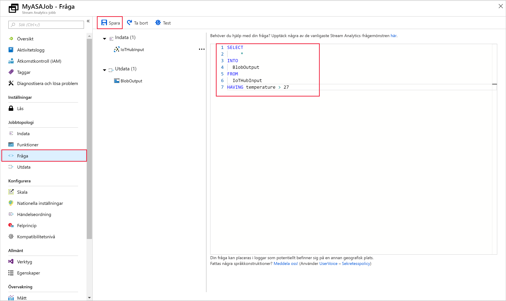

## <a name="run-the-iot-simulator"></a>Köra IoT-simulatorn

1. Öppna [Raspberry Pi Azure IoT-onlinesimulatorn](https://azure-samples.github.io/raspberry-pi-web-simulator/).

2. Ersätt platshållaren på rad 15 med Azure IoT Hub-enhetens anslutningssträng, som du sparade i föregående avsnitt.

3. Klicka på **Kör**. Utdata bör visas de sensordata och meddelanden som skickas till din IoT-hubb.

   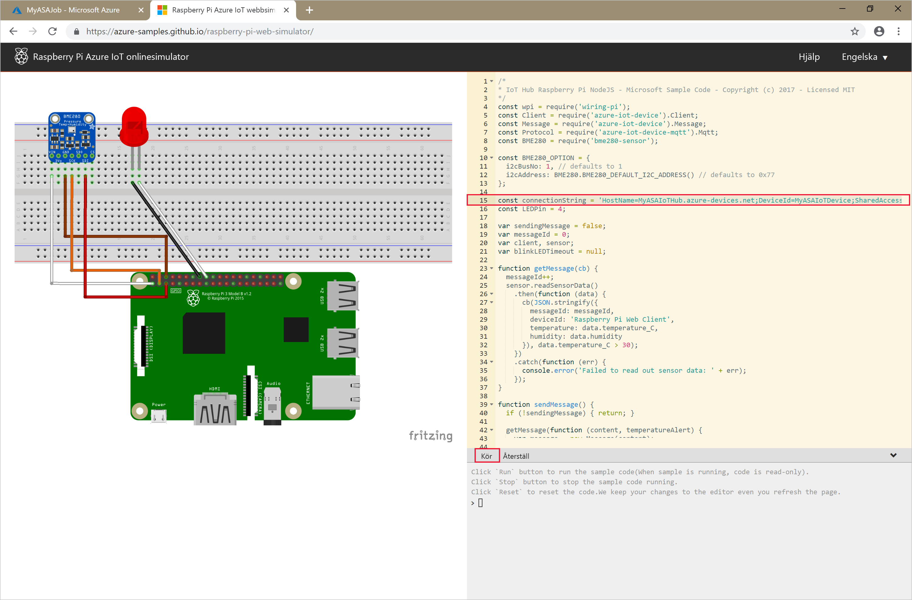

## <a name="start-the-stream-analytics-job-and-check-the-output"></a>Starta Stream Analytics-jobbet och kontrollera utdata

1. Återgå till jobböversiktssidan och välj **Starta**.

2. Under **Starta jobb** väljer du **Nu** för fältet **Starttid för jobbutdata**. Starta sedan jobbet genom att välja **Starta**.

3. Efter några minuter går du till portalen och letar rätt på lagringskontot och den container som du har konfigurerat som utdata för jobbet. Nu kan du se utdatafilen i containern. Det tar några minuter för jobbet att starta första gången. När det har startats fortsätter det att köras medan data tas emot.  

   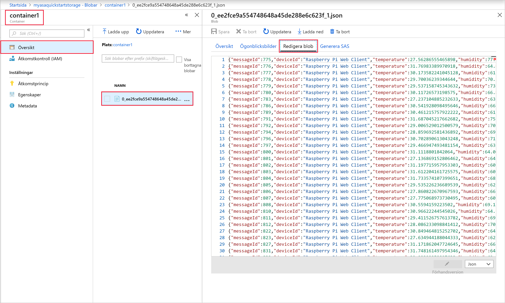

## <a name="clean-up-resources"></a>Rensa resurser

När det inte längre behövs tar du bort resursgruppen, Stream Analytics-jobbet och alla relaterade resurser. Om du tar bort jobbet undviker du att bli fakturerad för de strömmande enheter som används av jobbet. Om du planerar att använda jobbet i framtiden kan du stoppa det och sedan starta det igen när du behöver det. Om du inte tänker fortsätta använda det här jobbet tar du bort alla resurser som skapades i snabbstarten med följande steg:

1. Klicka på **Resursgrupper** på den vänstra menyn i Azure-portalen och välj sedan namnet på den resurs du skapade.  

2. På sidan med resursgrupper klickar du på **Ta bort**, skriver in namnet på resursen som ska tas bort i textrutan och väljer sedan **Ta bort**.

## <a name="next-steps"></a>Nästa steg

I den här snabbstarten har du distribuerat ett enkelt Stream Analytics-jobb med hjälp Azure-portalen. Du kan också distribuera Stream Analytics-jobb med [PowerShell,](stream-analytics-quick-create-powershell.md) [Visual Studio](stream-analytics-quick-create-vs.md)och [Visual Studio Code](quick-create-vs-code.md).

Om du vill se hur du konfigurerar andra indatakällor och utför realtidsidentifiering fortsätter du till följande artikel:

> [!div class="nextstepaction"]
> [Identifiering av bedrägerier i realtid med hjälp av Azure Stream Analytics](stream-analytics-real-time-fraud-detection.md)
