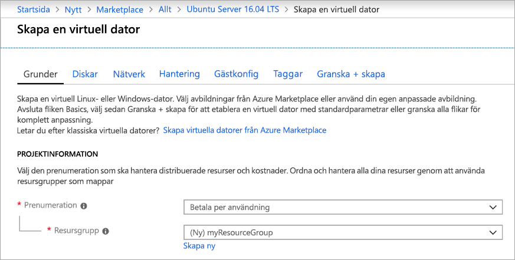
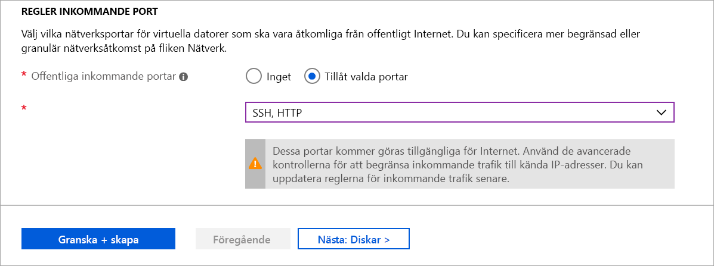

# <a name="quickstart-create-a-linux-virtual-machine-in-the-azure-portal"></a>Snabbstart: Skapa en virtuell Linux-dator i Azure Portal

Det går att skapa virtuella Azure-datorer via Azure Portal. Azure-portalen är ett webbläsarbaserat användargränssnitt för att skapa virtuella datorer och alla relaterade resurser. Den här snabbstarten visar hur du använder Azure-portalen för att distribuera en virtuell Linux-dator (VM) som kör Ubuntu 16.04 LTS. För att se hur den virtuella datorn fungerar i praktiken använder du sedan SSH för att ansluta till den virtuella datorn och installerar NGINX-webbservern.

Om du inte har en Azure-prenumeration kan du skapa ett [kostnadsfritt konto](https://azure.microsoft.com/free/?WT.mc_id=A261C142F) innan du börjar.

## <a name="create-ssh-key-pair"></a>Skapa SSH-nyckelpar

Du behöver ett SSH-nyckelpar för att slutföra den här snabbstarten. Om du redan har ett SSH-nyckelpar kan du hoppa över det här steget.

Öppna bash-gränssnittet och använd [ssh-keygen](https://www.ssh.com/ssh/keygen/) för att skapa ett SSH-nyckelpar. Om du inte har något bash-gränssnitt på den lokala datorn kan du använda [Azure Cloud Shell](https://shell.azure.com/bash).  

```bash
ssh-keygen -t rsa -b 2048
```

Ovanstående kommando genererar offentliga och privata nycklar med standardnamnet `id_rsa` i `~/.ssh directory`. Kommandot returnerar den fullständiga sökvägen till den offentliga nyckeln. Använd sökvägen till den offentliga nyckeln för att visa innehållet med `cat`.

```bash 
cat ~/.ssh/id_rsa.pub
```

Spara kommandots utdata. Du behöver dem när du konfigurerar ditt administratörskonto för att logga in på den virtuella datorn.

Mer detaljerad information om hur du skapar SSH-nyckelpar, inklusive användning av PuTTy, finns i [Använd SSH-nycklar med Windows](ssh-from-windows.md).

Om du skapar SSH-nyckelpar med Cloud Shell kommer det att lagras i en Azure-filresurs som [monteras automatiskt av Cloud Shell](https://docs.microsoft.com/azure/cloud-shell/persisting-shell-storage). Ta inte bort den här filresursen eller lagringskontot förrän du har hämtat dina nycklar eller om du förlorat åtkomst till den virtuella datorn. 

## <a name="sign-in-to-azure"></a>Logga in på Azure

Logga in på [Azure-portalen](https://portal.azure.com).

## <a name="create-virtual-machine"></a>Skapa en virtuell dator

1. Välj **Skapa en resurs** längst upp till vänster i Azure-portalen.

1. I sökrutan ovanför listan över Azure Marketplace-resurser, söker du efter och väljer **Ubuntu Server 16.04 LTS** av Canonical och väljer sedan **Skapa**.

1. På fliken **Grundläggande inställningar** går du till **Projektinformation**, kontrollerar att korrekt prenumeration har valts och väljer sedan **Skapa ny** under **Resursgrupp**. I popup-fönstret skriver du *myResourceGroup* för namnet på resursgruppen och väljer sedan **OK*. 

    

1. Under **Instansinformation** skriver du *myVM* för **Namn på virtuell dator** och väljer *USA, östra* som **Region**. Låt de övriga standardvärdena vara som de är.

    

1. Under **Administratörskonto** väljer du **Offentlig SSH-nyckel**, skriver ditt användarnamn och klistrar sedan in den offentliga nyckeln i textrutan. Ta bort eventuella inledande eller avslutande blanksteg i din offentliga nyckel.

    

1. Under **Regler för inkommande portar** > **Offentliga inkommande portar** väljer du **Tillåt valda portar** och väljer sedan **SSH (22)** och **HTTP (80)** från listrutan. 

    

1. Låt de återstående standardinställningarna vara och välj sedan knappen **Granska + skapa** längst ned på sidan.

1. På sidan **Skapa en virtuell dator** kan du se information om den virtuella datorn som du håller på att skapa. När du är klar väljer du **Skapa**.

Det tar några minuter för den virtuella datorn att distribueras. När distributionen är klar kan du gå vidare till nästa avsnitt.

    
## <a name="connect-to-virtual-machine"></a>Ansluta till den virtuella datorn

Skapa en SSH-anslutning med den virtuella datorn.

1. Välj **Anslut**-knappen på översiktssidan för din virtuella dator. 

    

2. På sidan **Anslut till den virtuella datorn** behåller du standardalternativen för att ansluta via IP-adress via port 22. I **Logga in med lokalt virtuellt datorkonto** visas ett anslutningskommando. Klicka på knappen för att kopiera kommandot. Följande exempel visar hur SSH-anslutningskommandot ser ut:

    ```bash
    ssh azureuser@10.111.12.123
    ```

3. Med hjälp av samma bash-gränssnitt som du använde för att skapa ditt SSH-nyckelpar (som [Azure Cloud Shell](https://shell.azure.com/bash) eller ditt lokala bash-gränssnitt) klistrar du in kommandot för SSH-anslutning i gränssnittet för att skapa en SSH-session. 

## <a name="install-web-server"></a>Installera webbservern

Om du vill se hur den virtuella datorn fungerar i praktiken installerar du NGINX-webbservern. Från din SSH-session uppdaterar du dina paketkällor och installera det senaste NGINX-paketet.

```bash
sudo apt-get -y update
sudo apt-get -y install nginx
```

När du är klar avslutar du SSH-sessionen genom att skriva `exit`.


## <a name="view-the-web-server-in-action"></a>Se hur webbservern fungerar i praktiken

Använd valfri webbläsare för att visa välkomstsidan för NGINX. Ange den virtuella datorns offentliga IP-adress som webbadress. Den offentliga IP-adressen kan hittas på översiktssidan för den virtuella datorn eller som en del av SSH-anslutningssträngen du använde tidigare.


## <a name="clean-up-resources"></a>Rensa resurser

Du kan ta bort resursgruppen, den virtuella datorn och alla relaterade resurser när de inte längre behövs. Om du vill göra detta väljer du resursgruppen för den virtuella datorn. Välj sedan **Ta bort** och kontrollera namnet på resursgruppen som du vill ta bort.

## <a name="next-steps"></a>Nästa steg

I den här snabbstarten distribuerade du en enkel virtuell dator, skapade en nätverkssäkerhetsgrupp och en regel och installerade en enkel webbserver. Om du vill veta mer om virtuella Azure-datorer fortsätter du till självstudien för virtuella Linux-datorer.

> [!div class="nextstepaction"]
> [Självstudier om virtuella Azure Linux-datorer](./tutorial-manage-vm.md)
