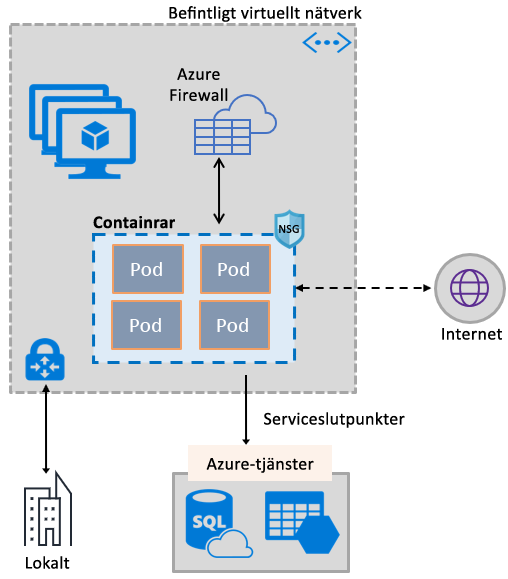
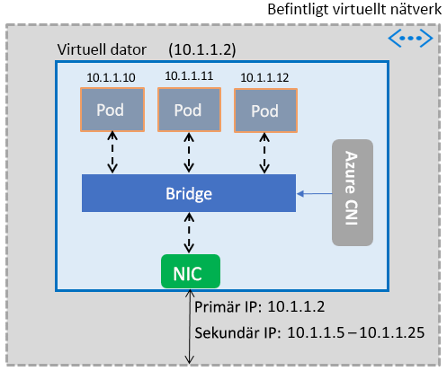

# Göra så att containrar kan använda Azure Virtual Network-funktioner

Hämta den omfattande uppsättningen med Azure-nätverksfunktioner till containrar genom att använda samma programvara som definierade nätverksstacken som används av virtuella datorer. Plugin-programmet Azure Virtual Network CNI (Container Network Interface) installeras på en virtuell Azure-dator. Plugin-programmet tilldelar IP-adresser från ett virtuellt nätverk för containrar som finns i den virtuella datorn, bifogar dem till det virtuella nätverket och ansluter dem sedan direkt till andra containrar och virtuella nätverksresurser. Plugin-programmet förlitar sig inte på överläggsnätverk eller vägar för anslutningen, och erbjuder samma prestanda som virtuella datorer. På en hög nivå innehåller plugin-programmet följande funktioner:

- En virtuell IP-adress tilldelas till varje podd, som kan bestå av en eller flera containrar.
- Poddar kan ansluta till peerkopplade virtuella nätverk och till lokala nätverk via ExpressRoute eller VPN för plats-till-plats. Poddar kan även nås från peerkopplade och lokala nätverk.
- Poddar kan komma åt tjänster som Azure Storage och Azure SQL Database, som skyddas av tjänstslutpunkter för virtuellt nätverk.
- Nätverkssäkerhetsgrupper och vägar kan tillämpas direkt på poddar.
- Poddar kan placeras direkt bakom en intern eller offentlig lastbalanserare i Azure, precis som virtuella datorer
- Poddar kan tilldelas en offentlig IP-adress, vilket gör dem direkt åtkomliga från internet. Poddar kan också ansluta till internet själva.
- Fungerar sömlöst med Kubernetes-resurser, till exempel tjänster, ingående domänkontrollanter och Kube DNS. En Kubernetes-tjänst kan också exponeras internt eller externt via Azure Load Balancer.

Följande bild visar hur plugin-programmet erbjuder Azure Virtual Network-funktioner för poddarna:

Plugin-programmet stöder både Linux- och Windows-plattformar.

## Ansluta poddar till ett virtuellt nätverk

Poddar finns i en virtuell dator som är en del av ett virtuellt nätverk. En pool med IP-adresser för poddarna har konfigurerats som sekundära adresser i en virtuell dators nätverksgränssnitt. Azure CNI konfigurerar grundläggande nätverksanslutning för poddar och hanterar användningen av IP-adresser i poolen. När en podd visas i den virtuella datorn tilldelar Azure CNI en tillgänglig IP-adress från poolen och ansluter podden till en brygga för programvara på den virtuella datorn. När en podd avslutas läggs IP-adressen tillbaka i poolen. Följande bild visar hur poddar ansluter till ett virtuellt nätverk:

## Internetåtkomst

Om du vill aktivera poddåtkomst till internet konfigurerar plugin-programmet *iptables*-regler för att nätadressöversätta (NAT) internet-bunden trafik från poddar. IP-källadressen för paketet översätts till den primära IP-adressen på den virtuella datorns nätverksgränssnitt. Virtuella Windows-datorer identifierar automatiskt källan för NAT-trafik (SNAT) IP-adresser som är utanför det undernät som den virtuell datorn tillhör som mål. Normalt översätts all trafik till en IP-adress utanför IP-adressintervallet för det virtuella nätverket.

## Begränsningar

Plugin-programmet stöder upp till 250 poddar per virtuell dator och upp till 16 000 poddar i ett virtuellt nätverk. Dessa gränser är olika för [Azure Kubernetes Service](../azure-resource-manager/management/azure-subscription-service-limits.md?toc=%2fazure%2fvirtual-network%2ftoc.json#azure-kubernetes-service-limits).

## Använda plugin-programmet

Plugin-programmet kan användas på följande sätt för att tillhandahålla grundläggande anslutning av virtuellt nätverk för poddar eller Docker-containrar:

- **Azure Kubernetes Service**: plugin-programmet är inbyggt i Azure Kubernetes Service (AKS). Du kan använda det genom att välja alternativet *Advanced Networking* (Avancerat nätverk). Via avancerade nätverk kan du distribuera ett Kubernetes-kluster i ett befintligt eller nytt virtuellt nätverk. Mer information om avancerade nätverk och hur du konfigurerar dem finns avsnittet om[nätverkskonfiguration i AKS](../aks/networking-overview.md?toc=%2fazure%2fvirtual-network%2ftoc.json).
- **AKS-motor**: AKS-Engine är ett verktyg som genererar en Azure Resource Manager-mall för distributionen av ett Kubernetes-kluster i Azure. Detaljerade anvisningar finns i [distribuera plugin-programmet för Kubernetes-kluster med AKS-motor](deploy-container-networking.md#deploy-the-azure-virtual-network-container-network-interface-plug-in).
- **Skapa ditt eget Kubernetes-kluster i Azure**: plugin-programmet kan användas för att tillhandahålla grundläggande nätverk för poddar i Kubernetes-kluster som du distribuerar själv, utan att behöva lita på AKS eller verktyg som AKS-motorn. I det här fallet är plugin-programmet installerat och aktiverat på varje virtuell dator i ett kluster. Detaljerade anvisningar finns i avsnittet om att [distribuera plugin-programmet för ett Kubernetes-kluster som du distribuerar själv](deploy-container-networking.md#deploy-plug-in-for-a-kubernetes-cluster).
- **Anslutning av virtuellt nätverk för Docker-containrar i Azure**: Plugin-programmet kan användas i situationer där du inte vill skapa ett Kubernetes-kluster och vill skapa Docker-containrar med ett virtuellt nätverk anslutet på virtuella datorer. Detaljerade anvisningar finns i avsnittet om att [distribuera plugin-programmet för Docker](deploy-container-networking.md#deploy-plug-in-for-docker-containers).

## Nästa steg

[Distribuera plugin-programmet](deploy-container-networking.md) för Kubernetes-kluster eller Docker-containrar
