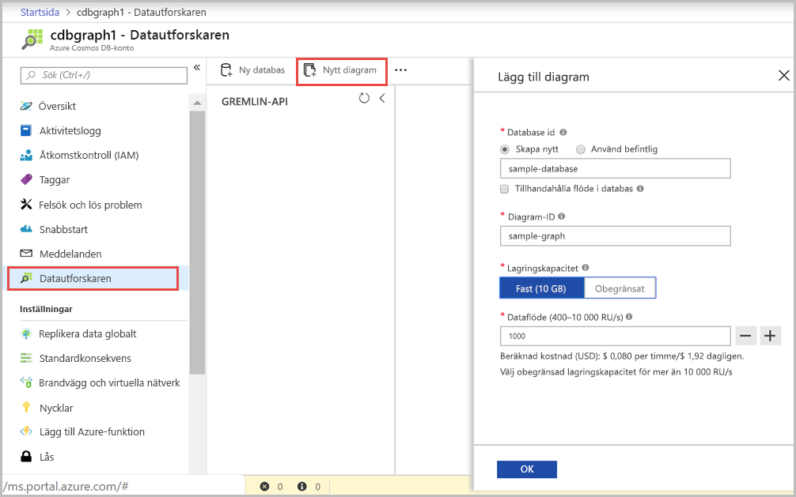

<!--Verify sucessfully-->
Nu kan du använda datautforskarverktyget i Azure Portal för att skapa en grafdatabas. 

1. Klicka på **Datautforskaren** > **Nytt diagram**.

    Området **Lägg till diagram** visas längst till höger, du kan behöva bläddra åt höger för att se det.

    

2. På sidan **Lägg till diagram** anger du inställningarna för den nya grafen.

    Inställning|Föreslaget värde|Beskrivning
    ---|---|---
    Databas-id|sample-database|Ange *sample-database* som namn på den nya databasen. Databasnamn måste innehålla mellan 1 och 255 tecken och får inte innehålla `/ \ # ?` eller avslutande blanksteg.
    Graf-id|sample-graph|Ange *sample-graph* som namnet på den nya samlingen. Samma teckenkrav gäller för grafnamn som databas-id.
    Lagringskapacitet|Fast (10 GB)|Låt standardvärdet **Fast (10 GB)** vara kvar. Det här värdet är databasens lagringskapacitet.
    Dataflöde|400 RU:er|Ändra genomflödet till 400 begäransenheter per sekund (RU/s). Du kan skala upp dataflödet senare om du vill minska svarstiden.

3. När formuläret är ifyllt klickar du på **OK**.

<!--Verify sucessfully-->
<!--Update_Description: new articles on  -->
<!--ms.date: 03/18/2019-->