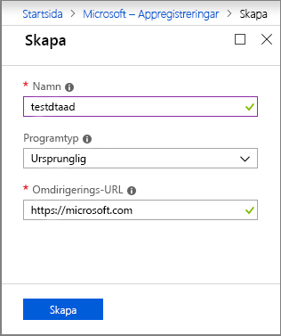
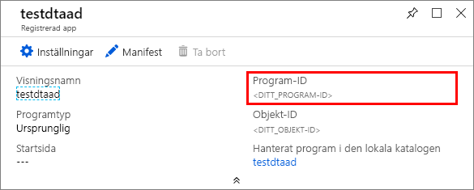

>[!NOTE]
>Det här avsnittet innehåller instruktioner för registrering av [Azure AD-appar](https://docs.microsoft.com/azure/active-directory/develop/quickstart-register-app).

1. Öppna Azure Active **Directory** från den expanderbara vänstra menyn i [Azure-portalen](https://portal.azure.com)och öppna sedan fönstret **Appregistreringar.** 

    

1. Välj knappen **+ Ny registrering.**

    

1. Ge appregistreringen ett eget namn i rutan **Namn**. 

    1. Ange `https://microsoft.com` textrutan under **Avsnittet Omdirigera URI (valfritt).**     

    1. Verifiera vilka konton och klienter som stöds av din Azure Active Directory-app.

    1. Välj **Registrera**.

    

1. **Autentiseringsbladet** anger viktiga konfigurationsinställningar för autentisering. 

    1. Lägg till **omdirigerings-URI:er** och konfigurera **accesstokens** genom att välja **+ Lägg till en plattform**.

    1. Välj **Ja** om du vill ange att appen är en **offentlig klient**.

    1. Verifiera vilka konton och klienter som stöds av din Azure Active Directory-app.

    

1. När du har valt lämplig plattform konfigurerar du dina **omdirigerings-URI:er** och **åtkomsttoken** på sidopanelen till höger om användargränssnittet.

    1. **Omdirigera URI:er** måste matcha den adress som anges av autentiseringsbegäran:

        * För appar som finns i en lokal utvecklingsmiljö väljer du **Offentlig klient (mobil & skrivbord).** Se till att ange **den offentliga klienten** till **Ja**.
        * För ensidiga appar som finns på Azure App Service väljer du **Webb**.

    1. Ta reda på om en **utloggnings-URL** är lämplig.

    1. Aktivera det implicita beviljandeflödet genom att kontrollera **Åtkomsttoken** eller **ID-token**.
                
    

    Klicka på **Konfigurera**och sedan **spara**.

1.  Öppna **fönstret Översikt** för din registrerade app och kopiera värdena för följande entiteter till en temporär fil. Du ska använda dessa värden för att konfigurera exempelprogrammet i följande avsnitt.

    - **Program-ID (klient)**
    - **Katalog-ID (klient)**

    

1. Öppna **api-behörighetsfönstret** för din appregistrering. Välj **+ Lägg till en behörighetsknapp.** I fönstret **Behörigheter för begäran om API** markerar du de **API:er som min organisation använder** och söker sedan efter något av följande:
    
    1. `Azure Digital Twins`. Välj **Azure Digital Twins** API.

        

    1. Alternativt kan du `Azure Smart Spaces Service`söka efter . Välj **Azure Smart Spaces Service** API.

        

    > [!IMPORTANT]
    > Azure AD API-namn och ID som visas beror på din klient:
    > * Testa klient- och kundkonton bör söka `Azure Digital Twins`efter .
    > * Andra Microsoft-konton `Azure Smart Spaces Service`bör söka efter .

1. Båda API:erna visas som **Azure Digital Twins** i samma **api-behörighetsfönster för begäran** när de har valts. Markera listrutan **Läs** och markera kryssrutan **Läs.Skriv.** Välj knappen **Lägg till behörigheter.**

    

1. Beroende på organisationens inställningar kan du behöva vidta ytterligare åtgärder för att ge administratörsåtkomst till det här API:et. Kontakta administratören för mer information. När administratörsåtkomsten har godkänts visar kolumnen **Administratörsmedgivande obligatoriskt** dina **behörigheter.** 

    

    Kontrollera att **Azure Digital Twins** visas.
