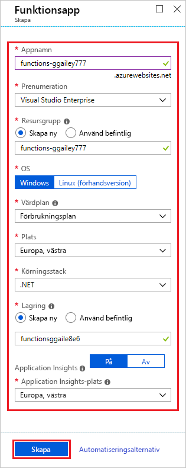

1. Välj knappen **skapa en resurs** i det övre vänstra hörnet av Azure Portal och välj sedan > Compute**Funktionsapp**.

    

2. Använd funktionsappinställningarna enligt tabellen under bilden.

    

    | Inställning      | Föreslaget värde  | Beskrivning                                        |
    | ------------ |  ------- | -------------------------------------------------- |
    | **Appens namn** | Globalt unikt namn | Namn som identifierar din nya funktionsapp. Giltiga tecken är `a-z`, `0-9` och `-`.  | 
    | **Prenumeration** | Din prenumeration | Prenumerationen som den nya funktionsappen skapas under. | 
    | **[Resursgrupp](../articles/azure-resource-manager/resource-group-overview.md)** |  myResourceGroup | Namnet på den nya resursgrupp där du vill skapa funktionsappen. |
    | **OS** | Windows | Vilka språk alternativ som är tillgängliga beror på operativ programmets operativ system. Python kräver exempelvis Linux. |
    | **[Värdplan](../articles/azure-functions/functions-scale.md)** | Förbrukningsplan | Värdplan som definierar hur resurser allokeras till din funktionsapp. I **standardförbrukningsplanen** läggs resurser till dynamiskt när de behövs i funktionerna. För den här typen av [serverlösa](https://azure.microsoft.com/overview/serverless-computing/) värdtjänster betalar du bara för den tid som dina funktioner körs. När du använder en App Service-plan måste du hantera [funktionsappens skalning](../articles/azure-functions/functions-scale.md).  |
    | **Location** | Västra Europa | Välj en [plats](https://azure.microsoft.com/regions/) nära dig eller nära andra tjänster som kommer att användas i dina funktioner. |
    | **Körningsstack** | Önskat språk | Välj en körning som stöder det funktionsprogrammeringsspråk som du föredrar. Välj **.NET** för C#- och F#-funktioner. |
    | **[Storage](../articles/storage/common/storage-quickstart-create-account.md)** |  Globalt unikt namn |  Skapa ett lagringskonto som används av din funktionsapp. Namnet på ett lagringskonto måste vara mellan 3 och 24 tecken långt och får endast innehålla siffror och gemener. Du kan också använda ett befintligt konto, som måste uppfylla [kraven för ett lagringskonto](../articles/azure-functions/functions-scale.md#storage-account-requirements). |
    | **[Application Insights](../articles/azure-functions/functions-monitoring.md)** | Standard | Skapar en Application Insights resurs av samma *app-namn* i den närmaste region som stöds. Genom att utöka den här inställningen kan du ändra det **nya resurs namnet** eller välja en annan **plats** i ett [Azure-geografi](https://azure.microsoft.com/global-infrastructure/geographies/) där du vill lagra dina data. |

3. Välj **Skapa** för att etablera och distribuera funktionsappen.

4. Välj meddelandeikonen i det övre högra hörnet av portalen och titta efter meddelandet **Distribueringen lyckades**.

    

5. Välj **Gå till resurs** att visa den nya funktionsappen. Du kan också välja **Fäst vid instrument panelen**. Genom att fästa blir det enklare att återgå till den här funktions program resursen från instrument panelen.
