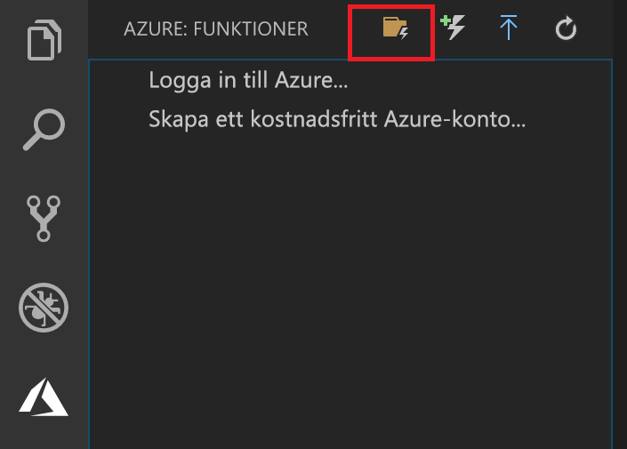

## Skapa ett Azure Functions-projekt

Med Azure Functions-projektmallen i Visual Studio Code skapas ett projekt som kan publiceras till en funktionsapp i Azure. Med en funktionsapp kan du gruppera funktioner som en logisk enhet så att det blir enklare att hantera, distribuera och dela resurser.

1. I Visual Studio Code, väljer du den Azure logotypen som ska visas i **Azure: Functions** område och välj sedan ikonen Skapa nytt projekt.

    

1. Välj en plats för projektarbetsytan och välj **Välj**.

    > [!NOTE]
    > Den här artikeln har utformats för att genomföras utanför en arbetsyta. Välj i det här fallet inte en projektmapp som ingår i en arbetsyta.

1. Välj språk för ditt funktionsappsprojekt. I den här artikeln används JavaScript.
    

1. Välj **Lägg till på arbetsyta** när du uppmanas att göra det.

I Visual Studio Code skapas funktionsappsprojektet på en ny arbetsyta. Det här projektet innehåller konfigurationsfilerna [host.json](../articles/azure-functions/functions-host-json.md) och [local.settings.json](../articles/azure-functions/functions-run-local.md#local-settings-file), plus eventuella språkspecifika projektfiler. Du får också en ny Git-lagringsplats i projektmappen.