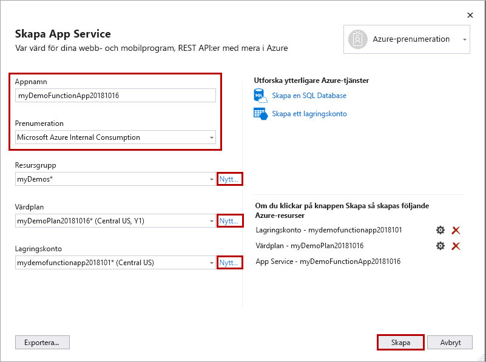

1. I **Solution Explorer** högerklickar du på projektet och väljer **Publicera**.

2. I dialog rutan **Välj ett publicerings mål** använder du de publicerings alternativ som anges i tabellen nedanför bilden: 

    

    | Alternativ      | Beskrivning                                |
    | ------------ |  -------------------------------------------------- |
    | **Azure Functions förbruknings plan** |   När du publicerar projektet till en Function-app som körs i en [förbruknings plan](../articles/azure-functions/functions-scale.md#consumption-plan)betalar du bara för körningar av Functions-appen. Andra värd planer ådrar sig högre kostnader. Läs mer i [Azure Functions skala och vara värd](../articles/azure-functions/functions-scale.md). | 
    | **Skapa ny** | En ny function-app med relaterade resurser skapas i Azure. När du väljer **Välj befintliga** skrivs alla filer i den befintliga funktionsappen i Azure över från det lokala projektet. Använd bara det här alternativet när du publicerar igen i en befintlig funktionsapp. |
    | **Kör från paketfil** | Din Function-app distribueras med hjälp av [zip Deploy](../articles/azure-functions/functions-deployment-technologies.md#zip-deploy) med läget [Kör-från-Package](../articles/azure-functions/run-functions-from-deployment-package.md) aktiverat. Detta är det rekommenderade sättet att köra funktioner, vilket ger bättre prestanda. |

3. Välj **Publicera**. Om du inte redan har loggat in på ditt Azure-konto från Visual Studio väljer du **Logga in**. Du kan också skapa ett kostnads fritt Azure-konto.

4. **I App Service: Skapa ny** dialog, Använd **värd** inställningarna som anges i tabellen nedanför bilden:

    

    | Inställning      | Föreslaget värde  | Beskrivning                                |
    | ------------ |  ------- | -------------------------------------------------- |
    | **Namn** | Globalt unikt namn | Namn som unikt identifierar din nya funktionsapp. Giltiga tecken är `a-z`, `0-9` och `-`. |
    | **Prenumeration** | Välj din prenumeration | Den Azure-prenumeration som ska användas. |
    | **[Resursgrupp](../articles/azure-resource-manager/resource-group-overview.md)** | myResourceGroup |  Namnet på resursgruppen som funktionsappen ska skapas i. Skapa en ny resursgrupp genom att välja **Ny**.|
    | **[Värd plan](../articles/azure-functions/functions-scale.md)** | Förbrukningsplan | Se till att välja **förbrukningen** under **storlek** när du har valt **ny** för att skapa en server lös plan. Välj också en **plats** i en [region](https://azure.microsoft.com/regions/) nära dig eller nära andra tjänster som används av dina funktioner. När du kör i en plan som inte är **Förbrukning** behöver du hantera [funktionsappens skalning](../articles/azure-functions/functions-scale.md).  |
    | **[Azure Storage](../articles/storage/common/storage-quickstart-create-account.md)** | Allmänt lagrings konto | Azure Functions-körmiljön kräver ett Azure Storage-konto. Välj **ny** för att skapa ett allmänt lagrings konto. Du kan också använda ett befintligt konto som uppfyller [kraven för ett lagringskonto](../articles/azure-functions/functions-scale.md#storage-account-requirements).  |

5. Välj **skapa** för att skapa en Function-app och relaterade resurser i Azure med de här inställningarna och distribuera din funktions projekt kod. 

6. När distributionen är klar skriver du ned värdet för **Plats-URL**. Det här är funktionsappens adress i Azure.

    
