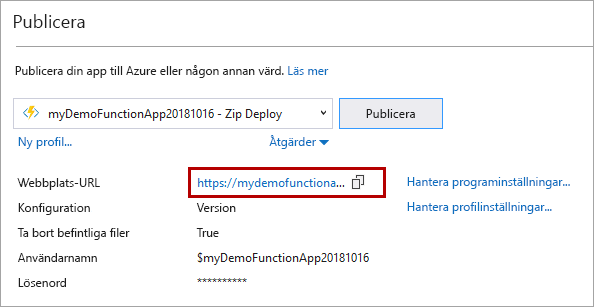

1. I **Solution Explorer** högerklickar du på projektet och väljer **Publicera**.

2. I **Välj ett publicerings mål**använder du de publicerings alternativ som anges i följande tabell: 

    | Alternativ      | Beskrivning                                |
    | ------------ |  -------------------------------------------------- |
    | **Azure-Funktionsapp** | Skapa en Function-app i en Azure-moln miljö. | 
    | **Skapa ny** | En ny function-app med relaterade resurser skapas i Azure.  Om du väljer **Välj befintlig**skrivs alla filer i den befintliga Function-appen i Azure över av filer från det lokala projektet. Använd bara det här alternativet när du publicerar om uppdateringar till en befintlig Function-app. |
    | **Kör från paketfil** | Din Function-app distribueras med hjälp av [zip Deploy](../articles/azure-functions/functions-deployment-technologies.md#zip-deploy) med läget [Kör-från-Package](../articles/azure-functions/run-functions-from-deployment-package.md) aktiverat. Den här distributionen, som ger bättre prestanda, är det rekommenderade sättet att köra funktionerna.  Om du inte använder det här alternativet, se till att du stoppar ditt program projekt från att köras lokalt innan du publicerar till Azure. |

    

3. Välj **Publicera**. Om du inte redan har loggat in på ditt Azure-konto från Visual Studio väljer du **Logga in**. Du kan också skapa ett kostnads fritt Azure-konto.

4. I **Azure App Service: skapa ny**, Använd de värden som anges i följande tabell:

    | Inställning      | Värde  | Beskrivning                                |
    | ------------ |  ------- | -------------------------------------------------- |
    | **Namn** | Globalt unikt namn | Namn som unikt identifierar din nya funktionsapp. Acceptera det här namnet eller ange ett nytt namn. Giltiga tecken är: `a-z`, `0-9`, och `-`. |
    | **Prenumeration** | Din prenumeration | Den Azure-prenumeration som ska användas. Godkänn denna prenumeration eller Välj en ny i list rutan. |
    | **[Resurs grupp](../articles/azure-resource-manager/management/overview.md)** | Namnet på din resurs grupp |  Resurs gruppen där du vill skapa din Function-app. Välj en befintlig resurs grupp i den nedrullningsbara listan eller Välj **ny** för att skapa en ny resurs grupp.|
    | **[Värd plan](../articles/azure-functions/functions-scale.md)** | Namn på din värd plan | Välj **nytt** om du vill konfigurera en server lös plan. Se till att välja **förbrukningen** under **storlek**. När du publicerar projektet till en Function-app som körs i en [förbruknings plan](../articles/azure-functions/functions-scale.md#consumption-plan)betalar du bara för körningar av Functions-appen. Andra värd planer ådrar sig högre kostnader. Om du kör i en annan plan än **förbrukningen**måste du hantera [skalningen av din Function-app](../articles/azure-functions/functions-scale.md). Välj en **plats** i en [region](https://azure.microsoft.com/regions/) nära dig eller andra tjänster som dina funktioner har åtkomst till.  |
    | **[Azure Storage](../articles/storage/common/storage-account-create.md)** | Allmänt lagrings konto | Ett Azure Storage-konto krävs av Functions-körningen. Välj **nytt** om du vill konfigurera ett allmänt lagrings konto. Du kan också välja ett befintligt konto som uppfyller [kraven för lagrings kontot](../articles/azure-functions/functions-scale.md#storage-account-requirements).  |

    

5. Välj **skapa** för att skapa en Function-app och dess relaterade resurser i Azure med de här inställningarna och distribuera din funktions projekt kod. 

6. Välj publicera och när distributionen är klar noterar du **webbplatsens URL** -värde, som är adressen till din Function-app i Azure.

    
