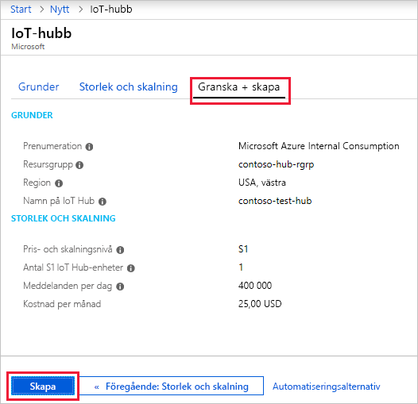

I det här avsnittet beskrivs hur du använder [Azure-portalen](https://portal.azure.com) för att skapa en IoT-hubb.

1. Logga in på [Azure-portalen](https://portal.azure.com).

1. På Azure-startsidan väljer du knappen **+ Skapa en resurs** och anger sedan *IoT Hub* i fältet Sök på **Marketplace.**

1. Välj **IoT Hub** i sökresultaten och välj sedan **Skapa**.

1. Fyll i fälten på fliken **Grunderna** på följande sätt:

   - **Prenumeration**: Välj den prenumeration som ska användas för navet.

   - **Resursgrupp:** Välj en resursgrupp eller skapa en ny. Om du vill skapa en ny väljer du **Skapa ny** och fyller i det namn du vill använda. Om du vill använda en befintlig resursgrupp väljer du den resursgruppen. Mer information finns i [Hantera Azure Resource Manager-resursgrupper](../articles/azure-resource-manager/management/manage-resource-groups-portal.md).

   - **Region**: Välj den region där du vill att hubben ska finnas. Välj den plats som ligger närmast dig. Vissa funktioner, till exempel [IoT Hub-enhetsströmmar,](../articles/iot-hub/iot-hub-device-streams-overview.md)är endast tillgängliga i specifika regioner. För dessa begränsade funktioner måste du välja ett av de regioner som stöds.

   - **IoT Hub Namn:** Ange ett namn för din hubb. Det här namnet måste vara globalt unikt. Om namnet som du anger är tillgängligt visas en grön bockmarkering.

   [!INCLUDE [iot-hub-pii-note-naming-hub](iot-hub-pii-note-naming-hub.md)]

   

1. Välj **Nästa: Storlek och skala** för att fortsätta skapa din hubb.

   

   Du kan acceptera standardinställningarna här. Om du vill kan du ändra något av följande fält: 

    - **Pris- och skalnivå**: Den valda nivån. Du kan välja mellan flera nivåer, beroende på hur många funktioner du vill ha och hur många meddelanden du skickar via din lösning per dag. Den kostnadsfria nivån är avsedd för testning och utvärdering. Det gör att 500 enheter kan anslutas till navet och upp till 8 000 meddelanden per dag. Varje Azure-prenumeration kan skapa en IoT-hubb på den kostnadsfria nivån. 

      Om du arbetar med en snabbstart för IoT Hub-enhetsströmmar väljer du den kostnadsfria nivån.

    - **IoT Hub-enheter**: Antalet meddelanden som tillåts per enhet per dag beror på hubbens prisnivå. Om du till exempel vill att navet ska stödja inträngning på 700 000 meddelanden väljer du två S1-nivåenheter.
    Mer information om de andra alternativen för nivån finns i avsnittet om att [välja rätt nivå för IoT Hub](../articles/iot-hub/iot-hub-scaling.md).

    - **Azure Security Center:** Aktivera detta för att lägga till ett extra lager av hotskydd till IoT och dina enheter. Det här alternativet är inte tillgängligt för hubbar på den kostnadsfria nivån. Mer information om den här funktionen finns i [Azure Security Center för IoT](https://docs.microsoft.com/azure/asc-for-iot/).

    - **Avancerade inställningar** > **Enhet-till-moln-partitioner**: Den här egenskapen relaterar meddelanden mellan enheter och moln till antalet samtidiga läsare av meddelandena. De flesta hubbar behöver bara fyra partitioner.

1.  Välj **Nästa: Taggar för** att fortsätta till nästa skärm.

    Taggar är namn/värdepar. Du kan tilldela samma tagg till flera resurser och resursgrupper för att kategorisera resurser och konsolidera fakturering. Mer information finns i [Använda taggar för att ordna dina Azure-resurser](../articles/azure-resource-manager/management/tag-resources.md).

    

1.  Välj **Nästa: Granska + skapa** för att granska dina val. Du ser något som liknar den här skärmen, men med de värden du valde när du skapade navet. 

    

1.  Välj **Skapa** om du vill skapa den nya hubben. Det tar några minuter att skapa hubben.
